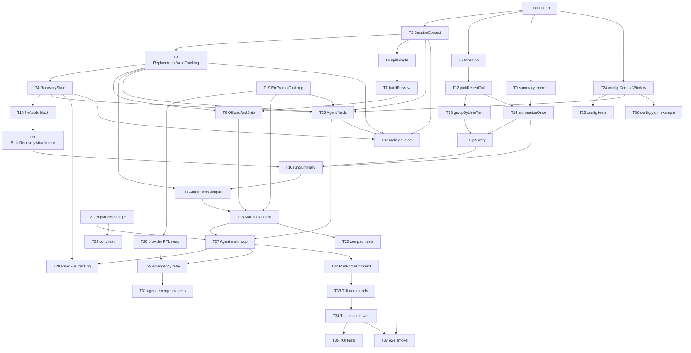
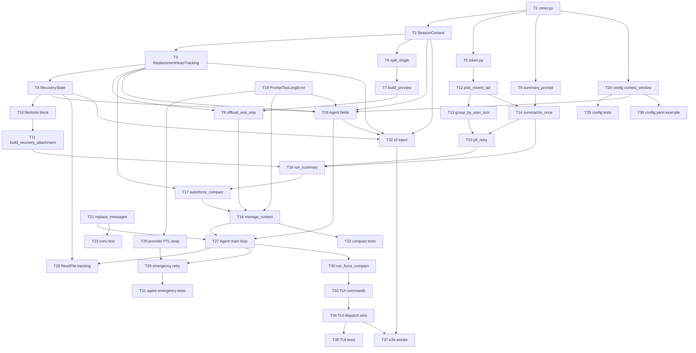
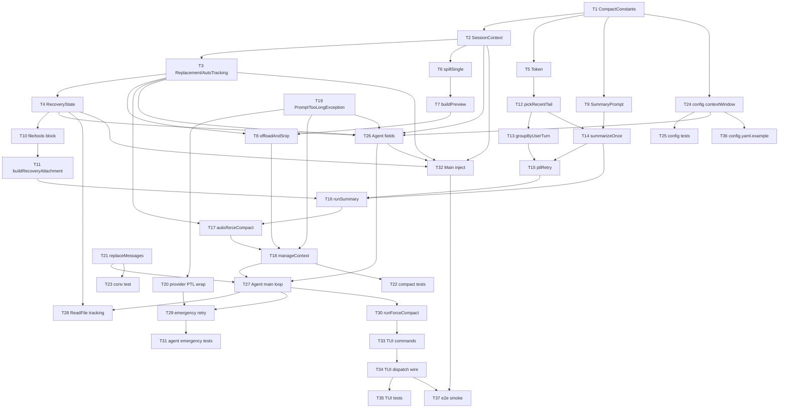

# 第8章：实战篇

## 本章需要做什么 ？

上一章我们给 GuoLaiCode 接上了 MCP Client，它终于能通过标准化协议动态接入外部工具了。但随着 Agent 能力越来越强，一个新问题浮出水面：它干活的时间越来越长，读的文件越来越多，Token 消耗直线飙升，直到撞上上下文窗口的天花板。

这一章要给 GuoLaiCode 装上上下文管理能力。做完之后，Agent 能在有限的 Token 预算内长时间工作，不会因为对话太长而瘫掉。

具体要新增这些东西：

* **Token 估算&#x20;**：近似计算当前对话占了多少 Token

* **大结果存磁盘&#x20;**：工具输出超过阈值时，完整内容写到本地文件，对话里只保留预览和路径

* **全量摘要（Auto-Compact）&#x20;**：上下文逼近窗口上限时，调用 LLM 生成结构化摘要替换旧消息，压缩后恢复关键上下文

* **手动 /compact 命令&#x20;**：用户随时可以触发压缩，显示压缩前后的 Token 变化

* **Agent Loop 集成&#x20;**：每轮循环前自动执行两层压缩，压缩结果赋值回外层对话历史

这章 **不做&#x20;**：精确 tokenizer（用近似估算就够了）、压缩策略的机器学习优化。

***

## Vibe Coding 实战

### 生成四份文档

把任务换成本章的内容：

```markdown
# 我的初步想法
这一步的目标是：给 GuoLaiCode 装上上下文管理能力，让它能在有限的 Token 预算里长时间干活。靠两层压缩策略，也就是轻量预防加重量兜底，保证对话累积再多也不会因为上下文溢出而瘫掉。

技术要求：

- Token 大头是工具结果，压缩从这里下手；用户的原始消息尽量原文保留，不被摘要改写
- 第一层预防：单个工具结果超阈值就存盘，对话里只留预览和文件路径；单条消息工具结果合计超了，挑大的依次存盘
- 第二层兜底：整体对话逼近窗口上限时调 LLM 生成结构化摘要，把较早的消息摘要掉、近期原文留下来（从尾部按 token 往回数，约 1 万 token 或至少 5 条），摘要按几个固定部分组织
- 摘要的 Prompt 要明确禁止模型调任何工具，并要求先写分析草稿再写正式摘要，草稿用完就丢
- 压缩后补一条边界消息，提示模型要文件细节请重新读取，别照着摘要脑补代码
- 用户能手动触发压缩，摘要连续失败 3 次要熔断，避免死循环

这一步先不做精确的 tokenizer，用近似估算就够（锚定上一次 API usage、只对增量按字符数估算）；也不搞摘要策略的机器学习优化。

触发时机：

- 每次 API 请求前先跑轻量预防（管单条消息大小），再看是否需要重量兜底（管累积历史长度）
- 自动触发留 13K 安全余量防估算误差，用户手动触发时余量收窄到 3K，因为是用户主动要压
```

然后 AI 就会开始问你问题，进行需求澄清。


你根据理论篇学到的内容回答这些问题，一直这样反复循环对齐需求，最后就能生成四份文档了。

### 正式开发

四份文档有了之后，就相当于施工图纸已经定好了，然后让 Claude Code 根据这四份文档进行开发


经过一段时间后，开发完成。


### 功能验证过程

来验收一下结果

启动 GuoLaiCode，给 Agent 一个复读机任务，必定会超过阈值成为大结果


可以看到，大文件的工具输出被自动存盘。


接下来看看自动压缩，为了方便演示，我们先把自动压缩的阈值调低


我们给个长点的任务。


在不断的梳理中，输入token会累积，等对话累积到阈值时自动压缩，Token 用量大幅回落，但 Agent 仍然记得之前在做什么。


最后试试输入 `/compact` 手动触发，能看到压缩前后的 Token 变化。


验收没问题，那么本章的主要任务就完成了。事实上这个只是Agent的记忆系统的一部分，下一章，我们来进一步巩固我们的记忆系统更完整的体系

***

## 参考提示词和代码

如果你在澄清需求的过程中遇到困难，或者生成的四份文件效果不理想，可以直接使用下面的参考版本。

把下面四个文件保存到项目根目录，然后告诉你的 AI 编程助手：

### Go

```markdown
# 上下文管理 Spec

## 背景

guolaicode 是一个无状态的 LLM Agent：每一轮与模型的交互都要把全量对话历史（包含用户消息、助手消息、工具调用、工具结果）打包进请求体。随着会话变长，请求体会单调膨胀，直到撞上模型的上下文窗口上限被 provider 拒绝（`prompt_too_long` 类错误）。

在实际编码场景下，工具结果（特别是 ReadFile、Bash、Grep 的输出）是 token 占用的绝对大头，根据实测一般占整轮请求的 80%~90% 左右。把一份十几万字符的源文件原样反复塞进每一轮请求，是上下文耗尽的主要诱因。

不同 provider 的上下文窗口差异很大：Anthropic 默认 200K，OpenAI 默认 128K，未来还可能接入更窄或更宽的模型。固定阈值无法跨 provider 通用，也无法预防长会话的崩溃路径。

guolaicode 已经在前面的章节里完成了若干基础设施：ch06 引入了五层防御的权限引擎，ch07 引入了 MCP 客户端管理，工具生态已经可以放心扩展。但是这些都只解决"单轮如何安全执行"的问题，长时间连续工作的"对话本身越来越长"问题还没人管。ch08 要补的就是这一块：让 Agent 能够在一个进程内连续工作数小时，而不会因为对话历史撑爆 context 而中断。

设计思路是两层防御。第一层在工具结果产生的瞬间就动手：把超大的单条结果落盘，对话里只留头部预览和文件路径，从源头压住膨胀曲线。第二层是兜底：当估算 token 接近模型上下文窗口时，发起一次 LLM 全量摘要，把多轮历史浓缩成一份结构化纪要，再追加一段"恢复"内容把摘要无法精确还原的关键事实（最近读过的文件原文、当前可用工具、边界提示）补回来。第一层是预防，第二层是急救，两层互相独立但配合作战。

另外还要给用户一个明确的手动入口，让用户能在自己判断"该收一下了"的时候直接触发摘要，而不必等到自动阈值。

## 目标

- G1：在单进程会话内，能够连续工作数小时不因上下文超长而被 provider 拒绝。
- G2：尽量保留 prompt cache 命中率——同一个工具结果在被替换后，每一轮回放的字符串必须逐字节一致。
- G3：用户消息原文不丢，模型可以通过摘要+恢复段还原"用户到底要我做什么"。
- G4：被替换或被摘要掉的工具结果在物理上仍可访问，模型可以用文件读取工具显式重读。
- G5：自动压缩与手动压缩共用核心摘要路径，但触发条件、阈值、熔断行为有所区分。
- G6：对 provider 撞墙（prompt_too_long）有兜底的紧急压缩 + 重试机制，不让一次撞墙就丢掉用户的最新输入。
- G7：跨 provider 通用：上下文窗口大小通过配置驱动，未配置时按 provider 协议给出合理默认值。
- G8：上下文管理引入的所有新代码集中在专属模块内，对 Agent 主循环只暴露窄接口；功能可以被关闭或绕过测试。

## 功能需求

> **字节口径说明**：本文档中工具结果的 50000 / 200000 阈值与预览体头部的 2048 阈值均指 `len(content)` 返回的字节数（Go 字符串以 UTF-8 编码计量，一个中文 3 字节），不是 Unicode 码点数。下文出现的"字符"统一按字节计算，便于实现层用 `len()` 直接判断。

### 第 1 层：单条与单轮工具结果预防性压缩

- **F1**：当某一次工具调用返回的内容字节数超过单条阈值（50000 字节）时，系统必须把完整结果落盘，对话里只保留该工具结果的"预览替换体"。
- **F2**：每一组工具调用回合对应一条 RoleTool 消息（guolaicode 把同一回合的工具结果挂在该消息的 `ToolResults` 切片里）。系统先剔除已被 F1 单条阈值命中而决策为替换的项，再对该消息上剩余项的 `Content` 字节做聚合判断：若聚合字节数超过单轮聚合阈值（200000 字节），按字节从大到小依次把工具结果落盘，直到剩余项的聚合字节数回落到 ≤ 200000。F1 已替换的项不再参与 F2 聚合判断。
- **F2a**：F1 与 F2 共用一次扫描：实现层对每条 RoleTool 消息的 `ToolResults` 切片建立候选列表后按字节倒序处理；先把超过单条阈值的项落盘，再按聚合预算继续落盘下一项，直到剩余聚合 ≤ messageAggregateLimit。落盘 → 改写 Content → 写入账本三个动作必须按固定顺序串行执行，任一步失败则三件都不发生（保持原文 + 不写账本），保证 Content 与账本始终一致。
- **F3**：落盘文件名必须等于该工具调用的 `tool_use_id`；同一个 `tool_use_id` 已落盘过就跳过，不重复写。
- **F4**：替换体在对话中必须以稳定的字符串形式呈现，必须包含四项信息：① 原始字节数元信息；② 头部预览：取该工具结果的前 20 行或前 2048 字节中的较短者（先按行截到 20 行，再按字节截到 2048，二者择短，保证预览长度可控）；③ 落盘文件路径；④ 重读提示，明确告知模型如需完整内容请用文件读取工具读取该路径。
- **F5**：替换决策必须冻结，且账本更新满足四条子项：
  - (a) 账本（已见集合 `seenIds` + id→预览字符串映射 `replacements`）只在第 1 层完成对该 id 的决策动作后写入；
  - (b) 落盘失败的 id 既不计入 `seenIds` 也不计入 `replacements`，下次组装请求时重新评估；
  - (c) 同一个 id 在同一轮内最多被评估一次（已决策的项跳过后续聚合判定，避免重复算入预算）；
  - (d) 一旦写入 `seenIds`，无论是"保留原文"还是"替换"，本会话内不再翻转；被决定为"替换"的 id 之后每一轮都用同一份预览字符串（同一个 string，不允许重新构造）替换。
- **F6**：第 1 层压缩在 Agent 每次组装 LLM 请求体之前执行，是确定性的、纯函数式的字符串替换，不调用 LLM。

### 第 2 层：LLM 全量摘要

- **F7**：当估算 token 达到自动触发阈值（上下文窗口 − 20000 − 13000）时，系统必须在下一次 LLM 请求发出之前完成一次摘要。其中 20000 是给摘要本身的预留输出空间，13000 是估算误差与单轮波动的安全余量，防止"看上去差一点点"实际已经撞墙。
- **F8**：摘要请求体不传任何工具定义。摘要本身不允许调用工具。
- **F9**：摘要分两阶段：先让模型在 `<analysis>` 标签内写出分析草稿，再在 `<summary>` 标签内写出正式摘要。草稿丢弃，只保留正式摘要。
- **F10**：正式摘要必须遵循固定的 9 部分结构：① 主要请求和意图；② 关键技术概念；③ 文件和代码段；④ 错误和修复；⑤ 问题解决过程；⑥ 所有用户消息原文优先逐条保留；⑦ 待办任务；⑧ 当前工作（最详细的一段，覆盖正在做什么、停在哪一步）；⑨ 可能的下一步。
- **F11**：摘要完成后，需要从原对话尾部保留一段"近期原文"接在摘要之后。保留策略：从尾部开始倒序累加，直到累计估算 token ≥ 10000 **且**累计消息条数 ≥ 5（两个下界都满足后才停手）。"择宽"在本文档中的含义是"同时满足两个下界，覆盖范围更大"，不是"任一满足即停"（任一满足即停反而是择窄，会让保留量比设计小）。
- **F12**：保留近期原文时不允许把一对 `tool_use` 和 `tool_result` 切开。如果按 token/消息数算出来的截断点正好夹在工具调用和工具结果中间，必须把截断点向前推到工具调用之前。

### Token 估算

- **F13**：系统必须能在不调用精确 tokenizer 的前提下估算"如果现在发请求要消耗多少 token"。估算锚定上一次 provider 返回的真实 usage（input + cache_read + cache_creation + output 之和），并对其后新增的消息内容按"字符数 / 3.5"做增量估算。
- **F14**：每次 LLM 请求结束后，系统必须从流尾事件中捕获 usage 数据并更新锚点。

### 压缩后恢复（三段）

- **F15**：第 2 层摘要完成后，系统必须在摘要之后、近期原文之前，追加一段恢复内容，分三块：最近读过的文件快照、当前可用工具列表、边界提示消息。
- **F16**：最近读过的文件快照最多 5 个，按"最后一次成功读取的时间戳"倒序排列。每个文件内容上限 5000 token；超过时保留头部 5000 token 对应的字符片段（按 `5000 * estimateCharsPerToken` 估算字符数），截掉尾部多余内容，并在尾部追加一行 `(content truncated)` 标注。每个文件展示路径、读取时间戳、内容片段。
- **F17**：当前可用工具列表必须与下一次 LLM 请求实际传给 provider 的 tools 参数严格一致——即同一份工具集合在恢复段声明和在请求 tools 字段里出现的工具数量、工具名、参数 schema 都必须对得上。为保证一致性，恢复段所读取的工具定义与当次 Stream 请求传给 provider 的 `Tools` 必须来自主循环本轮迭代开头按当前权限模式（普通/规划）一次性算出的同一份切片引用，不允许在恢复段构造与 Stream 调用之间独立重算或选择不同子集。本章承诺的工具一致性以 Agent.Run 的单次迭代为粒度；跨迭代或跨 Run 调用之间允许工具集变化。
- **F18**：边界提示消息是固定文案，明确告诉模型：需要文件原文、错误原文、用户原话时请用文件读取工具重读，不要靠摘要猜测。
- **F19**：文件追踪发生在 Agent 主循环里：每当文件读取工具成功返回后，系统必须用纯净字节（不带行号前缀的原始内容）重新记录一次到文件追踪状态，作为恢复段的数据源。
- **F19a**：文件追踪的写入必须与工具结果回填到 Conversation 在同一 goroutine 内顺序发生（即在 `executeBatched` 完成工具调用后、`AddToolResults` 之前同步触发），保证下一次 ManageContext 能观察到本轮 ReadFile 的记录。
- **F20**：文件追踪状态在被工具回调和主循环并发访问的场景下必须是线程安全的。

### 手动入口

- **F21**：TUI 输入框收到以斜杠开头的输入时，必须走命令路径，不发送给 LLM。本章把已有的 `/exit`、`/plan`、`/do` 命令一并迁移到统一注册表 `builtinCommands` 下（行为不变），同时新增 `/compact` 内置命令；未注册命令走未知命令兜底，给出可用命令提示，不发送给 LLM。命令路径不写入 conversation，命令执行结果只通过系统消息在 TUI 视图层展示。
- **F22**：`/compact` 跳过第 1 层、跳过阈值检查、跳过熔断器，无条件触发一次 LLM 摘要。"跳过第 1 层"仅指本次手动触发动作本身不调用第 1 层；摘要完成后 Conversation 被替换为新消息列表，Agent 下一次发请求前的常规第 1 层（自动路径）继续生效。
- **F23**：手动 `/compact` 不做阈值判断，无条件触发摘要。3000 这个安全余量仅用于判断摘要请求自身的 messages（即摘要 prompt 序列化后的输入）估算 token 是否已经超过 `context_window - 20000 - 3000`；如果超过则直接进入 F27 的丢消息组重试，不让请求白白撞墙。
- **F24**：手动压缩完成后，TUI 必须显示一条系统消息，告诉用户压缩前后估算 token 数的变化。
- **F24a（自动压缩 UX）**：自动压缩触发时 TUI 必须立即显示一条状态提示（如 "正在压缩上下文..."），完成后追加 "已压缩，token 从 X 降至 Y"，避免用户以为程序卡死。
- **F24b（紧急压缩 UX）**：紧急压缩触发时 TUI 同样显示状态提示，前缀为 "上下文撞墙，自动压缩中..."；完成后追加压缩结果或错误信息。

### 异常路径

- **F25**：Agent 主循环在调用 provider 时如果收到 `prompt_too_long` 类错误，必须立即触发一次紧急压缩，然后用压缩后的新消息列表把刚才那个请求重试一次。紧急压缩与手动 `/compact` 共用同一条核心路径，但紧急压缩在调用摘要前必须先强制跑一次第 1 层（OffloadAndSnip）把单条 50K+ 工具结果挪到磁盘，避免摘要请求自己也立刻撞 PTL。紧急压缩内部发起的摘要请求若自身撞 prompt_too_long，仍走 F27 的丢消息组重试策略；F27 是所有摘要请求（自动 / 手动 / 紧急）共用的底层处理。
- **F25a**：紧急压缩成功后，系统必须使用新的消息序列与重置后的锚点（usageAnchor 临时清零）重新估算 token；只有在估算低于 `context_window - manualSafetyMargin` 时才进行重试，否则视为不可恢复错误上抛，不再做第二次紧急压缩。
- **F26**：紧急压缩后的重试只重试一次。重试仍失败的话，按正常错误流程上抛，不再二次重试。Agent 在主循环内用一个 `emergencyRetried` 局部标记保证一次迭代内只重试一次。
- **F27（摘要请求自身 PTL 的统一处理 - 自动 / 手动 / 紧急共用）**：如果摘要请求自身也撞了 `prompt_too_long`，系统必须把当前对话按"用户提交 → 一组 assistant/tool 往返"分组，丢弃最旧的若干组，用剩余消息重新发起摘要请求。这一过程最多 3 次直接重试（即除初始请求外的 3 次重试，每次丢最旧 1 组）；3 次仍失败后，每次再丢 `ceil(剩余组数 × 0.2)`（至少 1 组）继续，直至摘要请求能塞下，或者全部消息都被丢光。若所有消息组都被丢光摘要请求仍然失败，按一次摘要失败上抛错误（自动路径计入熔断；手动 / 紧急路径直接返回错误给上层）；系统不会尝试发送 messages 为空的摘要请求。PTL 重试用光后仍失败，在自动路径下计入熔断计数；在手动 / 紧急路径下不计入熔断。
- **F28**：自动摘要连续失败 3 次后，系统必须停止自动触发，进入熔断状态。"失败"在此明确定义为：整轮 AutoCompact（含 PTL 自重试）最终未拿到可用摘要——无论是普通 LLM 错误还是 PTL 重试用光，都按一次失败累计。只要有任何一次自动摘要成功，连续失败计数立即清零。
- **F29**：熔断状态只影响"自动触发"路径。手动 `/compact` 与紧急压缩永远绕过熔断器。

### 配置与生命周期

- **F30**：配置文件中每个 provider 配置项支持一个新字段 `context_window`，单位为 token，类型为整数。
- **F31**：未配置 `context_window` 时，按 provider 协议给出默认值：anthropic 默认 200000，openai 默认 128000。
- **F32**：配置示例文件必须同步展示新字段的用法。
- **F33**：自动压缩阈值与紧急压缩阈值都由 `context_window` 减去固定 buffer 算出，不开放为独立配置项；buffer 的具体常量在系统内部硬编码。
- **F34**：会话 id 在进程启动时生成一次，格式为 `<unix_ts>-<short_random>`。会话 id 在进程内全局唯一，不持久化，进程退出不自动清理本会话目录。
- **F35**：所有落盘的工具结果写到 `.guolaicode/sessions/<session_id>/tool-results/<tool_use_id>` 路径下。该目录必须按需创建，已存在时不报错。
- **F36（硬编码常量集合）**：系统内部硬编码以下常量：单条工具结果阈值 50000 字节、单轮聚合阈值 200000 字节、摘要输出预留 20000 token、自动安全余量 13000 token、手动安全余量 3000 token、近期原文 token 下界 10000、近期原文条数下界 5、最大近期文件数 5、单文件快照 token 上限 5000、自动摘要熔断阈值 3、摘要 PTL 直接重试上限 3、PTL 比例丢弃步长 0.2、字符→token 估算比 3.5、预览体头部字节上限 2048、预览体头部行数上限 20。这些常量的调整属于代码变更，不属于配置变更；它们不暴露为配置项。
- **F37（手动 / 主循环互斥）**：手动 `/compact` 与 Agent 主循环不允许并发执行。要么 TUI 在主循环空闲（即一次 Run 调用结束）时才触发；要么 Agent 在 Run 期间持一把会话级锁，RunForceCompact 必须等待该锁。

## 非功能需求

- **N1（性能）**：第 1 层压缩是纯字符串处理，在每轮组装请求时必须能在毫秒级完成；落盘 I/O 异步或同步均可，但不能阻塞主循环超过 100ms 的量级。
- **N2（并发安全）**：替换决策账本（已见集合 + id→预览字符串映射）、文件追踪状态、自动摘要熔断计数三类状态在多 goroutine 场景下都必须并发安全；任意一种状态在 TUI 命令路径、Agent 主循环、紧急压缩路径同时访问时不允许出现读写竞态。账本的"读账本 → 决策 → 写账本"必须在同一把锁的同一临界区内原子完成，不允许出现"某 id 已 Seen 但 replacement 还没写入"的中间态；也不允许出现某个 id 的替换字符串在同一轮请求里出现两个不同版本。
- **N3（向后兼容）**：未启用 context_window 配置项的旧配置文件必须仍然可以正常加载；运行时即使从未触发压缩，也不影响 Agent 原有行为。
- **N4（可测性）**：核心逻辑（替换决策、token 估算、消息分组与丢弃、近期原文边界推算）必须能脱离真实 provider 单元测试；测试 fixture 不依赖网络。
- **N5（可调试性）**：每次触发压缩都要输出可追踪的日志或事件，至少包含触发原因（自动 / 手动 / 紧急）、压缩前估算 token、压缩后估算 token、被替换的工具结果数量。
- **N6（错误隔离）**：第 1 层落盘失败必须降级为不替换该条工具结果，不能因为磁盘问题让对话中断；第 2 层摘要失败必须按熔断器规则记录，不能因为单次摘要失败让 Agent 进程崩溃。

## 不做的事

- **不做技能（Skill）恢复**：本章只恢复"最近读过的文件 + 工具列表 + 边界提示"三段。Skill 子系统在 guolaicode 中还没建立，等到引入 Skill 之后再补对应恢复段。
- **不集成精确 tokenizer**：估算锚定 provider 返回的真实 usage，新增内容按字符数除以 3.5 估算。引入 tokenizer 会增加依赖与计算开销，而锚定真实 usage 已经足够稳定。
- **不做摘要质量的反馈优化**：摘要 prompt 固定下来即可，不接入机器学习、不做线上 A/B、不做用户对摘要的评分回流。
- **不做跨进程或跨会话的对话历史持久化**：进程退出对话就丢，本章只保证单进程内长时间工作可用。
- **不支持同进程多 Agent 实例并发**：当前 guolaicode 进程内只有一个 Agent；多实例并发涉及状态隔离、目录隔离等额外问题，不在本章范围。
- **不自动清理 `.guolaicode/sessions/` 目录**：本会话目录在进程退出后保留，由用户/外部脚本自行清理。这样调试时还能回看落盘内容。
- **不监控 prompt cache 命中率**：本章只通过"决策冻结"被动保证缓存稳定，不主动测量缓存命中率指标。
- **不把全部阈值开放为配置项**：只暴露 `context_window`。单条阈值、单轮聚合阈值、摘要预留、安全余量、近期原文保留量、熔断阈值等全部硬编码。

## 验收标准

- **AC1（单条预防）**：构造一次返回 60000 字节的工具调用 → 对话中该工具结果被替换为预览体，包含原始字节数、头部预览、落盘路径、重读提示四项；预览体头部内容长度同时不超过 20 行且不超过 2048 字节；`.guolaicode/sessions/<session_id>/tool-results/<tool_use_id>` 下能找到完整原文。
- **AC2（单轮聚合预防）**：构造一条 RoleTool 消息触发 3 条工具结果，每条 80000 字节（合计 240000，超 200000 阈值）→ 系统按字节大→小依次落盘，直到聚合回落到 200000 以下；被替换的工具结果数量等于"足以让聚合达标"的最小数量。
- **AC3（幂等落盘）**：对同一个 `tool_use_id` 触发两次第 1 层压缩 → 落盘文件只写一次（文件 mtime 不变），第二次跳过 I/O。
- **AC4（决策冻结）**：某个 `tool_use_id` 在第 N 轮被决定不替换 → 此后任意一轮组装请求时该工具结果都保持原文；某个 `tool_use_id` 在第 M 轮被决定替换 → 此后任意一轮组装请求时使用的预览字符串都与第 M 轮逐字节一致。子断言：构造一个落盘失败场景，该 id 不进入 seenIds，下一轮组装请求时仍可被重新评估并尝试落盘。
- **AC5（自动触发阈值）**：当估算 token 跨过 `context_window − 33000` 边界 → 下一次 LLM 请求发出前自动执行一次摘要；估算 token 未跨过该边界时不触发。
- **AC6（摘要请求无工具）**：抓取摘要发往 provider 的请求体 → tools 字段为空或不存在。
- **AC7（摘要结构）**：摘要返回内容只保留 `<summary>` 部分，可解析出 9 个固定小节，且第 6 节中能找到本会话所有用户消息的原文。
- **AC8（近期原文保留边界）**：摘要后对话中除摘要本身和恢复三段之外，保留的"近期原文"满足：累计估算 token ≥ 10000 **且**条数 ≥ 5（两个下界都满足）；且最前面一条不是落单的 `tool_result`。
- **AC9（恢复三段-文件快照）**：在压缩前依次读过 7 个不同文件 → 恢复段只展示最后 5 个，按时间戳倒序；每个文件超过 5000 token 时只保留头部对应字符片段（截掉尾部多余内容），尾部出现 `(content truncated)` 标注。
- **AC10（恢复三段-工具一致）**：恢复段中列出的工具名集合 == 紧接其后的那次 LLM 请求 tools 参数中的工具名集合，逐项可对应。子断言：恢复段读取的工具定义切片与 Stream 请求的 `Tools` 切片来自同一引用（同一份切片头指向同一底层数组），而非分别构造后内容相等。
- **AC11（恢复三段-边界提示）**：恢复段包含固定文案的边界提示消息，告知模型需要原文请重读，不要靠摘要猜测。
- **AC12（手动入口路由）**：在 TUI 输入 `/compact` → 不会触发任何 LLM 普通对话请求，只会触发一次摘要请求；输入 `/unknown` 之类未注册命令 → 给出友好提示，也不发给 LLM。
- **AC13（手动入口跳过阈值）**：在估算 token 远低于自动阈值时输入 `/compact` → 仍然执行一次摘要，不被阈值检查拦截。
- **AC14（手动入口跳过熔断）**：人为让自动摘要连续失败 3 次进入熔断 → 此时输入 `/compact` 仍然能正常执行摘要。
- **AC15（手动入口提示）**：`/compact` 成功后 TUI 显示一条系统消息，包含压缩前和压缩后的估算 token 数。
- **AC16（紧急压缩）**：mock provider 在第 K 次请求返回 `prompt_too_long` → Agent 立刻触发一次紧急压缩 → 用压缩后的消息列表重试该请求一次；该次重试成功后整体流程继续，重试失败则上抛错误。
- **AC17（紧急压缩不重复）**：mock provider 在紧急压缩后的重试请求中再次返回 `prompt_too_long` → Agent 不再进入第二次紧急压缩，按错误上抛。
- **AC18（PTL 重试 - 摘要自身过长）**：mock provider 对摘要请求返回 `prompt_too_long` → 系统按消息组丢弃策略重试，至多 3 次直接重试；3 次仍失败则每次再丢 20% 消息组继续，直至成功或对话耗尽。
- **AC19（熔断器累计）**：连续 3 次自动摘要失败（无论是普通失败还是 PTL 重试用光）→ 第 4 次达到自动阈值时不再触发自动摘要；其间任意一次自动摘要成功 → 失败计数立刻清零，自动触发恢复正常。子断言：PTL 重试用光导致的失败计入熔断；手动 / 紧急路径的 PTL 重试用光不计入熔断。
- **AC20（context_window 配置覆盖）**：在 provider 配置项里设置 `context_window: 100000` → 自动触发阈值 = 67000；手动 `/compact` 时无条件执行第 2 层，**不**与 77000 比较；77000（即 `100000 - 20000 - 3000`）仅作为摘要请求本身的预检阈值在 PTL 兜底中用到。不配置时按协议给出默认 200000（anthropic）或 128000（openai）。
- **AC21（会话目录）**：进程启动后访问 `.guolaicode/sessions/`，能看到形如 `<unix_ts>-<short_random>` 的子目录；进程退出后该目录保留，下次启动会再开一个新的子目录。
- **AC22（Token 估算更新）**：连续 3 次真实 LLM 请求 → 每次请求结束后，估算锚点都用最近一次 provider 返回的 usage（input + cache_read + cache_creation + output）替换（**不是累加**，是替换）；估算函数在两次真实请求之间按"字符数 / 常量 3.5"做增量估算（常量 estimateCharsPerToken 取值为 3.5）。
- **AC23a（并发安全 - 替换决策账本）**：在 TUI 命令路径、主循环与紧急压缩路径并发触发 OffloadAndSnip 时 → 没有数据竞争，同一 id 的决策与替换字符串不会出现两个版本。
- **AC23b（并发安全 - 文件追踪）**：在工具回调和主循环里同时往文件追踪状态写入和读取 → 没有数据竞争，没有同一文件出现重复或错乱的快照。
- **AC23c（并发安全 - 熔断计数）**：自动路径与手动路径同时访问 AutoTracking 的 RecordSuccess / RecordFailure / Tripped 时无 data race；熔断计数的读写在锁内完成。
```

````markdown
# 上下文管理 Plan## 架构概览

ch08 引入一个新的本地包 `internal/compact/`，作为上下文管理的唯一权威入口。包内承担三块职责：

1. **第 1 层预防性压缩**：在每一轮 LLM 请求发出之前，对 `conversation` 中的工具结果做幂等的"超阈值落盘 + 字符串替换"，并把替换决策冻结在一个会话级账本里，保证 prompt cache 前缀逐字节稳定。
2. **第 2 层 LLM 摘要 + 恢复**：在估算 token 触达阈值（或被手动 / 紧急触发）时，调用 provider 跑一次结构化摘要请求，生成 9 部分摘要 + 三段恢复 + 近期原文，构造一个新的 `[]llm.Message` 替换掉旧的对话历史。
3. **辅助子模块**：token 估算（锚定真实 usage + 字符增量）、最近读过文件的并发安全追踪、会话目录管理、PTL 自重试与熔断器。

`internal/compact/` 不直接持有 `Agent`，也不直接管理 `Provider`。它通过一组窄接口与外部模块交互：

| 外部模块 | 交互方向 | 形式 |
|----------|----------|------|
| `internal/agent/` | Agent 调 compact | 主循环每轮请求前调 `ManageContext`；ReadFile 成功后调 `RecoveryState.RecordFile`；捕获 `prompt_too_long` 后调 `ForceCompact` 重试一次 |
| `internal/conversation/` | compact 改 conversation | compact 拿到 `[]llm.Message` 后做字符串替换 / 摘要重建，再用一个新方法 `ReplaceMessages` 整体替换内存数组 |
| `internal/llm/` | compact 调 provider | 摘要请求复用同一份 `llm.Provider.Stream`，但 `Request.Tools` 留空；从 `StreamEvent` 尾部拿 usage 锚定 token 估算 |
| `internal/tui/` | TUI 调 compact | TUI 拿到以 `/` 开头的输入走命令分发；`/compact` 命令调 compact 的 `ForceCompact` 并展示 token 变化系统消息 |
| `internal/config/` | config 喂 compact | `ProviderConfig` 新增 `ContextWindow int`，未配置时按协议给默认值；compact 通过参数拿到当前 provider 的 context_window |

**Agent 生命周期与状态归属调整**：现状的 TUI 在 `beginTurn` 里每轮 `agent.New(...).Run(...)` 重新构造一次 Agent（见 `internal/tui/stream.go:96`），意味着把 compact 的长生命周期状态（替换决策账本、文件追踪、自动摘要熔断计数、usageAnchor、本轮工具切片缓存）放成 Agent 字段会被每轮重置——决策冻结与熔断器立刻失效。

本章引入 `SessionRuntime` 作为 TUI Model 跨 Run 持有的长生命周期状态容器：

```go
// internal/agent/runtime.go（建议新建，或挂在 internal/compact 由 agent re-export）
type SessionRuntime struct {
    Replacement   *compact.ContentReplacementState
    Recovery      *compact.RecoveryState
    AutoTracking  *compact.AutoCompactTrackingState
    Session       *compact.SessionContext
    ContextWindow int
    UsageAnchor   int64 // 上一次主对话路径 Stream 真实 usage 之和；摘要请求不更新此字段
    AnchorMsgLen  int   // anchor 当时 Conversation.Len()，下次估算只算这之后的字符增量
}
```

`agent.New` 构造期接受 `*SessionRuntime` 注入；TUI Model 持有同一份 `*SessionRuntime` 跨轮复用。状态所有权关系：TUI Model 拥有 SessionRuntime；每轮把 SessionRuntime 与 Conversation 一并交给 Agent。compact 是逻辑层，对状态零持有、可重入。

**依赖方向无环**：
- `compact` 不 import `agent` / `config` / `tui` / `cmd`。
- `config` 仅在 `EffectiveContextWindow()` 中读自身常量（`DefaultAnthropicContextWindow` / `DefaultOpenAIContextWindow` 定义在 `internal/config/protocol_defaults.go`，不放 compact 包）。
- `agent` 依赖 `compact` + `conversation` + `llm` + `tool` + `permission`，**不** import `config`。
- `cmd/guolaicode` 是唯一同时 import `config` 与 `agent` 的位置，负责把 `providerCfg.EffectiveContextWindow()` 注入 SessionRuntime。
- `tui` 持有 `*SessionRuntime` 与 `*agent.Agent`（或在每轮构造 Agent 时把 runtime 传入）。

## 核心数据结构

```go
// internal/compact/state.go

// ContentReplacementState 是会话级的"工具结果替换决策账本"。
// seenIds 记录已经决策过的 tool_use_id，无论决策是替换还是保留原文。
// replacements 只保存"决定替换"那一支的预览字符串，键是 tool_use_id。
// 同一个 tool_use_id 一旦进入 seenIds 就再也不会被重新评估，保证 prompt cache 稳定。
//
// 并发安全约束：OffloadAndSnip 在执行期间持有 mu 全程加锁（读账本 → 决策 → 落盘 →
// 写账本必须在同一临界区内原子完成），避免出现"已 Seen 但 replacement 未写"的中间态。
// 对外只暴露一个高层方法 DecideOnce 让调用方传入决策回调，由本类型内部统一加锁。
// 一旦预览字符串写入 replacements[id]，本会话内不允许修改（包括其中内嵌的 originalBytes
// 字段）。OffloadAndSnip 永远不重新调用 buildPreview，已 Seen 的 id 直接复用现存字符串。
type ContentReplacementState struct {
    mu           sync.Mutex
    seenIds      map[string]struct{}
    replacements map[string]string
}

func NewContentReplacementState() *ContentReplacementState

// DecideOnce 一次性完成"查账本→决策→写账本"。
// decide 回调在持锁状态下被调用，返回 (是否替换, 预览字符串)。
// 若 id 已 Seen：直接返回现存 replacement（若是 MarkKept 则返回原 content）。
// 若 decide 返回 replace=false：MarkKept，返回原 content。
// 若 decide 返回 replace=true：MarkReplaced，返回 preview。
// 落盘 I/O 应在 decide 内完成；decide 返回错误（通过 replace=false 信号）即不写账本，
// 下一轮可重新评估该 id。
func (s *ContentReplacementState) DecideOnce(id, originalContent string, decide func() (replace bool, preview string)) string

// AutoCompactTrackingState 跟踪自动摘要连续失败次数，用于熔断。
// 手动 / 紧急压缩路径不读这个字段。
type AutoCompactTrackingState struct {
    mu                  sync.Mutex
    ConsecutiveFailures int
}

func NewAutoCompactTrackingState() *AutoCompactTrackingState

// RecoveryState 是 Agent 主循环写、compact 摘要时读的文件追踪状态。
// files 的键是文件绝对路径，避免相对路径在不同 cwd 下错乱。
type RecoveryState struct {
    mu    sync.Mutex
    files map[string]FileReadRecord
}

type FileReadRecord struct {
    Path      string
    Content   string    // 不带行号前缀的纯净字节
    Timestamp time.Time // 最后一次成功读取的时间
}

func NewRecoveryState() *RecoveryState
func (r *RecoveryState) RecordFile(path, content string)
func (r *RecoveryState) Snapshot() []FileReadRecord // 已按时间戳倒序

// SessionContext 是会话生命周期信息。SessionID 进程启动时一次性生成。
// SpillDir 是落盘目录，固定指向 .guolaicode/sessions/<session_id>/tool-results/。
type SessionContext struct {
    SessionID string
    SpillDir  string
}

func NewSessionContext(workspace string) (*SessionContext, error)
```

```go
// internal/compact/const.go

const (
    singleResultLimit                 = 50000   // 单条工具结果落盘阈值（字符）
    messageAggregateLimit             = 200000  // 单条 assistant 消息内工具结果聚合阈值（字符）
    summaryReserve                    = 20000   // 给摘要 LLM 输出预留的 token 空间
    autoSafetyMargin                  = 13000   // 自动触发的额外安全余量：防估算误差与单轮波动
    manualSafetyMargin                = 3000    // 手动触发的安全余量：只用来判断摘要请求本身能不能塞下
    recoveryFileLimit                 = 5       // 恢复段最多展示几个文件
    recoveryTokensPerFile             = 5000    // 单个文件快照的 token 上限，超出时保留头部、截掉尾部
    recentKeepTokens                  = 10000   // 摘要后保留近期原文的 token 下界
    recentKeepMessages                = 5       // 摘要后保留近期原文的条数下界
    maxConsecutiveAutoCompactFailures = 3       // 熔断阈值
    ptlRetryLimit                     = 3       // 摘要请求自身 PTL 的"直接重试"次数
    ptlDropPercentage                 = 0.2     // 3 次后每次再丢的比例
    estimateCharsPerToken             = 3.5     // 增量估算的字符/token 比
    previewHeadBytes                  = 2048    // 预览体头部字节数上限
    previewHeadLines                  = 20      // 预览体头部行数上限
)

const defaultAnthropicContextWindow = 200000
const defaultOpenAIContextWindow    = 128000
```

```go
// internal/config/config.go 改动（仅追加字段，不动现有字段顺序与标签）

type ProviderConfig struct {
    Name          string `yaml:"name"`
    Protocol      string `yaml:"protocol"`
    BaseURL       string `yaml:"base_url"`
    APIKey        string `yaml:"api_key"`
    Model         string `yaml:"model"`
    Thinking      bool   `yaml:"thinking"`        // 仅 anthropic 生效
    ContextWindow int    `yaml:"context_window"`  // 新增字段，单位 token，0 表示走协议默认
}

// internal/config/protocol_defaults.go（新文件）
const (
    DefaultAnthropicContextWindow = 200000
    DefaultOpenAIContextWindow    = 128000
)

// 派生方法，给 compact / cmd 用
func (p ProviderConfig) EffectiveContextWindow() int {
    if p.ContextWindow > 0 {
        return p.ContextWindow
    }
    switch p.Protocol {
    case ProtocolAnthropic:
        return DefaultAnthropicContextWindow
    case ProtocolOpenAI:
        return DefaultOpenAIContextWindow
    default:
        return DefaultAnthropicContextWindow
    }
}
```

> **依赖方向说明**：协议默认值常量定义在 `internal/config/protocol_defaults.go`，由 `config` 自身使用；`compact` 包不持有协议默认值常量。`config` 与 `compact` 单向无环。

## 模块设计### compact 包#### `compact.go` - ManageContext 主入口

```go
type ManageInput struct {
    Conv           *conversation.Conversation
    Provider       llm.Provider
    Model          string
    ContextWindow  int
    ToolDefs       []llm.ToolDefinition       // 主循环本轮迭代开头按当前 mode 选好的工具定义切片，恢复段与 Stream 共用此切片
    Replacement    *ContentReplacementState
    Recovery       *RecoveryState
    AutoTracking   *AutoCompactTrackingState
    Session        *SessionContext
    UsageAnchor    int64                       // 上一次主对话路径 Stream 真实 usage 之和
    AnchorMsgLen   int                         // anchor 当时 Conversation.Len()，用于"只算锚点之后的字符增量"
    EstimatedToken int64                       // 调用方算好的本轮估算 token（= anchor + chars/3.5）
    Trigger        TriggerKind                 // TriggerAuto / TriggerManual / TriggerEmergency
}

type ManageOutput struct {
    BeforeTokens int64
    AfterTokens  int64
}

// ManageContext 是 Agent 每轮请求前必调的唯一入口。
// 步骤：
//   1. 若 Trigger == TriggerManual：跳过第 1 层、阈值、熔断；直接 ForceCompact。
//      若 Trigger == TriggerEmergency：先强制跑一次 OffloadAndSnip（layer1），
//      再无条件 ForceCompact——避免摘要请求本身因为大工具结果直接撞 PTL。
//   2. 否则（Auto 路径）：
//      a. 先执行第 1 层 OffloadAndSnip 得到 updatedMsgs；
//      b. 用 EstimateTokens(in.UsageAnchor, updatedMsgs, in.AnchorMsgLen) 重算估算 token
//         （**必须用 layer1 之后的 updatedMsgs**，否则估算会偏高、过早触发 layer2）；
//      c. 若估算 < (ContextWindow - summaryReserve - autoSafetyMargin) 或 AutoTracking.Tripped()：
//         直接返回，仅 layer1 生效；
//      d. 否则 AutoCompact，成功后 ReplaceMessages。
//
// BeforeTokens / AfterTokens 口径：
//   - BeforeTokens = ManageContext 入口处的 in.EstimatedToken（已包含调用方算好的 anchor + 增量）；
//   - AfterTokens = layer2 替换 conversation 后用 EstimateTokens(0, newMsgs, 0) 重新算的值；
//     若只跑了 layer1，AfterTokens = EstimateTokens(in.UsageAnchor, layer1Out, in.AnchorMsgLen)。
func ManageContext(ctx context.Context, in ManageInput) (ManageOutput, error)
```

职责：编排两层调用顺序、决定走自动 / 手动 / 紧急路径、把替换/摘要后的消息写回 `Conversation`、更新熔断器计数。

依赖：`layer1.OffloadAndSnip`、`layer2.AutoCompact`、`layer2.ForceCompact`、`token.EstimateTokens`。

#### `layer1.go` - 单结果与聚合落盘 + 决策冻结

```go
// OffloadAndSnip 遍历 conv.Messages()，针对每一条 RoleTool 消息上的 ToolResults
// 切片做处理（guolaicode 在 conversation.AddToolResults 把一轮工具结果挂在一条 RoleTool
// 消息上，工具结果不在 assistant 消息里）。规则：
//   1. 已经在 Replacement.seenIds 中的工具结果，通过 DecideOnce 拿到现存决策结果
//      （MarkKept → 返回原文；MarkReplaced → 复用 replacements[id]，**不重新构造** preview）；
//   2. 未决策的项进入候选列表，按字节倒序处理：
//      a. 单条 > singleResultLimit：spillSingle 成功 → 改写 Content → MarkReplaced，
//         同时把该项从聚合预算里扣除；
//      b. 然后看剩余项的聚合字节是否 > messageAggregateLimit；继续按倒序逐项落盘，
//         直至剩余聚合 ≤ messageAggregateLimit；
//      c. 未落盘的项 MarkKept。
//   3. 落盘失败时降级为不替换、不写账本（DecideOnce 通过 replace=false 信号实现），下次重试。
//   4. 落盘 → 改写 Content → 写账本 三个动作通过 DecideOnce 在持锁状态下顺序执行，
//      任一步失败回退到 MarkKept；保证 Content 与账本永远一致。
// 返回新的 []llm.Message，纯函数风格，不修改入参。
func OffloadAndSnip(
    msgs []llm.Message,
    state *ContentReplacementState,
    session *SessionContext,
) ([]llm.Message, error)

// spillSingle 把单条 tool_result 内容写入 SpillDir/<tool_use_id>。
// 幂等：文件已存在则不重写、不报错。
func spillSingle(session *SessionContext, toolUseID, content string) error

// buildPreview 构造替换体字符串，包含原始字节数、头部预览、落盘路径、重读提示。
// 头部预览策略：取 min(前 previewHeadLines 行, 前 previewHeadBytes 字节)。
// 调用时机：只在 OffloadAndSnip 内首次决策为替换的瞬间调用一次；之后所有轮次都必须
// 通过 state.DecideOnce 复用 replacements[id] 里存好的字符串，不允许重新调用。
func buildPreview(originalBytes int, head string, spillPath string) string
```

职责：单条 / 聚合判断、落盘 I/O、预览体格式化、账本写入。

依赖：`SessionContext`、`ContentReplacementState`。

#### `layer2.go` - 摘要、PTL 重试、熔断

```go
// AutoCompact 在熔断器未触发时执行，整轮（含 PTL 自重试）失败累加 ConsecutiveFailures，成功清零。
// beforeTok = in.EstimatedToken；afterTok = EstimateTokens(0, newMsgs, 0)。
func AutoCompact(ctx context.Context, in ManageInput) (newMsgs []llm.Message, beforeTok, afterTok int64, err error)

// ForceCompact 手动 / 紧急路径专用：跳过熔断器。
// beforeTok / afterTok 口径同 AutoCompact。失败也不计入熔断。
func ForceCompact(ctx context.Context, in ManageInput) (newMsgs []llm.Message, beforeTok, afterTok int64, err error)

// runSummary 是两条路径的共同核心：构造摘要 prompt、发请求、解析 <summary>、
// 拼接恢复段、追加近期原文边界裁剪。
// 调用入口必须先拍一次 recoverySnapshot := in.Recovery.Snapshot()，整个 runSummary
// 生命周期内只使用这一份快照，避免恢复段渲染期间 RecordFile 写入造成"声明的工具/文件"
// 与"Stream 调用时刻状态"漂移。
func runSummary(ctx context.Context, in ManageInput) ([]llm.Message, error)

// summarizeOnce 发一次摘要请求。
// 实现要点：for ev := range provider.Stream(ctx, req)；text 累加；ev.Usage 捕获；
// ev.Err 非 nil 时立即终止并把该 err 返回；PTL 由调用方通过 errors.Is(err, llm.ErrPromptTooLong)
// 识别并切到 ptlRetry。
// **重要**：摘要请求结束后不更新 SessionRuntime.UsageAnchor；usageAnchor 只由主对话路径维护。
func summarizeOnce(ctx context.Context, in ManageInput, msgs []llm.Message) (string, error)

// ptlRetry 实现 F27 的丢消息组策略：
//   - 前 ptlRetryLimit 次：每次丢最旧的若干"用户提交 + 一组 assistant/tool 往返"分组；
//   - 之后：每次按当前剩余消息组数 × ptlDropPercentage 丢；
//   - 直到摘要请求能塞下，或全部丢光返回错误。
func ptlRetry(ctx context.Context, in ManageInput, msgs []llm.Message, err error) (string, error)

// pickRecentTail 从 msgs 尾部累加，满足以下条件后停止：
//   - 累计估算 token ≥ recentKeepTokens；或
//   - 累计消息数 ≥ recentKeepMessages；
//   - 二者择宽。
// 之后再做"tool_use/tool_result 配对修正"：若截断点夹在配对中间，向前推到 tool_use 之前。
func pickRecentTail(msgs []llm.Message) []llm.Message

// groupByUserTurn 按 F27 的"用户提交 → 一组 assistant/tool 往返"分组，给 ptlRetry 用。
func groupByUserTurn(msgs []llm.Message) [][]llm.Message
```

职责：摘要 LLM 请求构造、PTL 自重试、熔断计数维护、近期原文边界推算。

依赖：`llm.Provider`、`summary_prompt`、`recovery`、`token`、`AutoCompactTrackingState`。

#### `summary_prompt.go` - 摘要 Prompt 模板

```go
// BuildSummaryPrompt 把对话 msgs 嵌入到固定模板里。
// 返回长度为 1 的切片，仅一条 user 消息，其 Content 形如：
//
//   You are summarizing a coding agent conversation. Output in two phases.
//
//   <analysis>
//   （在这里写分析草稿，会被丢弃）
//   </analysis>
//
//   <summary>
//   ## 1 主要请求和意图
//   ## 2 关键技术概念
//   ## 3 文件和代码段
//   ## 4 错误和修复
//   ## 5 问题解决过程
//   ## 6 所有用户消息原文
//   ## 7 待办任务
//   ## 8 当前工作（最详细）
//   ## 9 可能的下一步
//   </summary>
//
//   不要调用任何工具，输出纯文本。
//
//   [conversation]
//   <serializeConversation(msgs) 的输出>
//
// 9 个小节标题在 prompt 中是固定字面字符串，便于 ExtractSummary 解析与测试匹配。
func BuildSummaryPrompt(msgs []llm.Message) []llm.Message

// serializeConversation 把对话扁平化成可读文本（不暴露 ToolCall.Input 原 JSON）：
//   - 每条 user/assistant 消息：role: <content>
//   - assistant 工具调用：[call <name> id=<id> args=<json string>]
//   - tool 消息内的每条 result：[result id=<id> isError=<bool>] <content>
// 行间用 \n 隔开；本函数纯函数，不依赖外部状态，便于单测固定预期文本。
func serializeConversation(msgs []llm.Message) string

// ExtractSummary 从模型返回的整段文本里抠出 <summary>...</summary> 之间的正文。
// <analysis> 部分直接丢弃。提取失败时返回原文 + 一个 warning，避免硬失败。
func ExtractSummary(raw string) string
```

职责：维护摘要 prompt 的全文文案、解析模型输出。

依赖：无（纯模板 + 字符串解析）。

#### `recovery.go` - 三段恢复

```go
// BuildRecoveryAttachment 构造摘要后的"恢复三段"内容。
// 调用方必须先在 runSummary 入口拍一次快照 snapshot := recovery.Snapshot()，
// 把快照而非 *RecoveryState 传入本函数，避免恢复段渲染期间另一个 goroutine
// 通过 RecordFile 改变状态导致漂移。
// 三段：
//   1. 最近读过的文件快照：取 snapshot 前 recoveryFileLimit 个（已按时间戳倒序），
//      单文件 > recoveryTokensPerFile token 时保留头部对应字符片段，
//      截掉尾部多余内容，并在尾部追加 (content truncated)；
//   2. 当前可用工具列表：直接来自入参 toolDefs（与 Stream 调用同一切片引用），
//      保证恢复段宣称的工具集与 Request.Tools 完全一致；
//   3. 边界提示消息：固定文案。
// 返回 llm.Message{Role: RoleUser, Content: "..."}。摘要消息与恢复消息合并到
// 同一条 user 消息上输出（见 layer2.runSummary 拼装规则），避免 user/user 连续；
// 本函数只负责返回"恢复三段"的内容片段，layer2 会与摘要文本拼到同一条 user 消息上。
func BuildRecoveryAttachment(
    snapshot []FileReadRecord,
    toolDefs []llm.ToolDefinition,
) string

// renderFileBlock 渲染单个文件快照：路径 / 时间戳 / 内容片段（必要时截断）。
func renderFileBlock(rec FileReadRecord) string

// renderToolsBlock 渲染工具列表：每行一个工具名 + 用途 + 参数 schema 摘要。
func renderToolsBlock(defs []llm.ToolDefinition) string

// boundaryNotice 是边界提示消息的固定文案常量。
const boundaryNotice = `...固定文案：需要文件原文/错误原文/用户原话时，请使用文件读取工具重新读取对应路径，不要依据摘要内容做猜测...`
```

职责：把 RecoveryState 快照 + toolDefs 组合成一段稳定文本。

依赖：`FileReadRecord`、`llm.ToolDefinition`。

#### `token.go` - Token 估算

```go
// EstimateTokens 锚定最近一次 provider usage + 之后新增消息的字符增量。
// 入参语义：
//   - anchor: 上一次主对话路径 Stream 真实 usage 之和（int64，与 llm.Usage 字段类型保持一致）；
//   - allMsgs: 当前 Conversation.Messages() 完整切片；
//   - anchorMsgLen: 当 anchor 被记录时 Conversation.Len() 的值，
//     表示锚点之前已被这份 usage 算进的消息条数；
//   - 函数只把 allMsgs[anchorMsgLen:] 这部分的字符累加，避免把已含在 anchor 里的历史
//     重复计算。
//   - 入参 allMsgs 必须是已经经过 OffloadAndSnip 处理（layer1 之后）的消息切片；
//     否则估算偏高，会过早触发 layer2。
//   - 返回 anchor + ceil(sum(chars(msg)) / estimateCharsPerToken)。
// 锚点为 0、anchorMsgLen 为 0（首轮 / 摘要后）时退化为纯字符估算。
func EstimateTokens(anchor int64, allMsgs []llm.Message, anchorMsgLen int) int64

// UsageAnchor 把 Stream 尾事件中的 usage 合并成单一锚点值（int64，无溢出风险）。
// 等价于 u.InputTokens + u.OutputTokens + u.CacheRead + u.CacheWrite。
func UsageAnchor(u llm.Usage) int64

// messageChars 计算单段消息切片的字符总量。
// 累加 len(Content) + 每个 ToolCalls[i].Input 长度 + 每个 ToolResults[i].Content 长度。
func messageChars(msgs []llm.Message) int
```

职责：纯函数估算。

依赖：无。

### Agent 主循环改造（`internal/agent/agent.go`）

Agent 通过 `SessionRuntime` 拿到所有长生命周期状态；Agent 自身只新增轻量字段：

```go
type Agent struct {
    // ... 原有字段（provider / registry / version / eng）
    runtime *SessionRuntime  // 由 New 注入，跨 Run 复用
    runMu   sync.Mutex       // 保证 Run 与 RunForceCompact 不并发
}

// New 签名扩展为可选参数版本，避免破坏现有调用点：
//   func New(p llm.Provider, r *tool.Registry, version string, eng *permission.Engine,
//            opts ...Option) *Agent
// Option 包含 WithRuntime(*SessionRuntime)。当不传 runtime 时构造一个空 runtime
// 让现有测试不爆，但本章的 guolaicode/smoke 入口必须显式传入。
```

主循环关键改动：

1. **本轮迭代开头**：按当前 `permission.Mode` 选 `defs := a.registry.Definitions()` 或 `ReadOnlyDefinitions()`，把同一份 `defs` 切片同时作为 `ManageInput.ToolDefs` 和 `streamOnce` 的 `Request.Tools`，保证恢复段宣称的工具与请求 tools 来自同一引用。`defs` 不缓存到 Agent 字段（避免 mode 切换时复用旧切片），但同一轮迭代内被 ManageContext 与 streamOnce 共用。
2. **每轮 streamOnce 之前**：构造 `ManageInput`：`UsageAnchor = a.runtime.UsageAnchor`、`AnchorMsgLen = a.runtime.AnchorMsgLen`、`EstimatedToken = compact.EstimateTokens(UsageAnchor, conv.Messages(), AnchorMsgLen)`、`Trigger = TriggerAuto`。调 `compact.ManageContext`，错误走错误流程；ManageContext 内部已经把消息列表写回 conversation。
3. **streamOnce 签名扩展为返回 error**：把现有 `(text string, calls []llm.ToolCall, usage *llm.Usage, ok bool)` 改成 `(text string, calls []llm.ToolCall, usage *llm.Usage, err error)`。错误来源是 `StreamEvent.Err`（guolaicode 的 `Provider.Stream` 接口只返回 channel，无 error 返回值，错误通过事件流投递）。streamOnce 在收到 ev.Err 时累加的 text 不写回 Conversation（保证 Conversation 状态与 Stream 调用前一致，紧急压缩可以安全地 ReplaceMessages）。
4. **Stream 完成后**（仅主对话路径）：从尾事件中读 `usage`，调 `compact.UsageAnchor(*usage)` 更新 `a.runtime.UsageAnchor`，同时 `a.runtime.AnchorMsgLen = a.runtime.conv.Len()`。摘要请求结束后**不**更新这两个字段。
5. **ReadFile 工具调用成功后**：在 `executeBatched` 内、工具 worker goroutine 内同步执行：检测 `toolName == "read_file"` 且 `tool.Result.IsError == false`（注意 IsError 来自 `tool.Result`，不是 `llm.ToolResult`），把 `llm.ToolCall.Input`（json.RawMessage）反序列化成 `map[string]any`，取出 `path` 字段（与 `internal/tool/read_file.go` 定义的参数名一致），`filepath.Abs(path)` 后用 `os.ReadFile(absPath)` 拿纯净字节，调 `a.runtime.Recovery.RecordFile(absPath, string(b))`。读盘失败吞掉。调用必须在 `conv.AddToolResults(results)` **之前**完成（同 goroutine 顺序），保证下一次 ManageContext 能看到本轮 ReadFile 的记录。
6. **错误捕获 / 紧急压缩**：在主循环内捕获 `streamOnce` 返回的 `err`，用 `errors.Is(err, llm.ErrPromptTooLong)` 判断。命中时：
   - 用一个迭代级局部变量 `emergencyRetried := false` 锁定一次性重试。若已为 true 则按正常错误上抛。
   - 调 `compact.ManageContext(ctx, in)` with `Trigger = TriggerEmergency`：内部先做一次 OffloadAndSnip 再 ForceCompact。
   - 紧急压缩成功后把 `a.runtime.UsageAnchor = 0`、`a.runtime.AnchorMsgLen = 0`（conversation 已重建），用 `EstimateTokens(0, conv.Messages(), 0)` 重新算估算 token；若估算已低于 `ContextWindow - manualSafetyMargin` 则置 `emergencyRetried = true` 后重试本轮 streamOnce；否则视为不可恢复，按错误上抛，不做第二次紧急压缩。
   - 紧急路径里 ForceCompact 内部若遇 PTL 走 ptlRetry，全程不调 AutoTracking 任何方法。

> **Run 与 RunForceCompact 互斥**：Agent 在 `Run` 入口先 `a.runMu.Lock()`，结束时 Unlock；`RunForceCompact` 入口也先 Lock。保证手动 /compact 不与正在进行的 Run 并发触发 ManageContext。

> **Run 期间 Registry 不可变**：本章承诺主循环开头算出的 toolDefs 在一次 Run 调用内保持稳定；MCP 工具的注册/注销只允许发生在 Run 之间。如果未来需要 Run 中动态增删工具，必须重新约定 toolDefs 重算时机并同步刷新恢复段缓存。

> **压缩状态事件 emit**（兑现 spec F24a / F24b）：`Event` 结构新增 `Compact *CompactEvent` 字段（`internal/agent/agent.go`）。主循环在以下两个时机向 `ch` emit 状态事件，让 TUI 在 LLM 摘要请求还在跑的时候就能立刻显示"压缩中"前缀，避免用户以为程序卡死：
>
> - **自动路径**（主循环步骤 2 内）：若本轮 `EstimateTokens` 已超 `ContextWindow - summaryReserve - autoSafetyMargin`（即必然要走 layer 2），在调 `compact.ManageContext` **之前** emit `Event{Compact: &CompactEvent{Phase: CompactPhaseBeforeAuto}}`；ManageContext 返回后 emit `Event{Compact: &CompactEvent{Phase: CompactPhaseAfterAuto, Before, After, Err}}`。如果本轮估算未超阈值（只跑 layer 1 / 什么都不做），**不发任何 Compact 事件**——layer 1 是静默操作。
> - **紧急路径**（主循环步骤 6 内）：在 `Trigger = TriggerEmergency` 调 ManageContext **之前** emit `Event{Compact: &CompactEvent{Phase: CompactPhaseBeforeEmergency}}`；ManageContext 返回后 emit `Event{Compact: &CompactEvent{Phase: CompactPhaseAfterEmergency, Before, After, Err}}`。
> - **手动路径**（`/compact` / RunForceCompact）：不走 Compact 事件路径，由 TUI handleCompact 直接拿到 (before, after, err) 元组通过 tea.Msg 回投，文案统一格式见后文 TUI 渲染段。
>
> ```go
> // internal/agent/agent.go
> type CompactPhase int
> const (
>     CompactPhaseBeforeAuto      CompactPhase = iota + 1
>     CompactPhaseAfterAuto
>     CompactPhaseBeforeEmergency
>     CompactPhaseAfterEmergency
> )
>
> type CompactEvent struct {
>     Phase  CompactPhase
>     Before int64 // After 状态有意义；Before 状态置 0
>     After  int64 // 同上
>     Err    error // After 状态可能非 nil（PTL 重试全部失败或熔断生效）
> }
>
> type Event struct {
>     // ... 既有字段
>     Compact *CompactEvent // 新增：压缩生命周期事件
> }
> ```

### Conversation 改造（`internal/conversation/conversation.go`）

新增一个整体替换方法，并补充内部 mutex 保护：

```go
// Conversation 内部新增 mu sync.Mutex（Messages / ReplaceMessages / AddXxx 都加锁），
// 防止 ReplaceMessages 与 Messages 并发时拿到部分写入的切片。

// ReplaceMessages 把内存数组整体替换为传入的 msgs。
// compact 摘要后用这个方法一次性丢弃旧历史并装入"摘要 + 恢复 + 近期原文"。
// 不暴露切片引用，做深拷贝（含 ToolCalls / ToolResults 切片）以免外部继续持有旧切片。
func (c *Conversation) ReplaceMessages(msgs []llm.Message)
```

> **性能评估**：每轮 ManageContext 都会调 ReplaceMessages（layer1-only 时也要写回，否则 OffloadAndSnip 的字符串替换不会作用于下一轮）。25 轮 × 数十条消息 × 数百 KB 字符串的深拷贝在毫秒级完成，与摘要 LLM 请求几十秒耗时相比可忽略；不做对象池。

### TUI 命令分发（`internal/tui/`）

`internal/tui/stream.go` 现有 `submit()` 内部已经有针对 `/exit` / `/plan` / `/do` 的 switch 分支。本章把这三个命令一并迁移到统一注册表，并新增 `/compact`：

```go
// internal/tui/commands.go（新文件）

// dispatchCommand 检查输入是否以 "/" 开头；命中则返回对应命令处理器；
// 未以 "/" 开头返回 nil, false；以 "/" 开头但未注册则返回 unknownCommand handler。
func dispatchCommand(input string) (commandHandler, bool)

type commandHandler func(ctx context.Context, model *Model) tea.Cmd

// builtinCommands 注册表初始填四项：迁移现有 /exit / /plan / /do，新增 /compact。
var builtinCommands = map[string]commandHandler{
    "/exit":    handleExit,
    "/plan":    handlePlan,
    "/do":      handleDo,
    "/compact": handleCompact,
}

// handleCompact 在 goroutine 里调 model.runtime.RunForceCompact(ctx)
// （等价于 model.agent.RunForceCompact）；完成后通过 tea.Msg 把 (before, after, err)
// 抛回 Update 循环，由 Update 决定打印系统消息：成功 "已压缩，token 从 X 降至 Y"，
// 失败 "压缩失败: <err>"。命令路径不调 conv.AddUser，不写入对话历史。
```

Model 字段调整：

```go
type Model struct {
    // ... 原有字段
    runtime *agent.SessionRuntime  // 新增：跨 Run 持有的长生命周期状态
    agent   *agent.Agent           // 新增：常驻 Agent 实例（在 beginTurn 内复用，不再每轮 New）
}
```

`beginTurn` 不再每轮 `agent.New(...)`：构造期一次性 `m.agent = agent.New(m.provider, m.registry, m.version, m.engine, agent.WithRuntime(m.runtime))`；`beginTurn` 只调 `m.agent.Run(turnCtx, m.conv, m.mode)`。

Agent 层新增 `RunForceCompact(ctx) (before, after int64, err error)` 给 TUI 调用：内部先 `a.runMu.Lock()` 等待主循环空闲，再构造 ManageInput with `Trigger = TriggerManual`，调 `compact.ManageContext`，从 Output 取 BeforeTokens / AfterTokens 返回。

**TUI 渲染 Compact 事件**（兑现 spec F24a / F24b）：`internal/tui/stream.go` 的 `updateStreaming` 在 `streamMsg` 处理上新增 `msg.Compact != nil` 分支，按 Phase 渲染系统消息后继续 `waitForEvent` 拉下一帧，**不写入 conversation**：

| Phase | 渲染文案 |
|-|-|
| `CompactPhaseBeforeAuto` | `"正在压缩上下文..."` |
| `CompactPhaseBeforeEmergency` | `"上下文撞墙，自动压缩中..."` |
| `CompactPhaseAfterAuto` / `AfterEmergency` (Err == nil) | `"已压缩，token 从 <Before> 降至 <After>"` |
| `CompactPhaseAfterAuto` / `AfterEmergency` (Err != nil) | `"压缩失败：<Err>"` |

格式化逻辑抽出一个内部函数 `formatCompactNotice(phase, before, after, err) string`，让 `handleCompact` 的 tea.Msg 回投路径（手动 `/compact`）也复用同一个函数渲染完成态文案，确保自动 / 紧急 / 手动三条路径的文案风格一致。

### config 改造（`internal/config/`）

- `ProviderConfig` 增加 `ContextWindow int` 字段并支持从 YAML 读取。
- 新增 `EffectiveContextWindow()` 方法：配置 > 0 返回配置值；否则按 protocol 给默认值（anthropic→200000，openai→128000，其他 protocol→200000 作为保守默认）。
- `internal/config/config_test.go` 增加：未配置 / 配置为 0 / 配置为正数 / 未知 protocol 四种情况的断言。

### `.guolaicode/config.yaml.example` 更新

在 providers 数组里给每个 provider 加上 `context_window` 示例值与注释：

```yaml
providers:
  - name: claude
    protocol: anthropic
    api_key: sk-ant-xxx
    model: claude-sonnet-4-5
    context_window: 200000   # 可选，未配置时按 protocol 默认（anthropic 200000、openai 128000）
```

## 模块交互**正常路径（自动触发）：**

```
用户输入 (TUI)
    │ 非 / 开头
    ▼
Agent.Run() goroutine
    │
    ├─[迭代 N 开头]→ registry.Definitions() / ReadOnlyDefinitions() ──→ defs（本轮复用）
    │
    │   ┌─────────────────────────────────────────────────┐
    │   │            compact.ManageContext                │
    │   │  ┌──────────────────────────────────────────┐   │
    │   │  │ 1. layer1.OffloadAndSnip                 │   │
    │   │  │    - 查 ContentReplacementState 账本     │   │
    │   │  │    - 新 id：判断 single / aggregate      │   │
    │   │  │    - 落盘到 SpillDir/<tool_use_id>       │   │
    │   │  │    - 写入账本（冻结决策）                │   │
    │   │  └──────────────────────────────────────────┘   │
    │   │              │                                   │
    │   │              ▼                                   │
    │   │  ┌──────────────────────────────────────────┐   │
    │   │  │ 2. token.EstimateTokens                  │   │
    │   │  │    = anchor + chars / 3.5                │   │
    │   │  └──────────────────────────────────────────┘   │
    │   │              │                                   │
    │   │              ▼                                   │
    │   │  estimated >= window-20000-13000 且未熔断？      │
    │   │              │ 是                                │
    │   │              ▼                                   │
    │   │  ┌──────────────────────────────────────────┐   │
    │   │  │ 3. layer2.AutoCompact                    │   │
    │   │  │    a. BuildSummaryPrompt（无工具）       │   │
    │   │  │    b. Provider.Stream → <summary> 解析   │   │
    │   │  │    c. BuildRecoveryAttachment (3 段)     │   │
    │   │  │    d. pickRecentTail + 配对修正          │   │
    │   │  │    e. 拼接成 newMsgs                     │   │
    │   │  │    f. Conversation.ReplaceMessages       │   │
    │   │  │    g. 成功→失败计数清零；失败→+1，熔断   │   │
    │   │  └──────────────────────────────────────────┘   │
    │   └─────────────────────────────────────────────────┘
    │
    ├─→ streamOnce: Provider.Stream(ctx, Request{ messages, tools=defs })
    │       │
    │       ├─正常完成 → 读尾事件 usage → usageAnchor 更新
    │       │
    │       └─prompt_too_long → 紧急压缩路径（见下）
    │
    └─→ executeBatched 工具调用
            │
            └─ReadFile 成功 → os.ReadFile 纯净字节 → RecoveryState.RecordFile
```

**紧急压缩路径（provider 撞墙）：**

```
Provider.Stream 返回 ev.Err 命中 ErrPromptTooLong
    │
    ▼
streamOnce 返回 err（已累加的 text 不写入 Conversation，保证状态原子）
    │
    ▼
主循环：emergencyRetried 已为 true? → 是：按错误上抛
    │ 否
    ▼
compact.ManageContext(Trigger=Emergency)
    │   - 跳过阈值检查、跳过熔断器
    │   - 先强制跑一次 OffloadAndSnip（layer1）把大工具结果挪走
    │   - 再 ForceCompact → runSummary → ReplaceMessages
    │     若 runSummary 内部撞 PTL → 走 F27 的 ptlRetry（不调 AutoTracking）
    ▼
重置锚点：runtime.UsageAnchor=0、runtime.AnchorMsgLen=0
重新估算：est := EstimateTokens(0, conv.Messages(), 0)
    │
    ▼
est < ContextWindow - manualSafetyMargin？
    ├─是 → emergencyRetried=true → 重试本轮 streamOnce
    │       ├─成功 → 继续主循环
    │       └─再次 PTL → 按错误上抛，不再做第二次紧急压缩
    └─否 → 视为不可恢复，按错误上抛
```

**手动压缩路径：**

```
TUI 输入 "/compact"
    │
    ▼
dispatchCommand 命中 → 不发 LLM
    │
    ▼
agent.RunForceCompact
    │
    ▼
compact.ManageContext(Trigger=Manual)
    │   - 同 Emergency 路径
    ▼
返回 (before, after)
    │
    ▼
TUI push 系统消息 "已压缩，token 从 X 降至 Y"
```

**摘要请求自身 PTL：**

```
summarizeOnce 收到 prompt_too_long
    │
    ▼
groupByUserTurn(msgs) → groups
    │
    ├─第 1~3 次：每次丢最旧的 1 组 → 重试 summarizeOnce
    │
    └─第 4 次起：丢 len(剩余) * 0.2 组 → 重试
        │
        ├─成功 → 返回
        └─groups 全空 → 返回错误（上层熔断计数 + 1）
```

## 文件组织

```
internal/compact/
├── compact.go         — ManageContext 主入口、Trigger 枚举、编排两层调用
├── layer1.go          — OffloadAndSnip / spillSingle / buildPreview
├── layer2.go          — AutoCompact / ForceCompact / runSummary / summarizeOnce / ptlRetry / pickRecentTail / groupByUserTurn
├── summary_prompt.go  — BuildSummaryPrompt 模板 + serializeConversation + ExtractSummary 解析
├── recovery.go        — RecoveryState / FileReadRecord / BuildRecoveryAttachment / boundaryNotice
├── token.go           — EstimateTokens / UsageAnchor / messageChars
├── state.go           — ContentReplacementState (DecideOnce) / AutoCompactTrackingState / SessionContext
├── const.go           — 全部硬编码常量
├── compact_test.go    — ManageContext 集成单测（fakeProvider 驱动）
├── layer1_test.go     — 单条 / 聚合 / 幂等 / 决策冻结 / 落盘失败降级
├── layer2_test.go     — 摘要流程 / PTL 重试 / 熔断计数 / 近期原文边界 / 配对修正
├── summary_prompt_test.go — Prompt 文本断言 + <summary> 解析
├── recovery_test.go   — 文件快照排序 / 截断 / 工具集合一致性 / 并发写 / boundaryNotice 稳定
└── token_test.go      — 锚点 + 字符增量 / usage 合并
```

`internal/agent/agent.go` 改动：
- 新增 `*SessionRuntime` 注入字段与 `runMu sync.Mutex`；`New` 改为变参选项（`WithRuntime`）以便保留对现有测试的兼容。
- 把 `streamOnce` 签名改成返回 `(text, calls, usage, err error)`；错误由内部从 `StreamEvent.Err` 捕获。
- 主循环本轮迭代开头按 mode 选 `defs := registry.Definitions()` 或 `ReadOnlyDefinitions()`，同一份切片传给 ManageContext.ToolDefs 与 Request.Tools。
- 每轮 `streamOnce` 前调 `compact.ManageContext(Trigger=TriggerAuto)`。
- 主对话路径 `streamOnce` 完成后更新 `runtime.UsageAnchor` 与 `runtime.AnchorMsgLen`；摘要路径不更新。
- 在工具结果回填阶段对 ReadFile 调用 `os.ReadFile` 纯净字节并写入 `Recovery`（同 goroutine、`AddToolResults` 之前）。
- 捕获 `llm.ErrPromptTooLong` → ManageContext(Trigger=TriggerEmergency) → 重新估算后同迭代重试一次。
- 新增 `RunForceCompact(ctx) (before, after int64, err error)` 给 TUI 调；入口先 `runMu.Lock()`。

`internal/agent/runtime.go`（新文件）：定义 `SessionRuntime` 结构与构造函数；定义 `Option` 函数式选项与 `WithRuntime`。

`internal/agent/agent_test.go` 改动：
- 已有 `fakeProvider` 扩展能力：① 在脚本最后一帧之前发送 `StreamEvent{Usage: &llm.Usage{...}}`；② 支持按调用次数序列化错误投递（包括包装好的 `ErrPromptTooLong`）。
- 新增"撞墙后紧急压缩成功"与"紧急压缩后再次撞墙上抛"两个用例。

`internal/conversation/conversation.go` 改动：新增 `mu sync.Mutex`；新增 `ReplaceMessages(msgs []llm.Message)`，做深拷贝；已有 `AddXxx` / `Messages` / `Len` / `LastRole` 全部加锁。

`internal/conversation/conversation_test.go` 改动：新增 `ReplaceMessages` 的直接断言用例。

`internal/llm/provider.go` 改动：
- 新增 `ErrPromptTooLong` 哨兵错误（`var ErrPromptTooLong = errors.New("...")`）。
- `ToolDefinition`（line 34）已是导出类型，无需改动。

`internal/llm/anthropic.go` / `internal/llm/openai.go` 改动：捕获 provider 返回的"上下文过长"错误码或消息片段，包装成 `fmt.Errorf("%w: %v", llm.ErrPromptTooLong, origErr)` 并通过 `trySend(ctx, ch, StreamEvent{Err: wrapped})` 投递（接口签名只有 channel 返回，错误走事件流）。

`internal/llm/anthropic_test.go` / `internal/llm/openai_test.go`：注入构造好的错误返回，断言：① 典型 `prompt_too_long` / `context_length_exceeded` 被 Stream 转换成 wrapped err 投递到 `StreamEvent.Err`；② `errors.Is(err, llm.ErrPromptTooLong)` 命中；③ 其他 4xx/5xx 错误不被错误地包装为 PTL。

`internal/tui/commands.go`（新文件）：`dispatchCommand` + `handleExit` / `handlePlan` / `handleDo` / `handleCompact` + 未知命令兜底。
`internal/tui/stream.go`：`submit()` 内原 switch 分支改用 `dispatchCommand` 调用；命令路径不调 `conv.AddUser`，不写入对话历史。
`internal/tui/tui.go`：Model 新增 `runtime *agent.SessionRuntime` 与 `agent *agent.Agent` 字段；`New` 构造期一次性构造 Agent 并保存。
`internal/tui/tui_test.go`：① `/compact` 走命令路径不发 LLM；② `/unknown` 友好提示；③ 迁移后 `/exit` / `/plan` / `/do` 行为不回归三个用例。

`internal/config/config.go`：`ProviderConfig` 追加 `ContextWindow int yaml:"context_window"`，加 `EffectiveContextWindow()`；现有字段顺序与标签不变。
`internal/config/protocol_defaults.go`（新文件）：`DefaultAnthropicContextWindow = 200000`、`DefaultOpenAIContextWindow = 128000`。
`internal/config/config_test.go`：新增四种情况断言。

`cmd/guolaicode/main.go`：启动阶段调 `compact.NewSessionContext(workspace)`、`compact.NewContentReplacementState()`、`compact.NewRecoveryState()`、`compact.NewAutoCompactTrackingState()`，组装为 `SessionRuntime`；待 provider 选定后注入 `EffectiveContextWindow()`；把 `*SessionRuntime` 交给 TUI Model。

`cmd/smoke/main.go`：同样按新签名构造 Agent；smoke 场景的 ContextWindow 可固定 200000。

`.gitignore`：追加 `.guolaicode/sessions/`，避免开发者跑一次 guolaicode 后 `git status` 出现一大坨 session 子目录。

`.guolaicode/config.yaml.example`：新增 `context_window` 字段示例与注释。

## 技术决策

| 决策点 | 选择 | 理由 |
|--------|------|------|
| 包结构与命名 | `internal/compact/` 单包，子文件按职责拆分（layer1 / layer2 / recovery / token） | 上下文管理逻辑高度内聚，对外只暴露 `ManageContext` 等少量函数。单包简化导入路径，多文件保证可读性。子包拆分会引入循环引用风险（layer2 既要 token 又要 recovery）。 |
| ContentReplacementState 临界区 | OffloadAndSnip 持 mu 全程；账本读写不暴露给外部，杜绝 TOCTOU 翻转 | 账本对外只通过 DecideOnce 这一个高层方法操作（持锁 + 回调内决策 + 同临界区写入），消除"读账本→落盘→写账本"之间的并发翻转窗口。 |
| AutoCompactTrackingState 独立于 ContentReplacementState | 拆成两个 struct | 熔断只用于自动路径，手动 / 紧急完全绕过；放一起会让"是否应该读熔断字段"在调用点变得模糊。两个 struct 都内嵌 `sync.Mutex` 保证并发安全。 |
| 9 部分 + 两阶段摘要 prompt 内嵌 | 直接写在 `summary_prompt.go` 的常量字符串里 | Prompt 是产品规范的一部分，不需要从外部加载；放代码里方便 review 与版本回滚。也避免在测试里读文件。9 个小节标题用固定字面字符串，便于 ExtractSummary 与单测匹配。 |
| 摘要请求不传 tools | Request.Tools 留空 | 摘要本身是"压缩历史"的语义动作，模型不应该在摘要阶段发起新工具调用。保留 tools 会让模型混淆任务，且消耗额外 token。 |
| ReadFile 后用 os.ReadFile 重读纯净字节 | 工具 worker goroutine 内同步重读 | 工具返回字符串带行号前缀（guolaicode 现有实现），直接拿来做恢复段会让模型把行号当成代码的一部分。重读一次磁盘成本可忽略；同步顺序保证下一次 ManageContext 能观察到本轮记录。 |
| 主循环本轮迭代开头算 toolDefs | 局部变量复用，不缓存到 Agent 字段 | F17 要求恢复段声明的工具集合和 Stream 调用的 tools 严格一致。同一轮迭代按 mode 选好后，把同一份切片同时传给 ManageContext.ToolDefs 与 Request.Tools，引用一致即逐项一致。 |
| EstimateTokens 用 3.5 字符/token | 硬编码 estimateCharsPerToken=3.5 | 锚定真实 usage 已经是主力，字符比例只用于两次真实请求之间的近似。3.5 是英文+代码混合场景下的常用经验值，过细的差异会被锚点纠正。 |
| 紧急压缩只重试一次 | 同迭代内 emergencyRetried 锁定一次性重试 | 紧急压缩已经丢掉了一大段历史，如果重试还失败说明问题不是 token 而是其他（如单条 user 消息就超长）。多次重试只会让用户等更久。重试前必须重估 token 低于 `context_window - manualSafetyMargin`，否则视为不可恢复。 |
| session_id 不持久化 | 进程启动生成 `<unix_ts>-<short_random>` | 单进程会话边界等于进程边界，不需要恢复。`.guolaicode/sessions/` 留作调试副产物，外部脚本/用户决定清理时机。 |
| 阈值硬编码 + 仅 context_window 走 config | 单项 config 暴露 | context_window 由 provider 决定，跨 provider 必须可配。其余阈值若开放为配置会指数级放大测试矩阵，且没有跨用户的差异化需求。本章不开放为配置项；调整属于代码变更。 |
| Layer 1 落盘失败降级为不替换 | 不进 seenIds，下次重试 | 磁盘问题是瞬时的可恢复故障，不应该让对话因此中断。N6 错误隔离的直接体现。 |
| Layer 2 PTL 重试中按"用户提交 + 一组往返"分组 | groupByUserTurn 抽成独立函数 | F27 的语义保证最早被丢的是最旧的一整轮交互，不会把同一轮的 user/assistant/tool 拆成半截。独立函数便于单元测试。 |
| Conversation 内部 mutex + ReplaceMessages 深拷贝 | 加锁 + 拷贝整数组 | 摘要后 compact 把 newMsgs 交出去就不应该再被外部改动；Conversation 也不应该暴露内部切片指针。深拷贝在 25 轮 × 数百 KB 量级下耗时毫秒级，与摘要 LLM 请求耗时相比可忽略；不再做对象池。 |
| TUI 命令分发用 map[string]handler | 极简注册表（4 项：/exit、/plan、/do、/compact） | 本章只有这几个内置命令，O(1) 查找已经够用；分支/参数解析框架不在本章范围。 |
| 命令路径不写入 conversation | UI 层 push 系统消息，不调 conv.AddUser | `/compact` 等命令不属于对话语义，进入 conversation 会污染下一轮 LLM 输入。系统消息只在 TUI 视图层展示。 |
| 摘要 + 恢复段合并为一条 user 消息 | runSummary 输出新对话首条是单条 user，content 内嵌 9 部分摘要 + 三段恢复 | Anthropic 协议禁止 user/user 连续；分两条会导致 400 错误。合并后续接近期原文（无论首条是 user / assistant / tool 都不破坏交替）。摘要写在前、三段恢复紧随其后，全部装在一个 user.Content 字符串里。 |
| pickRecentTail 配对修正与 role 衔接 | 截断点前推 + 必要时插入 assistant 占位 | 截断点夹在 tool_use/tool_result 中间时，向前推到 tool_use 之前；若拼接后导致 summary(user) 紧接近期原文首条 user，则在 recovery 段后、近期原文前插入一条 assistant 衔接占位，保证 Anthropic user/assistant 交替约束。 |
| ProviderConfig 新增方法 EffectiveContextWindow | 派生方法而非构造时折算 | 配置加载时不知道 protocol 默认值表，把默认值表收敛到方法里，让 config 加载逻辑保持纯字段映射。也便于后续追加新 protocol 默认值。 |
| ErrPromptTooLong 作为 llm 包哨兵错误 | `errors.Is` 判断 | 不同 provider 返回的具体错误结构差异大（HTTP 400 vs structured error），统一成哨兵错误后 agent 主循环只需要一处判断。anthropic/openai provider 通过 `trySend(ctx, ch, StreamEvent{Err: wrapped})` 把 PTL 错误投递到事件流，主循环从 `StreamEvent.Err` 用 `errors.Is` 检测。 |
| context_window 注入时机 | provider 选定后由 cmd/guolaicode 注入 SessionRuntime，本会话内不变 | guolaicode 启动期 TUI 可能选 provider，等用户选定后才能确定 context_window；本章不支持运行期切 provider；切换 provider 等同于重新启动进程。 |
| context_window 下界检查 | 必须 > `summaryReserve + autoSafetyMargin`（即 > 33000） | 低于此值时 `ContextWindow - 33000` 为非正数，自动阈值判断永远成立，每轮都会触发摘要导致死循环；ManageContext 在入口对 ContextWindow 做 sanity check，过小时跳过自动 layer2 并写一条警告日志。 |
````

````markdown
# 上下文管理 Tasks

本章把"两层压缩 + 压缩后恢复 + 手动 / 紧急入口"按 plan 的模块切分落到代码上。任务粒度控制在 2~5 分钟一个，每个任务都自包含：可以读完任务直接动手，不需要回看 plan。任务之间通过"依赖"字段标明顺序。

## 文件清单

| 文件路径 | 类型 | 职责 |
|----------|------|------|
| `internal/compact/const.go` | 新建 | 全部硬编码常量 |
| `internal/compact/state.go` | 新建 | `ContentReplacementState`（含 `DecideOnce`）/ `AutoCompactTrackingState` / `RecoveryState` / `SessionContext` |
| `internal/compact/token.go` | 新建 | `EstimateTokens` / `UsageAnchor` / `messageChars` |
| `internal/compact/layer1.go` | 新建 | `OffloadAndSnip` / `spillSingle` / `buildPreview` |
| `internal/compact/summary_prompt.go` | 新建 | `BuildSummaryPrompt` / `serializeConversation` / `ExtractSummary` / 9 部分模板 |
| `internal/compact/recovery.go` | 新建 | `BuildRecoveryAttachment` / `renderFileBlock` / `renderToolsBlock` / `boundaryNotice` |
| `internal/compact/layer2.go` | 新建 | `AutoCompact` / `ForceCompact` / `runSummary` / `summarizeOnce` / `ptlRetry` / `pickRecentTail` / `groupByUserTurn` |
| `internal/compact/compact.go` | 新建 | `ManageContext` / `TriggerKind` 枚举 / 编排 |
| `internal/compact/*_test.go` | 新建 | 各文件对应单测 |
| `internal/llm/provider.go` | 修改 | 新增 `ErrPromptTooLong` 哨兵错误（`ToolDefinition` 已是导出类型，无需改动） |
| `internal/llm/anthropic.go` | 修改 | 把 provider 上下文过长错误包装成 `ErrPromptTooLong` 并通过 `StreamEvent.Err` 投递 |
| `internal/llm/openai.go` | 修改 | 同上 |
| `internal/llm/anthropic_test.go` | 修改/新建 | PTL 错误包装单测 |
| `internal/llm/openai_test.go` | 修改/新建 | PTL 错误包装单测 |
| `internal/conversation/conversation.go` | 修改 | 加 `mu sync.Mutex`；新增 `ReplaceMessages(msgs)` 深拷贝整体替换 |
| `internal/conversation/conversation_test.go` | 修改 | 增加 `ReplaceMessages` 用例 |
| `internal/config/config.go` | 修改 | `ProviderConfig` 追加 `ContextWindow int` + `EffectiveContextWindow()` |
| `internal/config/protocol_defaults.go` | 新建 | `DefaultAnthropicContextWindow` / `DefaultOpenAIContextWindow` 协议默认值常量 |
| `internal/config/config_test.go` | 修改 | 4 种情况断言 + yaml.Unmarshal `.guolaicode/config.yaml.example` 通过的解析测试 |
| `internal/agent/runtime.go` | 新建 | `SessionRuntime` 结构 + `Option` 函数式选项（`WithRuntime`） |
| `internal/agent/agent.go` | 修改 | `New` 改为变参 Option；streamOnce 签名改为返回 err；主循环集成 compact、ReadFile 追踪、PTL 紧急压缩、`RunForceCompact`、`runMu` 互斥锁 |
| `internal/agent/agent_test.go` | 修改 | fakeProvider 扩展 + 紧急压缩两用例 |
| `internal/tui/commands.go` | 新建 | 命令分发 + `/exit` / `/plan` / `/do` / `/compact` 处理器 + 未知命令兜底 |
| `internal/tui/tui.go` | 修改 | Model 新增 `runtime *agent.SessionRuntime` 与 `agent *agent.Agent` 字段；`New` 构造期一次性构造 Agent |
| `internal/tui/stream.go` | 修改 | `submit()` 内原 switch 改用 `dispatchCommand` |
| `internal/tui/tui_test.go` | 修改 | 5 组用例:`/compact` 路由到命令分发、`/unknown` 友好提示、迁移后 `/exit` / `/plan` / `/do` 各一组不回归 |
| `cmd/guolaicode/main.go` | 修改 | 启动期构造 SessionRuntime 注入 TUI；待 provider 选定后再注入 ContextWindow |
| `cmd/smoke/main.go` | 修改 | 按新 Agent 构造签名传入 SessionRuntime（smoke 场景 ContextWindow=200000） |
| `.guolaicode/config.yaml.example` | 修改 | 新增 `context_window` 字段示例与注释 |
| `.gitignore` | 修改 | 追加 `.guolaicode/sessions/` |

---

## T1 - 建立 compact 包骨架与常量- **文件**：`internal/compact/const.go`
- **依赖**：无
- **步骤**：
  1. 新建目录 `internal/compact/`。
  2. 在 `const.go` 顶部声明 `package compact`。
  3. 定义全部硬编码常量：`singleResultLimit = 50000`、`messageAggregateLimit = 200000`、`summaryReserve = 20000`、`autoSafetyMargin = 13000`、`manualSafetyMargin = 3000`、`recoveryFileLimit = 5`、`recoveryTokensPerFile = 5000`、`recentKeepTokens = 10000`、`recentKeepMessages = 5`、`maxConsecutiveAutoCompactFailures = 3`、`ptlRetryLimit = 3`、`ptlDropPercentage = 0.2`、`estimateCharsPerToken = 3.5`、`previewHeadBytes = 2048`、`previewHeadLines = 20`。
  4. 定义 `defaultAnthropicContextWindow = 200000`、`defaultOpenAIContextWindow = 128000`，导出供 config 使用。
  5. 每个常量上方写一行简短中文注释，说明数字含义。注释不写"参考"、"取自"等外部引用语。
- **验证**：`go build ./internal/compact/...` 通过；`go vet ./internal/compact/...` 无告警。

## T2 - SessionContext 与目录创建- **文件**：`internal/compact/state.go`
- **依赖**：T1
- **步骤**：
  1. 创建 `state.go`，包声明同 T1。
  2. 定义 `SessionContext` 结构：`SessionID string` / `SpillDir string`。
  3. 实现包内 `newSessionID() string`：
     - 用 `crypto/rand.Read` 读 4 字节；失败时降级为 `math/rand.New(rand.NewSource(time.Now().UnixNano()))` 取 4 字节 fallback，并写一条 warning 日志。
     - hex 编码后拼成 8 字符短随机串。
     - 返回 `fmt.Sprintf("%d-%s", time.Now().Unix(), hex)`。
  4. 实现 `NewSessionContext(workspace string) (*SessionContext, error)`：
     - 调 `newSessionID()` 拿到 SessionID（不会 panic，crypto/rand 不可用时自动降级）。
     - 拼接 `SpillDir = filepath.Join(workspace, ".guolaicode/sessions", SessionID, "tool-results")`。
     - 调 `os.MkdirAll(SpillDir, 0o755)`；目录已存在不算错误。
     - 返回构造好的指针。
  5. 在文件头部 import 中遵循 goimports 分组：标准库一组、本地包一组、第三方一组。
- **验证**：`go build ./internal/compact/...` 通过；T22 增加 `TestNewSessionContextRandFailFallback`（注入 io.Reader 失败模拟）覆盖降级路径。

## T3 - ContentReplacementState 与 AutoCompactTrackingState- **文件**：`internal/compact/state.go`
- **依赖**：T2
- **步骤**：
  1. 在 `state.go` 中追加 `ContentReplacementState` 结构：`mu sync.Mutex`、`seenIds map[string]struct{}`、`replacements map[string]string`。两本 map 都是包内私有，不导出。
  2. 实现 `NewContentReplacementState()` 构造函数，初始化两个 map。
  3. 给 `ContentReplacementState` 加唯一高层方法：

     ```go
     // DecideOnce 在持锁状态下完成"查账本 → 决策 → 写账本"原子操作。
     // 若 id 已 Seen：直接返回账本中存量结果（MarkKept 返回原 content，MarkReplaced 返回 replacements[id]）。
     // 若 id 未 Seen：调 decide() 回调（仍在持锁状态）：
     //   - 回调返回 replace=false：MarkKept；返回原 content。
     //   - 回调返回 replace=true 且 preview 非空：MarkReplaced；返回 preview。
     //   - 回调若希望表达"落盘失败、本轮不写账本下轮重试"，返回 replace=false 且不写账本：
     //     用一个特殊 sentinel "skipMarkKept" bool 区分。本任务为简化实现，只暴露 (replace, preview) 二元，
     //     落盘失败时回调内层应让 replace=false 但要确保本次不写 seenIds。
     // 为支持落盘失败"既不 MarkKept 也不 MarkReplaced"的语义，DecideOnce 改为三元返回 decide func() (decision, preview string)：
     //   decision == "kept" → 写 seenIds，不写 replacements；返回原 content。
     //   decision == "replaced" → 写 seenIds + replacements；返回 preview。
     //   decision == "skip" → 既不写 seenIds 也不写 replacements；返回原 content（下一轮重试）。
     func (s *ContentReplacementState) DecideOnce(id, original string, decide func() (decision, preview string)) string
     ```

     注意 `seenIds` 与 `replacements` 两本 map 的写入必须在同一临界区内完成（持有 mu 期间），避免出现"已 Seen 但 replacement 未写"的中间态。
  4. 定义 `AutoCompactTrackingState` 结构：`mu sync.Mutex`、`ConsecutiveFailures int`。
  5. 实现 `NewAutoCompactTrackingState()` 构造；以及 `RecordSuccess()` / `RecordFailure()` / `Tripped() bool`（>= maxConsecutiveAutoCompactFailures），全部加锁。
- **验证**：`go build ./internal/compact/...` 通过；目测每个 mutex 写/读临界区均加锁；DecideOnce 是临界区入口。

## T4 - RecoveryState 与 FileReadRecord- **文件**：`internal/compact/state.go`
- **依赖**：T3
- **步骤**：
  1. 定义 `FileReadRecord` 结构：`Path string` / `Content string` / `Timestamp time.Time`。
  2. 定义 `RecoveryState` 结构：`mu sync.Mutex`、`files map[string]FileReadRecord`（键为绝对路径）。
  3. 实现 `NewRecoveryState()` 构造。
  4. 实现 `RecordFile(path, content string)`：加锁写入，若 path 不是绝对路径则 `filepath.Abs` 一次再存。
  5. 实现 `Snapshot() []FileReadRecord`：加锁拷贝 map，按 `Timestamp` 倒序排序返回切片。
- **验证**：`go build ./internal/compact/...` 通过；自查 `Snapshot` 返回的是拷贝，不暴露内部 map。

## T5 - EstimateTokens 与 UsageAnchor- **文件**：`internal/compact/token.go`
- **依赖**：T1
- **步骤**：
  1. 新建 `token.go`，包声明同 T1。
  2. 实现 `UsageAnchor(u llm.Usage) int64`：返回 `u.InputTokens + u.OutputTokens + u.CacheRead + u.CacheWrite`（llm.Usage 字段为 int64，输出也是 int64，避免 32-bit 平台溢出）。
  3. 实现包内 `messageChars(msgs []llm.Message) int`：遍历每条 message，累加 `len(Content)` + 每个 `ToolCalls[i].Input` 字节长度（注意字段名是 `Input`，类型 json.RawMessage）+ 每个 `ToolResults[i].Content` 长度。考虑 nil 安全。
  4. 实现 `EstimateTokens(anchor int64, allMsgs []llm.Message, anchorMsgLen int) int64`：
     - 计算 `tail := allMsgs[anchorMsgLen:]`（若 anchorMsgLen > len(allMsgs) 则 tail 取空切片，防御性 max 处理）；
     - 返回 `anchor + int64(math.Ceil(float64(messageChars(tail)) / estimateCharsPerToken))`。
     - 入参语义：anchor 是上一次主对话 Stream 真实 usage 之和，anchorMsgLen 是当时 conversation.Len()；只对锚点之后追加到 conversation 的消息做字符增量估算，避免重复计算历史。
- **验证**：`go build ./internal/compact/...` 通过；对 `anchor=0, allMsgs=[], anchorMsgLen=0` 返回 0；对 `anchor=1000, allMsgs=[m1, m2], anchorMsgLen=1`，结果 = `1000 + ceil(len(m2.Content)/3.5)`。

## T6 - 单条工具结果落盘 spillSingle- **文件**：`internal/compact/layer1.go`
- **依赖**：T2
- **步骤**：
  1. 新建 `layer1.go`，包声明同 T1。
  2. 实现 `spillSingle(session *SessionContext, toolUseID, content string) error`：
     - 拼接 `path := filepath.Join(session.SpillDir, toolUseID)`。
     - 用 `os.Stat(path)` 判断文件已存在则直接返回 nil（幂等）。
     - 否则 `os.WriteFile(path, []byte(content), 0o644)`；失败返回原错误。
  3. 包内的 helper 不导出。
- **验证**：`go build ./internal/compact/...` 通过；手工写一个 main 测一次重复落盘，第二次 mtime 不变（也可留到 T22 测试覆盖）。

## T7 - 预览体构造 buildPreview- **文件**：`internal/compact/layer1.go`
- **依赖**：T6
- **步骤**：
  1. 实现 `headPreview(content string) string`：先按 `\n` 分成最多 `previewHeadLines` 行，再用 `if len(headBytes) > previewHeadBytes { 截断 }` 二次裁剪。
  2. 实现 `buildPreview(originalBytes int, head, spillPath string) string`：返回一个固定格式的多行字符串：
     - 第 1 行：`[content offloaded] original size: <originalBytes> bytes`
     - 第 2 行：`[saved to] <spillPath>`
     - 第 3 行：`[head preview]`
     - 后续若干行：`head` 内容
     - 末尾：固定文案"完整内容已保存到上述路径，如需查看请用文件读取工具读取该路径，不要凭头部预览猜测全文"
  3. 字符串构造用 `strings.Builder`，保证逐字节稳定输出。
- **验证**：`go build ./internal/compact/...` 通过；同一对入参连续两次调用 `buildPreview` 返回完全相等字符串。

## T8 - OffloadAndSnip 主体- **文件**：`internal/compact/layer1.go`
- **依赖**：T3、T7
- **步骤**：
  1. 实现 `OffloadAndSnip(msgs []llm.Message, state *ContentReplacementState, session *SessionContext) ([]llm.Message, error)`。
  2. 先深拷贝 msgs 到 `out`（拷贝 slice header + 每条 ToolResults 切片，避免改原数组）。
  3. 关键约束：仅遍历 `Role == llm.RoleTool` 的消息（guolaicode 把一轮工具结果挂在 RoleTool 消息的 `ToolResults` 切片里，**不**在 assistant 消息里）。对每条 RoleTool 消息独立处理其 `ToolResults` 切片。
  4. 单遍扫描 + 候选列表处理（决策只走一次）：
     - 对当前 RoleTool 消息的 ToolResults 建立候选列表 `candidates`：先用 `state.DecideOnce(id, content, func()(decision, preview string){ return "kept", "" })` 探测已经决策过的项（账本会返回正确结果——MarkKept 返回原 content、MarkReplaced 返回 preview），把这些项直接落到 `out` 对应位置；剩下未决策的项进入 `candidates`。
       注意：对已 Seen 项不允许重新调用 buildPreview，DecideOnce 内部会复用 replacements[id]。
     - 把 `candidates` 按 `len(Content)` 倒序排序，按下列顺序处理每个 candidate：
       a. `len(Content) > singleResultLimit` 必须落盘；
       b. 否则若 `当前剩余聚合字节 > messageAggregateLimit`，仍按倒序继续落盘下一个；
       c. 直至剩余聚合 ≤ messageAggregateLimit 停手；
       d. 未被落盘的剩余项 MarkKept。
     - 落盘逻辑：调用 `state.DecideOnce(id, content, func()(decision, preview string) {
         if err := spillSingle(session, id, content); err != nil {
             return "skip", ""  // 不写账本，下一轮重试
         }
         spillPath := filepath.Join(session.SpillDir, id)
         return "replaced", buildPreview(len(content), headPreview(content), spillPath)
       })`，用返回值作为新的 ToolResults[j].Content。
     - 落盘 → 改写 Content → 写账本三个动作通过 DecideOnce 在同一临界区完成，任一步失败（spill 错）则三件都不做。
  5. 返回 `out, nil`。落盘 I/O 错误内部已通过 "skip" 决策吞掉（保持原文 + 不写账本），函数本身只返回输出消息和 nil；如果需要返回最后一次 err 仅作日志可选。
- **验证**：`go build ./internal/compact/...` 通过；目测每个 candidate 只通过 DecideOnce 走一次。

## T9 - 摘要 Prompt 模板与解析- **文件**：`internal/compact/summary_prompt.go`
- **依赖**：T1
- **步骤**：
  1. 新建 `summary_prompt.go`，包声明同 T1。
  2. 定义包级常量 `summaryInstruction string`（用反引号块），内容包含：
     - 第一阶段要求用 `<analysis>...</analysis>` 包裹分析草稿。
     - 第二阶段要求用 `<summary>...</summary>` 包裹正式摘要。
     - 正式摘要必须按 9 个固定小节顺序输出，每节用统一的标题格式：① 主要请求和意图、② 关键技术概念、③ 文件和代码段、④ 错误和修复、⑤ 问题解决过程、⑥ 所有用户消息原文（按时间顺序逐条保留）、⑦ 待办任务、⑧ 当前工作（最详细）、⑨ 可能的下一步。
     - 明确指示"不要调用任何工具，输出纯文本"。
  3. 实现 `BuildSummaryPrompt(msgs []llm.Message) []llm.Message`：
     - 把原对话序列化成一段可读文本（每条按 `role: content` 拼接，附带 tool_calls / tool_results 简述）。
     - 返回长度为 1 的切片：一条 user 消息，内容为 `summaryInstruction + "\n\n[conversation]\n" + serialized`。
  4. 实现 `ExtractSummary(raw string) string`：
     - 在 raw 中查找最后一对 `<summary>` 与 `</summary>`，取中间正文 trim 后返回。
     - 找不到时直接返回 raw（不抛错），让上层降级使用。
- **验证**：`go build ./internal/compact/...` 通过；手工对 `"abc<summary>xx</summary>yy"` 调用 `ExtractSummary` 得 `"xx"`。

## T10 - boundaryNotice 与单文件 / 工具 block 渲染- **文件**：`internal/compact/recovery.go`
- **依赖**：T4
- **步骤**：
  1. 新建 `recovery.go`，包声明同 T1。
  2. 定义包级常量 `boundaryNotice string`（反引号块）：固定文案，明确告诉模型"需要文件原文、错误原文、用户原话时请使用文件读取工具重读对应路径，不要依据摘要内容做猜测"。
  3. 实现 `renderFileBlock(rec FileReadRecord) string`：
     - 估算 limit 对应字符数 `charLimit := int(float64(recoveryTokensPerFile) * estimateCharsPerToken)`；
     - 若 `len(content) > charLimit`，**保留头部** `content[:charLimit]`，截掉尾部多余内容，并在尾部追加一行 `(content truncated)`；
     - 输出格式：`### <path>\n[read at] <RFC3339 时间>\n<content fragment>\n`（必要时含 `(content truncated)` 行）。
  4. 实现 `renderToolsBlock(defs []llm.ToolDefinition) string`：
     - 遍历 defs，每个工具一行：`- <Name>: <Description>`，再缩进一行展示 `InputSchema` 的 JSON 紧凑串（用 `encoding/json` Marshal）。
- **验证**：`go build ./internal/compact/...` 通过；对超长 content 渲染后串尾出现 `(content truncated)`，头部内容保留前 `charLimit` 字符。

## T11 - BuildRecoveryAttachment 三段拼接- **文件**：`internal/compact/recovery.go`
- **依赖**：T10
- **步骤**：
  1. 实现 `BuildRecoveryAttachment(snapshot []FileReadRecord, toolDefs []llm.ToolDefinition) string`：
     - 入参 snapshot 必须由调用方（runSummary 入口）一次性拍好；本函数不直接持有 *RecoveryState，避免渲染期间状态漂移。
     - 取 snapshot 前 `recoveryFileLimit` 个（snapshot 已按时间戳倒序）。
     - 用 `strings.Builder` 拼三段：
       - `## 最近读过的文件\n` + 各 `renderFileBlock`；列表为空时写一行 `(无)`。
       - `## 当前可用工具\n` + `renderToolsBlock(toolDefs)`。
       - `## 边界提示\n` + `boundaryNotice`。
     - **返回 string**，不返回 llm.Message：runSummary 会把摘要文本与本函数输出拼到同一条 user 消息的 Content 里（避免 user/user 连续违反 anthropic 协议）。
  2. 函数纯函数，不修改任何外部状态。
- **验证**：`go build ./internal/compact/...` 通过；用相同入参连续调两次得到逐字节相等字符串（覆盖 C12 边界提示稳定性）。

## T12 - 近期原文 pickRecentTail + 配对修正- **文件**：`internal/compact/layer2.go`
- **依赖**：T5
- **步骤**：
  1. 新建 `layer2.go`，包声明同 T1。
  2. 实现 `pickRecentTail(msgs []llm.Message) []llm.Message`：
     - 从尾到头扫描，累计 tokens（用 T5 的 `messageChars` 单条估算）和条数。
     - 命中"累计 token ≥ recentKeepTokens **且**条数 ≥ recentKeepMessages"（两个下界都满足后才停手——这是 spec F11 的"择宽"语义：同时满足两个下界，覆盖范围更大）就停止。
     - 设当前 startIdx，再做配对修正：若 `msgs[startIdx].Role == llm.RoleTool`（落单的 tool_result），把 startIdx 往前推到上一个带 ToolCalls 的 assistant 消息处。
     - 返回 `msgs[startIdx:]` 的拷贝。
  3. 注意空 msgs 直接返回空切片。
- **验证**：`go build ./internal/compact/...` 通过；手工构造 6 条短消息，第 1~3 条是一组 user/assistant/tool，第 4~6 是另一组；token 与条数两个下界都满足后停止，起点落在组首，不会切到 tool_result 单独。

## T12a - pickRecentTail 起点 role 衔接修正- **文件**：`internal/compact/layer2.go`
- **依赖**：T12
- **步骤**：
  1. 实现包内 `joinAfterSummary(summaryAndRecovery llm.Message, recent []llm.Message) []llm.Message`：
     - 摘要+恢复消息固定 `Role = llm.RoleUser`（见 T16 决策）。
     - 若 `len(recent) == 0`：直接返回 `[summaryAndRecovery]`。
     - 若 `recent[0].Role == llm.RoleUser`：在两者之间插入一条 assistant 衔接占位 `llm.Message{Role: RoleAssistant, Content: "（已加载上下文摘要与恢复信息。请继续。）"}`，避免 user/user 连续违反 anthropic 协议。
     - 若 `recent[0].Role == llm.RoleTool`：pickRecentTail 配对修正应该已经把起点前推到 assistant，这里再做一次防御性检查：若仍为 tool，则强行前移到第一条 assistant 或直接丢掉这条 tool。
     - 其他情况（assistant 开头）：正常拼接。
  2. 返回拼接后的完整切片。
- **验证**：`go build ./internal/compact/...` 通过；T22 增加 `TestJoinAfterSummaryAvoidsConsecutiveUser`。

## T13 - groupByUserTurn 分组- **文件**：`internal/compact/layer2.go`
- **依赖**：T12
- **步骤**：
  1. 实现 `groupByUserTurn(msgs []llm.Message) [][]llm.Message`：
     - 遍历 msgs；每遇到 `Role == "user"` 就开一个新组。
     - 同组追加：直到下一个 user 出现或遍历结束。
     - 第一条不是 user 时（少见），把它单独塞进第 0 组防止丢失。
  2. 不修改入参。
- **验证**：`go build ./internal/compact/...` 通过；对 `[u, a, t, u, a]` 返回长度 2 的二维切片，第 0 组 3 条、第 1 组 2 条。

## T14 - summarizeOnce 单次摘要请求- **文件**：`internal/compact/layer2.go`
- **依赖**：T9、T12
- **步骤**：
  1. 实现 `summarizeOnce(ctx context.Context, in ManageInput, msgs []llm.Message) (string, error)`：
     - `req := llm.Request{Messages: BuildSummaryPrompt(msgs), Tools: nil}`（不传 System / Reminder；llm.Request 没有 Model 字段，model 由 provider 自身持有）。
     - `for ev := range in.Provider.Stream(ctx, req)`：
       - `ev.Err != nil`：立即 `return "", ev.Err`（PTL 也通过这条返回，调用方用 `errors.Is(err, llm.ErrPromptTooLong)` 判断）。
       - `ev.Text != ""`：累加到 `strings.Builder`。
       - `ev.Usage != nil`：捕获但**不**回写 SessionRuntime.UsageAnchor（摘要请求不更新主对话锚点）。
       - 其他事件（Done、ToolCalls）忽略。
     - 流自然结束（channel close）后调 `ExtractSummary(builder.String())` 返回。
  2. 错误透传——让上层 `errors.Is(err, llm.ErrPromptTooLong)` 能命中。
- **验证**：`go build ./internal/compact/...` 通过；T22 添加 `TestSummarizeOncePTLPassThrough` 验证 fakeProvider 投递 wrapped PTL 时 summarizeOnce 返回的 err 满足 errors.Is。

## T15 - ptlRetry 摘要请求自重试- **文件**：`internal/compact/layer2.go`
- **依赖**：T13、T14
- **步骤**：
  1. 实现 `ptlRetry(ctx context.Context, in ManageInput, msgs []llm.Message, firstErr error) (string, error)`：
     - 用 `groupByUserTurn(msgs)` 得到 `groups`。
     - 前 `ptlRetryLimit` (=3) 次重试：每次 `groups = groups[1:]`（丢最旧 1 组），把剩余组 flatten 回 `[]llm.Message` 调 `summarizeOnce`；成功返回；继续遇到 `ErrPromptTooLong` 累计重试次数。这一阶段总共发 4 次请求：1 次初始（由调用方在 firstErr 前已发出）+ 3 次重试。
     - 超过 3 次重试仍 PTL 后：每次按 `drop := int(math.Ceil(float64(len(groups)) * ptlDropPercentage))` 砍掉最前面 `drop` 组（至少 1），继续重试，直到 `len(groups) == 0`。
     - 全部丢光仍失败（即 len(groups)==0 时再调一次也会失败）：返回最近一次 err，**不**发送 messages 为空的请求。
  2. 中间任何"非 PTL"错误立即上抛，不再重试。
- **验证**：`go build ./internal/compact/...` 通过；T22 增加 `TestPTLRetryDropsExactlyOneGroupPerStep` 与 `TestPTLRetryStopsBeforeEmptyMessages`。

## T16 - runSummary 摘要 + 恢复 + 近期原文拼接- **文件**：`internal/compact/layer2.go`
- **依赖**：T11、T12a、T14、T15
- **步骤**：
  1. 实现 `runSummary(ctx context.Context, in ManageInput) ([]llm.Message, error)`：
     - 取 `oldMsgs := in.Conv.Messages()`。
     - **入口拍快照**：`recoverySnapshot := in.Recovery.Snapshot()`；后续渲染只用这一份快照。
     - 调 `summarizeOnce(ctx, in, oldMsgs)`；若返回 `errors.Is(err, llm.ErrPromptTooLong)` 走 `ptlRetry`；最终拿到 `summaryText`（PTL 重试用光的错误直接上抛给调用方）。
     - 调 `BuildRecoveryAttachment(recoverySnapshot, in.ToolDefs)` 得到恢复内容字符串。
     - 把摘要和恢复合并到同一条 user 消息：
       ```go
       combinedContent := "## 历史会话摘要\n" + summaryText + "\n\n" + recoveryText
       summaryAndRecovery := llm.Message{Role: llm.RoleUser, Content: combinedContent}
       ```
     - 调 `pickRecentTail(oldMsgs)` 得到近期原文切片。
     - 调 `joinAfterSummary(summaryAndRecovery, recentTail)` 拼接，保证不出现 user/user 连续。
     - 返回拼接后 msgs 与 nil。
- **验证**：`go build ./internal/compact/...` 通过。

## T17 - AutoCompact 与 ForceCompact- **文件**：`internal/compact/layer2.go`
- **依赖**：T16、T3
- **步骤**：
  1. 实现 `AutoCompact(ctx context.Context, in ManageInput) ([]llm.Message, int64, int64, error)`：
     - `beforeTok := in.EstimatedToken`。
     - 调 `runSummary(ctx, in)`。整轮失败（包括 runSummary 内部 ptlRetry 用光的情况）：`in.AutoTracking.RecordFailure()`；返回 `(nil, beforeTok, 0, err)`。
     - 成功：`in.AutoTracking.RecordSuccess()`；用 `EstimateTokens(0, newMsgs, 0)` 算 `afterTok`；返回 `(newMsgs, beforeTok, afterTok, nil)`。
  2. 实现 `ForceCompact(ctx context.Context, in ManageInput) ([]llm.Message, int64, int64, error)`：
     - 与 AutoCompact 类似，但**不调用** AutoTracking 任何方法。
     - 失败也不计入熔断。
- **验证**：`go build ./internal/compact/...` 通过。

## T18 - ManageContext 编排入口- **文件**：`internal/compact/compact.go`
- **依赖**：T8、T17
- **步骤**：
  1. 新建 `compact.go`，包声明同 T1。
  2. 定义 `TriggerKind` 类型（int 别名）与常量 `TriggerAuto` / `TriggerManual` / `TriggerEmergency`。
  3. 定义 `ManageInput` 结构（按 plan 字段清单：含 `ToolDefs []llm.ToolDefinition`、`UsageAnchor int64`、`AnchorMsgLen int`、`EstimatedToken int64` 等）与 `ManageOutput{BeforeTokens, AfterTokens int64}`。
  4. 实现 `ManageContext(ctx context.Context, in ManageInput) (ManageOutput, error)`：
     - **TriggerManual 分支**：跳过 layer1、阈值、熔断；直接 `ForceCompact`；成功后 `Conv.ReplaceMessages(newMsgs)`；返回 `ManageOutput{BeforeTokens: in.EstimatedToken, AfterTokens: afterTok}`。
     - **TriggerEmergency 分支**：
       - 先强制跑一次 `OffloadAndSnip(in.Conv.Messages(), in.Replacement, in.Session)` 把大工具结果挪走，`Conv.ReplaceMessages(layer1Out)`。
       - 再调 `ForceCompact`；写回 conversation；返回 BeforeTokens/AfterTokens。
     - **TriggerAuto 分支**：
       - a. `layer1Out, _ := OffloadAndSnip(in.Conv.Messages(), in.Replacement, in.Session)`；`in.Conv.ReplaceMessages(layer1Out)`（无论是否触发 layer2 都必须写回，否则 layer1 的替换不会作用到下一次 streamOnce）。
       - b. 重新算 `estTokens := EstimateTokens(in.UsageAnchor, layer1Out, in.AnchorMsgLen)`（**必须用 layer1Out**，不能用 in.EstimatedToken，否则 layer1 节省的 token 不被反映在阈值判断里）。
       - c. **sanity check**：若 `in.ContextWindow <= summaryReserve + autoSafetyMargin`（即 ≤ 33000），跳过自动 layer2 并写一条 warning 日志，避免阈值为负造成死循环。
       - d. `threshold := in.ContextWindow - summaryReserve - autoSafetyMargin`；若 `estTokens < threshold` 或 `in.AutoTracking.Tripped()`：直接返回 `ManageOutput{BeforeTokens: in.EstimatedToken, AfterTokens: estTokens}`，仅 layer1 生效。
       - e. 否则调 `AutoCompact(ctx, in)`；成功后 `Conv.ReplaceMessages(newMsgs)`；返回 `ManageOutput{BeforeTokens: in.EstimatedToken, AfterTokens: afterTok}`。
- **验证**：`go build ./internal/compact/...` 通过；`go vet ./internal/compact/...` 干净。

## T19 - llm.ErrPromptTooLong 哨兵- **文件**：`internal/llm/provider.go`
- **依赖**：无
- **步骤**：
  1. 在 `provider.go` 顶部 import 处理后，新增：`var ErrPromptTooLong = errors.New("prompt too long for context window")`。需要 `import "errors"`。
  2. `llm.ToolDefinition` 已是导出类型（见 internal/llm/provider.go:34）且字段 `Name` / `Description` / `InputSchema` 都已导出，本任务**不**改名、**不**新增导出动作。
- **验证**：`go build ./internal/llm/...` 通过；`grep -n ErrPromptTooLong internal/llm/provider.go` 命中。

## T20 - Anthropic / OpenAI provider PTL 错误包装- **文件**：`internal/llm/anthropic.go` / `internal/llm/openai.go`
- **依赖**：T19
- **步骤**：
  1. anthropic Stream 错误分支：检测原始错误是否符合"上下文过长"特征（HTTP 状态 400 且响应体含 `prompt is too long`，或错误类型 `invalid_request_error` 且消息含 `context_length`）。命中时 `wrapped := fmt.Errorf("%w: %v", llm.ErrPromptTooLong, origErr)`，通过 `trySend(ctx, ch, llm.StreamEvent{Err: wrapped})` 投递到事件流（`Provider.Stream` 接口签名只返回 channel，无 error 返回值，PTL 错误必须以 `StreamEvent.Err` 形式发出）。
  2. openai Stream 错误分支：检测 HTTP 400 + `code == "context_length_exceeded"`，同样 wrap 后通过 `StreamEvent.Err` 投递。
  3. 其他错误维持原行为（直接以 `StreamEvent.Err` 投递原 err，不做 PTL wrap）。
- **验证**：`go build ./internal/llm/...` 通过。

## T20.5 - Anthropic / OpenAI provider PTL 错误包装单测- **文件**：`internal/llm/anthropic_test.go` / `internal/llm/openai_test.go`
- **依赖**：T20
- **步骤**：
  1. 注入构造好的错误返回（mock HTTP 客户端或注入预构造错误对象）。
  2. 断言：① 典型的 `prompt_too_long` / `context_length_exceeded` 原始错误被 Stream 转换成 wrapped err 并以 `StreamEvent.Err` 投递；② `errors.Is(ev.Err, llm.ErrPromptTooLong)` 命中（验证用 `%w` 而非 `%v`）；③ 其他 4xx / 5xx 错误不被错误地包装为 PTL（errors.Is 返回 false）。
- **验证**：`go test ./internal/llm/...` 通过。

## T21 - Conversation.ReplaceMessages + 并发安全- **文件**：`internal/conversation/conversation.go`
- **依赖**：无
- **步骤**：
  1. 给 `Conversation` 结构体新增 `mu sync.Mutex` 字段（当前 conversation.go 没有 mu）。
  2. 给现有 `AddUser` / `AddAssistant` / `AddAssistantWithToolCalls` / `AddToolResults` / `Messages` / `Len` / `LastRole` 全部加锁（写操作 mu.Lock() defer mu.Unlock()，读操作同样加锁，避免并发读写竞态）。
  3. 新增 `ReplaceMessages(msgs []llm.Message)`：
     - 加锁。
     - 深拷贝：先 `make([]llm.Message, len(msgs))`，逐条复制；每条内的 `ToolCalls` / `ToolResults` 切片再单独 `make` + `copy`；不暴露原入参引用。
     - 直接 `c.messages = newSlice`。
- **验证**：`go build ./internal/conversation/...` 通过；T23 加并发用例覆盖 mu。

## T22 - compact 包单元测试- **文件**：`internal/compact/state_test.go` / `layer1_test.go` / `summary_prompt_test.go` / `recovery_test.go` / `token_test.go` / `layer2_test.go` / `compact_test.go` / `testhelper_test.go`
- **依赖**：T1~T18
- **步骤**：
  1. **testhelper_test.go**（包内 helper 文件）：定义 `fakeCompactProvider` 类型——脚本化驱动 `[][]llm.StreamEvent`，支持按调用次数返回不同错误（覆盖 ErrPromptTooLong 与其他错误）；在最后一帧之前发送 Usage 事件。compact 包内部测试统一用这个 helper。**不要** import `internal/agent` 的 fakeProvider（私有不可导入）。
  2. `state_test.go`：
     - `TestNewSessionContext`：验证 `<unix>-<hex>` 格式，目录创建成功。
     - `TestNewSessionContextRandFailFallback`：注入 io.Reader 失败模拟，验证降级到 math/rand 仍能返回合法 ID（不 panic）。
     - `TestDecideOnceFreezeKept`：DecideOnce(id, ..., decide kept) 之后再次 DecideOnce 返回原 content，账本不翻转。
     - `TestDecideOnceFreezeReplaced`：DecideOnce(id, ..., decide replaced) 之后再次 DecideOnce 返回同一份 preview（逐字节相等）。
     - `TestDecideOnceSkipDoesNotMark`：DecideOnce 回调返回 "skip" → 下一次 DecideOnce 仍可走 decide 回调（账本未写入）。
     - `TestRecoveryStateSnapshotOrder`：Snapshot 按时间倒序。
     - `TestRecoveryStateConcurrent`：50 goroutine 并发 RecordFile + Snapshot，`go test -race` 干净。
     - `TestAutoTrackingConsecutiveBudget`：连续 RecordFailure 两次 → Tripped()=false；插入 RecordSuccess → 计数清零；再 RecordFailure 两次 Tripped()=false；第 3 次 Tripped()=true。
     - `TestAutoTrackingConcurrent`：goroutine 并发 RecordSuccess / RecordFailure / Tripped，`go test -race` 干净（覆盖 AC23c）。
  3. `token_test.go`：
     - `TestEstimateTokensAnchor`：anchor=0/anchorMsgLen=0 → 纯字符；anchor=1000, msgs=[m1, m2], anchorMsgLen=1 → 1000 + ceil(len(m2)/3.5)。
     - `TestEstimateTokensInt64NoOverflow`：anchor=2_000_000_000, 大消息累加，不触发 int 溢出。
     - `TestUsageAnchorSum`：四个字段相加，返回 int64。
  4. `layer1_test.go`：
     - `TestSpillSingleIdempotent`：连续两次 spillSingle，文件 mtime 不变。
     - `TestOffloadSingleResult`：单条 60000 字节 → 被替换；落盘文件存在；预览体头部 ≤ 20 行且 ≤ 2048 字节。
     - `TestOffloadAggregate`：1 条 RoleTool 消息内 3 条 80000 字节工具结果 → 至少 2 条被替换，聚合回落到 ≤ 200000。
     - `TestOffloadDecisionFreeze`：同一 id 跑两次 OffloadAndSnip，第二次结果与第一次逐字节一致。
     - `TestOffloadSpillFailureRetryable`：把 SpillDir 改成不可写目录，验证落盘失败时该条不被替换，且账本中该 id 仍未 Seen；下一轮 OffloadAndSnip 再次尝试 spill 一次。
     - `TestPreviewStableAcrossRounds`：同一 (originalBytes, head, spillPath) 两次 buildPreview 返回逐字节相等字符串；同时验证不会被第二次 OffloadAndSnip 重新构造。
  5. `summary_prompt_test.go`：
     - `TestBuildSummaryPromptShape`：返回 1 条 user 消息且包含 9 部分小节标题（字面字符串匹配）+ `<analysis>` / `<summary>` 标签说明 + "不要调用任何工具"。
     - `TestSerializeConversationDeterministic`：相同 msgs 两次序列化返回逐字节相等。
     - `TestExtractSummary`：三个 case（标准、缺失、嵌套），缺失时返回原文。
  6. `recovery_test.go`：
     - `TestRenderFileBlockTruncate`：超长内容保留头部并在尾部出现 `(content truncated)`（**头部**保留、**尾部**截掉）。
     - `TestBuildRecoveryAttachmentLimit`：放 7 条 record，输出只含最近 5 条；第 6、第 7 条的路径在输出中**不**出现（反向断言）；5 条出现顺序与时间戳倒序一致（用 strings.Index 比对位置）。
     - `TestBuildRecoveryAttachmentToolsExact`：传入 toolDefs，输出文本能匹配每个工具名；用 set 比对工具名集合 == 入参 defs 工具名集合。
     - `TestBoundaryNoticeStable`：连续两次 BuildRecoveryAttachment（相同 snapshot 与 toolDefs）输出逐字节相等（覆盖 C12）。
  7. `layer2_test.go`：
     - `TestPickRecentTailBoundary`：构造 token 边界与条数边界两种触发场景；验证"两个下界都满足"才停手。
     - `TestPickRecentTailPairFix`：截断点夹在 tool_use/tool_result 中间 → 起点前移到 assistant tool_use 之前；切片首条 role 不是 tool。
     - `TestJoinAfterSummaryAvoidsConsecutiveUser`：recent 首条是 user 时插入 assistant 衔接占位。
     - `TestGroupByUserTurn`：标准用例。
     - `TestPTLRetryDropsExactlyOneGroupPerStep`：前 3 次 PTL，第 4 次成功；fakeProvider 记录每次请求里的 groups 数序列为 [G, G-1, G-2, G-3]，第 4 次（G-3）成功。
     - `TestPTLRetryFallToPercentage`：超过 3 次后按比例丢；断言每次 drop = ceil(剩余 * 0.2) 且 drop ≥ 1。
     - `TestPTLRetryStopsBeforeEmptyMessages`：fakeProvider 持续 PTL 直到 groups 耗尽，函数返回最后一次 err，不发送 messages 为空的摘要请求。
  8. `compact_test.go`：
     - `TestManageContextAutoTriggersOnThreshold`：估算 token > 阈值 → 触发 AutoCompact；conversation 被替换。
     - `TestManageContextAutoSkippedBelowThreshold`：估算 token < 阈值 → 不触发 layer2（用 fakeProvider.summarizeCalls 计数 == 0 断言，覆盖 AC5）。
     - `TestManageContextAutoUsesLayer1Output`：layer1 把 60K 工具结果替换为预览体后，重新估算 token 跌到阈值以下时不再触发 layer2（覆盖 task T18 步骤 4b 重估行为）。
     - `TestManageContextAutoSkippedWhenTripped`：AutoTracking 标记为 Tripped → 跳过 layer2。
     - `TestManageContextAutoFailureRecordsFailure`：fakeProvider 摘要返回 500 → AutoTracking.RecordFailure 被调用；连续 3 次后 Tripped()。
     - `TestManageContextAutoPTLExhaustionCountsAsFailure`：fakeProvider 持续返回 PTL 直到 groups 耗尽 → 该轮算一次失败，熔断计数 +1。
     - `TestManageContextManualBypassesEverything`：Trigger=Manual + 远低于阈值（estimated=500，window=200000）→ 仍执行 layer2；fakeProvider.summarizeCalls == 1。
     - `TestManageContextEmergencyRunsLayer1ThenForce`：Trigger=Emergency 时先执行 OffloadAndSnip（断言落盘文件存在）再 ForceCompact。
     - `TestManageContextEmergencyBypassTracking`：人为让 AutoTracking.Tripped 仍能走 Emergency 路径成功完成。
     - `TestManageContextAutoUsageAnchorReplacedNotAccumulated`：fakeProvider 脚本化连续 3 次返回不同 Usage（1000 / 1500 / 2200），主对话路径每次 Stream 完成后 anchor 被替换为最新 Usage 之和（依次 1000 / 1500 / 2200），**不是**累加（覆盖 AC22）。
- **验证**：`go test -race ./internal/compact/...` 全部通过。

## T23 - Conversation.ReplaceMessages 测试- **文件**：`internal/conversation/conversation_test.go`
- **依赖**：T21
- **步骤**：
  1. 新增 `TestReplaceMessagesDeepCopy`：构造 2 条 msg，调 ReplaceMessages，修改原切片后 conv.Messages() 不被影响。
  2. 新增 `TestReplaceMessagesEmpty`：传 nil / 空切片不 panic，Messages() 返回长度 0。
  3. 风格遵循文件内已有断言风格（reflect.DeepEqual，不引入 table-driven）。
- **验证**：`go test ./internal/conversation/...` 通过。

## T24 - config Provider 新增 ContextWindow 与默认值- **文件**：`internal/config/config.go` + `internal/config/protocol_defaults.go`（新建）
- **依赖**：T1
- **步骤**：
  1. 新建 `internal/config/protocol_defaults.go`，定义：
     ```go
     package config

     const (
         DefaultAnthropicContextWindow = 200000
         DefaultOpenAIContextWindow    = 128000
     )
     ```
     默认值常量定义在 config 自身，**不**放 compact 包，避免 config → compact 反向依赖。
  2. `ProviderConfig` 结构体在最末位追加 `ContextWindow int yaml:"context_window"`。现有字段顺序与 yaml 标签**不动**（避免破坏现有解码）。
  3. 实现 `func (p ProviderConfig) EffectiveContextWindow() int`：
     - 若 `p.ContextWindow > 0` 返回该值。
     - 否则按 `p.Protocol`：`ProtocolAnthropic` → `DefaultAnthropicContextWindow`、`ProtocolOpenAI` → `DefaultOpenAIContextWindow`、其他返回 `DefaultAnthropicContextWindow`（保守）。
  4. `Load` 路径已是 `yaml.Unmarshal(data, &cfg)`，新字段会被自动解码；不需要额外动 Load。
- **验证**：`go build ./internal/config/...` 通过；`grep -n compact internal/config/` 无命中（config 不 import compact）。

## T25 - config 单元测试 4 种情况- **文件**：`internal/config/config_test.go`
- **依赖**：T24
- **步骤**：
  1. `TestEffectiveContextWindowUnconfigured`：anthropic + 不配置 → 200000。
  2. `TestEffectiveContextWindowZero`：openai + 配置 0 → 128000。
  3. `TestEffectiveContextWindowPositive`：anthropic + 配置 80000 → 80000。
  4. `TestEffectiveContextWindowUnknownProtocol`：未知 protocol + 不配置 → 200000（保守默认）。
- **验证**：`go test ./internal/config/...` 通过。

## T26 - Agent 与 SessionRuntime- **文件**：`internal/agent/runtime.go`（新建）+ `internal/agent/agent.go`（修改）
- **依赖**：T2、T3、T4、T19、T24
- **步骤**：
  1. 新建 `internal/agent/runtime.go`，定义：
     ```go
     type SessionRuntime struct {
         Replacement   *compact.ContentReplacementState
         Recovery      *compact.RecoveryState
         AutoTracking  *compact.AutoCompactTrackingState
         Session       *compact.SessionContext
         ContextWindow int
         UsageAnchor   int64 // 主对话路径 Stream 真实 usage 之和；摘要请求不更新
         AnchorMsgLen  int   // anchor 当时 Conversation.Len()
         mu            sync.Mutex // 保护 UsageAnchor / AnchorMsgLen 的读写
     }

     type Option func(*Agent)
     func WithRuntime(r *SessionRuntime) Option { return func(a *Agent){ a.runtime = r } }
     ```
  2. 修改 `Agent` 结构（字段保持 lowercase 包内私有）：
     - 新增 `runtime *SessionRuntime`、`runMu sync.Mutex`。
  3. 修改 `New` 签名为：
     ```go
     func New(p llm.Provider, r *tool.Registry, version string, eng *permission.Engine, opts ...Option) *Agent {
         a := &Agent{provider: p, registry: r, version: version, eng: eng}
         for _, opt := range opts { opt(a) }
         if a.runtime == nil {
             // 测试场景下保留兼容：构造一个空 runtime，所有压缩动作不触发
             a.runtime = &SessionRuntime{ ContextWindow: 200000 }
         }
         return a
     }
     ```
  4. 调整 `streamOnce` 签名为 `(text string, calls []llm.ToolCall, usage *llm.Usage, err error)`：
     - 内部从 `StreamEvent.Err` 捕获错误，循环结束后 `return ..., capturedErr`；不再在内部 `emit Event{Err: ev.Err}`（改由 Run 在拿到 err 后统一 emit）。
     - 注意累加的 text 在 err 路径下**不**写回 Conversation（保持原子，紧急压缩可安全 ReplaceMessages）。
- **验证**：`go build ./internal/agent/...` 通过。

## T27 - Agent 主循环集成 ManageContext- **文件**：`internal/agent/agent.go`
- **依赖**：T18、T21、T26
- **步骤**：
  1. 在 `Run()` 入口 `a.runMu.Lock()`，结束 `defer a.runMu.Unlock()`，保证不与 RunForceCompact 并发触发 ManageContext。
  2. 每轮迭代开头保留现有"按 mode 选 defs"逻辑（agent.go:106-109）：`defs := a.registry.Definitions()`，`mode == ModePlan` 时改为 `ReadOnlyDefinitions()`。把同一份 `defs` 切片同时传给 `ManageContext.ToolDefs` 与 `streamOnce` 的 `Request.Tools`。**不**缓存到 Agent 字段（避免 mode 切换或后续迭代复用旧切片）。
  3. 每轮 `streamOnce` 之前调 ManageContext：
     ```go
     a.runtime.mu.Lock()
     anchor, anchorLen := a.runtime.UsageAnchor, a.runtime.AnchorMsgLen
     cw := a.runtime.ContextWindow
     a.runtime.mu.Unlock()
     est := compact.EstimateTokens(anchor, conv.Messages(), anchorLen)
     in := compact.ManageInput{
         Conv: conv,
         Provider: a.provider,
         ContextWindow: cw,
         ToolDefs: defs,
         Replacement: a.runtime.Replacement,
         Recovery: a.runtime.Recovery,
         AutoTracking: a.runtime.AutoTracking,
         Session: a.runtime.Session,
         UsageAnchor: anchor,
         AnchorMsgLen: anchorLen,
         EstimatedToken: est,
         Trigger: compact.TriggerAuto,
     }
     if _, err := compact.ManageContext(ctx, in); err != nil {
         // 错误走现有错误流程：emit Event{Err: err} + finalize
     }
     ```
  4. streamOnce 完成后（主对话路径成功返回 usage 时）：
     ```go
     if usage != nil {
         a.runtime.mu.Lock()
         a.runtime.UsageAnchor = compact.UsageAnchor(*usage)
         a.runtime.AnchorMsgLen = conv.Len()
         a.runtime.mu.Unlock()
     }
     ```
     摘要请求路径不走这条更新（在 layer2.summarizeOnce 内不写 runtime）。
- **验证**：`go build ./internal/agent/...` 通过；`go vet` 干净。

## T28 - Agent 在 ReadFile 后记录文件追踪- **文件**：`internal/agent/agent.go`
- **依赖**：T4、T26
- **步骤**：
  1. Hook 点：在 `runGuarded` / `runTool` 返回 `tool.Result` 之后、`results[i]` 被填回 `executeBatched` 的结果切片之前（同 goroutine，工具 worker 内同步执行）。**必须**在 `conv.AddToolResults(results)` 之前完成，保证下一次 ManageContext 能看到本轮 ReadFile 记录。
  2. 判断条件：`calls[i].Name == "read_file"`（guolaicode 现有工具名以 `internal/tool/read_file.go` 的 Name() 返回值为准）且 `tool.Result.IsError == false`（IsError 来自 `tool.Result`，不是 `llm.ToolResult`）。
  3. 从 `llm.ToolCall.Input`（json.RawMessage）取参数：
     ```go
     var args map[string]any
     if err := json.Unmarshal(calls[i].Input, &args); err != nil { return /* 跳过 */ }
     path, ok := args["path"].(string)
     if !ok || path == "" { return /* 跳过 */ }
     ```
     注意 ToolCall 字段是 `Input` 不是 `Arguments`，参数名以 `internal/tool/read_file.go` 定义的 Args struct 为准（guolaicode 现在用 `path`）。
  4. 解析绝对路径：`absPath, err := filepath.Abs(path)`；err 不为 nil 直接跳过。
  5. 同步读盘：`b, err := os.ReadFile(absPath)`；err 不为 nil 直接跳过（recovery 缺一条无所谓）。
  6. 写入 recovery：`a.runtime.Recovery.RecordFile(absPath, string(b))`。
- **验证**：`go build ./internal/agent/...` 通过；自查只对 ReadFile 工具触发，其他工具不会写 Recovery。

## T29 - Agent 紧急压缩 + 重试一次- **文件**：`internal/agent/agent.go`
- **依赖**：T18、T20、T27
- **步骤**：
  1. T26 已把 streamOnce 改为返回 `(text, calls, usage, err error)`。Run 主循环在拿到 err 后用 `errors.Is(err, llm.ErrPromptTooLong)` 判断 PTL。
  2. 在 Run 主循环里用一个迭代级局部变量 `emergencyRetried := false` 锁定一次性重试：
     ```go
     for iter := 1; iter <= maxIterations; iter++ {
         emergencyRetried := false
         // ... ManageContext(Auto) ...
         text, calls, usage, err := a.streamOnce(...)
         if err != nil {
             if errors.Is(err, llm.ErrPromptTooLong) && !emergencyRetried {
                 // 紧急压缩
                 in := <同 T27 的 ManageInput，但 Trigger=TriggerEmergency>
                 if _, ferr := compact.ManageContext(ctx, in); ferr != nil {
                     emit Event{Err: ferr}; break
                 }
                 // 重置锚点 + 重估
                 a.runtime.mu.Lock()
                 a.runtime.UsageAnchor = 0
                 a.runtime.AnchorMsgLen = 0
                 a.runtime.mu.Unlock()
                 est2 := compact.EstimateTokens(0, conv.Messages(), 0)
                 if est2 >= a.runtime.ContextWindow - manualSafetyMargin {
                     // 不可恢复
                     emit Event{Err: err}; break
                 }
                 emergencyRetried = true
                 text, calls, usage, err = a.streamOnce(...)
                 // err 仍非 nil 或仍 PTL：按正常错误流程上抛，不再判断
             }
             if err != nil { emit Event{Err: err}; break }
         }
         // ... 后续逻辑
     }
     ```
  3. 紧急路径里 ForceCompact 内部如遇 PTL 走 ptlRetry，全程不调 AutoTracking 任何方法。
- **验证**：`go build ./internal/agent/...` 通过。

## T29a - Agent emit Compact 状态事件（兑现 spec F24a / F24b）- **文件**：`internal/agent/agent.go`、`internal/agent/agent_test.go`
- **依赖**：T27、T29
- **步骤**：
  1. `agent.go` 定义事件类型：
     ```go
     type CompactPhase int
     const (
         CompactPhaseBeforeAuto      CompactPhase = iota + 1
         CompactPhaseAfterAuto
         CompactPhaseBeforeEmergency
         CompactPhaseAfterEmergency
     )
     type CompactEvent struct {
         Phase  CompactPhase
         Before int64
         After  int64
         Err    error
     }
     ```
  2. `Event` 结构追加字段 `Compact *CompactEvent`（保持其他字段不变）。
  3. **自动路径 emit**（在 T27 主循环步骤 2 内，调 `compact.ManageContext` 之前）：
     ```go
     willSummarize := in.EstimatedToken >= a.runtime.ContextWindow - 20000 - 13000
     if willSummarize {
         emit(ctx, ch, Event{Compact: &CompactEvent{Phase: CompactPhaseBeforeAuto}})
     }
     out, mcErr := compact.ManageContext(ctx, in)
     if willSummarize {
         emit(ctx, ch, Event{Compact: &CompactEvent{
             Phase: CompactPhaseAfterAuto, Before: out.BeforeTokens, After: out.AfterTokens, Err: mcErr,
         }})
     }
     ```
     阈值未达不发任何 Compact 事件（layer 1 是静默操作）。
  4. **紧急路径 emit**（在 T29 紧急压缩分支内）：调 `compact.ManageContext` with `Trigger=TriggerEmergency` 之前 emit `BeforeEmergency`，返回后 emit `AfterEmergency`（带 Before/After/Err）。
  5. agent_test.go 新增两个用例：
     - `TestAgentEmitsAutoCompactEvents`：fakeProvider 注入超大对话历史使 EstimatedToken 越过阈值；运行 Run 收集所有 Event；断言 events 切片里依次出现 `CompactPhaseBeforeAuto` 然后 `CompactPhaseAfterAuto`（Before > After，Err == nil）。
     - `TestAgentEmitsEmergencyCompactEvents`：fakeProvider 第一次 Stream 返回 `ErrPromptTooLong`、第二次正常；断言收到 `CompactPhaseBeforeEmergency` → `CompactPhaseAfterEmergency`，且后续 Run 正常完成。
- **验证**：`go build ./internal/agent/...` 通过；`go test -run 'TestAgentEmits(Auto|Emergency)CompactEvents' ./internal/agent/...` 通过。

## T30 - Agent RunForceCompact 给 TUI 调- **文件**：`internal/agent/agent.go`
- **依赖**：T27
- **步骤**：
  1. 新增方法 `func (a *Agent) RunForceCompact(ctx context.Context, conv *conversation.Conversation, defs []llm.ToolDefinition) (before, after int64, err error)`：
     - 入口 `a.runMu.Lock(); defer a.runMu.Unlock()` 保证不与 Run 并发。
     - 构造 ManageInput（同 T27），但 `Trigger = compact.TriggerManual`；`ToolDefs` 由 TUI 传入（与下一次 Run 的 defs 一致，避免独立计算）。
     - 调 `compact.ManageContext`；返回 `Output.BeforeTokens` / `Output.AfterTokens` / err。
  2. 该方法可被 TUI 在主 goroutine 之外阻塞调用，注意 ctx 控制。
- **验证**：`go build ./internal/agent/...` 通过。

## T31 - Agent 紧急压缩单元测试- **文件**：`internal/agent/agent_test.go`
- **依赖**：T29
- **步骤**：
  1. 扩展现有 `fakeProvider`：① 在脚本最后一帧之前发 `StreamEvent{Usage: &llm.Usage{...}}`；② 支持按调用次数序列化错误投递（包括已被 wrap 成 `llm.ErrPromptTooLong` 的错误），错误通过 `StreamEvent{Err: wrapped}` 投递到事件流。
  2. `TestAgentEmergencyCompactSucceeds`：第 1 次 Stream 投递 PTL；fakeProvider 接收紧急压缩的摘要请求 → 返回正常摘要；第 2 次 Stream（重试原请求）正常完成 → 整体成功。
  3. `TestAgentEmergencyCompactReRaiseOnSecondPTL`：紧急压缩后的重试还返回 PTL → Agent 上抛错误（Event.Err 命中），不再做第三次。
  4. `TestAgentEmergencyCompactUnrecoverableWhenStillTooBig`：紧急压缩后重新估算的 token 仍 ≥ ContextWindow - manualSafetyMargin → Agent 不发起第二次 Stream 请求而是直接上抛错误。
- **验证**：`go test -race ./internal/agent/...` 通过。

## T32 - cmd/guolaicode 与 cmd/smoke 入口改造- **文件**：`cmd/guolaicode/main.go` + `cmd/smoke/main.go`
- **依赖**：T2、T3、T4、T26
- **步骤**：
  1. 启动阶段构造：
     - `session, err := compact.NewSessionContext(workspace)`（workspace = cwd 或 `.`）。
     - `replacement := compact.NewContentReplacementState()`。
     - `recovery := compact.NewRecoveryState()`。
     - `autoTracking := compact.NewAutoCompactTrackingState()`。
  2. `cmd/guolaicode/main.go`：若 providers 长度 == 1，启动期即可知 protocol → 直接计算 `cw := providers[0].EffectiveContextWindow()`，构造 `runtime := &agent.SessionRuntime{...}` 注入 TUI Model。若 providers > 1，让 TUI 完成 provider 选择后再注入 ContextWindow（在 TUI 的 provider-selected 回调里调 `runtime.ContextWindow = providerCfg.EffectiveContextWindow()`）。
  3. `cmd/smoke/main.go`：同样按新 Agent 构造签名调用 `agent.New(..., agent.WithRuntime(runtime))`；smoke 场景 ContextWindow 可固定 200000。
  4. Agent 内部由 TUI Model 持有（见 T32.5）：构造期一次性 `agent.New(...)`，后续 beginTurn 不再重新构造 Agent。
- **验证**：`go build ./cmd/guolaicode/... ./cmd/smoke/...` 通过；启动后 `.guolaicode/sessions/<id>/tool-results/` 目录存在。

## T32.5 - TUI Model 持有 SessionRuntime 与 Agent 引用- **文件**：`internal/tui/tui.go` + `internal/tui/stream.go`
- **依赖**：T26、T32
- **步骤**：
  1. `Model` 结构新增字段 `runtime *agent.SessionRuntime` 与 `agent *agent.Agent`（package 中的 `agent` 别名按需）。
  2. `New` 构造期接收 `runtime *agent.SessionRuntime` 参数（main 注入）。
  3. 若 providers 长度 == 1，`New` 内即可 `m.agent = agent.New(m.provider, m.registry, m.version, m.engine, agent.WithRuntime(runtime))`。
  4. 若多 provider，需在用户选定 provider 后再构造 Agent。把构造时机抽到一个 `m.ensureAgent()` 函数里，由 `beginTurn` 调一次（已构造时跳过）。
  5. `stream.go` 的 `beginTurn` 改为：`m.events = m.agent.Run(turnCtx, m.conv, m.mode)`（不再每轮 New Agent）。
- **验证**：`go build ./internal/tui/... ./cmd/guolaicode/...` 通过。

## T33 - TUI 命令分发框架- **文件**：`internal/tui/commands.go`
- **依赖**：T30、T32.5
- **步骤**：
  1. 新建 `commands.go`，包声明同 tui。
  2. 定义 `type commandHandler func(ctx context.Context, model *Model) tea.Cmd`。
  3. 注册表初始填四项（迁移现有 `/exit` / `/plan` / `/do`，新增 `/compact`）：
     ```go
     var builtinCommands = map[string]commandHandler{
         "/exit":    handleExit,
         "/plan":    handlePlan,
         "/do":      handleDo,
         "/compact": handleCompact,
     }
     ```
  4. 实现 `dispatchCommand(input string) (commandHandler, bool)`：
     - 不以 `/` 开头返回 `nil, false`。
     - 否则在 builtinCommands 找；未找到时返回一个内置 `unknownCommand` handler，通过 tea.Println 输出系统消息 `"未知命令: <input>，可用命令: /exit /plan /do /compact"`，返回 `(handler, true)`。
  5. 实现 `handleCompact(ctx, model)`：
     - 在 goroutine 里调 `model.agent.RunForceCompact(ctx, model.conv, defs)`（`defs` 用 `model.registry.Definitions()` 或 `ReadOnlyDefinitions()`，与下一轮 Run 一致）。
     - 完成后通过 tea.Msg 把 `(before, after int64, err error)` 抛回 Update 循环；Update 处理时通过 tea.Println 打印系统消息：成功 `"已压缩，token 从 X 降至 Y"`，失败 `"压缩失败: <err>"`。
     - **命令路径不调** `model.conv.AddUser`，命令输入不进入对话历史。
  6. `handleExit` / `handlePlan` / `handleDo` 复制 stream.go 现有 switch 分支行为：
     - `handleExit`：调 `model.cancel()` + `return tea.Quit`。
     - `handlePlan`：`model.mode = permission.ModePlan; model.textarea.Reset(); ...`；返回相同的 tea.Println noticeBlock。
     - `handleDo`：`model.mode = permission.ModeDefault; model.conv.AddUser(prompt.ExecuteDirective); return model.beginTurn(userBlock("/do"))`。
- **验证**：`go build ./internal/tui/...` 通过。

## T34 - TUI 输入路径接入 dispatchCommand- **文件**：`internal/tui/stream.go`
- **依赖**：T33
- **步骤**：
  1. guolaicode 现有 `internal/tui/stream.go` 的 `submit()` 内部已有针对 `/exit` / `/plan` / `/do` 的 switch 分支（line 65-78）。把这段 switch 整段删除，改为统一的命令分发：
     ```go
     func (m *Model) submit() tea.Cmd {
         text := strings.TrimSpace(m.textarea.Value())
         if text == "" { return nil }
         if handler, ok := dispatchCommand(text); ok {
             m.textarea.Reset(); m.syncInputHeight()
             return handler(m.ctx, m)
         }
         m.conv.AddUser(text)
         return m.beginTurn(userBlock(text))
     }
     ```
  2. 命令路径不写入 conversation、不调 LLM；系统消息只通过 tea.Println 渲染到 scrollback，不进入 conv.Messages()。
- **验证**：`go build ./internal/tui/...` 通过；手动跑 `tmux` 启动 guolaicode 输入 `/compact`、`/exit`、`/plan`、`/do` 验证行为；输入 `/unknown` 看到友好提示。

## T34a - TUI 渲染 Compact 状态事件（兑现 spec F24a / F24b）- **文件**：`internal/tui/stream.go`、`internal/tui/commands.go`、`internal/tui/tui_test.go`
- **依赖**：T29a、T34
- **步骤**：
  1. `stream.go` 内 `updateStreaming` 的 `streamMsg` 分派中，新增 `msg.Compact != nil` 优先级最高的 case（先于 Tool / Text / Notice / Done 等判断）：
     ```go
     case streamMsg:
         if msg.Compact != nil {
             text := formatCompactNotice(msg.Compact)
             return tea.Sequence(tea.Println(noticeBlock(text)), waitForEvent(m.events))
         }
         // ... 既有分支
     ```
  2. `commands.go` 内新增 `formatCompactNotice(ev *agent.CompactEvent) string`，按 Phase 返回：
     - `CompactPhaseBeforeAuto` → `"正在压缩上下文..."`
     - `CompactPhaseBeforeEmergency` → `"上下文撞墙，自动压缩中..."`
     - `CompactPhaseAfterAuto` / `AfterEmergency` 成功（Err == nil） → `fmt.Sprintf("已压缩，token 从 %d 降至 %d", ev.Before, ev.After)`
     - After*（Err != nil） → `fmt.Sprintf("压缩失败：%v", ev.Err)`
  3. `handleCompact` 的 tea.Msg 回投路径复用 `formatCompactNotice`，把手动 `/compact` 完成后的 (before, after, err) 包装成一个 `*agent.CompactEvent{Phase: CompactPhaseAfterAuto, ...}` 走同一段渲染函数，保证自动 / 紧急 / 手动三条路径的文案完全一致。
  4. tui_test.go 新增 3 个用例：
     - `TestTUIRendersBeforeAutoNotice`：注入 `streamMsg{Compact: &agent.CompactEvent{Phase: CompactPhaseBeforeAuto}}`，断言 scrollback 出现 `"正在压缩上下文..."` 且未写入 conv。
     - `TestTUIRendersBeforeEmergencyNotice`：注入 `CompactPhaseBeforeEmergency`，断言出现 `"上下文撞墙，自动压缩中..."`。
     - `TestTUIRendersAfterCompactNotice`：注入 `CompactPhaseAfterAuto{Before: 167000, After: 12000}`，断言出现 `"已压缩，token 从 167000 降至 12000"`；再注入 Err != nil 的版本断言出现 `"压缩失败：..."`。
- **验证**：`go build ./internal/tui/...` 通过；`go test -run 'TestTUIRenders.*Notice' ./internal/tui/...` 通过。

## T35 - TUI 命令分发测试- **文件**：`internal/tui/tui_test.go`
- **依赖**：T34
- **步骤**：
  1. `TestTUISlashCompactRoutesToCommand`：注入一个 mockAgent，输入 `/compact` 后断言 `mockAgent.RunForceCompactCalls == 1`、`mockAgent.RunCalls == 0`（不调 LLM 主对话路径）。
  2. `TestTUIUnknownSlashCommandFriendly`：输入 `/unknown` 后断言出现系统提示消息，且 `mockAgent.RunCalls == 0`。
  3. `TestTUIMigratedExitStillWorks`：输入 `/exit`，断言走命令路径返回 tea.Quit，行为与迁移前一致。
  4. `TestTUIMigratedPlanStillWorks`：输入 `/plan`，断言 mode 切到 plan，输出 noticeBlock，未调 Run。
  5. `TestTUIMigratedDoStillWorks`：输入 `/do`，断言 mode 切到 default、conv 追加 ExecuteDirective 并启动一轮 Run。
- **验证**：`go test ./internal/tui/...` 通过。

## T36 - 更新 config.yaml 示例- **文件**：`.guolaicode/config.yaml.example`
- **依赖**：T24
- **步骤**：
  1. 在每个 provider 示例项下加 `context_window: <值>` 字段。
  2. 上方加注释行：`# context_window 单位 token，可选；未配置时按 protocol 默认（anthropic 200000、openai 128000）。`
- **验证**：编写小测试 fixture，`yaml.Unmarshal` 把示例文件解析为 `config.Config` 不报错。

## T36a - .gitignore 追加 sessions 目录- **文件**：`.gitignore`
- **依赖**：T2
- **步骤**：
  1. 在 .gitignore 末尾追加一行 `.guolaicode/sessions/`。
  2. 提交时在 PR 说明中点出。
- **验证**：启动 guolaicode 后跑一次工具调用，`git status` 干净（不出现 sessions 子目录）。

## T37 - 端到端冒烟（tmux 手测）- **文件**：无（手测）
- **依赖**：T32、T34
- **步骤**：
  1. `go build -o bin/guolaicode ./cmd/guolaicode`。
  2. 用 tmux 启动 `bin/guolaicode`，配置好 anthropic provider。
  3. 触发一次大文件 ReadFile（构造一个 80KB 文件）→ 观察 `.guolaicode/sessions/<id>/tool-results/` 下出现该工具调用 id 的文件；下一轮请求里该工具结果展示成预览体。
  4. 连续多轮对话直到接近 context 上限。临时把 `context_window` 配成 **80000**（满足 80000 - 20000 - 13000 = 47000 仍为正数；context_window 必须 > 33000 才能让自动阈值有效），让前几轮工具结果先填到 ~50000 字符触发自动 layer2。观察自动压缩发生；TUI 不闪退，对话继续。
  5. 任意时刻输入 `/compact` → 看到系统消息 `已压缩，token 从 X 降至 Y`。
  6. 输入 `/unknown` → 看到未知命令提示，未发 LLM。
  7. 输入 `/exit` / `/plan` / `/do` → 行为与本章迁移前一致。
- **验证**：以上 7 步全部观察到预期行为，无 panic、无死循环。

---

## 执行顺序



并行机会：
- T5（token）可以与 T2~T4 并行。
- T9（summary prompt）独立，可与 T2~T8 并行。
- T19（哨兵错误）独立，可与 T1 并行启动。
- T21（ReplaceMessages）独立，可与 T1~T20 并行。
- T24/T25（config）只依赖 T1，可与 T2~T23 并行。
- T36（yaml 示例）只依赖 T24。
- T22（compact 测试）可以拆细，多人分别认领 layer1/layer2/recovery 等子文件并行写。
- T35（TUI 测试）只依赖 T34。

关键路径：T1 → T2~T4 → T8、T16 → T17 → T18 → T27 → T29 → T31 → T32 → T37。
````

```markdown
# 上下文管理 Checklist

> 每一项通过运行代码或观察行为来验证，聚焦系统行为。

## 实现完整性### 包与目录结构- [ ] **C1**：`internal/compact/` 目录存在，可被其他包 import。
  - 验证：`ls internal/compact/` 列出 `compact.go` / `layer1.go` / `layer2.go` / `summary_prompt.go` / `recovery.go` / `token.go` / `state.go` / `const.go` 八个核心文件，外加各自 `_test.go`。
  - 验证：`go build ./internal/compact/...` 退出码 0，无未解析符号。

- [ ] **C2**：常量集中在 `const.go`，未散落到其他文件。
  - 验证：在 `internal/compact/` 内执行 `grep -rn "= 50000\|= 200000\|= 20000\|= 13000\|= 3000\|= 10000"` 命中点全部在 `const.go`。
  - 验证：`DefaultAnthropicContextWindow` 与 `DefaultOpenAIContextWindow` 是导出常量（首字母大写），可被 `internal/config/` 引用。

### 状态对象- [ ] **C3**：会话状态构造函数全部返回非 nil 指针，且自动建立落盘目录。
  - 验证：编写或运行一段最小程序构造 `compact.NewSessionContext(workspace)`，检查返回的 SessionID 形如 `<unix_ts>-<hex>`，且 `SpillDir` 物理目录存在。
  - 验证：连续调用两次 `NewSessionContext` 得到不同的 SessionID。

- [ ] **C4**：替换决策账本提供"已见"与"已替换"两本独立簿子。
  - 验证：单元测试用 `Seen` / `Replacement` / `MarkKept` / `MarkReplaced` 组合检查：MarkKept 后 Seen 命中、Replacement 不命中；MarkReplaced 后两者都命中且 Replacement 返回值稳定。

- [ ] **C5**：熔断器有读、记录失败、记录成功、是否跳闸四个动作。
  - 验证：单元测试调 `RecordFailure` 三次后 `Tripped()` 返回 true；再调一次 `RecordSuccess` 立即返回 false。

- [ ] **C6**：文件追踪状态线程安全，对外只暴露快照拷贝。
  - 验证：`go test -race ./internal/compact/...` 中跑 50 个并发 RecordFile + Snapshot 的用例无 data race 告警。
  - 验证：修改 Snapshot 返回的切片不会影响下次调用的结果。

### 两层压缩- [ ] **C7**：第 1 层提供单条落盘、聚合落盘、幂等、决策冻结四种行为。
  - 验证：对 60K 字符单条结果运行一次 `OffloadAndSnip`，再运行第二次，输出消息完全一致。
  - 验证：对 3 条 80K 字符的聚合场景，第一次调用后聚合字节回落到 200K 阈值以下。

- [ ] **C8**：第 1 层落盘失败不阻断主流程。
  - 验证：把 SpillDir 改成只读路径运行 `OffloadAndSnip`，工具结果保持原文，账本中该 ID 未被标记为已见。

- [ ] **C9**：预览体包含原始字节数、头部预览、落盘路径、重读提示四项。
  - 验证：抓取预览体字符串，用 strings.Contains 断言四个稳定标志子串：① 包含 `original size:` 子串；② 包含 SpillDir 路径片段（filepath.Join(session.SpillDir, toolUseID) 的尾段）；③ 包含 `head preview` 标记；④ 包含 `文件读取工具` 与 `不要凭头部预览猜测` 两个关键短语。
  - 验证：预览体头部内容长度同时不超过 20 行且不超过 2048 字节（用 strings.Count + len 检查）。
  - 验证：相同入参连续两次构造预览体得到逐字节相等的字符串。

- [ ] **C10**：第 2 层摘要按"分析草稿 + 正式摘要"两阶段输出，正式摘要包含 9 个固定小节。
  - 验证：抓一次摘要请求体的 messages，最后一条 user 内容包含 `<analysis>` 与 `<summary>` 两个标签的说明，以及 9 个小节标题。
  - 验证：解析摘要返回结果，`<summary>` 之外的内容被丢弃。
  - 验证：抓一次完整摘要返回字符串，解析出第 6 部分（用户消息原文），断言会话内每条 user 消息的 Content 都能在第 6 部分中作为子串找到（逐条 strings.Contains 检查；覆盖 AC7）。

### 恢复三段- [ ] **C11**：恢复段拼装三块内容：最近读过的文件、当前可用工具、边界提示消息。
  - 验证：调 `BuildRecoveryAttachment(snapshot, toolDefs)` 后输出文本中能搜到 `最近读过的文件` / `当前可用工具` / `边界提示` 三个分节标题。
  - 验证：超过 5 条文件记录时仅输出最近 5 条；第 6、第 7 条路径**不**出现（反向断言）。
  - 验证：单文件超过 5000 token 时**保留头部**对应的字符片段，尾部出现 `(content truncated)`（不能截掉头部）。

- [ ] **C12**：边界提示消息文案稳定，不在两次调用之间漂移。
  - 验证：连续两次 BuildRecoveryAttachment 在相同 snapshot 与 toolDefs 入参下返回的边界提示段逐字节一致（覆盖 C12 / 验收 prompt cache 稳定）。

### Token 估算- [ ] **C13**：估算函数支持锚点 + 字符增量两种来源；返回类型 int64。
  - 验证：单元测试 `anchor=0, allMsgs=[], anchorMsgLen=0` 返回 0；`anchor=5000, allMsgs=[msg]`（msg.Content 350 字符）、`anchorMsgLen=0` 返回 `5000 + ceil(350/3.5) = 5100`。
  - 验证：`UsageAnchor` 返回 int64，把 input/output/cache_read/cache_write 四个字段加和。

- [ ] **C13a**：估算 token 远低于自动阈值时 ManageContext 不进入 layer2。
  - 验证：构造 `in.EstimatedToken = threshold - 1`、`in.ContextWindow = 200000`，调一次 ManageContext，断言 fakeProvider 的摘要请求计数 == 0（layer2 未触发）；同样输入 `in.EstimatedToken = threshold + 1` 时摘要请求计数 == 1（layer2 触发）。

### 手动入口与命令分发- [ ] **C14**：TUI 输入以 `/` 开头时走命令路径，不发给 LLM。
  - 验证：注入 mockAgent，TUI 收到 `/compact` 后 mockAgent 的 Stream 调用计数仍为 0、RunForceCompact 调用计数为 1。
  - 验证：注入 mockAgent，TUI 收到 `/unknown` 后 Stream 调用计数仍为 0，消息列表出现未知命令提示。

- [ ] **C15**：Agent 暴露 `RunForceCompact` 给 TUI 调用。
  - 验证：方法签名返回 `(before, after int, err error)`，TUI 拿到后用于拼系统消息。

### 紧急压缩与哨兵错误- [ ] **C16**：`llm.ErrPromptTooLong` 哨兵错误存在并被 provider 包装。
  - 验证：`grep -n ErrPromptTooLong internal/llm/provider.go` 命中。
  - 验证：编写专门的 provider PTL 包装单元测试 `TestAnthropicProviderWrapsPromptTooLong` / `TestOpenAIProviderWrapsPromptTooLong`：模拟 provider 返回上下文过长的原始错误，断言 `StreamEvent.Err` 满足 `errors.Is(err, llm.ErrPromptTooLong) == true`；对非 PTL 错误（500 等）断言为 false（验证用 `%w` 而非 `%v` 包装）。

### 配置- [ ] **C17**：`ProviderConfig` 新增 `ContextWindow` 字段并能从 YAML 解码。
  - 验证：构造一个 yaml 字符串带 `context_window: 80000` 字段加载后，对应 `ProviderConfig.ContextWindow == 80000`。

- [ ] **C18**：`EffectiveContextWindow()` 在四种场景下返回正确值。
  - 验证：anthropic + 未配置 → 200000；openai + 配置 0 → 128000；anthropic + 配置 80000 → 80000；未知 protocol + 未配置 → 200000（保守默认）。

---

## 集成### compact 与 conversation- [ ] **I1**：Conversation 提供 `ReplaceMessages` 入口，且做深拷贝。
  - 验证：构造 2 条消息调 `ReplaceMessages` 后修改原切片，`Messages()` 输出不被污染。
  - 验证：传 nil 不 panic，`Messages()` 长度为 0。

- [ ] **I2**：管理上下文成功后，conversation 内存数组被替换为新序列。
  - 验证：让 fakeProvider 触发一次 layer2 摘要后，`conv.Messages()` 长度等于 `1（摘要）+ 1（恢复）+ 近期原文条数`。

### compact 与 agent- [ ] **I3**：Agent 本轮迭代开头按 mode 选出 `defs`，把同一份切片同时传给 ManageContext.ToolDefs 与 Stream.Request.Tools。
  - 验证：用 set 比对工具名集合 ==（即 len 相等 + 每个名字双向包含）。
  - 验证：对每个工具，把恢复段中渲染的 JSON schema 字符串和 Request.Tools 中对应工具的 `InputSchema` 字段做 `json.Unmarshal` 后用 reflect.DeepEqual 比较；不允许仅靠工具名匹配。
  - 验证：若 Request.Tools 含有 N 个工具，恢复段必须正好渲染 N 个工具行，多一个少一个都算失败。
  - 验证：在 Agent 内对 defs 引用做断言——同一轮迭代内 ManageContext 拿到的 ToolDefs 切片头指针 == Stream 调用的 Request.Tools 切片头指针（指向同一底层数组，而不是分别构造后内容相等）。
  - 验证：Plan Mode 切换时 defs 是 `ReadOnlyDefinitions()`；Default Mode 时是 `Definitions()`；恢复段与 Stream 各跑一次都用同一份。

- [ ] **I4**：每轮主对话 Stream 完成后用尾事件的 usage 更新锚点（替换，不是累加）。
  - 验证：fakeProvider 在尾部投递一条带 Usage 的 StreamEvent，Agent 内部 `runtime.UsageAnchor` 等于 `input+output+cache_read+cache_write` 之和（int64）。

- [ ] **I4-bis**：锚点连续被替换、不累加。
  - 验证：在 fakeProvider 上脚本化连续 3 次返回不同的 Usage（例如 1000 / 1500 / 2200），断言每次 Stream 完成后 `runtime.UsageAnchor` 都被替换为最新 Usage 之和（依次 1000、1500、2200），而不是累加（覆盖 AC22）。
  - 验证：摘要请求（layer2 路径）结束后，runtime.UsageAnchor 不被修改（fakeProvider 让摘要请求也返回 Usage，断言 anchor 仍是主对话路径的最近值）。

- [ ] **I5**：ReadFile 工具成功后 Agent 用纯净字节写入 RecoveryState。
  - 验证：调用 ReadFile 读一个本地文件，断言 `recovery.Snapshot()` 包含该文件路径，且记录内容不含行号前缀（与磁盘原文逐字节相等）。

- [ ] **I6**：管理上下文遇到 PTL 时进入紧急压缩并就地重试一次。
  - 验证：fakeProvider 第 1 次 Stream 返回 `ErrPromptTooLong`，紧急压缩后的第 2 次 Stream 正常完成 → 整个 Run 成功结束。
  - 验证：紧急压缩后的重试再次返回 PTL 时 Agent 上抛错误，不再进入第三次。

### compact 与 tui- [ ] **I7**：TUI 命令分发表注册四项（迁移现有 `/exit` / `/plan` / `/do` + 新增 `/compact`）。
  - 验证：`grep -n "/compact\|/exit\|/plan\|/do" internal/tui/commands.go` 命中四项；`builtinCommands` 映射长度为 4。
  - 验证：输入 `/anything-else` 走未知命令路径，提示包含可用命令列表。
  - 验证：迁移后 `/exit` 仍然退出；`/plan` 仍然切 plan 模式；`/do` 仍然切 default 模式并启动一轮 Run。

- [ ] **I8**：`/compact` 处理完成后 TUI 输出带 token 数对比的系统消息。
  - 验证：mockAgent 返回 `(before=120000, after=42000)`，TUI 输出一条系统消息包含两个数字。
  - 验证：mockAgent 返回 `(before=500, after=300)` 也能正常显示系统消息，无任何阈值校验拦截（覆盖 AC13）。
  - 验证：mockAgent 返回 error，TUI 输出 `压缩失败: <err>`，不 panic。

- [ ] **I12**：手动 /compact 与 Run 串行执行（runMu 互斥）。
  - 验证：构造一个长跑 Run（fakeProvider 慢响应），同时启动一个 goroutine 调 RunForceCompact；断言两次操作按顺序串行完成，没有 data race，没有并发触发 ManageContext。

### compact 与 config- [ ] **I9**：`cmd/guolaicode/main.go` 启动时把 `EffectiveContextWindow()` 注入到 Agent。
  - 验证：跑 `bin/guolaicode` 并配置 anthropic provider 不带 context_window → Agent 字段拿到 200000。
  - 验证：把 `context_window: 100000` 加入配置 → Agent 字段拿到 100000。

- [ ] **I10**：`.guolaicode/config.yaml.example` 展示新字段用法与默认值注释。
  - 验证：打开示例文件，看到 `context_window: 200000` 之类的字段和 "可选；未配置时按 protocol 默认" 注释。

### 会话目录- [ ] **I11**：进程启动后 `.guolaicode/sessions/<id>/tool-results/` 物理目录被创建。
  - 验证：启动 guolaicode 后 `ls .guolaicode/sessions/` 出现新子目录；子目录名形如 `<unix_ts>-<hex>`。
  - 验证：进程退出后该目录依然保留，下次启动会再开一个新的子目录。

### Compact 状态事件路由（兑现 spec F24a / F24b）- [ ] **I13**：自动压缩触发时 Agent emit `Event.Compact{Phase: CompactPhaseBeforeAuto}` 与 `AfterAuto` 一对事件；阈值未达不 emit。
  - 验证：单测 `TestAgentEmitsAutoCompactEvents`（agent 包）收集 Run 通道所有 Event，断言 `Compact != nil` 的事件正好出现 2 次，Phase 序列 `[BeforeAuto, AfterAuto]`，且 After 的 `Before > After` 与 `Err == nil`。
  - 验证：单测 `TestAgentNoCompactEventBelowThreshold`：估算 token 远低于阈值时跑 25 轮，收集到的 Compact 事件数为 0。
- [ ] **I14**：紧急压缩触发时 Agent emit `BeforeEmergency` + `AfterEmergency` 一对事件。
  - 验证：单测 `TestAgentEmitsEmergencyCompactEvents` 收集事件，断言出现 `[BeforeEmergency, AfterEmergency]` 这一对（无论后续主对话重试是否成功）。
- [ ] **I15**：TUI updateStreaming 在 `streamMsg.Compact != nil` 时优先走渲染分支，文案由 `formatCompactNotice` 统一格式化；手动 `/compact` 完成态 tea.Msg 回投也走同一格式化函数。
  - 验证：单测 `TestTUIRendersBeforeAutoNotice` / `TestTUIRendersBeforeEmergencyNotice` / `TestTUIRendersAfterCompactNotice` 通过；用 strings.Contains 断言 scrollback 文本含目标短语，并断言此分支不调 conv.AddUser / 不调 Run。
  - 验证：手动 `/compact` 完成后的系统消息文本与 `formatCompactNotice(After*)` 字节相同（统一格式化的体现）。

---

## 编译与测试- [ ] **B1**：`go build ./...` 在仓库根目录退出码 0，无未解析符号。

- [ ] **B2**：`go vet ./...` 无告警。

- [ ] **B3**：`gofmt -l internal/compact/ internal/agent/ internal/conversation/ internal/llm/ internal/tui/ internal/config/ cmd/guolaicode/` 输出为空（全部已格式化）。

- [ ] **B4**：`goimports -l internal/compact/` 输出为空；import 分组遵循"标准库 / 本地包 / 第三方包"三段，组间空行隔开。

- [ ] **B5**：`go test ./internal/compact/...` 全部通过。覆盖：
  - 状态对象（决策冻结、并发安全）
  - token 估算（锚点 + 字符增量、usage 合并）
  - 第 1 层（单条 / 聚合 / 幂等 / 决策冻结 / 落盘失败降级）
  - 摘要 prompt（结构断言、`<summary>` 解析三种 case）
  - 恢复段（5 文件上限、5000 token 截断、工具列表逐项匹配）
  - 第 2 层（近期原文边界、tool_use/tool_result 配对修正、PTL 自重试、按比例丢弃）
  - 编排（自动触发阈值、熔断跳过、手动绕过）

- [ ] **B6**：`go test -race ./internal/compact/...` 通过，无 data race。重点用例：50 goroutine 并发往 RecoveryState 写入与 Snapshot。

- [ ] **B7**：`go test ./internal/conversation/...` 通过；`ReplaceMessages` 深拷贝与 nil 输入两个用例覆盖。

- [ ] **B8**：`go test ./internal/config/...` 通过；`EffectiveContextWindow` 四种 case 覆盖。

- [ ] **B9**：`go test -race ./internal/agent/...` 通过；新增"紧急压缩成功"与"紧急压缩后再次 PTL 上抛"两个用例。

- [ ] **B10**：`go test ./internal/tui/...` 通过；`/compact` 走命令路径与 `/unknown` 友好提示两个用例。

- [ ] **B11**：注释不出现"参考"、"取自"、"对齐"、"mirror"、"镜像"、"TS 实现"等外部引用语。
  - 验证：`grep -rn "参考\|取自\|对齐.*实现\|mirror\|镜像\|TS 实现\|TypeScript 实现\|as in\|课程实现\|README" internal/compact/ internal/agent/ internal/conversation/ internal/llm/ internal/tui/ internal/config/` 全部无命中。

- [ ] **BB1**：文档自检——spec / plan / task / checklist 本身也不出现外部引用语。
  - 验证：`grep -rnE --exclude=checklist.md "取自 ch|取自 README|参考课程|参考 Claude|参考 TS|参考 Type|对齐 ch|对齐课程|对齐.*实现|镜像实现|as in " docs/ch08/` 无命中。模式只匹配具体短语；`--exclude=checklist.md` 排除自身，避免本条 BB1 与 B11 把正则模式当字符串列出后构成 self-fire。

- [ ] **B12**：`.guolaicode/config.yaml.example` 可被解析。
  - 验证：编写一个测试 fixture，`yaml.Unmarshal` `.guolaicode/config.yaml.example` 到 `config.Config` 不报错；`config.validate()` 通过；新增的 `context_window` 字段在解码后非零。

---

## 端到端场景### 场景 E1：长会话不撞墙- [ ] **触发**：构造一个 fakeProvider 脚本，30 轮迭代每轮返回一个工具调用，工具结果 30KB，配合一个较小的 context_window（例如 50000）。
- [ ] **预期**：30 轮完整跑完，无 panic、无未捕获错误；中途至少触发一次自动 layer2 摘要；最终 `conv.Messages()` 长度远小于 30。
- [ ] **观察方式**：在 Agent 主循环内打日志或在测试里数 layer2 触发次数；测试用例 assert `Run` 函数正常返回。

### 场景 E2：单条大工具结果- [ ] **触发**：fakeProvider 一轮返回一个工具调用，工具回填 80KB（80000 字节）字符串。
- [ ] **预期**：下一轮 Stream 请求 messages 中该工具结果 Content 已被替换为预览体，通过 4 条 strings.Contains 断言：① 包含 `original size:` 子串与字节数（"80000"）；② 包含 `[saved to]` 与 SpillDir 尾段路径片段；③ 包含 `head preview` 标记；④ 包含 `文件读取工具` 与 `不要凭头部预览猜测` 两个关键短语。`.guolaicode/sessions/<id>/tool-results/<tool_use_id>` 文件存在且 size = 80000 字节。
- [ ] **观察方式**：用 fakeProvider 捕获第 N+1 次 Stream 请求体，检查 Content 字段；用 `os.Stat` 检查落盘文件大小。

### 场景 E3：单轮聚合超标- [ ] **触发**：一条 RoleTool 消息内的 ToolResults 切片含 3 条工具结果，每条 80KB（合计 240KB）。
- [ ] **预期**：至少 2 条被替换、落盘，未被替换的工具结果保持原文；下一轮请求中该 RoleTool 消息内剩余 ToolResults 的 Content 字节聚合 ≤ 200000 字节。
- [ ] **观察方式**：捕获 Stream 请求体，sum 该消息内所有 ToolResults.Content 长度；检查 SpillDir 至少出现 2 个文件。

### 场景 E4：决策冻结- [ ] **触发**：同一个 tool_use_id 在第 N 轮被决定不替换；继续跑到第 N+5 轮，期间内容未变。
- [ ] **预期**：第 N+1 ~ N+5 轮的请求体中该工具结果始终保持原文，无任何替换发生。
- [ ] **触发**：另一个 tool_use_id 在第 M 轮被决定替换。
- [ ] **预期**：第 M+1 ~ M+5 轮的请求体中该工具结果使用与第 M 轮逐字节相同的预览体（diff 比对应为空）。
- [ ] **观察方式**：捕获多轮 Stream 请求体，对同一 tool_use_id 在不同轮次的 Content 字符串做 `==` 比较。

### 场景 E5：手动 /compact- [ ] **触发**：在 TUI 启动后输入 `/compact`，压缩前估算 token = 1000（远低于自动阈值 167000）。
- [ ] **预期**：① fakeProvider 收到一次摘要请求（Request.Tools 为空）——证明手动路径无视阈值；② 收到结果后 conversation 被替换为"摘要 + 恢复段 + 近期原文"（首条是合并了摘要与三段恢复的单条 user 消息，第 6 部分包含本次会话所有 user 消息原文，按出现顺序逐条可定位）；③ TUI 输出系统消息 `已压缩，token 从 X 降至 Y`，X、Y 都是非负整数；断言 X = 入口 EstimatedToken（= 1000），Y = 替换后估算（EstimateTokens(0, newMsgs, 0)）；④ Stream 普通对话路径（主对话 Run）未被调用。
- [ ] **观察方式**：mockAgent 计数 RunForceCompact / Run 调用次数；fakeProvider 捕获摘要请求体；TUI 输出断言。

### 场景 E6：紧急压缩- [ ] **触发**：fakeProvider 在第 K 次 Stream 投递 `StreamEvent{Err: wrappedPTL}`（wrapped 通过 `errors.Is` 命中 ErrPromptTooLong）。
- [ ] **预期**：① Agent 先强制跑一次 OffloadAndSnip 把大工具结果挪走（断言 SpillDir 多了文件）；② 再调用一次摘要请求（紧急路径）；③ conversation 被替换；④ runtime.UsageAnchor 与 AnchorMsgLen 被清零；用新消息列表重新估算 token；若估算 < ContextWindow - manualSafetyMargin，**重试一次**第 K 次请求；⑤ 重试成功则整体流程继续；⑥ 重试再次返回 PTL 时上抛错误，不进入第三次。
- [ ] **观察方式**：fakeProvider 脚本化三组场景：① 摘要 + 重试成功；② 摘要 + 重试再次 PTL；③ 摘要 + 重新估算后**仍** ≥ ContextWindow - manualSafetyMargin（Agent 不发起第二次 Stream 请求，直接上抛错误）。三个测试用例分别 assert。

### 场景 E7：熔断- [ ] **触发 A（连续失败跳闸）**：让 fakeProvider 对摘要请求连续 3 次返回错误（非 PTL 即可，例如 500）。
- [ ] **预期 A**：① 第 3 次失败后熔断器跳闸；② 第 4 次估算 token 跨越自动阈值时，ManageContext 不再触发 layer2（用 fakeProvider.summarizeCalls 计数断言：第 4 次进入 ManageContext 后计数不增加）；③ 手动输入 `/compact` 时仍能正常执行 layer2，不被熔断器拦截。
- [ ] **触发 B（PTL 用光也计入熔断）**：让 fakeProvider 对摘要请求持续返回 PTL 直到 groups 全部丢光。
- [ ] **预期 B**：自动路径下该轮算一次失败，AutoTracking.ConsecutiveFailures += 1；连续 3 次后跳闸。
- [ ] **触发 C（成功清零）**：fakeProvider 摘要响应序列为 `[err, err, ok, err, err, err]`。
- [ ] **预期 C**：6 轮后熔断器才跳闸（而不是 5 轮），证明第 3 个 ok 把计数清零了。观察方式：在每次 ManageContext 后读 AutoTracking.ConsecutiveFailures，断言序列为 [1, 2, 0, 1, 2, 3]。
- [ ] **观察方式**：mockAgent / fakeProvider 内查询 AutoTracking.Tripped() 状态与 ConsecutiveFailures；通过 fakeProvider.summarizeCalls 计数断言 layer2 是否真的被发起。

### 场景 E8：压缩后恢复- [ ] **触发**：① 在压缩前先后读过 7 个不同文件；② 触发一次摘要。
- [ ] **预期**：压缩后下一轮 Stream 请求 messages 中首条 user 消息的 Content 同时包含：
  - 摘要 9 部分（标题字面匹配），且第 6 部分包含本次会话所有 user 消息原文（逐条 strings.Contains 命中）。
  - 最近读过的文件块：仅展示最近 5 个，按时间戳倒序；断言恢复段文本中**不**出现第 6、第 7 个文件的路径子串（反向断言）；并断言出现的 5 个路径在文本中的位置顺序与时间戳倒序一致（每两个相邻路径用 strings.Index 取位置，前者位置必小于后者）。
  - 当前可用工具块：每个工具一行；用 set 比对工具名集合 == Request.Tools 的工具名集合；对每个工具做 `json.Unmarshal(schema)` 后 `reflect.DeepEqual` 比较 InputSchema 内容；工具数量正好等于 Request.Tools 长度（多一个少一个都失败）。
  - 边界提示消息块：固定文案，明确告诉模型需要原文请重读。
- [ ] **观察方式**：捕获摘要后第 1 次 Stream 请求 messages；按文本片段断言三段标题；用 set 比对工具名集合；用反向 strings.Contains 断言被丢弃的文件路径不出现。

### 场景 E9：多 provider context_window- [ ] **触发 1**：anthropic provider 不配置 context_window。
- [ ] **预期 1**：Agent 拿到的 ContextWindow = 200000；自动阈值 = 200000 - 20000 - 13000 = 167000。
- [ ] **触发 2**：openai provider 不配置 context_window。
- [ ] **预期 2**：Agent 拿到的 ContextWindow = 128000；自动阈值 = 128000 - 20000 - 13000 = 95000。
- [ ] **触发 3**：anthropic provider 配置 context_window=100000。
- [ ] **预期 3**：Agent 拿到的 ContextWindow = 100000；自动阈值 = 67000；手动/紧急阈值 = 100000 - 20000 - 3000 = 77000。
- [ ] **观察方式**：在三种配置下分别跑一次 Run，构造刚好跨越阈值的估算 token，看是否触发 layer2。

### 场景 E10：不切断 tool_use / tool_result- [ ] **触发**：构造一段对话尾部形如 `[..., user, assistant{ToolCalls=[A]}, tool{result of A}, assistant{ToolCalls=[B]}, tool{result of B}]`，让 pickRecentTail 按"两个下界都满足"算出的截断点正好落在 `tool{result of A}` 单条上。
- [ ] **预期**（并列断言）：
  ① 返回切片第一条 Role 必为 `RoleUser` 或 `RoleAssistant`，不可为 `RoleTool`；
  ② 若第一条为 assistant 且有 ToolCalls，则切片中必须包含对应的 tool 消息（即 tool_use / tool_result 配对完整）；
  ③ 切片满足 `len(切片) ≥ 5` 且 `messageChars(切片)/3.5 ≥ 10000`（两个下界都满足）；
  ④ 切片长度不大于原 msgs 长度（即不会把不存在的消息算进去）。
- [ ] **观察方式**：单元测试构造对话后调 pickRecentTail，按上述 4 条断言。

### 场景 E11：摘要请求自身 PTL- [ ] **触发 A**：fakeProvider 对前 3 次摘要请求返回 `ErrPromptTooLong`，第 4 次返回正常摘要。
- [ ] **预期 A**：① 前 3 次每次丢最旧的一组"用户提交 + 一组 assistant/tool 往返"后重试；② 第 4 次成功；③ 整个 RunSummary 返回成功；④ 失败计数清零。
- [ ] **观察方式 A**：初始 groups 数为 G。fakeProvider 记录每次摘要请求里的 groups 数（按 user role 切分），断言序列为 [G, G-1, G-2, G-3]，第 4 次（G-3）返回成功。
- [ ] **触发 B（超过 3 次后按比例丢）**：fakeProvider 对前 4 次摘要请求都返回 PTL。
- [ ] **预期 B**：第 4 次重试切到按比例丢，`drop = ceil(剩余 * 0.2)` 且 `drop ≥ 1`；连续记录每次的 groups 数序列满足该递推。
- [ ] **触发 C（丢光仍失败）**：fakeProvider 持续返回 PTL 直到消息组全部丢光。
- [ ] **预期 C**：返回最后一次错误；自动路径下 AutoCompact 返回非 nil 错误且熔断计数 +1；同等条件下 ForceCompact（手动/紧急）返回错误但熔断计数不变。系统**不**发送 messages 为空的摘要请求。

### 场景 E12：tmux 真实运行- [ ] **触发**：`go build -o bin/guolaicode ./cmd/guolaicode`，在 tmux 中启动 guolaicode，配置 anthropic provider。
- [ ] **预期**：
  - 让 Agent 读一个 80KB 的本地文件 → `.guolaicode/sessions/<id>/tool-results/` 下出现该工具调用 ID 的文件；
  - 把 context_window 临时改成 80000（**不能低于 33000**，否则 80000 - 33000 = 47000 是负数会让自动压缩在每轮都触发，无法验证真实压缩信号），连续几轮对话后看到自动压缩日志；
  - 任意时刻输入 `/compact` 看到系统消息 `已压缩，token 从 X 降至 Y`；
  - 输入 `/unknown` 看到友好提示，未发 LLM；
  - 输入 `/exit` / `/plan` / `/do` 行为与本章迁移前一致；
  - 进程退出后 `.guolaicode/sessions/<id>/` 仍存在，下次启动再开新子目录。
- [ ] **观察方式**：tmux 中目测；用 `ls .guolaicode/sessions/` 与 `cat` 抽查落盘文件；`git status` 干净（覆盖 I12 .gitignore）。

### 场景 E13：自动压缩 UX 状态提示（兑现 spec F24a）- [ ] **触发**：构造 fakeProvider 脚本让某轮主对话开始前估算 token 跨越 `ContextWindow - 20000 - 13000` 阈值；fakeProvider 摘要请求阻塞 200ms 后返回成功，模拟真实 LLM 摘要耗时。
- [ ] **预期**：
  - 摘要请求开始前（即 fakeProvider 的摘要 Stream 还没返回任何 chunk），TUI scrollback 已经打印 `正在压缩上下文...`（strings.Contains 命中）。
  - 摘要请求完成后，TUI 接着打印 `已压缩，token 从 <Before> 降至 <After>`，其中 Before 和 After 都是非负整数；用正则 `^已压缩，token 从 \d+ 降至 \d+$` 匹配；Before > After。
  - 收集到的 Event 序列里在主对话 streamOnce 启动之前出现 `Compact{Phase: CompactPhaseBeforeAuto}`；ManageContext 返回后出现 `Compact{Phase: CompactPhaseAfterAuto}`；两个事件之间不出现 Text / Tool 事件（说明 TUI 显示状态时 LLM 主对话还未开始）。
- [ ] **观察方式**：测试驱动 Agent.Run，收集 events 切片并断言 Phase 顺序；mock TUI（或集成测试启动 bubbletea Program 用 `tea.WithProgramRenderer` 注入 capture writer）收集 noticeBlock 文本逐条断言。

### 场景 E14：紧急压缩 UX 状态提示（兑现 spec F24b）- [ ] **触发**：fakeProvider 在第 K 次主对话 Stream 投递 `StreamEvent{Err: wrappedPTL}`；之后再为 Agent 准备一次摘要响应 + 一次重试主对话响应。
- [ ] **预期**：
  - PTL 发生后、紧急 ManageContext 启动前，TUI scrollback 出现 `上下文撞墙，自动压缩中...`（strings.Contains 命中）。
  - 紧急压缩成功后 TUI 接着出现 `已压缩，token 从 X 降至 Y`；之后主对话 streamOnce 重试一次成功，TUI 继续渲染重试后 LLM 的 Text / Tool 事件。
  - 收集到的 Event 序列：`[Compact{BeforeEmergency}, Compact{AfterEmergency, Err=nil}, Text/Tool... (重试结果)]`。
- [ ] **触发（失败分支）**：fakeProvider 在紧急压缩内部让摘要请求 PTL 全部丢光后仍失败（不可恢复），或重试主对话再次返回 PTL。
- [ ] **预期（失败分支）**：
  - TUI 显示 `压缩失败：<Err>` 系统消息（strings.Contains `压缩失败` 命中）；Event 序列里 AfterEmergency 的 `Err != nil`。
  - 不会发起第三次 Stream 请求（fakeProvider.streamCalls 计数 ≤ 2）。
- [ ] **观察方式**：同 E13；fakeProvider 维护 streamCalls / summarizeCalls 计数器并在测试结尾断言。
```

### Python

```markdown
# 上下文管理 Spec## 背景

guolaicode 是一个无状态的 LLM Agent：每一轮与模型的交互都要把全量对话历史（包含用户消息、助手消息、工具调用、工具结果）打包进请求体。随着会话变长，请求体会单调膨胀，直到撞上模型的上下文窗口上限被 provider 拒绝（`prompt_too_long` 类错误）。

在实际编码场景下，工具结果（特别是 ReadFile、Bash、Grep 的输出）是 token 占用的绝对大头，根据实测一般占整轮请求的 80%~90% 左右。把一份十几万字符的源文件原样反复塞进每一轮请求，是上下文耗尽的主要诱因。

不同 provider 的上下文窗口差异很大：Anthropic 默认 200K，OpenAI 默认 128K，未来还可能接入更窄或更宽的模型。固定阈值无法跨 provider 通用，也无法预防长会话的崩溃路径。

guolaicode 已经在前面的章节里完成了若干基础设施：ch06 引入了五层防御的权限引擎，ch07 引入了 MCP 客户端管理，工具生态已经可以放心扩展。但是这些都只解决"单轮如何安全执行"的问题，长时间连续工作的"对话本身越来越长"问题还没人管。ch08 要补的就是这一块：让 Agent 能够在一个进程内连续工作数小时，而不会因为对话历史撑爆 context 而中断。

设计思路是两层防御。第一层在工具结果产生的瞬间就动手：把超大的单条结果落盘，对话里只留头部预览和文件路径，从源头压住膨胀曲线。第二层是兜底：当估算 token 接近模型上下文窗口时，发起一次 LLM 全量摘要，把多轮历史浓缩成一份结构化纪要，再追加一段"恢复"内容把摘要无法精确还原的关键事实（最近读过的文件原文、当前可用工具、边界提示）补回来。第一层是预防，第二层是急救，两层互相独立但配合作战。

另外还要给用户一个明确的手动入口，让用户能在自己判断"该收一下了"的时候直接触发摘要，而不必等到自动阈值。

## 目标

- G1：在单进程会话内，能够连续工作数小时不因上下文超长而被 provider 拒绝。
- G2：尽量保留 prompt cache 命中率——同一个工具结果在被替换后，每一轮回放的字符串必须逐字节一致。
- G3：用户消息原文不丢，模型可以通过摘要+恢复段还原"用户到底要我做什么"。
- G4：被替换或被摘要掉的工具结果在物理上仍可访问，模型可以用文件读取工具显式重读。
- G5：自动压缩与手动压缩共用核心摘要路径，但触发条件、阈值、熔断行为有所区分。
- G6：对 provider 撞墙（prompt_too_long）有兜底的紧急压缩 + 重试机制，不让一次撞墙就丢掉用户的最新输入。
- G7：跨 provider 通用：上下文窗口大小通过配置驱动，未配置时按 provider 协议给出合理默认值。
- G8：上下文管理引入的所有新代码集中在专属模块内，对 Agent 主循环只暴露窄接口；功能可以被关闭或绕过测试。

## 功能需求> **字节口径说明**：本文档中工具结果的 50000 / 200000 阈值与预览体头部的 2048 阈值均指 `len(content.encode("utf-8"))` 返回的字节数（Python 字符串底层是 Unicode 码点，对超大文本判断时统一编码到 UTF-8 计量；一个中文 3 字节），不是 `len(str)` 的字符数。下文出现的"字符"统一按 UTF-8 字节计算，便于实现层用 `len(s.encode("utf-8"))` 直接判断。

### 第 1 层:单条与单轮工具结果预防性压缩- **F1**：当某一次工具调用返回的内容字节数超过单条阈值（50000 字节）时,系统必须把完整结果落盘,对话里只保留该工具结果的"预览替换体"。
- **F2**：每一组工具调用回合对应一条 RoleTool 消息（guolaicode 把同一回合的工具结果挂在该消息的 `tool_results` 列表里）。系统先剔除已被 F1 单条阈值命中而决策为替换的项,再对该消息上剩余项的 `content` 字节做聚合判断:若聚合字节数超过单轮聚合阈值(200000 字节),按字节从大到小依次把工具结果落盘,直到剩余项的聚合字节数回落到 ≤ 200000。F1 已替换的项不再参与 F2 聚合判断。
- **F2a**：F1 与 F2 共用一次扫描:实现层对每条 RoleTool 消息的 `tool_results` 列表建立候选列表后按字节倒序处理;先把超过单条阈值的项落盘,再按聚合预算继续落盘下一项,直到剩余聚合 ≤ message_aggregate_limit。落盘 → 改写 content → 写入账本三个动作必须按固定顺序串行执行,任一步失败则三件都不发生(保持原文 + 不写账本),保证 content 与账本始终一致。
- **F3**：落盘文件名必须等于该工具调用的 `tool_use_id`；同一个 `tool_use_id` 已落盘过就跳过，不重复写。
- **F4**：替换体在对话中必须以稳定的字符串形式呈现,必须包含四项信息:① 原始字节数元信息;② 头部预览:取该工具结果的前 20 行或前 2048 字节中的较短者(先按行截到 20 行,再按字节截到 2048,二者择短,保证预览长度可控);③ 落盘文件路径;④ 重读提示,明确告知模型如需完整内容请用文件读取工具读取该路径。
- **F5**：替换决策必须冻结，且账本更新满足四条子项：
  - (a) 账本(已见集合 `seen_ids` + id→预览字符串映射 `replacements`)只在第 1 层完成对该 id 的决策动作后写入；
  - (b) 落盘失败的 id 既不计入 `seen_ids` 也不计入 `replacements`,下次组装请求时重新评估；
  - (c) 同一个 id 在同一轮内最多被评估一次（已决策的项跳过后续聚合判定，避免重复算入预算）；
  - (d) 一旦写入 `seen_ids`,无论是"保留原文"还是"替换",本会话内不再翻转;被决定为"替换"的 id 之后每一轮都用同一份预览字符串(同一个 str 对象,不允许重新构造)替换。
- **F6**：第 1 层压缩在 Agent 每次组装 LLM 请求体之前执行，是确定性的、纯函数式的字符串替换，不调用 LLM。

### 第 2 层：LLM 全量摘要- **F7**：当估算 token 达到自动触发阈值（上下文窗口 − 20000 − 13000）时，系统必须在下一次 LLM 请求发出之前完成一次摘要。其中 20000 是给摘要本身的预留输出空间，13000 是估算误差与单轮波动的安全余量，防止"看上去差一点点"实际已经撞墙。
- **F8**：摘要请求体不传任何工具定义。摘要本身不允许调用工具。
- **F9**：摘要分两阶段：先让模型在 `<analysis>` 标签内写出分析草稿，再在 `<summary>` 标签内写出正式摘要。草稿丢弃，只保留正式摘要。
- **F10**：正式摘要必须遵循固定的 9 部分结构：① 主要请求和意图；② 关键技术概念；③ 文件和代码段；④ 错误和修复；⑤ 问题解决过程；⑥ 所有用户消息原文优先逐条保留；⑦ 待办任务；⑧ 当前工作（最详细的一段，覆盖正在做什么、停在哪一步）；⑨ 可能的下一步。
- **F11**：摘要完成后,需要从原对话尾部保留一段"近期原文"接在摘要之后。保留策略:从尾部开始倒序累加,直到累计估算 token ≥ 10000 **且**累计消息条数 ≥ 5(两个下界都满足后才停手)。"择宽"在本文档中的含义是"同时满足两个下界,覆盖范围更大",不是"任一满足即停"(任一满足即停反而是择窄,会让保留量比设计小)。
- **F12**：保留近期原文时不允许把一对 `tool_use` 和 `tool_result` 切开。如果按 token/消息数算出来的截断点正好夹在工具调用和工具结果中间,必须把截断点向前推到工具调用之前。

### Token 估算- **F13**：系统必须能在不调用精确 tokenizer 的前提下估算"如果现在发请求要消耗多少 token"。估算锚定上一次 provider 返回的真实 usage（input + cache_read + cache_creation + output 之和），并对其后新增的消息内容按"字符数 / 3.5"做增量估算。
- **F14**：每次 LLM 请求结束后，系统必须从流尾事件中捕获 usage 数据并更新锚点。

### 压缩后恢复（三段）- **F15**：第 2 层摘要完成后，系统必须在摘要之后、近期原文之前，追加一段恢复内容，分三块：最近读过的文件快照、当前可用工具列表、边界提示消息。
- **F16**：最近读过的文件快照最多 5 个,按"最后一次成功读取的时间戳"倒序排列。每个文件内容上限 5000 token;超过时保留头部 5000 token 对应的字符片段(按 `int(5000 * estimate_chars_per_token)` 估算字符数),截掉尾部多余内容,并在尾部追加一行 `(content truncated)` 标注。每个文件展示路径、读取时间戳、内容片段。
- **F17**：当前可用工具列表必须与下一次 LLM 请求实际传给 provider 的 tools 参数严格一致——即同一份工具集合在恢复段声明和在请求 tools 字段里出现的工具数量、工具名、参数 schema 都必须对得上。为保证一致性,恢复段所读取的工具定义与当次 stream 请求传给 provider 的 `tools` 必须来自主循环本轮迭代开头按当前权限模式(普通/规划)一次性算出的同一份列表引用(`id(defs)` 相同),不允许在恢复段构造与 stream 调用之间独立重算或选择不同子集。本章承诺的工具一致性以 `Agent.run` 的单次迭代为粒度;跨迭代或跨 run 调用之间允许工具集变化。
- **F18**：边界提示消息是固定文案，明确告诉模型：需要文件原文、错误原文、用户原话时请用文件读取工具重读，不要靠摘要猜测。
- **F19**：文件追踪发生在 Agent 主循环里：每当文件读取工具成功返回后，系统必须用纯净字节（不带行号前缀的原始内容）重新记录一次到文件追踪状态，作为恢复段的数据源。
- **F19a**：文件追踪的写入必须与工具结果回填到 Conversation 在同一个 asyncio task 内顺序发生（即在 `execute_batched` 完成工具调用后、`add_tool_results` 之前同步 `await` 完成），保证下一次 `manage_context` 能观察到本轮 ReadFile 的记录。
- **F20**：文件追踪状态在被工具回调和主循环并发访问的场景下必须是线程安全/异步安全的（用 `asyncio.Lock` 或 `threading.RLock` 保护）。

### 手动入口- **F21**：TUI 输入框收到以斜杠开头的输入时，必须走命令路径，不发送给 LLM。本章把已有的 `/exit`、`/plan`、`/do` 命令一并迁移到统一注册表 `BUILTIN_COMMANDS` 下（行为不变），同时新增 `/compact` 内置命令；未注册命令走未知命令兜底，给出可用命令提示，不发送给 LLM。命令路径不写入 conversation，命令执行结果只通过系统消息在 TUI 视图层展示。
- **F22**：`/compact` 跳过第 1 层、跳过阈值检查、跳过熔断器，无条件触发一次 LLM 摘要。"跳过第 1 层"仅指本次手动触发动作本身不调用第 1 层；摘要完成后 Conversation 被替换为新消息列表，Agent 下一次发请求前的常规第 1 层（自动路径）继续生效。
- **F23**：手动 `/compact` 不做阈值判断，无条件触发摘要。3000 这个安全余量仅用于判断摘要请求自身的 messages（即摘要 prompt 序列化后的输入）估算 token 是否已经超过 `context_window - 20000 - 3000`；如果超过则直接进入 F27 的丢消息组重试，不让请求白白撞墙。
- **F24**：手动压缩完成后，TUI 必须显示一条系统消息，告诉用户压缩前后估算 token 数的变化。
- **F24a（自动压缩 UX）**：自动压缩触发时 TUI 必须立即显示一条状态提示（如 "正在压缩上下文..."），完成后追加 "已压缩，token 从 X 降至 Y"，避免用户以为程序卡死。
- **F24b（紧急压缩 UX）**：紧急压缩触发时 TUI 同样显示状态提示，前缀为 "上下文撞墙，自动压缩中..."；完成后追加压缩结果或错误信息。

### 异常路径- **F25**：Agent 主循环在调用 provider 时如果收到 `prompt_too_long` 类错误，必须立即触发一次紧急压缩，然后用压缩后的新消息列表把刚才那个请求重试一次。紧急压缩与手动 `/compact` 共用同一条核心路径，但紧急压缩在调用摘要前必须先强制跑一次第 1 层（`offload_and_snip`）把单条 50K+ 工具结果挪到磁盘，避免摘要请求自己也立刻撞 PTL。紧急压缩内部发起的摘要请求若自身撞 prompt_too_long，仍走 F27 的丢消息组重试策略；F27 是所有摘要请求（自动 / 手动 / 紧急）共用的底层处理。
- **F25a**：紧急压缩成功后，系统必须使用新的消息序列与重置后的锚点（`usage_anchor` 临时清零）重新估算 token；只有在估算低于 `context_window - manual_safety_margin` 时才进行重试，否则视为不可恢复错误上抛，不再做第二次紧急压缩。
- **F26**：紧急压缩后的重试只重试一次。重试仍失败的话，按正常错误流程上抛，不再二次重试。Agent 在主循环内用一个 `emergency_retried` 局部标记保证一次迭代内只重试一次。
- **F27（摘要请求自身 PTL 的统一处理 - 自动 / 手动 / 紧急共用）**：如果摘要请求自身也撞了 `prompt_too_long`，系统必须把当前对话按"用户提交 → 一组 assistant/tool 往返"分组，丢弃最旧的若干组，用剩余消息重新发起摘要请求。这一过程最多 3 次直接重试（即除初始请求外的 3 次重试，每次丢最旧 1 组）；3 次仍失败后，每次再丢 `math.ceil(剩余组数 × 0.2)`（至少 1 组）继续，直至摘要请求能塞下，或者全部消息都被丢光。若所有消息组都被丢光摘要请求仍然失败，按一次摘要失败上抛错误（自动路径计入熔断；手动 / 紧急路径直接返回错误给上层）；系统不会尝试发送 messages 为空的摘要请求。PTL 重试用光后仍失败，在自动路径下计入熔断计数；在手动 / 紧急路径下不计入熔断。
- **F28**：自动摘要连续失败 3 次后，系统必须停止自动触发，进入熔断状态。"失败"在此明确定义为：整轮 `auto_compact`（含 PTL 自重试）最终未拿到可用摘要——无论是普通 LLM 错误还是 PTL 重试用光，都按一次失败累计。只要有任何一次自动摘要成功，连续失败计数立即清零。
- **F29**：熔断状态只影响"自动触发"路径。手动 `/compact` 与紧急压缩永远绕过熔断器。

### 配置与生命周期- **F30**：配置文件中每个 provider 配置项支持一个新字段 `context_window`，单位为 token，类型为整数。
- **F31**：未配置 `context_window` 时，按 provider 协议给出默认值：anthropic 默认 200000，openai 默认 128000。
- **F32**：配置示例文件必须同步展示新字段的用法。
- **F33**：自动压缩阈值与紧急压缩阈值都由 `context_window` 减去固定 buffer 算出，不开放为独立配置项；buffer 的具体常量在系统内部硬编码。
- **F34**：会话 id 在进程启动时生成一次，格式为 `<unix_ts>-<short_random>`。会话 id 在进程内全局唯一，不持久化，进程退出不自动清理本会话目录。
- **F35**：所有落盘的工具结果写到 `.guolaicode/sessions/<session_id>/tool-results/<tool_use_id>` 路径下。该目录必须按需创建，已存在时不报错。
- **F36（硬编码常量集合）**：系统内部硬编码以下常量：单条工具结果阈值 50000 字节、单轮聚合阈值 200000 字节、摘要输出预留 20000 token、自动安全余量 13000 token、手动安全余量 3000 token、近期原文 token 下界 10000、近期原文条数下界 5、最大近期文件数 5、单文件快照 token 上限 5000、自动摘要熔断阈值 3、摘要 PTL 直接重试上限 3、PTL 比例丢弃步长 0.2、字符→token 估算比 3.5、预览体头部字节上限 2048、预览体头部行数上限 20。这些常量的调整属于代码变更，不属于配置变更；它们不暴露为配置项。
- **F37（手动 / 主循环互斥）**：手动 `/compact` 与 Agent 主循环不允许并发执行。要么 TUI 在主循环空闲（即一次 `run` 调用结束）时才触发；要么 Agent 在 `run` 期间持一把会话级锁（`asyncio.Lock`），`run_force_compact` 必须等待该锁。

## 非功能需求- **N1（性能）**：第 1 层压缩是纯字符串处理,在每轮组装请求时必须能在毫秒级完成;落盘 I/O 可同步(`pathlib.Path.write_bytes`)亦可走 `asyncio.to_thread`,但不能阻塞 asyncio event loop 超过 100ms 的量级。
- **N2（并发安全）**：替换决策账本（已见集合 + id→预览字符串映射）、文件追踪状态、自动摘要熔断计数三类状态在 asyncio task / 后台线程混用场景下都必须并发安全；任意一种状态在 TUI 命令路径、Agent 主循环、紧急压缩路径同时访问时不允许出现读写竞态。账本的"读账本 → 决策 → 写账本"必须在同一把锁的同一临界区内原子完成（`asyncio.Lock` 或 `threading.RLock`），不允许出现"某 id 已 Seen 但 replacement 还没写入"的中间态；也不允许出现某个 id 的替换字符串在同一轮请求里出现两个不同版本。
- **N3（向后兼容）**：未启用 context_window 配置项的旧配置文件必须仍然可以正常加载；运行时即使从未触发压缩，也不影响 Agent 原有行为。
- **N4（可测性）**：核心逻辑（替换决策、token 估算、消息分组与丢弃、近期原文边界推算）必须能脱离真实 provider 单元测试；测试 fixture 不依赖网络（pytest 用 monkeypatch 注入 fake provider）。
- **N5（可调试性）**：每次触发压缩都要输出可追踪的日志或事件（`logging.getLogger(__name__).info(...)`），至少包含触发原因（自动 / 手动 / 紧急）、压缩前估算 token、压缩后估算 token、被替换的工具结果数量。
- **N6（错误隔离）**：第 1 层落盘失败必须降级为不替换该条工具结果,不能因为磁盘问题让对话中断;第 2 层摘要失败必须按熔断器规则记录,不能因为单次摘要失败让 Agent 进程崩溃(所有外部异常在 compact 包入口处都被 `try/except Exception` 兜底)。

## 不做的事- **不做技能（Skill）恢复**：本章只恢复"最近读过的文件 + 工具列表 + 边界提示"三段。Skill 子系统在 guolaicode 中还没建立，等到引入 Skill 之后再补对应恢复段。
- **不集成精确 tokenizer**：估算锚定 provider 返回的真实 usage，新增内容按字符数除以 3.5 估算。引入 `tiktoken` / `anthropic-tokenizer` 会增加依赖与计算开销，而锚定真实 usage 已经足够稳定。
- **不做摘要质量的反馈优化**：摘要 prompt 固定下来即可，不接入机器学习、不做线上 A/B、不做用户对摘要的评分回流。
- **不做跨进程或跨会话的对话历史持久化**：进程退出对话就丢，本章只保证单进程内长时间工作可用。
- **不支持同进程多 Agent 实例并发**：当前 guolaicode 进程内只有一个 Agent；多实例并发涉及状态隔离、目录隔离等额外问题，不在本章范围。
- **不自动清理 `.guolaicode/sessions/` 目录**：本会话目录在进程退出后保留，由用户/外部脚本自行清理。这样调试时还能回看落盘内容。
- **不监控 prompt cache 命中率**：本章只通过"决策冻结"被动保证缓存稳定，不主动测量缓存命中率指标。
- **不把全部阈值开放为配置项**：只暴露 `context_window`。单条阈值、单轮聚合阈值、摘要预留、安全余量、近期原文保留量、熔断阈值等全部硬编码。

## 验收标准- **AC1（单条预防）**：构造一次返回 60000 字节的工具调用 → 对话中该工具结果被替换为预览体，包含原始字节数、头部预览、落盘路径、重读提示四项；预览体头部内容长度同时不超过 20 行且不超过 2048 字节；`.guolaicode/sessions/<session_id>/tool-results/<tool_use_id>` 下能找到完整原文。
- **AC2（单轮聚合预防）**：构造一条 RoleTool 消息触发 3 条工具结果，每条 80000 字节（合计 240000，超 200000 阈值）→ 系统按字节大→小依次落盘，直到聚合回落到 200000 以下；被替换的工具结果数量等于"足以让聚合达标"的最小数量。
- **AC3（幂等落盘）**：对同一个 `tool_use_id` 触发两次第 1 层压缩 → 落盘文件只写一次（文件 `os.stat().st_mtime_ns` 不变），第二次跳过 I/O。
- **AC4（决策冻结）**：某个 `tool_use_id` 在第 N 轮被决定不替换 → 此后任意一轮组装请求时该工具结果都保持原文；某个 `tool_use_id` 在第 M 轮被决定替换 → 此后任意一轮组装请求时使用的预览字符串都与第 M 轮逐字节一致（`id(s)` 不要求相同，但 `s1 == s2`）。子断言：构造一个落盘失败场景，该 id 不进入 seen_ids，下一轮组装请求时仍可被重新评估并尝试落盘。
- **AC5（自动触发阈值）**：当估算 token 跨过 `context_window − 33000` 边界 → 下一次 LLM 请求发出前自动执行一次摘要；估算 token 未跨过该边界时不触发。
- **AC6（摘要请求无工具）**：抓取摘要发往 provider 的请求体 → tools 字段为空或不存在。
- **AC7（摘要结构）**：摘要返回内容只保留 `<summary>` 部分，可解析出 9 个固定小节，且第 6 节中能找到本会话所有用户消息的原文。
- **AC8（近期原文保留边界）**：摘要后对话中除摘要本身和恢复三段之外，保留的"近期原文"满足：累计估算 token ≥ 10000 **且**条数 ≥ 5（两个下界都满足）；且最前面一条不是落单的 `tool_result`。
- **AC9（恢复三段-文件快照）**：在压缩前依次读过 7 个不同文件 → 恢复段只展示最后 5 个，按时间戳倒序；每个文件超过 5000 token 时只保留头部对应字符片段（截掉尾部多余内容），尾部出现 `(content truncated)` 标注。
- **AC10（恢复三段-工具一致）**：恢复段中列出的工具名集合 == 紧接其后的那次 LLM 请求 tools 参数中的工具名集合，逐项可对应。子断言：恢复段读取的工具定义列表与 Stream 请求的 `tools` 列表来自同一引用（`id(defs)` 相同），而非分别构造后内容相等。
- **AC11（恢复三段-边界提示）**：恢复段包含固定文案的边界提示消息，告知模型需要原文请重读，不要靠摘要猜测。
- **AC12（手动入口路由）**：在 TUI 输入 `/compact` → 不会触发任何 LLM 普通对话请求，只会触发一次摘要请求；输入 `/unknown` 之类未注册命令 → 给出友好提示，也不发给 LLM。
- **AC13（手动入口跳过阈值）**：在估算 token 远低于自动阈值时输入 `/compact` → 仍然执行一次摘要，不被阈值检查拦截。
- **AC14（手动入口跳过熔断）**：人为让自动摘要连续失败 3 次进入熔断 → 此时输入 `/compact` 仍然能正常执行摘要。
- **AC15（手动入口提示）**：`/compact` 成功后 TUI 显示一条系统消息，包含压缩前和压缩后的估算 token 数。
- **AC16（紧急压缩）**：mock provider 在第 K 次请求返回 `prompt_too_long` → Agent 立刻触发一次紧急压缩 → 用压缩后的消息列表重试该请求一次；该次重试成功后整体流程继续，重试失败则上抛错误。
- **AC17（紧急压缩不重复）**：mock provider 在紧急压缩后的重试请求中再次返回 `prompt_too_long` → Agent 不再进入第二次紧急压缩，按错误上抛。
- **AC18（PTL 重试 - 摘要自身过长）**：mock provider 对摘要请求返回 `prompt_too_long` → 系统按消息组丢弃策略重试，至多 3 次直接重试；3 次仍失败则每次再丢 20% 消息组继续，直至成功或对话耗尽。
- **AC19（熔断器累计）**：连续 3 次自动摘要失败（无论是普通失败还是 PTL 重试用光）→ 第 4 次达到自动阈值时不再触发自动摘要；其间任意一次自动摘要成功 → 失败计数立刻清零，自动触发恢复正常。子断言：PTL 重试用光导致的失败计入熔断；手动 / 紧急路径的 PTL 重试用光不计入熔断。
- **AC20（context_window 配置覆盖）**：在 provider 配置项里设置 `context_window: 100000` → 自动触发阈值 = 67000；手动 `/compact` 时无条件执行第 2 层，**不**与 77000 比较；77000（即 `100000 - 20000 - 3000`）仅作为摘要请求本身的预检阈值在 PTL 兜底中用到。不配置时按协议给出默认 200000（anthropic）或 128000（openai）。
- **AC21（会话目录）**：进程启动后访问 `.guolaicode/sessions/`，能看到形如 `<unix_ts>-<short_random>` 的子目录；进程退出后该目录保留，下次启动会再开一个新的子目录。
- **AC22（Token 估算更新）**：连续 3 次真实 LLM 请求 → 每次请求结束后，估算锚点都用最近一次 provider 返回的 usage（input + cache_read + cache_creation + output）替换（**不是累加**，是替换）；估算函数在两次真实请求之间按"字符数 / 常量 3.5"做增量估算（常量 `ESTIMATE_CHARS_PER_TOKEN` 取值为 3.5）。
- **AC23a（并发安全 - 替换决策账本）**：在 TUI 命令路径、主循环与紧急压缩路径并发触发 `offload_and_snip` 时 → 没有数据竞争（`pytest --asyncio-mode=auto` 跑并发用例），同一 id 的决策与替换字符串不会出现两个版本。
- **AC23b（并发安全 - 文件追踪）**：在工具回调和主循环里同时往文件追踪状态写入和读取 → 没有数据竞争，没有同一文件出现重复或错乱的快照。
- **AC23c（并发安全 - 熔断计数）**：自动路径与手动路径同时访问 `AutoTracking` 的 `record_success` / `record_failure` / `tripped` 时无竞态；熔断计数的读写在锁内完成。
```

````markdown
# 上下文管理 Plan## 架构概览

ch08 引入一个新的本地子包 `guolaicode.compact`，作为上下文管理的唯一权威入口。包内承担三块职责：

1. **第 1 层预防性压缩**：在每一轮 LLM 请求发出之前，对 `guolaicode.conversation` 中的工具结果做幂等的"超阈值落盘 + 字符串替换"，并把替换决策冻结在一个会话级账本里，保证 prompt cache 前缀逐字节稳定。
2. **第 2 层 LLM 摘要 + 恢复**：在估算 token 触达阈值（或被手动 / 紧急触发）时，调用 provider 跑一次结构化摘要请求，生成 9 部分摘要 + 三段恢复 + 近期原文，构造一个新的 `list[Message]` 替换掉旧的对话历史。
3. **辅助子模块**：token 估算（锚定真实 usage + 字符增量）、最近读过文件的并发安全追踪、会话目录管理、PTL 自重试与熔断器。

`guolaicode.compact` 不直接持有 `Agent`,也不直接管理 `Provider`。它通过一组窄接口与外部模块交互：

| 外部模块 | 交互方向 | 形式 |
|----------|----------|------|
| `guolaicode.agent` | Agent 调 compact | 主循环每轮请求前调 `manage_context`；ReadFile 成功后调 `RecoveryState.record_file`；捕获 `PromptTooLongError` 后调 `force_compact` 重试一次 |
| `guolaicode.conversation` | compact 改 conversation | compact 拿到 `list[Message]` 后做字符串替换 / 摘要重建，再用一个新方法 `replace_messages` 整体替换内存列表 |
| `guolaicode.llm` | compact 调 provider | 摘要请求复用同一份 `Provider.stream`，但 `Request.tools` 留空；从 `StreamEvent` 尾部拿 usage 锚定 token 估算 |
| `guolaicode.tui` | TUI 调 compact | TUI 拿到以 `/` 开头的输入走命令分发；`/compact` 命令调 compact 的 `force_compact` 并展示 token 变化系统消息 |
| `guolaicode.config` | config 喂 compact | `ProviderConfig` 新增 `context_window: int`，未配置时按协议给默认值；compact 通过参数拿到当前 provider 的 `context_window` |

**Agent 生命周期与状态归属调整**：现状的 TUI 在 `_begin_turn` 里每轮 `Agent(...).run(...)` 重新构造一次 Agent（见 `src/guolaicode/tui/stream.py`），意味着把 compact 的长生命周期状态（替换决策账本、文件追踪、自动摘要熔断计数、`usage_anchor`、本轮工具列表缓存）放成 `Agent` 字段会被每轮重置——决策冻结与熔断器立刻失效。

本章引入 `SessionRuntime` 作为 TUI Model 跨 run 持有的长生命周期状态容器：

```python
# src/guolaicode/agent/runtime.py（新建）
from dataclasses import dataclass, field
import asyncio
from guolaicode.compact import (
    ContentReplacementState, RecoveryState,
    AutoCompactTrackingState, SessionContext,
)

@dataclass
class SessionRuntime:
    replacement: ContentReplacementState
    recovery: RecoveryState
    auto_tracking: AutoCompactTrackingState
    session: SessionContext
    context_window: int = 200000
    usage_anchor: int = 0       # 上一次主对话路径 stream 真实 usage 之和;摘要请求不更新
    anchor_msg_len: int = 0     # anchor 当时 Conversation.length()，下次估算只算这之后的字符增量
    _lock: asyncio.Lock = field(default_factory=asyncio.Lock)  # 保护 usage_anchor / anchor_msg_len
```

`Agent` 构造期通过关键字参数 `runtime: SessionRuntime` 注入；TUI Model 持有同一份 `SessionRuntime` 跨轮复用。状态所有权关系：TUI Model 拥有 `SessionRuntime`；每轮把 `SessionRuntime` 与 `Conversation` 一并交给 `Agent`。compact 是逻辑层，对状态零持有、可重入。

**依赖方向无环**：
- `guolaicode.compact` 不 import `guolaicode.agent` / `guolaicode.config` / `guolaicode.tui` / `guolaicode.cli`。
- `guolaicode.config` 仅在 `effective_context_window()` 中读自身常量（`DEFAULT_ANTHROPIC_CONTEXT_WINDOW` / `DEFAULT_OPENAI_CONTEXT_WINDOW` 定义在 `src/guolaicode/config/protocol_defaults.py`，不放 compact 子包）。
- `guolaicode.agent` 依赖 `guolaicode.compact` + `guolaicode.conversation` + `guolaicode.llm` + `guolaicode.tool` + `guolaicode.permission`，**不** import `guolaicode.config`。
- `src/guolaicode/cli.py` 是唯一同时 import `config` 与 `agent` 的位置，负责把 `provider_cfg.effective_context_window()` 注入 `SessionRuntime`。
- `guolaicode.tui` 持有 `SessionRuntime` 与 `Agent`（或在每轮构造 Agent 时把 runtime 传入）。

## 核心数据结构

```python
# src/guolaicode/compact/state.py

import asyncio
import threading
from dataclasses import dataclass
from datetime import datetime
from typing import Callable

# ContentReplacementState 是会话级的"工具结果替换决策账本"。
# _seen_ids 记录已经决策过的 tool_use_id，无论决策是替换还是保留原文。
# _replacements 只保存"决定替换"那一支的预览字符串，键是 tool_use_id。
# 同一个 tool_use_id 一旦进入 _seen_ids 就再也不会被重新评估，保证 prompt cache 稳定。
#
# 并发安全约束:offload_and_snip 在执行期间持有 _lock 全程加锁(读账本 → 决策 → 落盘 →
# 写账本必须在同一临界区内原子完成),避免出现"已 Seen 但 replacement 未写"的中间态。
# 对外只暴露一个高层方法 decide_once 让调用方传入决策回调,由本类型内部统一加锁。
# 一旦预览字符串写入 _replacements[id]，本会话内不允许修改。offload_and_snip 永远不
# 重新调用 build_preview，已 Seen 的 id 直接复用现存字符串。
class ContentReplacementState:
    def __init__(self) -> None:
        self._lock = threading.RLock()
        self._seen_ids: set[str] = set()
        self._replacements: dict[str, str] = {}

    def decide_once(
        self,
        tool_use_id: str,
        original_content: str,
        decide: Callable[[], tuple[str, str]],  # 返回 (decision, preview)
    ) -> str:
        """一次性完成"查账本→决策→写账本"。

        decide 回调在持锁状态下被调用，返回 (decision, preview)，其中：
          - decision == "kept" → 写 _seen_ids，不写 _replacements；返回原 content。
          - decision == "replaced" → 写 _seen_ids + _replacements；返回 preview。
          - decision == "skip" → 既不写 _seen_ids 也不写 _replacements；返回原
            content（下一轮重试）。
        若 id 已 Seen：直接返回账本中存量结果（不再调 decide）。
        """
        ...

# AutoCompactTrackingState 跟踪自动摘要连续失败次数,用于熔断。
# 手动 / 紧急压缩路径不读这个字段。
class AutoCompactTrackingState:
    def __init__(self) -> None:
        self._lock = threading.RLock()
        self._consecutive_failures = 0

    def record_success(self) -> None: ...
    def record_failure(self) -> None: ...
    def tripped(self) -> bool: ...

# RecoveryState 是 Agent 主循环写、compact 摘要时读的文件追踪状态。
# _files 的键是文件绝对路径，避免相对路径在不同 cwd 下错乱。
@dataclass
class FileReadRecord:
    path: str
    content: str            # 不带行号前缀的纯净字节
    timestamp: datetime     # 最后一次成功读取的时间

class RecoveryState:
    def __init__(self) -> None:
        self._lock = threading.RLock()
        self._files: dict[str, FileReadRecord] = {}

    def record_file(self, path: str, content: str) -> None: ...
    def snapshot(self) -> list[FileReadRecord]:
        """返回按 timestamp 倒序排序的拷贝列表。"""
        ...

# SessionContext 是会话生命周期信息。session_id 进程启动时一次性生成。
# spill_dir 是落盘目录，固定指向 .guolaicode/sessions/<session_id>/tool-results/。
@dataclass
class SessionContext:
    session_id: str
    spill_dir: str

def new_session_context(workspace: str) -> SessionContext: ...
```

```python
# src/guolaicode/compact/const.py

SINGLE_RESULT_LIMIT                   = 50000   # 单条工具结果落盘阈值(字节)
MESSAGE_AGGREGATE_LIMIT               = 200000  # 单条 RoleTool 消息内工具结果聚合阈值(字节)
SUMMARY_RESERVE                       = 20000   # 给摘要 LLM 输出预留的 token 空间
AUTO_SAFETY_MARGIN                    = 13000   # 自动触发的额外安全余量:防估算误差与单轮波动
MANUAL_SAFETY_MARGIN                  = 3000    # 手动触发的安全余量:只用来判断摘要请求本身能不能塞下
RECOVERY_FILE_LIMIT                   = 5       # 恢复段最多展示几个文件
RECOVERY_TOKENS_PER_FILE              = 5000    # 单个文件快照的 token 上限,超出时保留头部、截掉尾部
RECENT_KEEP_TOKENS                    = 10000   # 摘要后保留近期原文的 token 下界
RECENT_KEEP_MESSAGES                  = 5       # 摘要后保留近期原文的条数下界
MAX_CONSECUTIVE_AUTO_COMPACT_FAILURES = 3       # 熔断阈值
PTL_RETRY_LIMIT                       = 3       # 摘要请求自身 PTL 的"直接重试"次数
PTL_DROP_PERCENTAGE                   = 0.2     # 3 次后每次再丢的比例
ESTIMATE_CHARS_PER_TOKEN              = 3.5     # 增量估算的字符/token 比
PREVIEW_HEAD_BYTES                    = 2048    # 预览体头部字节数上限
PREVIEW_HEAD_LINES                    = 20      # 预览体头部行数上限
```

```python
# src/guolaicode/config/config.py 改动(仅追加字段,不动现有字段顺序与名字)

from dataclasses import dataclass

@dataclass
class ProviderConfig:
    name: str
    protocol: str            # "anthropic" | "openai"
    base_url: str | None
    api_key: str
    model: str
    thinking: bool = False      # 仅 anthropic 生效
    context_window: int = 0     # 新增字段，单位 token，0 表示走协议默认

# src/guolaicode/config/protocol_defaults.py（新文件）
DEFAULT_ANTHROPIC_CONTEXT_WINDOW = 200000
DEFAULT_OPENAI_CONTEXT_WINDOW    = 128000

# 派生方法,给 compact / cli 用
def effective_context_window(p: ProviderConfig) -> int:
    if p.context_window > 0:
        return p.context_window
    if p.protocol == "anthropic":
        return DEFAULT_ANTHROPIC_CONTEXT_WINDOW
    if p.protocol == "openai":
        return DEFAULT_OPENAI_CONTEXT_WINDOW
    return DEFAULT_ANTHROPIC_CONTEXT_WINDOW
```

> **依赖方向说明**：协议默认值常量定义在 `src/guolaicode/config/protocol_defaults.py`，由 `guolaicode.config` 自身使用；`guolaicode.compact` 包不持有协议默认值常量。`config` 与 `compact` 单向无环。

## 模块设计### compact 子包#### `compact.py` - manage_context 主入口

```python
from dataclasses import dataclass
from enum import Enum
from typing import Any

class TriggerKind(Enum):
    AUTO = "auto"
    MANUAL = "manual"
    EMERGENCY = "emergency"

@dataclass
class ManageInput:
    conv: "Conversation"
    provider: "Provider"
    model: str
    context_window: int
    tool_defs: list["ToolDefinition"]       # 主循环本轮迭代开头按当前 mode 选好的工具定义列表，恢复段与 stream 共用此列表
    replacement: ContentReplacementState
    recovery: RecoveryState
    auto_tracking: AutoCompactTrackingState
    session: SessionContext
    usage_anchor: int                       # 上一次主对话路径 stream 真实 usage 之和
    anchor_msg_len: int                     # anchor 当时 conv.length()
    estimated_token: int                    # 调用方算好的本轮估算 token (= anchor + chars/3.5)
    trigger: TriggerKind

@dataclass
class ManageOutput:
    before_tokens: int
    after_tokens: int

async def manage_context(in_: ManageInput) -> ManageOutput:
    """Agent 每轮请求前必调的唯一入口。

    步骤:
      1. 若 trigger == MANUAL: 跳过第 1 层、阈值、熔断;直接 force_compact。
         若 trigger == EMERGENCY: 先强制跑一次 offload_and_snip(layer1),
         再无条件 force_compact——避免摘要请求本身因为大工具结果直接撞 PTL。
      2. 否则(AUTO 路径):
         a. 先执行第 1 层 offload_and_snip 得到 updated_msgs;
         b. 用 estimate_tokens(in_.usage_anchor, updated_msgs, in_.anchor_msg_len)
            重算估算 token (**必须用 layer1 之后的 updated_msgs**,否则估算会偏高、
            过早触发 layer2);
         c. 若估算 < (context_window - SUMMARY_RESERVE - AUTO_SAFETY_MARGIN) 或
            auto_tracking.tripped(): 直接返回,仅 layer1 生效;
         d. 否则 auto_compact, 成功后 replace_messages。

    before_tokens / after_tokens 口径:
      - before_tokens = manage_context 入口处的 in_.estimated_token;
      - after_tokens = layer2 替换 conversation 后用 estimate_tokens(0, new_msgs, 0)
        重新算的值;若只跑了 layer1, after_tokens = estimate_tokens(
        in_.usage_anchor, layer1_out, in_.anchor_msg_len)。
    """
```

职责：编排两层调用顺序、决定走自动 / 手动 / 紧急路径、把替换/摘要后的消息写回 `Conversation`、更新熔断器计数。

依赖：`layer1.offload_and_snip`、`layer2.auto_compact`、`layer2.force_compact`、`token.estimate_tokens`。

#### `layer1.py` - 单结果与聚合落盘 + 决策冻结

```python
def offload_and_snip(
    msgs: list[Message],
    state: ContentReplacementState,
    session: SessionContext,
) -> list[Message]:
    """遍历 msgs，针对每一条 Role == "tool" 的消息上的 tool_results 列表做处理
    (guolaicode 在 Conversation.add_tool_results 把一轮工具结果挂在一条 RoleTool
    消息上，工具结果不在 assistant 消息里)。规则:
      1. 已经在 state._seen_ids 中的工具结果，通过 decide_once 拿到现存决策结果
         (kept → 返回原文; replaced → 复用 _replacements[id]，**不重新构造** preview);
      2. 未决策的项进入候选列表，按字节倒序处理:
         a. 单条 > SINGLE_RESULT_LIMIT: spill_single 成功 → 改写 content → replaced,
            同时把该项从聚合预算里扣除;
         b. 然后看剩余项的聚合字节是否 > MESSAGE_AGGREGATE_LIMIT;继续按倒序逐项落盘,
            直至剩余聚合 ≤ MESSAGE_AGGREGATE_LIMIT;
         c. 未落盘的项 kept。
      3. 落盘失败时降级为不替换、不写账本(decide_once 通过 decision == "skip" 信号
         实现),下次重试。
      4. 落盘 → 改写 content → 写账本 三个动作通过 decide_once 在持锁状态下顺序执行,
         任一步失败回退到 skip; 保证 content 与账本永远一致。
    返回新的 list[Message]，纯函数风格，不修改入参。
    """

def spill_single(session: SessionContext, tool_use_id: str, content: str) -> None:
    """把单条 tool_result 内容写入 spill_dir/<tool_use_id>。

    幂等:文件已存在则不重写、不报错。失败抛 OSError 由上层捕获。
    """

def build_preview(original_bytes: int, head: str, spill_path: str) -> str:
    """构造替换体字符串，包含原始字节数、头部预览、落盘路径、重读提示。

    头部预览策略: 先按 \\n 分成最多 PREVIEW_HEAD_LINES 行，再按 PREVIEW_HEAD_BYTES
    字节二次裁剪。调用时机: 只在 offload_and_snip 内首次决策为替换的瞬间调用一次;
    之后所有轮次都必须通过 state.decide_once 复用 _replacements[id] 里存好的字符串,
    不允许重新调用。
    """
```

职责：单条 / 聚合判断、落盘 I/O、预览体格式化、账本写入。

依赖：`SessionContext`、`ContentReplacementState`。

#### `layer2.py` - 摘要、PTL 重试、熔断

```python
async def auto_compact(in_: ManageInput) -> tuple[list[Message], int, int]:
    """熔断器未触发时执行,整轮(含 PTL 自重试)失败累加 consecutive_failures,
    成功清零。before_tok = in_.estimated_token; after_tok = estimate_tokens(0, new_msgs, 0)。
    返回 (new_msgs, before_tok, after_tok); 失败抛 CompactError。"""

async def force_compact(in_: ManageInput) -> tuple[list[Message], int, int]:
    """手动 / 紧急路径专用:跳过熔断器。before_tok / after_tok 口径同 auto_compact。
    失败也不计入熔断。"""

async def run_summary(in_: ManageInput) -> list[Message]:
    """两条路径的共同核心:构造摘要 prompt、发请求、解析 <summary>、拼接恢复段、
    追加近期原文边界裁剪。

    调用入口必须先拍一次 recovery_snapshot = in_.recovery.snapshot()，整个
    run_summary 生命周期内只使用这一份快照，避免恢复段渲染期间 record_file 写入
    造成"声明的工具/文件"与"stream 调用时刻状态"漂移。
    """

async def summarize_once(in_: ManageInput, msgs: list[Message]) -> str:
    """发一次摘要请求。

    实现要点: req = Request(messages=build_summary_prompt(msgs), tools=None);
    async for ev in in_.provider.stream(req): text 累加, ev.usage 捕获;
    ev.err 非 None 时立即终止并把该 err 抛出; PTL 由调用方通过 isinstance(err,
    PromptTooLongError) 识别并切到 ptl_retry。

    **重要**: 摘要请求结束后不更新 SessionRuntime.usage_anchor; usage_anchor
    只由主对话路径维护。
    """

async def ptl_retry(
    in_: ManageInput, msgs: list[Message], first_err: Exception
) -> str:
    """实现 F27 的丢消息组策略:
      - 前 PTL_RETRY_LIMIT 次:每次丢最旧的若干"用户提交 + 一组 assistant/tool 往返"分组;
      - 之后:每次按当前剩余消息组数 × PTL_DROP_PERCENTAGE 丢(math.ceil,至少 1 组);
      - 直到摘要请求能塞下,或全部丢光抛错误。
    中间任何"非 PTL"错误立即上抛,不再重试。
    """

def pick_recent_tail(msgs: list[Message]) -> list[Message]:
    """从 msgs 尾部累加，满足以下条件后停止:
      - 累计估算 token ≥ RECENT_KEEP_TOKENS 且
      - 累计消息数 ≥ RECENT_KEEP_MESSAGES;
      - 二者择宽(两个下界都满足)。
    之后再做 tool_use/tool_result 配对修正:若截断点夹在配对中间，向前推到
    tool_use 之前。
    """

def group_by_user_turn(msgs: list[Message]) -> list[list[Message]]:
    """按 F27 的"用户提交 → 一组 assistant/tool 往返"分组,给 ptl_retry 用。"""
```

职责：摘要 LLM 请求构造、PTL 自重试、熔断计数维护、近期原文边界推算。

依赖：`guolaicode.llm.Provider`、`summary_prompt`、`recovery`、`token`、`AutoCompactTrackingState`。

#### `summary_prompt.py` - 摘要 Prompt 模板

```python
def build_summary_prompt(msgs: list[Message]) -> list[Message]:
    """把对话 msgs 嵌入到固定模板里。

    返回长度为 1 的列表,仅一条 user 消息，其 content 形如:

      You are summarizing a coding agent conversation. Output in two phases.

      <analysis>
      （在这里写分析草稿，会被丢弃）
      </analysis>

      <summary>
      ## 1 主要请求和意图
      ## 2 关键技术概念
      ## 3 文件和代码段
      ## 4 错误和修复
      ## 5 问题解决过程
      ## 6 所有用户消息原文
      ## 7 待办任务
      ## 8 当前工作(最详细)
      ## 9 可能的下一步
      </summary>

      不要调用任何工具,输出纯文本。

      [conversation]
      <serialize_conversation(msgs) 的输出>

    9 个小节标题在 prompt 中是固定字面字符串，便于 extract_summary 解析与测试匹配。
    """

def serialize_conversation(msgs: list[Message]) -> str:
    """把对话扁平化成可读文本(不暴露 ToolCall.input 原 JSON):
      - 每条 user/assistant 消息:`role: <content>`
      - assistant 工具调用:`[call <name> id=<id> args=<json string>]`
      - tool 消息内的每条 result:`[result id=<id> is_error=<bool>] <content>`
    行间用 \\n 隔开;本函数纯函数,不依赖外部状态,便于单测固定预期文本。
    """

def extract_summary(raw: str) -> str:
    """从模型返回的整段文本里抠出 <summary>...</summary> 之间的正文。

    <analysis> 部分直接丢弃。提取失败时返回原文 + 一个 logging.warning，避免硬失败。
    """
```

职责：维护摘要 prompt 的全文文案、解析模型输出。

依赖：标准库 `re` / `logging`（纯模板 + 字符串解析）。

#### `recovery.py` - 三段恢复

```python
def build_recovery_attachment(
    snapshot: list[FileReadRecord],
    tool_defs: list[ToolDefinition],
) -> str:
    """构造摘要后的"恢复三段"内容。

    调用方必须先在 run_summary 入口拍一次快照
    snapshot = recovery.snapshot()，把快照而非 RecoveryState 传入本函数,
    避免恢复段渲染期间另一个 task 通过 record_file 改变状态导致漂移。

    三段:
      1. 最近读过的文件快照:取 snapshot 前 RECOVERY_FILE_LIMIT 个(已按时间戳倒序),
         单文件 > RECOVERY_TOKENS_PER_FILE token 时保留头部对应字符片段,
         截掉尾部多余内容,并在尾部追加 (content truncated);
      2. 当前可用工具列表:直接来自入参 tool_defs(与 stream 调用同一列表引用),
         保证恢复段宣称的工具集与 Request.tools 完全一致;
      3. 边界提示消息:固定文案。
    返回纯文本 str。摘要消息与恢复消息合并到同一条 user 消息上输出(见
    layer2.run_summary 拼装规则),避免 user/user 连续违反 anthropic 协议;
    本函数只负责返回"恢复三段"的内容片段,layer2 会与摘要文本拼到同一条
    user 消息上。
    """

def render_file_block(rec: FileReadRecord) -> str:
    """渲染单个文件快照:路径 / 时间戳 / 内容片段(必要时截断)。"""

def render_tools_block(defs: list[ToolDefinition]) -> str:
    """渲染工具列表:每行一个工具名 + 用途 + 参数 schema 摘要。"""

BOUNDARY_NOTICE: str = """\
...固定文案:需要文件原文/错误原文/用户原话时,请使用文件读取工具重新读取对应路径,
不要依据摘要内容做猜测...
"""
```

职责：把 RecoveryState 快照 + tool_defs 组合成一段稳定文本。

依赖：`FileReadRecord`、`guolaicode.llm.ToolDefinition`。

#### `token.py` - Token 估算

```python
import math

def estimate_tokens(anchor: int, all_msgs: list[Message], anchor_msg_len: int) -> int:
    """锚定最近一次 provider usage + 之后新增消息的字符增量。

    入参语义:
      - anchor: 上一次主对话路径 stream 真实 usage 之和(int);
      - all_msgs: 当前 conv.messages() 完整列表;
      - anchor_msg_len: 当 anchor 被记录时 conv.length() 的值,
        表示锚点之前已被这份 usage 算进的消息条数;
      - 函数只把 all_msgs[anchor_msg_len:] 这部分的字符累加,避免把已含在 anchor
        里的历史重复计算。
      - 入参 all_msgs 必须是已经经过 offload_and_snip 处理(layer1 之后)的消息
        列表;否则估算偏高,会过早触发 layer2。
      - 返回 anchor + math.ceil(sum(chars(msg)) / ESTIMATE_CHARS_PER_TOKEN)。
    锚点为 0、anchor_msg_len 为 0(首轮 / 摘要后)时退化为纯字符估算。
    """

def usage_anchor(u: Usage) -> int:
    """把 stream 尾事件中的 usage 合并成单一锚点值。

    等价于 u.input_tokens + u.output_tokens + u.cache_read + u.cache_write。
    """

def message_chars(msgs: list[Message]) -> int:
    """计算单段消息列表的字符总量。

    累加 len(content.encode("utf-8")) + 每个 tool_calls[i].input 序列化后的
    字节长度 + 每个 tool_results[i].content 的字节长度。
    """
```

职责：纯函数估算。

依赖：标准库 `math`。

### Agent 主循环改造（`src/guolaicode/agent/agent.py`）

Agent 通过 `SessionRuntime` 拿到所有长生命周期状态；Agent 自身只新增轻量字段：

```python
class Agent:
    def __init__(
        self,
        provider: Provider,
        registry: ToolRegistry,
        version: str,
        engine: PermissionEngine,
        *,
        runtime: SessionRuntime | None = None,
    ) -> None:
        self.provider = provider
        self.registry = registry
        self.version = version
        self.engine = engine
        self.runtime = runtime or SessionRuntime(...)  # 测试场景默认值
        self._run_lock = asyncio.Lock()                # 保证 run 与 run_force_compact 不并发
```

主循环关键改动：

1. **本轮迭代开头**：按当前 `permission_mode` 选 `defs = self.registry.definitions()` 或 `read_only_definitions()`，把同一份 `defs` 列表同时作为 `ManageInput.tool_defs` 和 `_stream_once` 的 `Request.tools`，保证恢复段宣称的工具与请求 tools 来自同一引用（`id(defs)` 相同）。`defs` 不缓存到 Agent 字段（避免 mode 切换时复用旧列表），但同一轮迭代内被 `manage_context` 与 `_stream_once` 共用。
2. **每轮 `_stream_once` 之前**：构造 `ManageInput`：`usage_anchor = self.runtime.usage_anchor`、`anchor_msg_len = self.runtime.anchor_msg_len`、`estimated_token = estimate_tokens(usage_anchor, conv.messages(), anchor_msg_len)`、`trigger = TriggerKind.AUTO`。`await manage_context(in_)`，错误走错误流程；`manage_context` 内部已经把消息列表写回 conversation。
3. **`_stream_once` 签名扩展为返回 (text, calls, usage, err)**：把现有 `(text, calls, usage, ok)` 改成 `(text, calls, usage, err: Exception | None)`。错误来源是 `StreamEvent.err`（guolaicode 的 `Provider.stream` 是 async generator，错误通过事件流投递）。`_stream_once` 在收到 ev.err 时累加的 text 不写回 Conversation（保证 Conversation 状态与 stream 调用前一致，紧急压缩可以安全地 `replace_messages`）。
4. **stream 完成后**（仅主对话路径）：从尾事件中读 `usage`，调 `usage_anchor(usage)` 更新 `self.runtime.usage_anchor`，同时 `self.runtime.anchor_msg_len = conv.length()`。摘要请求结束后**不**更新这两个字段。
5. **ReadFile 工具调用成功后**：在 `_execute_batched` 内、工具 worker task 内同步 `await` 执行：检测 `tool_name == "read_file"` 且 `tool.Result.is_error is False`，把 `ToolCall.input`（dict）取出 `path` 字段（与 `src/guolaicode/tool/read_file.py` 定义的参数名一致），`pathlib.Path(path).resolve()` 后用 `await asyncio.to_thread(Path(abs_path).read_bytes)` 拿纯净字节，调 `self.runtime.recovery.record_file(abs_path, b.decode("utf-8", errors="replace"))`。读盘失败 `try/except OSError: pass` 吞掉。调用必须在 `conv.add_tool_results(results)` **之前**完成（同 task 顺序），保证下一次 `manage_context` 能看到本轮 ReadFile 的记录。
6. **错误捕获 / 紧急压缩**：在主循环内捕获 `_stream_once` 返回的 `err`，用 `isinstance(err, PromptTooLongError)` 判断。命中时：
   - 用一个迭代级局部变量 `emergency_retried = False` 锁定一次性重试。若已为 True 则按正常错误上抛。
   - `await manage_context(in_)` with `trigger = TriggerKind.EMERGENCY`：内部先做一次 `offload_and_snip` 再 `force_compact`。
   - 紧急压缩成功后把 `self.runtime.usage_anchor = 0`、`self.runtime.anchor_msg_len = 0`（conversation 已重建），用 `estimate_tokens(0, conv.messages(), 0)` 重新算估算 token；若估算已低于 `context_window - MANUAL_SAFETY_MARGIN` 则置 `emergency_retried = True` 后重试本轮 `_stream_once`；否则视为不可恢复，按错误上抛，不做第二次紧急压缩。
   - 紧急路径里 `force_compact` 内部若遇 PTL 走 `ptl_retry`，全程不调 `auto_tracking` 任何方法。

> **run 与 run_force_compact 互斥**：Agent 在 `run` 入口先 `async with self._run_lock:`；`run_force_compact` 入口也先 `async with self._run_lock:`。保证手动 `/compact` 不与正在进行的 run 并发触发 `manage_context`。

> **run 期间 Registry 不可变**：本章承诺主循环开头算出的 `tool_defs` 在一次 run 调用内保持稳定；MCP 工具的注册/注销只允许发生在 run 之间。如果未来需要 run 中动态增删工具，必须重新约定 `tool_defs` 重算时机并同步刷新恢复段缓存。

> **压缩状态事件 emit**（兑现 spec F24a / F24b）：`Event` 结构新增 `compact: CompactEvent | None` 字段（`src/guolaicode/agent/event.py`）。主循环在以下两个时机向事件队列 emit 状态事件，让 TUI 在 LLM 摘要请求还在跑的时候就能立刻显示"压缩中"前缀，避免用户以为程序卡死：
>
> - **自动路径**（主循环步骤 2 内）：若本轮 `estimate_tokens` 已超 `context_window - SUMMARY_RESERVE - AUTO_SAFETY_MARGIN`（即必然要走 layer 2），在 `await manage_context(in_)` **之前** emit `Event(compact=CompactEvent(phase=CompactPhase.BEFORE_AUTO))`；`manage_context` 返回后 emit `Event(compact=CompactEvent(phase=CompactPhase.AFTER_AUTO, before=..., after=..., err=...))`。如果本轮估算未超阈值（只跑 layer 1 / 什么都不做），**不发任何 Compact 事件**——layer 1 是静默操作。
> - **紧急路径**（主循环步骤 6 内）：在 `trigger = TriggerKind.EMERGENCY` 调 `manage_context` **之前** emit `Event(compact=CompactEvent(phase=CompactPhase.BEFORE_EMERGENCY))`；`manage_context` 返回后 emit `Event(compact=CompactEvent(phase=CompactPhase.AFTER_EMERGENCY, before=..., after=..., err=...))`。
> - **手动路径**（`/compact` / `run_force_compact`）：不走 Compact 事件路径，由 TUI `handle_compact` 直接拿到 `(before, after, err)` 元组通过 `App.call_from_thread` / `App.post_message` 回投，文案统一格式见后文 TUI 渲染段。
>
> ```python
> # src/guolaicode/agent/event.py
> from dataclasses import dataclass
> from enum import Enum
>
> class CompactPhase(Enum):
>     BEFORE_AUTO       = "before_auto"
>     AFTER_AUTO        = "after_auto"
>     BEFORE_EMERGENCY  = "before_emergency"
>     AFTER_EMERGENCY   = "after_emergency"
>
> @dataclass
> class CompactEvent:
>     phase: CompactPhase
>     before: int = 0    # after 状态有意义;before 状态置 0
>     after: int = 0
>     err: Exception | None = None
>
> @dataclass
> class Event:
>     # ... 既有字段
>     compact: CompactEvent | None = None  # 新增:压缩生命周期事件
> ```

### Conversation 改造（`src/guolaicode/conversation.py`）

新增一个整体替换方法，并补充内部 lock 保护：

```python
# Conversation 内部新增 _lock = threading.RLock()
# messages / replace_messages / add_xxx 都加锁,
# 防止 replace_messages 与 messages 并发时拿到部分写入的列表。

def replace_messages(self, msgs: list[Message]) -> None:
    """把内存列表整体替换为传入的 msgs。

    compact 摘要后用这个方法一次性丢弃旧历史并装入"摘要 + 恢复 + 近期原文"。
    不暴露列表引用,用 copy.deepcopy 做深拷贝(含 tool_calls / tool_results 子列表)
    以免外部继续持有旧列表。
    """
```

> **性能评估**：每轮 `manage_context` 都会调 `replace_messages`（layer1-only 时也要写回，否则 `offload_and_snip` 的字符串替换不会作用于下一轮）。25 轮 × 数十条消息 × 数百 KB 字符串的深拷贝在毫秒级完成（CPython 3.12 `copy.deepcopy` 性能足够），与摘要 LLM 请求几十秒耗时相比可忽略；不做对象池。

### TUI 命令分发（`src/guolaicode/tui/`）

`src/guolaicode/tui/stream.py` 现有 `submit()` 内部已经有针对 `/exit` / `/plan` / `/do` 的 `match/case` 分支。本章把这三个命令一并迁移到统一注册表，并新增 `/compact`：

```python
# src/guolaicode/tui/commands.py(新文件)

from collections.abc import Awaitable, Callable
from typing import Any

CommandHandler = Callable[[Any], Awaitable[None]]   # 入参为 GuoLaiCodeApp

def dispatch_command(input_: str) -> tuple[CommandHandler | None, bool]:
    """检查输入是否以 "/" 开头;命中则返回对应命令处理器;
    未以 "/" 开头返回 (None, False);以 "/" 开头但未注册则返回 unknown_command handler。
    """

# BUILTIN_COMMANDS 注册表初始填四项:迁移现有 /exit / /plan / /do,新增 /compact。
BUILTIN_COMMANDS: dict[str, CommandHandler] = {
    "/exit":    handle_exit,
    "/plan":    handle_plan,
    "/do":      handle_do,
    "/compact": handle_compact,
}

async def handle_compact(app: "GuoLaiCodeApp") -> None:
    """在 asyncio.create_task 里调 app.agent.run_force_compact(...)；
    完成后用 app.call_from_thread / app.post_message 把 (before, after, err)
    抛回 TUI 主循环，由 Update 决定打印系统消息:成功 "已压缩，token 从 X 降至 Y",
    失败 "压缩失败: <err>"。命令路径不调 conv.add_user，不写入对话历史。
    """
```

`GuoLaiCodeApp` 字段调整：

```python
class GuoLaiCodeApp(App):
    runtime: SessionRuntime  # 新增:跨 run 持有的长生命周期状态
    agent: Agent             # 新增:常驻 Agent 实例(在 _begin_turn 内复用,不再每轮 new)
```

`_begin_turn` 不再每轮 `Agent(...)`：构造期一次性 `self.agent = Agent(self.provider, self.registry, self.version, self.engine, runtime=self.runtime)`；`_begin_turn` 只调 `await self.agent.run(turn_ctx, self.conv, self.mode)`。

Agent 层新增 `async def run_force_compact(self, conv, tool_defs) -> tuple[int, int]` 给 TUI 调用：内部先 `async with self._run_lock:` 等待主循环空闲，再构造 ManageInput with `trigger = TriggerKind.MANUAL`，调 `manage_context`，从 Output 取 `before_tokens` / `after_tokens` 返回（失败抛异常由 TUI 捕获）。

**TUI 渲染 Compact 事件**（兑现 spec F24a / F24b）：`src/guolaicode/tui/stream.py` 的 `_update_streaming` 在 `StreamMsg` 处理上新增 `msg.compact is not None` 分支，按 phase 渲染系统消息后继续 `await self.events.__anext__()` 拉下一帧，**不写入 conversation**：

| Phase | 渲染文案 |
|-|-|
| `BEFORE_AUTO` | `"正在压缩上下文..."` |
| `BEFORE_EMERGENCY` | `"上下文撞墙，自动压缩中..."` |
| `AFTER_AUTO` / `AFTER_EMERGENCY` (err is None) | `"已压缩，token 从 <before> 降至 <after>"` |
| `AFTER_AUTO` / `AFTER_EMERGENCY` (err is not None) | `"压缩失败：<err>"` |

格式化逻辑抽出一个内部函数 `format_compact_notice(phase, before, after, err) -> str`，让 `handle_compact` 的回投路径（手动 `/compact`）也复用同一个函数渲染完成态文案，确保自动 / 紧急 / 手动三条路径的文案风格一致。

### config 改造（`src/guolaicode/config/`）

- `ProviderConfig` 增加 `context_window: int = 0` 字段并支持从 YAML 读取（`yaml.safe_load` 后手动映射或 dataclass 自动 from_dict）。
- 新增 `effective_context_window(p)` 函数：配置 > 0 返回配置值；否则按 protocol 给默认值（anthropic→200000，openai→128000，其他 protocol→200000 作为保守默认）。
- `tests/test_config.py` 增加：未配置 / 配置为 0 / 配置为正数 / 未知 protocol 四种情况的断言。

### `.guolaicode/config.yaml.example` 更新

在 providers 列表里给每个 provider 加上 `context_window` 示例值与注释：

```yaml
providers:
  - name: claude
    protocol: anthropic
    api_key: sk-ant-xxx
    model: claude-sonnet-4-5
    context_window: 200000   # 可选，未配置时按 protocol 默认（anthropic 200000、openai 128000）
```

## 模块交互**正常路径（自动触发）：**

```
用户输入 (TUI)
    │ 非 / 开头
    ▼
Agent.run() asyncio task
    │
    ├─[迭代 N 开头]→ registry.definitions() / read_only_definitions() ──→ defs（本轮复用）
    │
    │   ┌─────────────────────────────────────────────────┐
    │   │            compact.manage_context               │
    │   │  ┌──────────────────────────────────────────┐   │
    │   │  │ 1. layer1.offload_and_snip               │   │
    │   │  │    - 查 ContentReplacementState 账本     │   │
    │   │  │    - 新 id：判断 single / aggregate      │   │
    │   │  │    - 落盘到 spill_dir/<tool_use_id>      │   │
    │   │  │    - 写入账本（冻结决策）                │   │
    │   │  └──────────────────────────────────────────┘   │
    │   │              │                                   │
    │   │              ▼                                   │
    │   │  ┌──────────────────────────────────────────┐   │
    │   │  │ 2. token.estimate_tokens                 │   │
    │   │  │    = anchor + chars / 3.5                │   │
    │   │  └──────────────────────────────────────────┘   │
    │   │              │                                   │
    │   │              ▼                                   │
    │   │  estimated >= window-20000-13000 且未熔断？      │
    │   │              │ 是                                │
    │   │              ▼                                   │
    │   │  ┌──────────────────────────────────────────┐   │
    │   │  │ 3. layer2.auto_compact                   │   │
    │   │  │    a. build_summary_prompt（无工具）     │   │
    │   │  │    b. provider.stream → <summary> 解析   │   │
    │   │  │    c. build_recovery_attachment(3 段)    │   │
    │   │  │    d. pick_recent_tail + 配对修正        │   │
    │   │  │    e. 拼接成 new_msgs                    │   │
    │   │  │    f. conversation.replace_messages      │   │
    │   │  │    g. 成功→失败计数清零；失败→+1，熔断   │   │
    │   │  └──────────────────────────────────────────┘   │
    │   └─────────────────────────────────────────────────┘
    │
    ├─→ _stream_once: provider.stream(Request(messages, tools=defs))
    │       │
    │       ├─正常完成 → 读尾事件 usage → usage_anchor 更新
    │       │
    │       └─PromptTooLongError → 紧急压缩路径（见下）
    │
    └─→ _execute_batched 工具调用
            │
            └─ReadFile 成功 → asyncio.to_thread(read_bytes) → recovery.record_file
```

**紧急压缩路径（provider 撞墙）：**

```
provider.stream 投递 ev.err 命中 PromptTooLongError
    │
    ▼
_stream_once 返回 err（已累加的 text 不写入 Conversation，保证状态原子）
    │
    ▼
主循环:emergency_retried 已为 True? → 是:按错误上抛
    │ 否
    ▼
manage_context(trigger=EMERGENCY)
    │   - 跳过阈值检查、跳过熔断器
    │   - 先强制跑一次 offload_and_snip（layer1）把大工具结果挪走
    │   - 再 force_compact → run_summary → replace_messages
    │     若 run_summary 内部撞 PTL → 走 F27 的 ptl_retry（不调 auto_tracking）
    ▼
重置锚点:runtime.usage_anchor=0、runtime.anchor_msg_len=0
重新估算:est = estimate_tokens(0, conv.messages(), 0)
    │
    ▼
est < context_window - MANUAL_SAFETY_MARGIN？
    ├─是 → emergency_retried=True → 重试本轮 _stream_once
    │       ├─成功 → 继续主循环
    │       └─再次 PTL → 按错误上抛,不再做第二次紧急压缩
    └─否 → 视为不可恢复,按错误上抛
```

**手动压缩路径：**

```
TUI 输入 "/compact"
    │
    ▼
dispatch_command 命中 → 不发 LLM
    │
    ▼
agent.run_force_compact
    │
    ▼
manage_context(trigger=MANUAL)
    │   - 同 Emergency 路径
    ▼
返回 (before, after)
    │
    ▼
TUI push 系统消息 "已压缩，token 从 X 降至 Y"
```

**摘要请求自身 PTL：**

```
summarize_once 收到 PromptTooLongError
    │
    ▼
group_by_user_turn(msgs) → groups
    │
    ├─第 1~3 次：每次丢最旧的 1 组 → 重试 summarize_once
    │
    └─第 4 次起：丢 math.ceil(len(剩余) * 0.2) 组 → 重试
        │
        ├─成功 → 返回
        └─groups 全空 → 抛错误（上层熔断计数 + 1）
```

## 文件组织

```
src/guolaicode/compact/
├── __init__.py        — 重导出 manage_context / TriggerKind / 几个 State 类型
├── compact.py         — manage_context 主入口、TriggerKind 枚举、编排两层调用
├── layer1.py          — offload_and_snip / spill_single / build_preview
├── layer2.py          — auto_compact / force_compact / run_summary / summarize_once / ptl_retry / pick_recent_tail / group_by_user_turn
├── summary_prompt.py  — build_summary_prompt 模板 + serialize_conversation + extract_summary 解析
├── recovery.py        — FileReadRecord / RecoveryState / build_recovery_attachment / BOUNDARY_NOTICE
├── token.py           — estimate_tokens / usage_anchor / message_chars
├── state.py           — ContentReplacementState (decide_once) / AutoCompactTrackingState / SessionContext
└── const.py           — 全部硬编码常量

tests/compact/
├── test_compact.py        — manage_context 集成单测（fake_provider 驱动）
├── test_layer1.py         — 单条 / 聚合 / 幂等 / 决策冻结 / 落盘失败降级
├── test_layer2.py         — 摘要流程 / PTL 重试 / 熔断计数 / 近期原文边界 / 配对修正
├── test_summary_prompt.py — Prompt 文本断言 + <summary> 解析
├── test_recovery.py       — 文件快照排序 / 截断 / 工具集合一致性 / 并发写 / BOUNDARY_NOTICE 稳定
├── test_state.py          — 决策冻结 / 熔断计数 / 并发
└── test_token.py          — 锚点 + 字符增量 / usage 合并
```

`src/guolaicode/agent/agent.py` 改动：
- 新增 `runtime: SessionRuntime | None` 关键字参数与 `self._run_lock: asyncio.Lock`；构造时若未传 runtime 给一个默认实例以便保留对现有测试的兼容。
- 把 `_stream_once` 签名改成返回 `(text, calls, usage, err)`；错误由内部从 `StreamEvent.err` 捕获。
- 主循环本轮迭代开头按 mode 选 `defs = registry.definitions()` 或 `read_only_definitions()`，同一份列表（`id(defs)` 不变）传给 `ManageInput.tool_defs` 与 `Request.tools`。
- 每轮 `_stream_once` 前 `await manage_context(in_)` with `trigger = TriggerKind.AUTO`。
- 主对话路径 `_stream_once` 完成后更新 `runtime.usage_anchor` 与 `runtime.anchor_msg_len`；摘要路径不更新。
- 在工具结果回填阶段对 ReadFile 调用 `asyncio.to_thread(Path(p).read_bytes)` 纯净字节并写入 `recovery`（同 task、`add_tool_results` 之前）。
- 捕获 `PromptTooLongError` → `manage_context(trigger=EMERGENCY)` → 重新估算后同迭代重试一次。
- 新增 `async def run_force_compact(self, conv, tool_defs) -> tuple[int, int]` 给 TUI 调；入口先 `async with self._run_lock:`。

`src/guolaicode/agent/runtime.py`（新文件）：定义 `SessionRuntime` dataclass 与构造工厂。

`src/guolaicode/agent/event.py`（新文件或修改 `__init__.py`）：定义 `CompactPhase`、`CompactEvent`；`Event` dataclass 追加 `compact: CompactEvent | None = None`。

`tests/agent/test_agent.py` 改动：
- 已有 `fake_provider` 扩展能力：① 在脚本最后一帧之前 yield `StreamEvent(usage=Usage(...))`；② 支持按调用次数 yield 错误（包括包装好的 `PromptTooLongError`）。
- 新增"撞墙后紧急压缩成功"与"紧急压缩后再次撞墙上抛"两个用例。

`src/guolaicode/conversation.py` 改动：新增 `_lock = threading.RLock()`；新增 `replace_messages(msgs)`，做深拷贝；已有 `add_xxx` / `messages` / `length` / `last_role` 全部加锁。

`tests/test_conversation.py` 改动：新增 `replace_messages` 的直接断言用例。

`src/guolaicode/llm/__init__.py` 改动：
- 新增 `class PromptTooLongError(Exception)` 哨兵异常。
- `ToolDefinition` 已是导出类型，无需改动。

`src/guolaicode/llm/anthropic_provider.py` / `src/guolaicode/llm/openai_provider.py` 改动：捕获 provider SDK 抛出的"上下文过长"错误（`anthropic.BadRequestError` 且 message 含 `prompt is too long`；`openai.BadRequestError` 且 `code == "context_length_exceeded"`），包装成 `PromptTooLongError(orig)` 并通过 `yield StreamEvent(err=wrapped)` 投递（async generator 错误走事件流，不直接 raise）。

`tests/llm/test_anthropic_provider.py` / `tests/llm/test_openai_provider.py`：注入 mock SDK 客户端，断言：① 典型 `prompt_too_long` / `context_length_exceeded` 被 stream 转换成 wrapped 错误投递到 `StreamEvent.err`；② `isinstance(ev.err, PromptTooLongError)` 命中且 `ev.err.__cause__` 是原 SDK 异常；③ 其他 4xx/5xx 错误不被错误地包装为 PTL。

`src/guolaicode/tui/commands.py`（新文件）：`dispatch_command` + `handle_exit` / `handle_plan` / `handle_do` / `handle_compact` + 未知命令兜底。
`src/guolaicode/tui/stream.py`：`submit()` 内原 `match/case` 改用 `dispatch_command` 调用；命令路径不调 `conv.add_user`，不写入对话历史。
`src/guolaicode/tui/app.py`：`GuoLaiCodeApp` 新增 `runtime: SessionRuntime` 与 `agent: Agent` 字段；`__init__` 构造期一次性构造 Agent 并保存。
`tests/tui/test_tui.py`：① `/compact` 走命令路径不发 LLM；② `/unknown` 友好提示；③ 迁移后 `/exit` / `/plan` / `/do` 行为不回归三个用例。

`src/guolaicode/config/config.py`：`ProviderConfig` 追加 `context_window: int = 0`，加 `effective_context_window(p)`；现有字段顺序与 yaml 键名不变。
`src/guolaicode/config/protocol_defaults.py`（新文件）：`DEFAULT_ANTHROPIC_CONTEXT_WINDOW = 200000`、`DEFAULT_OPENAI_CONTEXT_WINDOW = 128000`。
`tests/test_config.py`：新增四种情况断言。

`src/guolaicode/cli.py`：启动阶段调 `new_session_context(workspace)`、`ContentReplacementState()`、`RecoveryState()`、`AutoCompactTrackingState()`，组装为 `SessionRuntime`；待 provider 选定后注入 `effective_context_window(p)`；把 `SessionRuntime` 交给 `GuoLaiCodeApp`。

`scripts/smoke.py`（若存在）：同样按新签名构造 Agent；smoke 场景的 `context_window` 可固定 200000。

`.gitignore`：追加 `.guolaicode/sessions/`，避免开发者跑一次 guolaicode 后 `git status` 出现一大坨 session 子目录。

`.guolaicode/config.yaml.example`：新增 `context_window` 字段示例与注释。

## 技术决策

| 决策点 | 选择 | 理由 |
|--------|------|------|
| 包结构与命名 | `guolaicode.compact` 单子包，子模块按职责拆分（layer1 / layer2 / recovery / token） | 上下文管理逻辑高度内聚，对外只暴露 `manage_context` 等少量函数。单子包简化导入路径，多模块保证可读性。再拆 sub-sub-package 会引入循环引用风险（layer2 既要 token 又要 recovery）。 |
| `ContentReplacementState` 临界区 | `offload_and_snip` 持 `_lock` 全程；账本读写不暴露给外部，杜绝 TOCTOU 翻转 | 账本对外只通过 `decide_once` 这一个高层方法操作（持锁 + 回调内决策 + 同临界区写入），消除"读账本→落盘→写账本"之间的并发翻转窗口。 |
| `AutoCompactTrackingState` 独立于 `ContentReplacementState` | 拆成两个 class | 熔断只用于自动路径，手动 / 紧急完全绕过；放一起会让"是否应该读熔断字段"在调用点变得模糊。两个 class 都内嵌 `threading.RLock` 保证并发安全。 |
| 9 部分 + 两阶段摘要 prompt 内嵌 | 直接写在 `summary_prompt.py` 的常量字符串里 | Prompt 是产品规范的一部分，不需要从外部加载；放代码里方便 review 与版本回滚。也避免在测试里读文件。9 个小节标题用固定字面字符串，便于 `extract_summary` 与单测匹配。 |
| 摘要请求不传 tools | `Request.tools = None` | 摘要本身是"压缩历史"的语义动作，模型不应该在摘要阶段发起新工具调用。保留 tools 会让模型混淆任务，且消耗额外 token。 |
| ReadFile 后用 `Path.read_bytes` 重读纯净字节 | 工具 worker task 内同步 `await asyncio.to_thread(...)` | 工具返回字符串带行号前缀（guolaicode 现有实现），直接拿来做恢复段会让模型把行号当成代码的一部分。重读一次磁盘成本可忽略；同步顺序保证下一次 `manage_context` 能观察到本轮记录。 |
| 主循环本轮迭代开头算 `tool_defs` | 局部变量复用，不缓存到 Agent 字段 | F17 要求恢复段声明的工具集合和 stream 调用的 tools 严格一致。同一轮迭代按 mode 选好后，把同一份列表（`id(defs)` 相同）同时传给 `ManageInput.tool_defs` 与 `Request.tools`，引用一致即逐项一致。 |
| `estimate_tokens` 用 3.5 字符/token | 硬编码 `ESTIMATE_CHARS_PER_TOKEN=3.5` | 锚定真实 usage 已经是主力，字符比例只用于两次真实请求之间的近似。3.5 是英文+代码混合场景下的常用经验值，过细的差异会被锚点纠正。引入 `tiktoken` 会显著增加依赖与冷启动成本。 |
| 紧急压缩只重试一次 | 同迭代内 `emergency_retried` 锁定一次性重试 | 紧急压缩已经丢掉了一大段历史，如果重试还失败说明问题不是 token 而是其他（如单条 user 消息就超长）。多次重试只会让用户等更久。重试前必须重估 token 低于 `context_window - MANUAL_SAFETY_MARGIN`，否则视为不可恢复。 |
| `session_id` 不持久化 | 进程启动生成 `<unix_ts>-<short_random>`（`secrets.token_hex(4)`） | 单进程会话边界等于进程边界，不需要恢复。`.guolaicode/sessions/` 留作调试副产物，外部脚本/用户决定清理时机。 |
| 阈值硬编码 + 仅 `context_window` 走 config | 单项 config 暴露 | `context_window` 由 provider 决定，跨 provider 必须可配。其余阈值若开放为配置会指数级放大测试矩阵，且没有跨用户的差异化需求。本章不开放为配置项；调整属于代码变更。 |
| Layer 1 落盘失败降级为不替换 | 不进 `_seen_ids`，下次重试 | 磁盘问题是瞬时的可恢复故障，不应该让对话因此中断。N6 错误隔离的直接体现。 |
| Layer 2 PTL 重试中按"用户提交 + 一组往返"分组 | `group_by_user_turn` 抽成独立函数 | F27 的语义保证最早被丢的是最旧的一整轮交互，不会把同一轮的 user/assistant/tool 拆成半截。独立函数便于单元测试。 |
| Conversation 内部 `RLock` + `replace_messages` 深拷贝 | 加锁 + `copy.deepcopy(msgs)` | 摘要后 compact 把 `new_msgs` 交出去就不应该再被外部改动；Conversation 也不应该暴露内部列表引用。深拷贝在 25 轮 × 数百 KB 量级下耗时毫秒级，与摘要 LLM 请求耗时相比可忽略；不再做对象池。 |
| TUI 命令分发用 `dict[str, handler]` | 极简注册表（4 项：/exit、/plan、/do、/compact） | 本章只有这几个内置命令，O(1) 查找已经够用；`click` / `typer` 等命令框架不在本章范围。 |
| 命令路径不写入 conversation | UI 层 push 系统消息，不调 `conv.add_user` | `/compact` 等命令不属于对话语义，进入 conversation 会污染下一轮 LLM 输入。系统消息只在 TUI 视图层（`RichLog`）展示。 |
| 摘要 + 恢复段合并为一条 user 消息 | `run_summary` 输出新对话首条是单条 user，content 内嵌 9 部分摘要 + 三段恢复 | Anthropic 协议禁止 user/user 连续；分两条会导致 400 错误。合并后续接近期原文（无论首条是 user / assistant / tool 都不破坏交替）。摘要写在前、三段恢复紧随其后，全部装在一个 user.content 字符串里。 |
| `pick_recent_tail` 配对修正与 role 衔接 | 截断点前推 + 必要时插入 assistant 占位 | 截断点夹在 tool_use/tool_result 中间时，向前推到 tool_use 之前；若拼接后导致 summary(user) 紧接近期原文首条 user，则在 recovery 段后、近期原文前插入一条 assistant 衔接占位，保证 Anthropic user/assistant 交替约束。 |
| `ProviderConfig` 新增独立函数 `effective_context_window(p)` | 函数而非构造时折算 | 配置加载时不知道 protocol 默认值表，把默认值表收敛到函数里，让 config 加载逻辑保持纯字段映射。也便于后续追加新 protocol 默认值。Python dataclass 也可以做成 `@property`，但当前简单函数足够。 |
| `PromptTooLongError` 作为 `llm` 包哨兵异常 | `isinstance` 判断 | 不同 provider 抛出的具体异常结构差异大（`anthropic.BadRequestError` vs `openai.BadRequestError`），统一成单一异常后 agent 主循环只需要一处判断。anthropic/openai provider 通过 `yield StreamEvent(err=wrapped)` 把 PTL 错误投递到事件流，主循环从 `StreamEvent.err` 用 `isinstance` 检测；同时 `wrapped.__cause__ = orig` 保留原异常供调试。 |
| `context_window` 注入时机 | provider 选定后由 `guolaicode.cli` 注入 `SessionRuntime`，本会话内不变 | guolaicode 启动期 TUI 可能选 provider，等用户选定后才能确定 `context_window`；本章不支持运行期切 provider；切换 provider 等同于重新启动进程。 |
| `context_window` 下界检查 | 必须 > `SUMMARY_RESERVE + AUTO_SAFETY_MARGIN`（即 > 33000） | 低于此值时 `context_window - 33000` 为非正数，自动阈值判断永远成立，每轮都会触发摘要导致死循环；`manage_context` 在入口对 `context_window` 做 sanity check，过小时跳过自动 layer2 并写一条 `logging.warning`。 |
````

````markdown
# 上下文管理 Tasks

本章把"两层压缩 + 压缩后恢复 + 手动 / 紧急入口"按 plan 的模块切分落到代码上。任务粒度控制在 2~5 分钟一个，每个任务都自包含：可以读完任务直接动手，不需要回看 plan。任务之间通过"依赖"字段标明顺序。

## 文件清单

| 文件路径 | 类型 | 职责 |
|----------|------|------|
| `src/guolaicode/compact/__init__.py` | 新建 | 重导出 `manage_context` / `TriggerKind` / 几个 State 类型 |
| `src/guolaicode/compact/const.py` | 新建 | 全部硬编码常量 |
| `src/guolaicode/compact/state.py` | 新建 | `ContentReplacementState`（含 `decide_once`）/ `AutoCompactTrackingState` / `RecoveryState` / `SessionContext` |
| `src/guolaicode/compact/token.py` | 新建 | `estimate_tokens` / `usage_anchor` / `message_chars` |
| `src/guolaicode/compact/layer1.py` | 新建 | `offload_and_snip` / `spill_single` / `build_preview` |
| `src/guolaicode/compact/summary_prompt.py` | 新建 | `build_summary_prompt` / `serialize_conversation` / `extract_summary` / 9 部分模板 |
| `src/guolaicode/compact/recovery.py` | 新建 | `build_recovery_attachment` / `render_file_block` / `render_tools_block` / `BOUNDARY_NOTICE` |
| `src/guolaicode/compact/layer2.py` | 新建 | `auto_compact` / `force_compact` / `run_summary` / `summarize_once` / `ptl_retry` / `pick_recent_tail` / `group_by_user_turn` |
| `src/guolaicode/compact/compact.py` | 新建 | `manage_context` / `TriggerKind` 枚举 / 编排 |
| `tests/compact/test_*.py` | 新建 | 各模块对应单测 |
| `src/guolaicode/llm/__init__.py` | 修改 | 新增 `class PromptTooLongError(Exception)` 哨兵异常（`ToolDefinition` 已是导出类型，无需改动） |
| `src/guolaicode/llm/anthropic_provider.py` | 修改 | 把 provider 上下文过长异常包装成 `PromptTooLongError` 并通过 `yield StreamEvent(err=...)` 投递 |
| `src/guolaicode/llm/openai_provider.py` | 修改 | 同上 |
| `tests/llm/test_anthropic_provider.py` | 修改/新建 | PTL 异常包装单测 |
| `tests/llm/test_openai_provider.py` | 修改/新建 | PTL 异常包装单测 |
| `src/guolaicode/conversation.py` | 修改 | 加 `_lock = threading.RLock()`；新增 `replace_messages(msgs)` 深拷贝整体替换 |
| `tests/test_conversation.py` | 修改 | 增加 `replace_messages` 用例 |
| `src/guolaicode/config/config.py` | 修改 | `ProviderConfig` 追加 `context_window: int = 0` + 模块级函数 `effective_context_window(p)` |
| `src/guolaicode/config/protocol_defaults.py` | 新建 | `DEFAULT_ANTHROPIC_CONTEXT_WINDOW` / `DEFAULT_OPENAI_CONTEXT_WINDOW` 协议默认值常量 |
| `tests/test_config.py` | 修改 | 4 种情况断言 + `yaml.safe_load` `.guolaicode/config.yaml.example` 通过的解析测试 |
| `src/guolaicode/agent/runtime.py` | 新建 | `SessionRuntime` dataclass |
| `src/guolaicode/agent/event.py` | 新建 | `CompactPhase` / `CompactEvent`；`Event` dataclass 追加 `compact` 字段 |
| `src/guolaicode/agent/agent.py` | 修改 | `__init__` 接受 `runtime` 关键字参数；`_stream_once` 签名改为返回 err；主循环集成 compact、ReadFile 追踪、PTL 紧急压缩、`run_force_compact`、`_run_lock` 互斥锁 |
| `tests/agent/test_agent.py` | 修改 | fake_provider 扩展 + 紧急压缩两用例 |
| `src/guolaicode/tui/commands.py` | 新建 | 命令分发 + `/exit` / `/plan` / `/do` / `/compact` 处理器 + 未知命令兜底 |
| `src/guolaicode/tui/app.py` | 修改 | `GuoLaiCodeApp` 新增 `runtime: SessionRuntime` 与 `agent: Agent` 字段；`__init__` 构造期一次性构造 Agent |
| `src/guolaicode/tui/stream.py` | 修改 | `submit()` 内原 match 改用 `dispatch_command` |
| `tests/tui/test_tui.py` | 修改 | 5 组用例:`/compact` 路由到命令分发、`/unknown` 友好提示、迁移后 `/exit` / `/plan` / `/do` 各一组不回归 |
| `src/guolaicode/cli.py` | 修改 | 启动期构造 `SessionRuntime` 注入 TUI；待 provider 选定后再注入 `context_window` |
| `scripts/smoke.py` | 修改 | 按新 Agent 构造签名传入 `SessionRuntime`（smoke 场景 `context_window=200000`） |
| `.guolaicode/config.yaml.example` | 修改 | 新增 `context_window` 字段示例与注释 |
| `.gitignore` | 修改 | 追加 `.guolaicode/sessions/` |

---

## T1 - 建立 compact 子包骨架与常量- **文件**：`src/guolaicode/compact/__init__.py`、`src/guolaicode/compact/const.py`
- **依赖**：无
- **步骤**：
  1. 新建目录 `src/guolaicode/compact/`，添加空 `__init__.py`（后续按导出需求填充 `from .compact import manage_context, TriggerKind` 等）。
  2. 新建 `const.py`，定义全部硬编码常量：`SINGLE_RESULT_LIMIT = 50000`、`MESSAGE_AGGREGATE_LIMIT = 200000`、`SUMMARY_RESERVE = 20000`、`AUTO_SAFETY_MARGIN = 13000`、`MANUAL_SAFETY_MARGIN = 3000`、`RECOVERY_FILE_LIMIT = 5`、`RECOVERY_TOKENS_PER_FILE = 5000`、`RECENT_KEEP_TOKENS = 10000`、`RECENT_KEEP_MESSAGES = 5`、`MAX_CONSECUTIVE_AUTO_COMPACT_FAILURES = 3`、`PTL_RETRY_LIMIT = 3`、`PTL_DROP_PERCENTAGE = 0.2`、`ESTIMATE_CHARS_PER_TOKEN = 3.5`、`PREVIEW_HEAD_BYTES = 2048`、`PREVIEW_HEAD_LINES = 20`。
  3. 每个常量上方写一行简短中文注释，说明数字含义。注释不写"参考"、"取自"等外部引用语。
- **验证**：`python -c "from guolaicode.compact import const"` 不报错；`ruff check src/guolaicode/compact/` 无告警。

## T2 - SessionContext 与目录创建- **文件**：`src/guolaicode/compact/state.py`
- **依赖**：T1
- **步骤**：
  1. 创建 `state.py`，文件头按 PEP 8 写好 `from __future__ import annotations` 与导入分组。
  2. 定义 `@dataclass class SessionContext` 字段：`session_id: str` / `spill_dir: str`。
  3. 实现模块内 `_new_session_id() -> str`：
     - 用 `secrets.token_hex(4)` 拿 8 字符短随机串（失败极少见；若必须考虑兜底可 `try/except` 后退 `random.Random(time.time()).randbytes(4).hex()` 并写一条 warning 日志）。
     - 返回 `f"{int(time.time())}-{hex_str}"`。
  4. 实现 `new_session_context(workspace: str) -> SessionContext`：
     - 调 `_new_session_id()` 拿到 `session_id`。
     - 拼接 `spill_dir = str(Path(workspace) / ".guolaicode/sessions" / session_id / "tool-results")`。
     - 调 `Path(spill_dir).mkdir(parents=True, exist_ok=True)`；目录已存在不算错误。
     - 返回构造好的实例。
  5. 文件头部 import 按 `ruff format` / `isort` 规则分组（标准库、第三方、本地）。
- **验证**：`python -c "from guolaicode.compact.state import new_session_context; print(new_session_context('.'))"` 输出合理；T22 增加 `test_new_session_context_rand_fail_fallback`（通过 monkeypatch 注入 `secrets.token_hex` 失败模拟）覆盖降级路径。

## T3 - ContentReplacementState 与 AutoCompactTrackingState- **文件**：`src/guolaicode/compact/state.py`
- **依赖**：T2
- **步骤**：
  1. 在 `state.py` 中追加 `ContentReplacementState` 类：`__init__` 内 `self._lock = threading.RLock()`、`self._seen_ids: set[str] = set()`、`self._replacements: dict[str, str] = {}`。属性以 `_` 开头不导出。
  2. 给类加唯一高层方法：

     ```python
     def decide_once(
         self,
         tool_use_id: str,
         original: str,
         decide: Callable[[], tuple[str, str]],  # 返回 (decision, preview)
     ) -> str:
         """持锁完成"查账本 → 决策 → 写账本"原子操作。

         若 id 已 Seen：直接返回账本中存量结果（kept 返回原 content，
         replaced 返回 _replacements[id]）。
         若 id 未 Seen：调 decide() 回调（仍持锁）：
           - 回调返回 ("kept", _)：写 _seen_ids，不写 _replacements；返回原 content。
           - 回调返回 ("replaced", preview)：写 _seen_ids + _replacements；返回 preview。
           - 回调返回 ("skip", _)：既不写 _seen_ids 也不写 _replacements；返回原
             content（下一轮重试）。
         """
     ```

     注意 `_seen_ids` 与 `_replacements` 两本结构的写入必须在同一临界区内完成（持 `_lock` 期间），避免出现"已 Seen 但 replacement 未写"的中间态。
  3. 定义 `AutoCompactTrackingState` 类：`__init__` 内 `self._lock = threading.RLock()`、`self._consecutive_failures = 0`。
  4. 实现 `record_success()` / `record_failure()` / `tripped() -> bool`（`>= MAX_CONSECUTIVE_AUTO_COMPACT_FAILURES`），全部加锁。
- **验证**：`ruff check src/guolaicode/compact/state.py` 干净；目测每个 `_lock` 写/读临界区均加锁；`decide_once` 是临界区入口。

## T4 - RecoveryState 与 FileReadRecord- **文件**：`src/guolaicode/compact/state.py`
- **依赖**：T3
- **步骤**：
  1. 定义 `@dataclass class FileReadRecord`：`path: str` / `content: str` / `timestamp: datetime`。
  2. 定义 `RecoveryState` 类：`__init__` 内 `self._lock = threading.RLock()`、`self._files: dict[str, FileReadRecord] = {}`（键为绝对路径）。
  3. 实现 `record_file(self, path: str, content: str)`：加锁写入，若 path 不是绝对路径则 `str(Path(path).resolve())` 一次再存；写入时 `timestamp = datetime.now()`。
  4. 实现 `snapshot(self) -> list[FileReadRecord]`：加锁拷贝 dict，按 `timestamp` 倒序排序返回列表（`copy.copy(rec)` 或 dataclass 自带浅拷贝即可，因为 `FileReadRecord` 字段都是不可变类型）。
- **验证**：`pytest tests/compact/test_state.py::test_recovery_state_snapshot_order` 通过；自查 `snapshot` 返回的是拷贝，不暴露内部 dict。

## T5 - estimate_tokens 与 usage_anchor- **文件**：`src/guolaicode/compact/token.py`
- **依赖**：T1
- **步骤**：
  1. 新建 `token.py`，import `math`。
  2. 实现 `usage_anchor(u: Usage) -> int`：返回 `u.input_tokens + u.output_tokens + u.cache_read + u.cache_write`（Python int 不溢出，无需特殊处理）。
  3. 实现模块内 `message_chars(msgs: list[Message]) -> int`：遍历每条 message，累加 `len(content.encode("utf-8"))` + 每个 `tool_calls[i].input` 用 `json.dumps(...)` 序列化后的字节长度（若已是 str 直接 encode）+ 每个 `tool_results[i].content` 的字节长度。考虑 `None` 安全。
  4. 实现 `estimate_tokens(anchor: int, all_msgs: list[Message], anchor_msg_len: int) -> int`：
     - 计算 `tail = all_msgs[anchor_msg_len:]`（若 `anchor_msg_len > len(all_msgs)` 则 tail 取空列表，防御性 `max(0, anchor_msg_len)` 处理）；
     - 返回 `anchor + math.ceil(message_chars(tail) / ESTIMATE_CHARS_PER_TOKEN)`。
     - 入参语义：`anchor` 是上一次主对话 stream 真实 usage 之和，`anchor_msg_len` 是当时 `conv.length()`；只对锚点之后追加到 conversation 的消息做字符增量估算，避免重复计算历史。
- **验证**：`pytest tests/compact/test_token.py` 通过；对 `anchor=0, all_msgs=[], anchor_msg_len=0` 返回 0；对 `anchor=1000, all_msgs=[m1, m2], anchor_msg_len=1`，结果 = `1000 + math.ceil(len(m2.content.encode())/3.5)`。

## T6 - 单条工具结果落盘 spill_single- **文件**：`src/guolaicode/compact/layer1.py`
- **依赖**：T2
- **步骤**：
  1. 新建 `layer1.py`，导入 `Path` 与 `SessionContext`。
  2. 实现 `spill_single(session: SessionContext, tool_use_id: str, content: str) -> None`：
     - 拼接 `path = Path(session.spill_dir) / tool_use_id`。
     - 用 `path.exists()` 判断文件已存在则直接返回（幂等）。
     - 否则 `path.write_bytes(content.encode("utf-8"))`；失败让 `OSError` 自然抛出。
  3. 模块内 helper 用 `_` 前缀或仅在模块作用域内使用。
- **验证**：`ruff check src/guolaicode/compact/layer1.py` 干净；手工写一个脚本测一次重复落盘，第二次 `st_mtime_ns` 不变（也可留到 T22 测试覆盖）。

## T7 - 预览体构造 build_preview- **文件**：`src/guolaicode/compact/layer1.py`
- **依赖**：T6
- **步骤**：
  1. 实现 `_head_preview(content: str) -> str`：先按 `\n` 用 `splitlines(keepends=True)` 切成最多 `PREVIEW_HEAD_LINES` 行，再用 `"".join(...)` 拼回；若 `len(head.encode("utf-8")) > PREVIEW_HEAD_BYTES` 再做字节级二次截断（注意 UTF-8 边界对齐）。
  2. 实现 `build_preview(original_bytes: int, head: str, spill_path: str) -> str`：返回一个固定格式的多行字符串：
     - 第 1 行：`f"[content offloaded] original size: {original_bytes} bytes"`
     - 第 2 行：`f"[saved to] {spill_path}"`
     - 第 3 行：`"[head preview]"`
     - 后续若干行：`head` 内容
     - 末尾：固定文案"完整内容已保存到上述路径，如需查看请用文件读取工具读取该路径，不要凭头部预览猜测全文"
  3. 字符串构造用 `io.StringIO` 或 `"\n".join([...])`，保证逐字节稳定输出。
- **验证**：同一对入参连续两次调用 `build_preview` 返回完全相等字符串（`==` 比较即可，Python str 不可变）。

## T8 - offload_and_snip 主体- **文件**：`src/guolaicode/compact/layer1.py`
- **依赖**：T3、T7
- **步骤**：
  1. 实现 `offload_and_snip(msgs: list[Message], state: ContentReplacementState, session: SessionContext) -> list[Message]`。
  2. 先深拷贝 msgs 到 `out`（`copy.deepcopy(msgs)` 或手动逐条复制 dataclass + 内部 list，避免改原列表）。
  3. 关键约束：仅遍历 `msg.role == "tool"` 的消息（guolaicode 把一轮工具结果挂在 tool 消息的 `tool_results` 列表里，**不**在 assistant 消息里）。对每条 tool 消息独立处理其 `tool_results` 列表。
  4. 单遍扫描 + 候选列表处理（决策只走一次）：
     - 对当前 tool 消息的 `tool_results` 建立候选列表 `candidates`：先用 `state.decide_once(id, content, lambda: ("kept", ""))` 探测已经决策过的项（账本会返回正确结果——kept 返回原 content、replaced 返回 preview），把这些项直接落到 `out` 对应位置；剩下未决策的项进入 `candidates`。
       注意：对已 Seen 项不允许重新调用 `build_preview`，`decide_once` 内部会复用 `_replacements[id]`。
     - 把 `candidates` 按 `len(content.encode("utf-8"))` 倒序排序，按下列顺序处理每个 candidate：
       a. `len(content.encode()) > SINGLE_RESULT_LIMIT` 必须落盘；
       b. 否则若 `当前剩余聚合字节 > MESSAGE_AGGREGATE_LIMIT`，仍按倒序继续落盘下一个；
       c. 直至剩余聚合 ≤ `MESSAGE_AGGREGATE_LIMIT` 停手；
       d. 未被落盘的剩余项 kept。
     - 落盘逻辑：

       ```python
       def _decide():
           try:
               spill_single(session, id_, content)
           except OSError:
               return ("skip", "")  # 不写账本，下一轮重试
           spill_path = str(Path(session.spill_dir) / id_)
           return ("replaced", build_preview(len(content.encode()), _head_preview(content), spill_path))

       new_content = state.decide_once(id_, content, _decide)
       ```

       用返回值作为新的 `tool_results[j].content`。
     - 落盘 → 改写 content → 写账本三个动作通过 `decide_once` 在同一临界区完成，任一步失败（spill 错）则三件都不做。
  5. 返回 `out`。落盘 I/O 错误内部已通过 "skip" 决策吞掉（保持原文 + 不写账本），函数本身无副作用返回；如果需要返回最后一次异常仅作日志可选（用 `logging.getLogger(__name__).warning`）。
- **验证**：`pytest tests/compact/test_layer1.py` 通过；目测每个 candidate 只通过 `decide_once` 走一次。

## T9 - 摘要 Prompt 模板与解析- **文件**：`src/guolaicode/compact/summary_prompt.py`
- **依赖**：T1
- **步骤**：
  1. 新建 `summary_prompt.py`。
  2. 定义模块级常量 `SUMMARY_INSTRUCTION: str`（用三引号字符串），内容包含：
     - 第一阶段要求用 `<analysis>...</analysis>` 包裹分析草稿。
     - 第二阶段要求用 `<summary>...</summary>` 包裹正式摘要。
     - 正式摘要必须按 9 个固定小节顺序输出，每节用统一的标题格式：① 主要请求和意图、② 关键技术概念、③ 文件和代码段、④ 错误和修复、⑤ 问题解决过程、⑥ 所有用户消息原文（按时间顺序逐条保留）、⑦ 待办任务、⑧ 当前工作（最详细）、⑨ 可能的下一步。
     - 明确指示"不要调用任何工具，输出纯文本"。
  3. 实现 `build_summary_prompt(msgs: list[Message]) -> list[Message]`：
     - 把原对话用 `serialize_conversation(msgs)` 序列化成一段可读文本。
     - 返回长度为 1 的列表：一条 user 消息，content 为 `SUMMARY_INSTRUCTION + "\n\n[conversation]\n" + serialized`。
  4. 实现 `extract_summary(raw: str) -> str`：
     - 在 raw 中查找最后一对 `<summary>` 与 `</summary>`（用 `re.findall(r"<summary>(.*?)</summary>", raw, re.DOTALL)[-1]`），取中间正文 `.strip()` 后返回。
     - 找不到时直接返回 raw（不抛错），让上层降级使用；同时 `logging.warning("summary tags not found")`。
- **验证**：`pytest tests/compact/test_summary_prompt.py` 通过；手工对 `"abc<summary>xx</summary>yy"` 调用 `extract_summary` 得 `"xx"`。

## T10 - BOUNDARY_NOTICE 与单文件 / 工具 block 渲染- **文件**：`src/guolaicode/compact/recovery.py`
- **依赖**：T4
- **步骤**：
  1. 新建 `recovery.py`。
  2. 定义模块级常量 `BOUNDARY_NOTICE: str`（三引号块）：固定文案，明确告诉模型"需要文件原文、错误原文、用户原话时请使用文件读取工具重读对应路径，不要依据摘要内容做猜测"。
  3. 实现 `render_file_block(rec: FileReadRecord) -> str`：
     - 估算 limit 对应字符数 `char_limit = int(RECOVERY_TOKENS_PER_FILE * ESTIMATE_CHARS_PER_TOKEN)`；
     - 若 `len(rec.content) > char_limit`，**保留头部** `rec.content[:char_limit]`，截掉尾部多余内容，并在尾部追加一行 `(content truncated)`；
     - 输出格式：`f"### {path}\n[read at] {timestamp.isoformat()}\n{content_fragment}\n"`（必要时含 `(content truncated)` 行）。
  4. 实现 `render_tools_block(defs: list[ToolDefinition]) -> str`：
     - 遍历 defs，每个工具一行：`f"- {name}: {description}"`，再缩进一行展示 `input_schema` 的 JSON 紧凑串（用 `json.dumps(schema, separators=(",", ":"), ensure_ascii=False)`）。
- **验证**：对超长 content 渲染后串尾出现 `(content truncated)`，头部内容保留前 `char_limit` 字符。

## T11 - build_recovery_attachment 三段拼接- **文件**：`src/guolaicode/compact/recovery.py`
- **依赖**：T10
- **步骤**：
  1. 实现 `build_recovery_attachment(snapshot: list[FileReadRecord], tool_defs: list[ToolDefinition]) -> str`：
     - 入参 snapshot 必须由调用方（`run_summary` 入口）一次性拍好；本函数不直接持有 `RecoveryState`，避免渲染期间状态漂移。
     - 取 snapshot 前 `RECOVERY_FILE_LIMIT` 个（snapshot 已按时间戳倒序）。
     - 用 `io.StringIO` 或 list join 拼三段：
       - `"## 最近读过的文件\n" + ...各 render_file_block...`；列表为空时写一行 `"(无)"`。
       - `"## 当前可用工具\n" + render_tools_block(tool_defs)`。
       - `"## 边界提示\n" + BOUNDARY_NOTICE`。
     - **返回 str**，不返回 `Message`：`run_summary` 会把摘要文本与本函数输出拼到同一条 user 消息的 content 里（避免 user/user 连续违反 anthropic 协议）。
  2. 函数纯函数，不修改任何外部状态。
- **验证**：`pytest tests/compact/test_recovery.py` 通过；用相同入参连续调两次得到逐字节相等字符串（覆盖 C12 边界提示稳定性）。

## T12 - 近期原文 pick_recent_tail + 配对修正- **文件**：`src/guolaicode/compact/layer2.py`
- **依赖**：T5
- **步骤**：
  1. 新建 `layer2.py`。
  2. 实现 `pick_recent_tail(msgs: list[Message]) -> list[Message]`：
     - 从尾到头扫描，累计 tokens（用 T5 的 `message_chars` 单条估算）和条数。
     - 命中"累计 token ≥ RECENT_KEEP_TOKENS **且**条数 ≥ RECENT_KEEP_MESSAGES"（两个下界都满足后才停手——这是 spec F11 的"择宽"语义：同时满足两个下界，覆盖范围更大）就停止。
     - 设当前 `start_idx`，再做配对修正：若 `msgs[start_idx].role == "tool"`（落单的 tool_result），把 `start_idx` 往前推到上一个带 `tool_calls` 的 assistant 消息处。
     - 返回 `msgs[start_idx:]` 的浅拷贝（`list(msgs[start_idx:])`）。
  3. 注意空 msgs 直接返回 `[]`。
- **验证**：手工构造 6 条短消息，第 1~3 条是一组 user/assistant/tool，第 4~6 是另一组；token 与条数两个下界都满足后停止，起点落在组首，不会切到 tool_result 单独。

## T12a - pick_recent_tail 起点 role 衔接修正- **文件**：`src/guolaicode/compact/layer2.py`
- **依赖**：T12
- **步骤**：
  1. 实现模块内 `_join_after_summary(summary_and_recovery: Message, recent: list[Message]) -> list[Message]`：
     - 摘要+恢复消息固定 `role = "user"`（见 T16 决策）。
     - 若 `len(recent) == 0`：直接返回 `[summary_and_recovery]`。
     - 若 `recent[0].role == "user"`：在两者之间插入一条 assistant 衔接占位 `Message(role="assistant", content="（已加载上下文摘要与恢复信息。请继续。）")`，避免 user/user 连续违反 anthropic 协议。
     - 若 `recent[0].role == "tool"`：`pick_recent_tail` 配对修正应该已经把起点前推到 assistant，这里再做一次防御性检查：若仍为 tool，则强行前移到第一条 assistant 或直接丢掉这条 tool。
     - 其他情况（assistant 开头）：正常拼接。
  2. 返回拼接后的完整列表。
- **验证**：T22 增加 `test_join_after_summary_avoids_consecutive_user`。

## T13 - group_by_user_turn 分组- **文件**：`src/guolaicode/compact/layer2.py`
- **依赖**：T12
- **步骤**：
  1. 实现 `group_by_user_turn(msgs: list[Message]) -> list[list[Message]]`：
     - 遍历 msgs；每遇到 `role == "user"` 就开一个新组。
     - 同组追加：直到下一个 user 出现或遍历结束。
     - 第一条不是 user 时（少见），把它单独塞进第 0 组防止丢失。
  2. 不修改入参。
- **验证**：对 `[u, a, t, u, a]` 返回长度 2 的二维列表，第 0 组 3 条、第 1 组 2 条。

## T14 - summarize_once 单次摘要请求- **文件**：`src/guolaicode/compact/layer2.py`
- **依赖**：T9、T12
- **步骤**：
  1. 实现 `async def summarize_once(in_: ManageInput, msgs: list[Message]) -> str`：
     - `req = Request(messages=build_summary_prompt(msgs), tools=None)`（不传 system；`Request` 没有 model 字段，model 由 provider 自身持有）。
     - `text_buf: list[str] = []; async for ev in in_.provider.stream(req):`
       - `ev.err is not None`：立即 `raise ev.err`（PTL 也通过这条抛出，调用方用 `isinstance(err, PromptTooLongError)` 判断）。
       - `ev.text`：追加到 `text_buf`。
       - `ev.usage is not None`：捕获但**不**回写 `SessionRuntime.usage_anchor`（摘要请求不更新主对话锚点）。
       - 其他事件（done、tool_calls）忽略。
     - 流自然结束（generator 抛 `StopAsyncIteration`）后调 `extract_summary("".join(text_buf))` 返回。
  2. 异常透传——让上层 `isinstance(err, PromptTooLongError)` 能命中。
- **验证**：T22 添加 `test_summarize_once_ptl_passthrough` 验证 fake_provider 投递 wrapped PTL 时 `summarize_once` 抛的 err 满足 `isinstance(err, PromptTooLongError)`。

## T15 - ptl_retry 摘要请求自重试- **文件**：`src/guolaicode/compact/layer2.py`
- **依赖**：T13、T14
- **步骤**：
  1. 实现 `async def ptl_retry(in_: ManageInput, msgs: list[Message], first_err: Exception) -> str`：
     - 用 `group_by_user_turn(msgs)` 得到 `groups`。
     - 前 `PTL_RETRY_LIMIT` (=3) 次重试：每次 `groups = groups[1:]`（丢最旧 1 组），把剩余组 `[m for g in groups for m in g]` flatten 回 `list[Message]` 调 `summarize_once`；成功返回；继续遇到 `PromptTooLongError` 累计重试次数。这一阶段总共发 4 次请求：1 次初始（由调用方在 `first_err` 前已发出）+ 3 次重试。
     - 超过 3 次重试仍 PTL 后：每次按 `drop = math.ceil(len(groups) * PTL_DROP_PERCENTAGE)` 砍掉最前面 `drop` 组（至少 1），继续重试，直到 `len(groups) == 0`。
     - 全部丢光仍失败（即 `len(groups) == 0` 时再调一次也会失败）：抛最近一次 err，**不**发送 messages 为空的请求。
  2. 中间任何"非 PTL"异常立即上抛，不再重试。
- **验证**：T22 增加 `test_ptl_retry_drops_exactly_one_group_per_step` 与 `test_ptl_retry_stops_before_empty_messages`。

## T16 - run_summary 摘要 + 恢复 + 近期原文拼接- **文件**：`src/guolaicode/compact/layer2.py`
- **依赖**：T11、T12a、T14、T15
- **步骤**：
  1. 实现 `async def run_summary(in_: ManageInput) -> list[Message]`：
     - 取 `old_msgs = in_.conv.messages()`。
     - **入口拍快照**：`recovery_snapshot = in_.recovery.snapshot()`；后续渲染只用这一份快照。
     - 调 `summarize_once(in_, old_msgs)`；若抛 `PromptTooLongError` 走 `ptl_retry`；最终拿到 `summary_text`（PTL 重试用光的异常直接上抛给调用方）。
     - 调 `build_recovery_attachment(recovery_snapshot, in_.tool_defs)` 得到恢复内容字符串。
     - 把摘要和恢复合并到同一条 user 消息：

       ```python
       combined_content = "## 历史会话摘要\n" + summary_text + "\n\n" + recovery_text
       summary_and_recovery = Message(role="user", content=combined_content)
       ```

     - 调 `pick_recent_tail(old_msgs)` 得到近期原文列表。
     - 调 `_join_after_summary(summary_and_recovery, recent_tail)` 拼接，保证不出现 user/user 连续。
     - 返回拼接后 msgs。
- **验证**：`pytest tests/compact/test_layer2.py::test_run_summary_basic` 通过。

## T17 - auto_compact 与 force_compact- **文件**：`src/guolaicode/compact/layer2.py`
- **依赖**：T16、T3
- **步骤**：
  1. 实现 `async def auto_compact(in_: ManageInput) -> tuple[list[Message], int, int]`：
     - `before_tok = in_.estimated_token`。
     - 调 `run_summary(in_)`。整轮失败（包括 `run_summary` 内部 `ptl_retry` 用光的情况）：`in_.auto_tracking.record_failure()`；`raise`（向上传播异常并附带 `before_tok` 信息）。
     - 成功：`in_.auto_tracking.record_success()`；用 `estimate_tokens(0, new_msgs, 0)` 算 `after_tok`；返回 `(new_msgs, before_tok, after_tok)`。
  2. 实现 `async def force_compact(in_: ManageInput) -> tuple[list[Message], int, int]`：
     - 与 `auto_compact` 类似，但**不调用** `auto_tracking` 任何方法。
     - 失败也不计入熔断。
- **验证**：`pytest tests/compact/test_layer2.py` 通过。

## T18 - manage_context 编排入口- **文件**：`src/guolaicode/compact/compact.py`
- **依赖**：T8、T17
- **步骤**：
  1. 新建 `compact.py`。
  2. 定义 `class TriggerKind(Enum)`：`AUTO = "auto"` / `MANUAL = "manual"` / `EMERGENCY = "emergency"`。
  3. 定义 `@dataclass class ManageInput`（按 plan 字段清单：含 `tool_defs: list[ToolDefinition]`、`usage_anchor: int`、`anchor_msg_len: int`、`estimated_token: int` 等）与 `@dataclass class ManageOutput(before_tokens: int, after_tokens: int)`。
  4. 实现 `async def manage_context(in_: ManageInput) -> ManageOutput`：
     - **MANUAL 分支**：跳过 layer1、阈值、熔断；直接 `force_compact`；成功后 `in_.conv.replace_messages(new_msgs)`；返回 `ManageOutput(before_tokens=in_.estimated_token, after_tokens=after_tok)`。
     - **EMERGENCY 分支**：
       - 先强制跑一次 `offload_and_snip(in_.conv.messages(), in_.replacement, in_.session)` 把大工具结果挪走，`in_.conv.replace_messages(layer1_out)`。
       - 再调 `force_compact`；写回 conversation；返回 `before_tokens`/`after_tokens`。
     - **AUTO 分支**：
       - a. `layer1_out = offload_and_snip(in_.conv.messages(), in_.replacement, in_.session)`；`in_.conv.replace_messages(layer1_out)`（无论是否触发 layer2 都必须写回，否则 layer1 的替换不会作用到下一次 `_stream_once`）。
       - b. 重新算 `est_tokens = estimate_tokens(in_.usage_anchor, layer1_out, in_.anchor_msg_len)`（**必须用 layer1_out**，不能用 `in_.estimated_token`，否则 layer1 节省的 token 不被反映在阈值判断里）。
       - c. **sanity check**：若 `in_.context_window <= SUMMARY_RESERVE + AUTO_SAFETY_MARGIN`（即 ≤ 33000），跳过自动 layer2 并 `logging.warning`，避免阈值为负造成死循环。
       - d. `threshold = in_.context_window - SUMMARY_RESERVE - AUTO_SAFETY_MARGIN`；若 `est_tokens < threshold` 或 `in_.auto_tracking.tripped()`：直接返回 `ManageOutput(before_tokens=in_.estimated_token, after_tokens=est_tokens)`，仅 layer1 生效。
       - e. 否则 `await auto_compact(in_)`；成功后 `in_.conv.replace_messages(new_msgs)`；返回 `ManageOutput(before_tokens=in_.estimated_token, after_tokens=after_tok)`。
- **验证**：`ruff check src/guolaicode/compact/` 干净；`pytest tests/compact/test_compact.py` 通过。

## T19 - llm.PromptTooLongError 哨兵- **文件**：`src/guolaicode/llm/__init__.py`
- **依赖**：无
- **步骤**：
  1. 在 `llm/__init__.py` 顶部，新增：

     ```python
     class PromptTooLongError(Exception):
         """Provider 上报上下文超出窗口时统一抛出的哨兵异常。"""
     ```

  2. `llm.ToolDefinition` 已是导出类型且字段 `name` / `description` / `input_schema` 都已存在，本任务**不**改名、**不**新增导出动作。
- **验证**：`python -c "from guolaicode.llm import PromptTooLongError"` 不报错；`grep -n PromptTooLongError src/guolaicode/llm/__init__.py` 命中。

## T20 - Anthropic / OpenAI provider PTL 错误包装- **文件**：`src/guolaicode/llm/anthropic_provider.py` / `src/guolaicode/llm/openai_provider.py`
- **依赖**：T19
- **步骤**：
  1. anthropic 适配器异常分支：在 `async for event in stream:` 外层 `try/except` 中捕获 `anthropic.BadRequestError`（status 400）并检查 `error.message` 或 `error.body` 是否含 `"prompt is too long"` / `"context_length"`。命中时 `wrapped = PromptTooLongError("anthropic prompt too long"); wrapped.__cause__ = orig`，通过 `yield StreamEvent(err=wrapped)` 投递到事件流（async generator 错误走事件流，不直接 `raise`）。
  2. openai 适配器异常分支：捕获 `openai.BadRequestError`，检查 `error.code == "context_length_exceeded"`，同样 wrap 后通过 `yield StreamEvent(err=wrapped)` 投递。
  3. 其他异常维持原行为（直接 `yield StreamEvent(err=orig)`，不做 PTL wrap）。
- **验证**：`ruff check src/guolaicode/llm/` 干净。

## T20.5 - Anthropic / OpenAI provider PTL 错误包装单测- **文件**：`tests/llm/test_anthropic_provider.py` / `tests/llm/test_openai_provider.py`
- **依赖**：T20
- **步骤**：
  1. 用 `pytest-asyncio` + monkeypatch / `unittest.mock.AsyncMock` 替换 SDK 客户端，让 stream 抛出预构造的 SDK 异常。
  2. 断言：① 典型的 `prompt_too_long` / `context_length_exceeded` 原始异常被 stream 转换成 wrapped 异常并以 `StreamEvent.err` 投递；② `isinstance(ev.err, PromptTooLongError)` 命中且 `ev.err.__cause__` 是原 SDK 异常；③ 其他 4xx / 5xx 错误不被错误地包装为 PTL（`isinstance` 返回 False）。
- **验证**：`pytest tests/llm/` 通过。

## T21 - conversation.replace_messages + 并发安全- **文件**：`src/guolaicode/conversation.py`
- **依赖**：无
- **步骤**：
  1. 给 `Conversation` 类新增 `self._lock = threading.RLock()` 字段（当前 conversation.py 没有 lock）。
  2. 给现有 `add_user` / `add_assistant` / `add_assistant_with_tool_calls` / `add_tool_results` / `messages` / `length` / `last_role` 全部加锁（`with self._lock:` 包裹方法体）。
  3. 新增 `replace_messages(self, msgs: list[Message]) -> None`：
     - `with self._lock:`。
     - 深拷贝：`new_list = copy.deepcopy(msgs)`；不暴露原入参引用。
     - 直接 `self._messages = new_list`。
- **验证**：`ruff check src/guolaicode/conversation.py` 干净；T23 加并发用例覆盖 `_lock`。

## T22 - compact 包单元测试- **文件**：`tests/compact/test_state.py` / `test_layer1.py` / `test_summary_prompt.py` / `test_recovery.py` / `test_token.py` / `test_layer2.py` / `test_compact.py` / `conftest.py`
- **依赖**：T1~T18
- **步骤**：
  1. **conftest.py**（pytest fixture 文件）：定义 `fake_compact_provider` fixture——脚本化驱动 `list[list[StreamEvent]]`，支持按调用次数 yield 不同异常（覆盖 `PromptTooLongError` 与其他异常）；在最后一帧之前 yield Usage 事件。compact 包内部测试统一用这个 helper。**不要** import `guolaicode.agent` 的 fake_provider（位于 `tests/agent/`，作用域不重合）。
  2. `test_state.py`：
     - `test_new_session_context`：验证 `<unix>-<hex>` 格式，目录创建成功。
     - `test_new_session_context_rand_fail_fallback`：monkeypatch `secrets.token_hex` 失败模拟，验证降级到 `random` 仍能返回合法 ID（不抛异常）。
     - `test_decide_once_freeze_kept`：`decide_once(id, ..., decide → kept)` 之后再次 `decide_once` 返回原 content，账本不翻转。
     - `test_decide_once_freeze_replaced`：`decide_once(id, ..., decide → replaced)` 之后再次 `decide_once` 返回同一份 preview（逐字节相等）。
     - `test_decide_once_skip_does_not_mark`：`decide_once` 回调返回 `("skip", "")` → 下一次 `decide_once` 仍可走 decide 回调（账本未写入）。
     - `test_recovery_state_snapshot_order`：snapshot 按 `timestamp` 倒序。
     - `test_recovery_state_concurrent`：50 个 `threading.Thread` 并发 `record_file` + `snapshot`，`pytest --tb=short` 干净（用 `threading.Barrier` 同步起跑线）。
     - `test_auto_tracking_consecutive_budget`：连续 `record_failure` 两次 → `tripped() is False`；插入 `record_success` → 计数清零；再 `record_failure` 两次 `tripped() is False`；第 3 次 `tripped() is True`。
     - `test_auto_tracking_concurrent`：thread 并发 `record_success` / `record_failure` / `tripped`，无 race（覆盖 AC23c）。
  3. `test_token.py`：
     - `test_estimate_tokens_anchor`：`anchor=0/anchor_msg_len=0` → 纯字符；`anchor=1000, msgs=[m1, m2], anchor_msg_len=1` → `1000 + math.ceil(len(m2)/3.5)`。
     - `test_estimate_tokens_large_no_issue`：`anchor=2_000_000_000`, 大消息累加（Python int 不溢出，主要验证逻辑正确）。
     - `test_usage_anchor_sum`：四个字段相加，返回 int。
  4. `test_layer1.py`：
     - `test_spill_single_idempotent`：连续两次 `spill_single`，文件 `st_mtime_ns` 不变。
     - `test_offload_single_result`：单条 60000 字节 → 被替换；落盘文件存在；预览体头部 ≤ 20 行且 ≤ 2048 字节。
     - `test_offload_aggregate`：1 条 tool 消息内 3 条 80000 字节工具结果 → 至少 2 条被替换，聚合回落到 ≤ 200000。
     - `test_offload_decision_freeze`：同一 id 跑两次 `offload_and_snip`，第二次结果与第一次逐字节一致。
     - `test_offload_spill_failure_retryable`：把 `spill_dir` 改成不可写目录（用 `tmp_path.chmod(0o500)`），验证落盘失败时该条不被替换，且账本中该 id 仍未 Seen；下一轮 `offload_and_snip` 再次尝试 spill 一次。
     - `test_preview_stable_across_rounds`：同一 `(original_bytes, head, spill_path)` 两次 `build_preview` 返回逐字节相等字符串；同时验证不会被第二次 `offload_and_snip` 重新构造。
  5. `test_summary_prompt.py`：
     - `test_build_summary_prompt_shape`：返回 1 条 user 消息且包含 9 部分小节标题（字面字符串匹配）+ `<analysis>` / `<summary>` 标签说明 + "不要调用任何工具"。
     - `test_serialize_conversation_deterministic`：相同 msgs 两次序列化返回逐字节相等。
     - `test_extract_summary`：三个 case（标准、缺失、嵌套），缺失时返回原文。
  6. `test_recovery.py`：
     - `test_render_file_block_truncate`：超长内容保留头部并在尾部出现 `(content truncated)`（**头部**保留、**尾部**截掉）。
     - `test_build_recovery_attachment_limit`：放 7 条 record，输出只含最近 5 条；第 6、第 7 条的路径在输出中**不**出现（反向断言）；5 条出现顺序与时间戳倒序一致（用 `text.index(path)` 比对位置）。
     - `test_build_recovery_attachment_tools_exact`：传入 tool_defs，输出文本能匹配每个工具名；用 set 比对工具名集合 == 入参 defs 工具名集合。
     - `test_boundary_notice_stable`：连续两次 `build_recovery_attachment`（相同 snapshot 与 tool_defs）输出逐字节相等（覆盖 C12）。
  7. `test_layer2.py`：
     - `test_pick_recent_tail_boundary`：构造 token 边界与条数边界两种触发场景；验证"两个下界都满足"才停手。
     - `test_pick_recent_tail_pair_fix`：截断点夹在 tool_use/tool_result 中间 → 起点前移到 assistant tool_use 之前；列表首条 role 不是 tool。
     - `test_join_after_summary_avoids_consecutive_user`：recent 首条是 user 时插入 assistant 衔接占位。
     - `test_group_by_user_turn`：标准用例。
     - `test_ptl_retry_drops_exactly_one_group_per_step`：前 3 次 PTL，第 4 次成功；fake_provider 记录每次请求里的 groups 数序列为 [G, G-1, G-2, G-3]，第 4 次（G-3）成功。
     - `test_ptl_retry_fall_to_percentage`：超过 3 次后按比例丢；断言每次 `drop = math.ceil(剩余 * 0.2)` 且 `drop >= 1`。
     - `test_ptl_retry_stops_before_empty_messages`：fake_provider 持续 PTL 直到 groups 耗尽，函数抛最后一次 err，不发送 messages 为空的摘要请求。
  8. `test_compact.py`：
     - `test_manage_context_auto_triggers_on_threshold`：估算 token > 阈值 → 触发 `auto_compact`；conversation 被替换。
     - `test_manage_context_auto_skipped_below_threshold`：估算 token < 阈值 → 不触发 layer2（用 `fake_provider.summarize_calls` 计数 == 0 断言，覆盖 AC5）。
     - `test_manage_context_auto_uses_layer1_output`：layer1 把 60K 工具结果替换为预览体后，重新估算 token 跌到阈值以下时不再触发 layer2（覆盖 task T18 步骤 4b 重估行为）。
     - `test_manage_context_auto_skipped_when_tripped`：`auto_tracking` 标记为 tripped → 跳过 layer2。
     - `test_manage_context_auto_failure_records_failure`：fake_provider 摘要抛 500 → `auto_tracking.record_failure` 被调用；连续 3 次后 `tripped()`。
     - `test_manage_context_auto_ptl_exhaustion_counts_as_failure`：fake_provider 持续 PTL 直到 groups 耗尽 → 该轮算一次失败，熔断计数 +1。
     - `test_manage_context_manual_bypasses_everything`：trigger=MANUAL + 远低于阈值（estimated=500，window=200000）→ 仍执行 layer2；`fake_provider.summarize_calls == 1`。
     - `test_manage_context_emergency_runs_layer1_then_force`：trigger=EMERGENCY 时先执行 `offload_and_snip`（断言落盘文件存在）再 `force_compact`。
     - `test_manage_context_emergency_bypass_tracking`：人为让 `auto_tracking.tripped` 仍能走 Emergency 路径成功完成。
     - `test_manage_context_auto_usage_anchor_replaced_not_accumulated`：fake_provider 脚本化连续 3 次 yield 不同 Usage（1000 / 1500 / 2200），主对话路径每次 stream 完成后 anchor 被替换为最新 Usage 之和（依次 1000 / 1500 / 2200），**不是**累加（覆盖 AC22）。
- **验证**：`pytest tests/compact/` 全部通过（`pytest-asyncio` mode auto）。

## T23 - conversation.replace_messages 测试- **文件**：`tests/test_conversation.py`
- **依赖**：T21
- **步骤**：
  1. 新增 `test_replace_messages_deep_copy`：构造 2 条 msg，调 `replace_messages`，修改原列表后 `conv.messages()` 不被影响。
  2. 新增 `test_replace_messages_empty`：传 `None` / 空列表不抛异常，`messages()` 返回长度 0（注意 `replace_messages(None)` 是否允许：实现里可 `msgs = msgs or []`）。
  3. 风格遵循文件内已有断言风格（直接 `assert ... == ...`，不引入 parametrize）。
- **验证**：`pytest tests/test_conversation.py` 通过。

## T24 - config Provider 新增 context_window 与默认值- **文件**：`src/guolaicode/config/config.py` + `src/guolaicode/config/protocol_defaults.py`（新建）
- **依赖**：T1
- **步骤**：
  1. 新建 `src/guolaicode/config/protocol_defaults.py`：

     ```python
     DEFAULT_ANTHROPIC_CONTEXT_WINDOW = 200000
     DEFAULT_OPENAI_CONTEXT_WINDOW    = 128000
     ```

     默认值常量定义在 config 自身，**不**放 compact 包，避免 config → compact 反向依赖。
  2. `ProviderConfig` dataclass 在最末位追加 `context_window: int = 0`。现有字段顺序与 yaml 键名**不动**（避免破坏现有解码）。
  3. 实现模块级函数 `def effective_context_window(p: ProviderConfig) -> int`：
     - 若 `p.context_window > 0` 返回该值。
     - 否则按 `p.protocol`：`"anthropic"` → `DEFAULT_ANTHROPIC_CONTEXT_WINDOW`、`"openai"` → `DEFAULT_OPENAI_CONTEXT_WINDOW`、其他返回 `DEFAULT_ANTHROPIC_CONTEXT_WINDOW`（保守）。
  4. `load(path)` 路径已是 `yaml.safe_load(...)` + 手动映射；新字段需在 `_from_dict` 里加一行 `context_window=data.get("context_window", 0)`。
- **验证**：`ruff check src/guolaicode/config/` 干净；`grep -n compact src/guolaicode/config/` 无命中（config 不 import compact）。

## T25 - config 单元测试 4 种情况- **文件**：`tests/test_config.py`
- **依赖**：T24
- **步骤**：
  1. `test_effective_context_window_unconfigured`：anthropic + 不配置 → 200000。
  2. `test_effective_context_window_zero`：openai + 配置 0 → 128000。
  3. `test_effective_context_window_positive`：anthropic + 配置 80000 → 80000。
  4. `test_effective_context_window_unknown_protocol`：未知 protocol + 不配置 → 200000（保守默认）。
- **验证**：`pytest tests/test_config.py` 通过。

## T26 - Agent 与 SessionRuntime- **文件**：`src/guolaicode/agent/runtime.py`（新建）+ `src/guolaicode/agent/agent.py`（修改）
- **依赖**：T2、T3、T4、T19、T24
- **步骤**：
  1. 新建 `src/guolaicode/agent/runtime.py`：

     ```python
     from dataclasses import dataclass, field
     import asyncio
     from guolaicode.compact import (
         ContentReplacementState, RecoveryState,
         AutoCompactTrackingState, SessionContext,
     )

     @dataclass
     class SessionRuntime:
         replacement: ContentReplacementState
         recovery: RecoveryState
         auto_tracking: AutoCompactTrackingState
         session: SessionContext
         context_window: int = 200000
         usage_anchor: int = 0       # 主对话路径 stream 真实 usage 之和;摘要请求不更新
         anchor_msg_len: int = 0     # anchor 当时 conv.length()
         _lock: asyncio.Lock = field(default_factory=asyncio.Lock)
     ```

  2. 修改 `Agent` 类：
     - `__init__` 新增 `runtime: SessionRuntime | None = None` 关键字参数。
     - 新增 `self._run_lock = asyncio.Lock()`。
     - `runtime is None` 时构造一个空 runtime（测试场景下保留兼容），所有压缩动作不触发或退化：

       ```python
       if runtime is None:
           runtime = SessionRuntime(
               replacement=ContentReplacementState(),
               recovery=RecoveryState(),
               auto_tracking=AutoCompactTrackingState(),
               session=new_session_context("."),
               context_window=200000,
           )
       self.runtime = runtime
       ```

  3. 调整 `_stream_once` 签名为 `(text: str, calls: list[ToolCall], usage: Usage | None, err: Exception | None)`：
     - 内部从 `StreamEvent.err` 捕获异常，循环结束后 `return ..., captured_err`；不再在内部 yield `Event(err=...)`（改由 run 在拿到 err 后统一 yield）。
     - 注意累加的 text 在 err 路径下**不**写回 Conversation（保持原子，紧急压缩可安全 `replace_messages`）。
- **验证**：`ruff check src/guolaicode/agent/` 干净。

## T27 - Agent 主循环集成 manage_context- **文件**：`src/guolaicode/agent/agent.py`
- **依赖**：T18、T21、T26
- **步骤**：
  1. 在 `run()` 入口 `async with self._run_lock:`，保证不与 `run_force_compact` 并发触发 `manage_context`。
  2. 每轮迭代开头保留现有"按 mode 选 defs"逻辑：`defs = self.registry.definitions()`，`mode == PlanMode` 时改为 `read_only_definitions()`。把同一份 `defs` 列表同时传给 `ManageInput.tool_defs` 与 `_stream_once` 的 `Request.tools`。**不**缓存到 Agent 字段（避免 mode 切换或后续迭代复用旧列表）。
  3. 每轮 `_stream_once` 之前调 `manage_context`：

     ```python
     async with self.runtime._lock:
         anchor = self.runtime.usage_anchor
         anchor_len = self.runtime.anchor_msg_len
         cw = self.runtime.context_window
     est = estimate_tokens(anchor, conv.messages(), anchor_len)
     in_ = ManageInput(
         conv=conv,
         provider=self.provider,
         context_window=cw,
         tool_defs=defs,
         replacement=self.runtime.replacement,
         recovery=self.runtime.recovery,
         auto_tracking=self.runtime.auto_tracking,
         session=self.runtime.session,
         usage_anchor=anchor,
         anchor_msg_len=anchor_len,
         estimated_token=est,
         trigger=TriggerKind.AUTO,
     )
     try:
         await manage_context(in_)
     except Exception as err:
         # 错误走现有错误流程: yield Event(err=err); break
         ...
     ```

  4. `_stream_once` 完成后（主对话路径成功返回 usage 时）：

     ```python
     if usage is not None:
         async with self.runtime._lock:
             self.runtime.usage_anchor = usage_anchor(usage)
             self.runtime.anchor_msg_len = conv.length()
     ```

     摘要请求路径不走这条更新（在 `layer2.summarize_once` 内不写 runtime）。
- **验证**：`ruff check src/guolaicode/agent/` 干净。

## T28 - Agent 在 ReadFile 后记录文件追踪- **文件**：`src/guolaicode/agent/agent.py`
- **依赖**：T4、T26
- **步骤**：
  1. Hook 点：在 `_run_guarded` / `_run_tool` 返回 `tool.Result` 之后、`results[i]` 被填回 `_execute_batched` 的结果列表之前（同 task，工具 worker 内同步 `await`）。**必须**在 `conv.add_tool_results(results)` 之前完成，保证下一次 `manage_context` 能看到本轮 ReadFile 记录。
  2. 判断条件：`calls[i].name == "read_file"`（guolaicode 现有工具名以 `src/guolaicode/tool/read_file.py` 的 `name` 属性为准）且 `tool.Result.is_error is False`（`is_error` 来自 `tool.Result`，不是 `llm.ToolResult`）。
  3. 从 `ToolCall.input`（dict）取参数：

     ```python
     args = calls[i].input
     if not isinstance(args, dict):
         continue
     path = args.get("path")
     if not isinstance(path, str) or not path:
         continue
     ```

     注意 `ToolCall` 字段在 Python 适配后是 `input` 而非 `arguments`，参数名以 `src/guolaicode/tool/read_file.py` 定义的 schema 为准（guolaicode 现在用 `path`）。
  4. 解析绝对路径：`abs_path = str(Path(path).resolve())`；解析失败 `try/except OSError: continue`。
  5. 同步读盘：

     ```python
     try:
         data = await asyncio.to_thread(Path(abs_path).read_bytes)
     except OSError:
         continue
     ```

  6. 写入 recovery：`self.runtime.recovery.record_file(abs_path, data.decode("utf-8", errors="replace"))`。
- **验证**：`ruff check src/guolaicode/agent/` 干净；自查只对 ReadFile 工具触发，其他工具不会写 recovery。

## T29 - Agent 紧急压缩 + 重试一次- **文件**：`src/guolaicode/agent/agent.py`
- **依赖**：T18、T20、T27
- **步骤**：
  1. T26 已把 `_stream_once` 改为返回 `(text, calls, usage, err)`。run 主循环在拿到 err 后用 `isinstance(err, PromptTooLongError)` 判断 PTL。
  2. 在 run 主循环里用一个迭代级局部变量 `emergency_retried = False` 锁定一次性重试：

     ```python
     for iter_ in range(1, max_iterations + 1):
         emergency_retried = False
         # ... manage_context(AUTO) ...
         text, calls, usage, err = await self._stream_once(...)
         if err is not None:
             if isinstance(err, PromptTooLongError) and not emergency_retried:
                 in_ = <同 T27 的 ManageInput，但 trigger=EMERGENCY>
                 try:
                     await manage_context(in_)
                 except Exception as ferr:
                     yield Event(err=ferr); break
                 async with self.runtime._lock:
                     self.runtime.usage_anchor = 0
                     self.runtime.anchor_msg_len = 0
                 est2 = estimate_tokens(0, conv.messages(), 0)
                 if est2 >= self.runtime.context_window - MANUAL_SAFETY_MARGIN:
                     yield Event(err=err); break
                 emergency_retried = True
                 text, calls, usage, err = await self._stream_once(...)
             if err is not None:
                 yield Event(err=err); break
         # ... 后续逻辑
     ```

  3. 紧急路径里 `force_compact` 内部如遇 PTL 走 `ptl_retry`，全程不调 `auto_tracking` 任何方法。
- **验证**：`ruff check src/guolaicode/agent/` 干净。

## T29a - Agent emit Compact 状态事件（兑现 spec F24a / F24b）- **文件**：`src/guolaicode/agent/event.py`（新建）+ `src/guolaicode/agent/agent.py`、`tests/agent/test_agent.py`
- **依赖**：T27、T29
- **步骤**：
  1. 新建 `src/guolaicode/agent/event.py`：

     ```python
     from dataclasses import dataclass
     from enum import Enum

     class CompactPhase(Enum):
         BEFORE_AUTO       = "before_auto"
         AFTER_AUTO        = "after_auto"
         BEFORE_EMERGENCY  = "before_emergency"
         AFTER_EMERGENCY   = "after_emergency"

     @dataclass
     class CompactEvent:
         phase: CompactPhase
         before: int = 0
         after: int = 0
         err: Exception | None = None
     ```

  2. `Event` dataclass 追加字段 `compact: CompactEvent | None = None`（保持其他字段不变）。
  3. **自动路径 emit**（在 T27 主循环步骤 2 内，调 `manage_context` 之前）：

     ```python
     will_summarize = in_.estimated_token >= self.runtime.context_window - 20000 - 13000
     if will_summarize:
         yield Event(compact=CompactEvent(phase=CompactPhase.BEFORE_AUTO))
     try:
         out = await manage_context(in_)
         mc_err = None
     except Exception as e:
         mc_err = e; out = ManageOutput(before_tokens=in_.estimated_token, after_tokens=0)
     if will_summarize:
         yield Event(compact=CompactEvent(
             phase=CompactPhase.AFTER_AUTO,
             before=out.before_tokens, after=out.after_tokens, err=mc_err,
         ))
     ```

     阈值未达不发任何 Compact 事件（layer 1 是静默操作）。
  4. **紧急路径 emit**（在 T29 紧急压缩分支内）：调 `manage_context` with `trigger=EMERGENCY` 之前 yield `BEFORE_EMERGENCY`，返回后 yield `AFTER_EMERGENCY`（带 before/after/err）。
  5. `tests/agent/test_agent.py` 新增两个用例：
     - `test_agent_emits_auto_compact_events`：fake_provider 注入超大对话历史使 `estimated_token` 越过阈值；运行 run 收集所有 Event；断言 events 列表里依次出现 `CompactPhase.BEFORE_AUTO` 然后 `CompactPhase.AFTER_AUTO`（before > after，err is None）。
     - `test_agent_emits_emergency_compact_events`：fake_provider 第一次 stream yield `PromptTooLongError`、第二次正常；断言收到 `CompactPhase.BEFORE_EMERGENCY` → `CompactPhase.AFTER_EMERGENCY`，且后续 run 正常完成。
- **验证**：`pytest -k 'test_agent_emits_(auto|emergency)_compact_events' tests/agent/` 通过。

## T30 - Agent run_force_compact 给 TUI 调- **文件**：`src/guolaicode/agent/agent.py`
- **依赖**：T27
- **步骤**：
  1. 新增方法 `async def run_force_compact(self, conv, tool_defs: list[ToolDefinition]) -> tuple[int, int]`：
     - 入口 `async with self._run_lock:` 保证不与 run 并发。
     - 构造 `ManageInput`（同 T27），但 `trigger = TriggerKind.MANUAL`；`tool_defs` 由 TUI 传入（与下一次 run 的 defs 一致，避免独立计算）。
     - `out = await manage_context(in_)`；返回 `(out.before_tokens, out.after_tokens)`。失败让异常向上抛，由 TUI 捕获。
  2. 该方法可被 TUI 在 asyncio.create_task 里调用，注意 ctx / cancellation 控制。
- **验证**：`ruff check src/guolaicode/agent/` 干净。

## T31 - Agent 紧急压缩单元测试- **文件**：`tests/agent/test_agent.py`
- **依赖**：T29
- **步骤**：
  1. 扩展现有 `fake_provider`：① 在脚本最后一帧之前 yield `StreamEvent(usage=Usage(...))`；② 支持按调用次数 yield 异常（包括已被 wrap 成 `PromptTooLongError` 的异常），异常通过 `StreamEvent(err=wrapped)` 投递到事件流。
  2. `test_agent_emergency_compact_succeeds`：第 1 次 stream yield PTL；fake_provider 接收紧急压缩的摘要请求 → yield 正常摘要；第 2 次 stream（重试原请求）正常完成 → 整体成功。
  3. `test_agent_emergency_compact_re_raise_on_second_ptl`：紧急压缩后的重试还 yield PTL → Agent 上抛异常（Event.err 命中），不再做第三次。
  4. `test_agent_emergency_compact_unrecoverable_when_still_too_big`：紧急压缩后重新估算的 token 仍 ≥ `context_window - MANUAL_SAFETY_MARGIN` → Agent 不发起第二次 stream 请求而是直接上抛异常。
- **验证**：`pytest tests/agent/` 通过。

## T32 - cli 与 smoke 入口改造- **文件**：`src/guolaicode/cli.py` + `scripts/smoke.py`
- **依赖**：T2、T3、T4、T26
- **步骤**：
  1. 启动阶段构造：

     ```python
     session = new_session_context(workspace=str(Path.cwd()))
     replacement = ContentReplacementState()
     recovery = RecoveryState()
     auto_tracking = AutoCompactTrackingState()
     ```

  2. `src/guolaicode/cli.py`：若 `providers` 长度 == 1，启动期即可知 protocol → 直接计算 `cw = effective_context_window(providers[0])`，构造 `runtime = SessionRuntime(...)` 注入 `GuoLaiCodeApp`。若 `len(providers) > 1`，让 TUI 完成 provider 选择后再注入 `context_window`（在 TUI 的 provider-selected 回调里调 `runtime.context_window = effective_context_window(provider_cfg)`）。
  3. `scripts/smoke.py`：同样按新 Agent 构造签名调用 `Agent(..., runtime=runtime)`；smoke 场景 `context_window` 可固定 200000。
  4. Agent 内部由 TUI Model 持有（见 T32.5）：构造期一次性 `Agent(...)`，后续 `_begin_turn` 不再重新构造 Agent。
- **验证**：`python -m guolaicode --help` 可启动；启动后 `.guolaicode/sessions/<id>/tool-results/` 目录存在。

## T32.5 - TUI Model 持有 SessionRuntime 与 Agent 引用- **文件**：`src/guolaicode/tui/app.py` + `src/guolaicode/tui/stream.py`
- **依赖**：T26、T32
- **步骤**：
  1. `GuoLaiCodeApp` 类新增字段 `runtime: SessionRuntime` 与 `agent: Agent`。
  2. `__init__` 接收 `runtime: SessionRuntime` 参数（cli 注入）。
  3. 若 providers 长度 == 1，`__init__` 内即可 `self.agent = Agent(self.provider, self.registry, self.version, self.engine, runtime=runtime)`。
  4. 若多 provider，需在用户选定 provider 后再构造 Agent。把构造时机抽到一个 `self._ensure_agent()` 方法里，由 `_begin_turn` 调一次（已构造时跳过）。
  5. `stream.py` 的 `_begin_turn` 改为：`self.events = self.agent.run(turn_ctx, self.conv, self.mode)`（不再每轮 `Agent(...)`）。
- **验证**：`ruff check src/guolaicode/tui/` 干净。

## T33 - TUI 命令分发框架- **文件**：`src/guolaicode/tui/commands.py`
- **依赖**：T30、T32.5
- **步骤**：
  1. 新建 `commands.py`。
  2. 定义 `CommandHandler = Callable[["GuoLaiCodeApp"], Awaitable[None]]`。
  3. 注册表初始填四项（迁移现有 `/exit` / `/plan` / `/do`，新增 `/compact`）：

     ```python
     BUILTIN_COMMANDS: dict[str, CommandHandler] = {
         "/exit":    handle_exit,
         "/plan":    handle_plan,
         "/do":      handle_do,
         "/compact": handle_compact,
     }
     ```

  4. 实现 `dispatch_command(input_: str) -> tuple[CommandHandler | None, bool]`：
     - 不以 `/` 开头返回 `(None, False)`。
     - 否则在 `BUILTIN_COMMANDS` 找；未找到时返回一个内置 `unknown_command` handler，通过 `app.notify(...)` 或 `RichLog.write(...)` 输出系统消息 `f"未知命令: {input_}，可用命令: /exit /plan /do /compact"`，返回 `(handler, True)`。
  5. 实现 `async def handle_compact(app)`：
     - 在 `asyncio.create_task(...)` 里调 `await app.agent.run_force_compact(app.conv, defs)`（`defs` 用 `app.registry.definitions()` 或 `read_only_definitions()`，与下一轮 run 一致）。
     - 完成后用 `app.call_from_thread(...)` / `app.post_message(...)` 把 `(before, after, err)` 抛回主循环；主循环处理时打印系统消息：成功 `f"已压缩，token 从 {before} 降至 {after}"`，失败 `f"压缩失败: {err}"`。
     - **命令路径不调** `app.conv.add_user`，命令输入不进入对话历史。
  6. `handle_exit` / `handle_plan` / `handle_do` 复制 `stream.py` 现有 match 分支行为：
     - `handle_exit`：调 `app.exit()`。
     - `handle_plan`：`app.mode = PermissionMode.PLAN`；`app.input.value = ""`；通过 `RichLog.write(notice_block(...))` 打印提示。
     - `handle_do`：`app.mode = PermissionMode.DEFAULT; app.conv.add_user(EXECUTE_DIRECTIVE); await app._begin_turn(user_block("/do"))`。
- **验证**：`ruff check src/guolaicode/tui/` 干净。

## T34 - TUI 输入路径接入 dispatch_command- **文件**：`src/guolaicode/tui/stream.py`
- **依赖**：T33
- **步骤**：
  1. guolaicode 现有 `src/guolaicode/tui/stream.py` 的 `submit()` 内部已有针对 `/exit` / `/plan` / `/do` 的 match 分支。把这段 match 整段删除，改为统一的命令分发：

     ```python
     async def submit(self) -> None:
         text = self.input.value.strip()
         if not text:
             return
         handler, ok = dispatch_command(text)
         if ok:
             self.input.value = ""
             await handler(self)
             return
         self.conv.add_user(text)
         await self._begin_turn(user_block(text))
     ```

  2. 命令路径不写入 conversation、不调 LLM；系统消息只通过 `RichLog.write(...)` 渲染到 scrollback，不进入 `conv.messages()`。
- **验证**：`ruff check src/guolaicode/tui/` 干净；手动跑 `tmux` 启动 guolaicode 输入 `/compact`、`/exit`、`/plan`、`/do` 验证行为；输入 `/unknown` 看到友好提示。

## T34a - TUI 渲染 Compact 状态事件（兑现 spec F24a / F24b）- **文件**：`src/guolaicode/tui/stream.py`、`src/guolaicode/tui/commands.py`、`tests/tui/test_tui.py`
- **依赖**：T29a、T34
- **步骤**：
  1. `stream.py` 内 `_update_streaming` 的 `stream_msg` 分派中，新增 `msg.compact is not None` 优先级最高的分支（先于 Tool / Text / Notice / Done 等判断）：

     ```python
     if msg.compact is not None:
         text = format_compact_notice(msg.compact)
         self.rich_log.write(notice_block(text))
         await self._wait_for_event()
         return
     # ... 既有分支
     ```

  2. `commands.py` 内新增 `format_compact_notice(ev: CompactEvent) -> str`，按 phase 返回：
     - `BEFORE_AUTO` → `"正在压缩上下文..."`
     - `BEFORE_EMERGENCY` → `"上下文撞墙，自动压缩中..."`
     - `AFTER_AUTO` / `AFTER_EMERGENCY` 成功（`err is None`） → `f"已压缩，token 从 {ev.before} 降至 {ev.after}"`
     - `AFTER_*` (`err is not None`) → `f"压缩失败：{ev.err}"`
  3. `handle_compact` 的回投路径复用 `format_compact_notice`，把手动 `/compact` 完成后的 `(before, after, err)` 包装成一个 `CompactEvent(phase=CompactPhase.AFTER_AUTO, ...)` 走同一段渲染函数，保证自动 / 紧急 / 手动三条路径的文案完全一致。
  4. `test_tui.py` 新增 3 个用例：
     - `test_tui_renders_before_auto_notice`：注入 `stream_msg(compact=CompactEvent(phase=BEFORE_AUTO))`，断言 scrollback 出现 `"正在压缩上下文..."` 且未写入 conv。
     - `test_tui_renders_before_emergency_notice`：注入 `BEFORE_EMERGENCY`，断言出现 `"上下文撞墙，自动压缩中..."`。
     - `test_tui_renders_after_compact_notice`：注入 `AFTER_AUTO(before=167000, after=12000)`，断言出现 `"已压缩，token 从 167000 降至 12000"`；再注入 `err is not None` 的版本断言出现 `"压缩失败：..."`。
- **验证**：`pytest -k 'test_tui_renders_.*_notice' tests/tui/` 通过。

## T35 - TUI 命令分发测试- **文件**：`tests/tui/test_tui.py`
- **依赖**：T34
- **步骤**：
  1. `test_tui_slash_compact_routes_to_command`：注入一个 mock agent，输入 `/compact` 后断言 `mock_agent.run_force_compact_calls == 1`、`mock_agent.run_calls == 0`（不调 LLM 主对话路径）。
  2. `test_tui_unknown_slash_command_friendly`：输入 `/unknown` 后断言出现系统提示消息，且 `mock_agent.run_calls == 0`。
  3. `test_tui_migrated_exit_still_works`：输入 `/exit`，断言走命令路径调 `app.exit()`，行为与迁移前一致。
  4. `test_tui_migrated_plan_still_works`：输入 `/plan`，断言 mode 切到 plan，输出 notice_block，未调 run。
  5. `test_tui_migrated_do_still_works`：输入 `/do`，断言 mode 切到 default、conv 追加 EXECUTE_DIRECTIVE 并启动一轮 run。
- **验证**：`pytest tests/tui/` 通过。

## T36 - 更新 config.yaml 示例- **文件**：`.guolaicode/config.yaml.example`
- **依赖**：T24
- **步骤**：
  1. 在每个 provider 示例项下加 `context_window: <值>` 字段。
  2. 上方加注释行：`# context_window 单位 token，可选；未配置时按 protocol 默认（anthropic 200000、openai 128000）。`
- **验证**：编写小测试 fixture，`yaml.safe_load(Path(".guolaicode/config.yaml.example").read_text())` 解析后通过 `_from_dict` 转为 `Config` 不报错。

## T36a - .gitignore 追加 sessions 目录- **文件**：`.gitignore`
- **依赖**：T2
- **步骤**：
  1. 在 `.gitignore` 末尾追加一行 `.guolaicode/sessions/`。
  2. 提交时在 PR 说明中点出。
- **验证**：启动 guolaicode 后跑一次工具调用，`git status` 干净（不出现 sessions 子目录）。

## T37 - 端到端冒烟（tmux 手测）- **文件**：无（手测）
- **依赖**：T32、T34
- **步骤**：
  1. `uv sync` 或 `pip install -e .`。
  2. 用 tmux 启动 `python -m guolaicode`，配置好 anthropic provider。
  3. 触发一次大文件 ReadFile（构造一个 80KB 文件）→ 观察 `.guolaicode/sessions/<id>/tool-results/` 下出现该工具调用 id 的文件；下一轮请求里该工具结果展示成预览体。
  4. 连续多轮对话直到接近 context 上限。临时把 `context_window` 配成 **80000**（满足 `80000 - 20000 - 13000 = 47000` 仍为正数；`context_window` 必须 > 33000 才能让自动阈值有效），让前几轮工具结果先填到 ~50000 字符触发自动 layer2。观察自动压缩发生；TUI 不闪退，对话继续。
  5. 任意时刻输入 `/compact` → 看到系统消息 `已压缩，token 从 X 降至 Y`。
  6. 输入 `/unknown` → 看到未知命令提示，未发 LLM。
  7. 输入 `/exit` / `/plan` / `/do` → 行为与本章迁移前一致。
- **验证**：以上 7 步全部观察到预期行为，无未捕获异常、无死循环。

---

## 执行顺序



并行机会：
- T5（token）可以与 T2~T4 并行。
- T9（summary prompt）独立，可与 T2~T8 并行。
- T19（哨兵异常）独立，可与 T1 并行启动。
- T21（replace_messages）独立，可与 T1~T20 并行。
- T24/T25（config）只依赖 T1，可与 T2~T23 并行。
- T36（yaml 示例）只依赖 T24。
- T22（compact 测试）可以拆细，多人分别认领 layer1/layer2/recovery 等子文件并行写。
- T35（TUI 测试）只依赖 T34。

关键路径：T1 → T2~T4 → T8、T16 → T17 → T18 → T27 → T29 → T31 → T32 → T37。
````

```markdown
# 上下文管理 Checklist

> 每一项通过运行代码或观察行为来验证，聚焦系统行为。

## 实现完整性### 包与目录结构- [ ] **C1**：`src/guolaicode/compact/` 子包存在，可被其他模块 import。
  - 验证：`ls src/guolaicode/compact/` 列出 `compact.py` / `layer1.py` / `layer2.py` / `summary_prompt.py` / `recovery.py` / `token.py` / `state.py` / `const.py` / `__init__.py` 九个核心文件，外加 `tests/compact/` 下的 `test_*.py`。
  - 验证：`python -c "import guolaicode.compact"` 退出码 0，无 ImportError。

- [ ] **C2**：常量集中在 `const.py`，未散落到其他文件。
  - 验证：在 `src/guolaicode/compact/` 内执行 `grep -rn "= 50000\|= 200000\|= 20000\|= 13000\|= 3000\|= 10000"` 命中点全部在 `const.py`。
  - 验证：`DEFAULT_ANTHROPIC_CONTEXT_WINDOW` 与 `DEFAULT_OPENAI_CONTEXT_WINDOW` 是 `src/guolaicode/config/protocol_defaults.py` 中的导出常量，可被 `guolaicode.config` 引用。

### 状态对象- [ ] **C3**：会话状态构造函数全部返回非 None 实例，且自动建立落盘目录。
  - 验证：编写或运行一段最小程序 `new_session_context(".")`，检查返回的 `session_id` 形如 `<unix_ts>-<hex>`，且 `spill_dir` 物理目录存在。
  - 验证：连续调用两次 `new_session_context` 得到不同的 `session_id`。

- [ ] **C4**：替换决策账本提供"已见"与"已替换"两本独立簿子。
  - 验证：单元测试用 kept / replaced / skip 组合检查：kept 后 `_seen_ids` 命中、`_replacements` 不命中；replaced 后两者都命中且 `_replacements` 返回值稳定。

- [ ] **C5**：熔断器有读、记录失败、记录成功、是否跳闸四个动作。
  - 验证：单元测试调 `record_failure` 三次后 `tripped()` 返回 True；再调一次 `record_success` 立即返回 False。

- [ ] **C6**：文件追踪状态线程安全，对外只暴露快照拷贝。
  - 验证：`pytest tests/compact/` 中跑 50 个并发 `record_file` + `snapshot` 的用例无异常。
  - 验证：修改 `snapshot()` 返回的列表不会影响下次调用的结果。

### 两层压缩- [ ] **C7**：第 1 层提供单条落盘、聚合落盘、幂等、决策冻结四种行为。
  - 验证：对 60K 字符单条结果运行一次 `offload_and_snip`，再运行第二次，输出消息完全一致。
  - 验证：对 3 条 80K 字符的聚合场景，第一次调用后聚合字节回落到 200K 阈值以下。

- [ ] **C8**：第 1 层落盘失败不阻断主流程。
  - 验证：把 `spill_dir` 改成只读路径（`Path.chmod(0o500)`）运行 `offload_and_snip`，工具结果保持原文，账本中该 id 未被标记为已见。

- [ ] **C9**：预览体包含原始字节数、头部预览、落盘路径、重读提示四项。
  - 验证：抓取预览体字符串，用 `in` 操作符断言四个稳定标志子串：① 包含 `original size:` 子串；② 包含 `spill_dir` 路径片段（`Path(session.spill_dir) / tool_use_id` 的尾段）；③ 包含 `head preview` 标记；④ 包含 `文件读取工具` 与 `不要凭头部预览猜测` 两个关键短语。
  - 验证：预览体头部内容长度同时不超过 20 行且不超过 2048 字节（用 `text.count("\n")` + `len(text.encode())` 检查）。
  - 验证：相同入参连续两次构造预览体得到逐字节相等的字符串。

- [ ] **C10**：第 2 层摘要按"分析草稿 + 正式摘要"两阶段输出，正式摘要包含 9 个固定小节。
  - 验证：抓一次摘要请求体的 messages，最后一条 user 内容包含 `<analysis>` 与 `<summary>` 两个标签的说明，以及 9 个小节标题。
  - 验证：解析摘要返回结果，`<summary>` 之外的内容被丢弃。
  - 验证：抓一次完整摘要返回字符串，解析出第 6 部分（用户消息原文），断言会话内每条 user 消息的 content 都能在第 6 部分中作为子串找到（逐条 `in` 检查；覆盖 AC7）。

### 恢复三段- [ ] **C11**：恢复段拼装三块内容：最近读过的文件、当前可用工具、边界提示消息。
  - 验证：调 `build_recovery_attachment(snapshot, tool_defs)` 后输出文本中能搜到 `最近读过的文件` / `当前可用工具` / `边界提示` 三个分节标题。
  - 验证：超过 5 条文件记录时仅输出最近 5 条；第 6、第 7 条路径**不**出现（反向断言）。
  - 验证：单文件超过 5000 token 时**保留头部**对应的字符片段，尾部出现 `(content truncated)`（不能截掉头部）。

- [ ] **C12**：边界提示消息文案稳定，不在两次调用之间漂移。
  - 验证：连续两次 `build_recovery_attachment` 在相同 snapshot 与 tool_defs 入参下返回的边界提示段逐字节一致（覆盖 C12 / 验收 prompt cache 稳定）。

### Token 估算- [ ] **C13**：估算函数支持锚点 + 字符增量两种来源；返回类型 `int`。
  - 验证：单元测试 `anchor=0, all_msgs=[], anchor_msg_len=0` 返回 0；`anchor=5000, all_msgs=[msg]`（`msg.content` 350 字符 ASCII）、`anchor_msg_len=0` 返回 `5000 + math.ceil(350/3.5) = 5100`。
  - 验证：`usage_anchor` 返回 int，把 `input_tokens` / `output_tokens` / `cache_read` / `cache_write` 四个字段加和。

- [ ] **C13a**：估算 token 远低于自动阈值时 `manage_context` 不进入 layer2。
  - 验证：构造 `in_.estimated_token = threshold - 1`、`in_.context_window = 200000`，调一次 `manage_context`，断言 fake_provider 的摘要请求计数 == 0（layer2 未触发）；同样输入 `in_.estimated_token = threshold + 1` 时摘要请求计数 == 1（layer2 触发）。

### 手动入口与命令分发- [ ] **C14**：TUI 输入以 `/` 开头时走命令路径，不发给 LLM。
  - 验证：注入 mock agent，TUI 收到 `/compact` 后 `mock_agent.stream_calls == 0`、`mock_agent.run_force_compact_calls == 1`。
  - 验证：注入 mock agent，TUI 收到 `/unknown` 后 `mock_agent.stream_calls == 0`，消息列表出现未知命令提示。

- [ ] **C15**：Agent 暴露 `run_force_compact` 给 TUI 调用。
  - 验证：方法签名为 `async def run_force_compact(self, conv, tool_defs) -> tuple[int, int]`，TUI 拿到 `(before, after)` 后用于拼系统消息（失败时让异常向上抛）。

### 紧急压缩与哨兵异常- [ ] **C16**：`llm.PromptTooLongError` 哨兵异常存在并被 provider 包装。
  - 验证：`grep -n PromptTooLongError src/guolaicode/llm/__init__.py` 命中。
  - 验证：编写专门的 provider PTL 包装单元测试 `test_anthropic_provider_wraps_prompt_too_long` / `test_openai_provider_wraps_prompt_too_long`：模拟 provider 抛出上下文过长的原始 SDK 异常，断言 `StreamEvent.err` 满足 `isinstance(err, PromptTooLongError) is True` 且 `err.__cause__` 是原 SDK 异常；对非 PTL 异常（500 等）断言 `isinstance` 为 False。

### 配置- [ ] **C17**：`ProviderConfig` 新增 `context_window` 字段并能从 YAML 解码。
  - 验证：构造一个 yaml 字符串带 `context_window: 80000` 字段，`load(...)` 后对应 `ProviderConfig.context_window == 80000`。

- [ ] **C18**：`effective_context_window(p)` 在四种场景下返回正确值。
  - 验证：anthropic + 未配置 → 200000；openai + 配置 0 → 128000；anthropic + 配置 80000 → 80000；未知 protocol + 未配置 → 200000（保守默认）。

---

## 集成### compact 与 conversation- [ ] **I1**：Conversation 提供 `replace_messages` 入口，且做深拷贝。
  - 验证：构造 2 条消息调 `replace_messages` 后修改原列表，`messages()` 输出不被污染。
  - 验证：传 `None` / 空列表不抛异常，`messages()` 长度为 0。

- [ ] **I2**：管理上下文成功后，conversation 内存列表被替换为新序列。
  - 验证：让 fake_provider 触发一次 layer2 摘要后，`conv.messages()` 长度等于 `1（摘要 + 恢复合并） + 近期原文条数`。

### compact 与 agent- [ ] **I3**：Agent 本轮迭代开头按 mode 选出 `defs`，把同一份列表同时传给 `ManageInput.tool_defs` 与 `Stream.Request.tools`。
  - 验证：用 set 比对工具名集合 ==（即 len 相等 + 每个名字双向包含）。
  - 验证：对每个工具，把恢复段中渲染的 JSON schema 字符串和 `Request.tools` 中对应工具的 `input_schema` 字段做 `json.loads` 后用 `==` 比较；不允许仅靠工具名匹配。
  - 验证：若 `Request.tools` 含有 N 个工具，恢复段必须正好渲染 N 个工具行，多一个少一个都算失败。
  - 验证：在 Agent 内对 defs 引用做断言——同一轮迭代内 `manage_context` 拿到的 `tool_defs` 列表 `id(...)` == stream 调用的 `Request.tools` 列表 `id(...)`（同一对象引用，而不是分别构造后内容相等）。
  - 验证：Plan Mode 切换时 defs 是 `read_only_definitions()`；Default Mode 时是 `definitions()`；恢复段与 stream 各跑一次都用同一份。

- [ ] **I4**：每轮主对话 stream 完成后用尾事件的 usage 更新锚点（替换，不是累加）。
  - 验证：fake_provider 在尾部 yield 一条带 `usage` 的 `StreamEvent`，Agent 内部 `runtime.usage_anchor` 等于 `input + output + cache_read + cache_write` 之和（int）。

- [ ] **I4-bis**：锚点连续被替换、不累加。
  - 验证：在 fake_provider 上脚本化连续 3 次 yield 不同的 Usage（例如 1000 / 1500 / 2200），断言每次 stream 完成后 `runtime.usage_anchor` 都被替换为最新 Usage 之和（依次 1000、1500、2200），而不是累加（覆盖 AC22）。
  - 验证：摘要请求（layer2 路径）结束后，`runtime.usage_anchor` 不被修改（fake_provider 让摘要请求也 yield Usage，断言 anchor 仍是主对话路径的最近值）。

- [ ] **I5**：ReadFile 工具成功后 Agent 用纯净字节写入 `RecoveryState`。
  - 验证：调用 ReadFile 读一个本地文件，断言 `recovery.snapshot()` 包含该文件路径，且记录内容不含行号前缀（与磁盘原文逐字节相等）。

- [ ] **I6**：管理上下文遇到 PTL 时进入紧急压缩并就地重试一次。
  - 验证：fake_provider 第 1 次 stream yield `PromptTooLongError`，紧急压缩后的第 2 次 stream 正常完成 → 整个 run 成功结束。
  - 验证：紧急压缩后的重试再次 yield PTL 时 Agent 上抛异常，不再进入第三次。

### compact 与 tui- [ ] **I7**：TUI 命令分发表注册四项（迁移现有 `/exit` / `/plan` / `/do` + 新增 `/compact`）。
  - 验证：`grep -n "/compact\|/exit\|/plan\|/do" src/guolaicode/tui/commands.py` 命中四项；`BUILTIN_COMMANDS` 字典长度为 4。
  - 验证：输入 `/anything-else` 走未知命令路径，提示包含可用命令列表。
  - 验证：迁移后 `/exit` 仍然退出；`/plan` 仍然切 plan 模式；`/do` 仍然切 default 模式并启动一轮 run。

- [ ] **I8**：`/compact` 处理完成后 TUI 输出带 token 数对比的系统消息。
  - 验证：mock agent 返回 `(before=120000, after=42000)`，TUI 输出一条系统消息包含两个数字。
  - 验证：mock agent 返回 `(before=500, after=300)` 也能正常显示系统消息，无任何阈值校验拦截（覆盖 AC13）。
  - 验证：mock agent 抛异常，TUI 输出 `压缩失败: <err>`，不退出。

- [ ] **I12**：手动 `/compact` 与 run 串行执行（`_run_lock` 互斥）。
  - 验证：构造一个长跑 run（fake_provider 慢响应），同时启动一个 `asyncio.create_task` 调 `run_force_compact`；断言两次操作按顺序串行完成，没有并发触发 `manage_context`。

### compact 与 config- [ ] **I9**：`src/guolaicode/cli.py` 启动时把 `effective_context_window(p)` 注入到 Agent。
  - 验证：跑 `python -m guolaicode` 并配置 anthropic provider 不带 `context_window` → Agent 字段拿到 200000。
  - 验证：把 `context_window: 100000` 加入配置 → Agent 字段拿到 100000。

- [ ] **I10**：`.guolaicode/config.yaml.example` 展示新字段用法与默认值注释。
  - 验证：打开示例文件，看到 `context_window: 200000` 之类的字段和 "可选；未配置时按 protocol 默认" 注释。

### 会话目录- [ ] **I11**：进程启动后 `.guolaicode/sessions/<id>/tool-results/` 物理目录被创建。
  - 验证：启动 guolaicode 后 `ls .guolaicode/sessions/` 出现新子目录；子目录名形如 `<unix_ts>-<hex>`。
  - 验证：进程退出后该目录依然保留，下次启动会再开一个新的子目录。

### Compact 状态事件路由（兑现 spec F24a / F24b）- [ ] **I13**：自动压缩触发时 Agent yield `Event.compact = CompactEvent(phase=BEFORE_AUTO)` 与 `AFTER_AUTO` 一对事件；阈值未达不 yield。
  - 验证：单测 `test_agent_emits_auto_compact_events`（agent 包）收集 run async generator 所有 Event，断言 `compact is not None` 的事件正好出现 2 次，phase 序列 `[BEFORE_AUTO, AFTER_AUTO]`，且 After 的 `before > after` 与 `err is None`。
  - 验证：单测 `test_agent_no_compact_event_below_threshold`：估算 token 远低于阈值时跑 25 轮，收集到的 Compact 事件数为 0。
- [ ] **I14**：紧急压缩触发时 Agent yield `BEFORE_EMERGENCY` + `AFTER_EMERGENCY` 一对事件。
  - 验证：单测 `test_agent_emits_emergency_compact_events` 收集事件，断言出现 `[BEFORE_EMERGENCY, AFTER_EMERGENCY]` 这一对（无论后续主对话重试是否成功）。
- [ ] **I15**：TUI `_update_streaming` 在 `stream_msg.compact is not None` 时优先走渲染分支，文案由 `format_compact_notice` 统一格式化；手动 `/compact` 完成态回投也走同一格式化函数。
  - 验证：单测 `test_tui_renders_before_auto_notice` / `test_tui_renders_before_emergency_notice` / `test_tui_renders_after_compact_notice` 通过；用 `in` 操作符断言 scrollback 文本含目标短语，并断言此分支不调 `conv.add_user` / 不调 run。
  - 验证：手动 `/compact` 完成后的系统消息文本与 `format_compact_notice(CompactEvent(phase=AFTER_*, ...))` 字节相同（统一格式化的体现）。

---

## 编译与测试- [ ] **B1**：`python -m compileall src/guolaicode` 退出码 0，无语法错误；`python -c "import guolaicode"` 成功。

- [ ] **B2**：`ruff check src/guolaicode/` 无告警。

- [ ] **B3**：`ruff format --check src/guolaicode/compact/ src/guolaicode/agent/ src/guolaicode/conversation.py src/guolaicode/llm/ src/guolaicode/tui/ src/guolaicode/config/ src/guolaicode/cli.py` 输出为空（全部已格式化）。

- [ ] **B4**：`ruff check --select I src/guolaicode/compact/` 输出为空；import 分组遵循"标准库 / 第三方 / 本地"三段，组间空行隔开（PEP 8 + isort 默认风格）。

- [ ] **B5**：`pytest tests/compact/` 全部通过。覆盖：
  - 状态对象（决策冻结、并发安全）
  - token 估算（锚点 + 字符增量、usage 合并）
  - 第 1 层（单条 / 聚合 / 幂等 / 决策冻结 / 落盘失败降级）
  - 摘要 prompt（结构断言、`<summary>` 解析三种 case）
  - 恢复段（5 文件上限、5000 token 截断、工具列表逐项匹配）
  - 第 2 层（近期原文边界、tool_use/tool_result 配对修正、PTL 自重试、按比例丢弃）
  - 编排（自动触发阈值、熔断跳过、手动绕过）

- [ ] **B6**：`pytest tests/compact/ -k concurrent` 通过，无异常。重点用例：50 个 thread 并发往 `RecoveryState` 写入与 `snapshot`。

- [ ] **B7**：`pytest tests/test_conversation.py` 通过；`replace_messages` 深拷贝与 `None` 输入两个用例覆盖。

- [ ] **B8**：`pytest tests/test_config.py` 通过；`effective_context_window` 四种 case 覆盖。

- [ ] **B9**：`pytest tests/agent/` 通过；新增"紧急压缩成功"与"紧急压缩后再次 PTL 上抛"两个用例。

- [ ] **B10**：`pytest tests/tui/` 通过；`/compact` 走命令路径与 `/unknown` 友好提示两个用例。

- [ ] **B11**：注释不出现"参考"、"取自"、"对齐"、"mirror"、"镜像"、"TS 实现"、"Go 实现"等外部引用语。
  - 验证：`grep -rn "参考\|取自\|对齐.*实现\|mirror\|镜像\|TS 实现\|TypeScript 实现\|Go 实现\|as in\|课程实现\|README" src/guolaicode/compact/ src/guolaicode/agent/ src/guolaicode/conversation.py src/guolaicode/llm/ src/guolaicode/tui/ src/guolaicode/config/` 全部无命中。

- [ ] **BB1**：文档自检——spec / plan / task / checklist 本身也不出现外部引用语。
  - 验证：`grep -rnE --exclude=checklist.md "取自 ch|取自 README|参考课程|参考 Claude|参考 TS|参考 Type|参考 Go|对齐 ch|对齐课程|对齐.*实现|镜像实现|as in " docs/python/ch08/` 无命中。模式只匹配具体短语；`--exclude=checklist.md` 排除自身，避免本条 BB1 与 B11 把正则模式当字符串列出后构成 self-fire。

- [ ] **B12**：`.guolaicode/config.yaml.example` 可被解析。
  - 验证：编写一个测试 fixture，`yaml.safe_load(Path(".guolaicode/config.yaml.example").read_text())` 不报错；映射到 `Config` 后 `validate()` 通过；新增的 `context_window` 字段在解码后非零。

---

## 端到端场景### 场景 E1：长会话不撞墙- [ ] **触发**：构造一个 fake_provider 脚本，30 轮迭代每轮返回一个工具调用，工具结果 30KB，配合一个较小的 `context_window`（例如 50000）。
- [ ] **预期**：30 轮完整跑完，无未捕获异常；中途至少触发一次自动 layer2 摘要；最终 `conv.messages()` 长度远小于 30。
- [ ] **观察方式**：在 Agent 主循环内打日志或在测试里数 layer2 触发次数；测试用例 assert `run` async generator 正常 `StopAsyncIteration`。

### 场景 E2：单条大工具结果- [ ] **触发**：fake_provider 一轮返回一个工具调用，工具回填 80KB（80000 字节）字符串。
- [ ] **预期**：下一轮 stream 请求 messages 中该工具结果 content 已被替换为预览体，通过 4 条 `in` 断言：① 包含 `original size:` 子串与字节数（"80000"）；② 包含 `[saved to]` 与 `spill_dir` 尾段路径片段；③ 包含 `head preview` 标记；④ 包含 `文件读取工具` 与 `不要凭头部预览猜测` 两个关键短语。`.guolaicode/sessions/<id>/tool-results/<tool_use_id>` 文件存在且 size = 80000 字节。
- [ ] **观察方式**：用 fake_provider 捕获第 N+1 次 stream 请求体，检查 content 字段；用 `Path(...).stat().st_size` 检查落盘文件大小。

### 场景 E3：单轮聚合超标- [ ] **触发**：一条 RoleTool 消息内的 `tool_results` 列表含 3 条工具结果，每条 80KB（合计 240KB）。
- [ ] **预期**：至少 2 条被替换、落盘，未被替换的工具结果保持原文；下一轮请求中该 RoleTool 消息内剩余 `tool_results` 的 content 字节聚合 ≤ 200000 字节。
- [ ] **观察方式**：捕获 stream 请求体，sum 该消息内所有 `tool_results.content` 长度；检查 `spill_dir` 至少出现 2 个文件。

### 场景 E4：决策冻结- [ ] **触发**：同一个 `tool_use_id` 在第 N 轮被决定不替换；继续跑到第 N+5 轮，期间内容未变。
- [ ] **预期**：第 N+1 ~ N+5 轮的请求体中该工具结果始终保持原文，无任何替换发生。
- [ ] **触发**：另一个 `tool_use_id` 在第 M 轮被决定替换。
- [ ] **预期**：第 M+1 ~ M+5 轮的请求体中该工具结果使用与第 M 轮逐字节相同的预览体（`==` 比较为 True）。
- [ ] **观察方式**：捕获多轮 stream 请求体，对同一 `tool_use_id` 在不同轮次的 content 字符串做 `==` 比较。

### 场景 E5：手动 /compact- [ ] **触发**：在 TUI 启动后输入 `/compact`，压缩前估算 token = 1000（远低于自动阈值 167000）。
- [ ] **预期**：① fake_provider 收到一次摘要请求（`Request.tools is None`）——证明手动路径无视阈值；② 收到结果后 conversation 被替换为"摘要 + 恢复段 + 近期原文"（首条是合并了摘要与三段恢复的单条 user 消息，第 6 部分包含本次会话所有 user 消息原文，按出现顺序逐条可定位）；③ TUI 输出系统消息 `已压缩，token 从 X 降至 Y`，X、Y 都是非负整数；断言 X = 入口 `estimated_token`（= 1000），Y = 替换后估算（`estimate_tokens(0, new_msgs, 0)`）；④ stream 普通对话路径（主对话 run）未被调用。
- [ ] **观察方式**：mock agent 计数 `run_force_compact` / `run` 调用次数；fake_provider 捕获摘要请求体；TUI 输出断言。

### 场景 E6：紧急压缩- [ ] **触发**：fake_provider 在第 K 次 stream yield `StreamEvent(err=wrapped_ptl)`（wrapped 通过 `isinstance` 命中 `PromptTooLongError`）。
- [ ] **预期**：① Agent 先强制跑一次 `offload_and_snip` 把大工具结果挪走（断言 `spill_dir` 多了文件）；② 再调用一次摘要请求（紧急路径）；③ conversation 被替换；④ `runtime.usage_anchor` 与 `anchor_msg_len` 被清零；用新消息列表重新估算 token；若估算 < `context_window - MANUAL_SAFETY_MARGIN`，**重试一次**第 K 次请求；⑤ 重试成功则整体流程继续；⑥ 重试再次 yield PTL 时上抛异常，不进入第三次。
- [ ] **观察方式**：fake_provider 脚本化三组场景：① 摘要 + 重试成功；② 摘要 + 重试再次 PTL；③ 摘要 + 重新估算后**仍** ≥ `context_window - MANUAL_SAFETY_MARGIN`（Agent 不发起第二次 stream 请求，直接上抛异常）。三个测试用例分别 assert。

### 场景 E7：熔断- [ ] **触发 A（连续失败跳闸）**：让 fake_provider 对摘要请求连续 3 次抛异常（非 PTL 即可，例如 500）。
- [ ] **预期 A**：① 第 3 次失败后熔断器跳闸；② 第 4 次估算 token 跨越自动阈值时，`manage_context` 不再触发 layer2（用 `fake_provider.summarize_calls` 计数断言：第 4 次进入 `manage_context` 后计数不增加）；③ 手动输入 `/compact` 时仍能正常执行 layer2，不被熔断器拦截。
- [ ] **触发 B（PTL 用光也计入熔断）**：让 fake_provider 对摘要请求持续 yield PTL 直到 groups 全部丢光。
- [ ] **预期 B**：自动路径下该轮算一次失败，`auto_tracking._consecutive_failures += 1`；连续 3 次后跳闸。
- [ ] **触发 C（成功清零）**：fake_provider 摘要响应序列为 `[err, err, ok, err, err, err]`。
- [ ] **预期 C**：6 轮后熔断器才跳闸（而不是 5 轮），证明第 3 个 ok 把计数清零了。观察方式：在每次 `manage_context` 后读 `auto_tracking._consecutive_failures`，断言序列为 [1, 2, 0, 1, 2, 3]。
- [ ] **观察方式**：mock agent / fake_provider 内查询 `auto_tracking.tripped()` 状态与 `_consecutive_failures`；通过 `fake_provider.summarize_calls` 计数断言 layer2 是否真的被发起。

### 场景 E8：压缩后恢复- [ ] **触发**：① 在压缩前先后读过 7 个不同文件；② 触发一次摘要。
- [ ] **预期**：压缩后下一轮 stream 请求 messages 中首条 user 消息的 content 同时包含：
  - 摘要 9 部分（标题字面匹配），且第 6 部分包含本次会话所有 user 消息原文（逐条 `in` 命中）。
  - 最近读过的文件块：仅展示最近 5 个，按时间戳倒序；断言恢复段文本中**不**出现第 6、第 7 个文件的路径子串（反向断言）；并断言出现的 5 个路径在文本中的位置顺序与时间戳倒序一致（每两个相邻路径用 `text.index(...)` 取位置，前者位置必小于后者）。
  - 当前可用工具块：每个工具一行；用 set 比对工具名集合 == `Request.tools` 的工具名集合；对每个工具做 `json.loads(schema)` 后 `==` 比较 `input_schema` 内容；工具数量正好等于 `Request.tools` 长度（多一个少一个都失败）。
  - 边界提示消息块：固定文案，明确告诉模型需要原文请重读。
- [ ] **观察方式**：捕获摘要后第 1 次 stream 请求 messages；按文本片段断言三段标题；用 set 比对工具名集合；用反向 `in` 断言被丢弃的文件路径不出现。

### 场景 E9：多 provider context_window- [ ] **触发 1**：anthropic provider 不配置 `context_window`。
- [ ] **预期 1**：Agent 拿到的 `context_window = 200000`；自动阈值 = `200000 - 20000 - 13000 = 167000`。
- [ ] **触发 2**：openai provider 不配置 `context_window`。
- [ ] **预期 2**：Agent 拿到的 `context_window = 128000`；自动阈值 = `128000 - 20000 - 13000 = 95000`。
- [ ] **触发 3**：anthropic provider 配置 `context_window=100000`。
- [ ] **预期 3**：Agent 拿到的 `context_window = 100000`；自动阈值 = 67000；手动/紧急阈值 = `100000 - 20000 - 3000 = 77000`。
- [ ] **观察方式**：在三种配置下分别跑一次 run，构造刚好跨越阈值的估算 token，看是否触发 layer2。

### 场景 E10：不切断 tool_use / tool_result- [ ] **触发**：构造一段对话尾部形如 `[..., user, assistant(tool_calls=[A]), tool(result of A), assistant(tool_calls=[B]), tool(result of B)]`，让 `pick_recent_tail` 按"两个下界都满足"算出的截断点正好落在 `tool(result of A)` 单条上。
- [ ] **预期**（并列断言）：
  ① 返回列表第一条 role 必为 `"user"` 或 `"assistant"`，不可为 `"tool"`；
  ② 若第一条为 assistant 且有 `tool_calls`，则列表中必须包含对应的 tool 消息（即 tool_use / tool_result 配对完整）；
  ③ 列表满足 `len(列表) >= 5` 且 `message_chars(列表)/3.5 >= 10000`（两个下界都满足）；
  ④ 列表长度不大于原 msgs 长度（即不会把不存在的消息算进去）。
- [ ] **观察方式**：单元测试构造对话后调 `pick_recent_tail`，按上述 4 条断言。

### 场景 E11：摘要请求自身 PTL- [ ] **触发 A**：fake_provider 对前 3 次摘要请求 yield `PromptTooLongError`，第 4 次 yield 正常摘要。
- [ ] **预期 A**：① 前 3 次每次丢最旧的一组"用户提交 + 一组 assistant/tool 往返"后重试；② 第 4 次成功；③ 整个 `run_summary` 返回成功；④ 失败计数清零。
- [ ] **观察方式 A**：初始 groups 数为 G。fake_provider 记录每次摘要请求里的 groups 数（按 user role 切分），断言序列为 `[G, G-1, G-2, G-3]`，第 4 次（G-3）返回成功。
- [ ] **触发 B（超过 3 次后按比例丢）**：fake_provider 对前 4 次摘要请求都 yield PTL。
- [ ] **预期 B**：第 4 次重试切到按比例丢，`drop = math.ceil(剩余 * 0.2)` 且 `drop >= 1`；连续记录每次的 groups 数序列满足该递推。
- [ ] **触发 C（丢光仍失败）**：fake_provider 持续 yield PTL 直到消息组全部丢光。
- [ ] **预期 C**：抛最后一次异常；自动路径下 `auto_compact` 抛非 None 异常且熔断计数 +1；同等条件下 `force_compact`（手动/紧急）抛异常但熔断计数不变。系统**不**发送 messages 为空的摘要请求。

### 场景 E12：tmux 真实运行- [ ] **触发**：`uv sync` 或 `pip install -e .`，在 tmux 中启动 `python -m guolaicode`，配置 anthropic provider。
- [ ] **预期**：
  - 让 Agent 读一个 80KB 的本地文件 → `.guolaicode/sessions/<id>/tool-results/` 下出现该工具调用 id 的文件；
  - 把 `context_window` 临时改成 80000（**不能低于 33000**，否则 `80000 - 33000 = 47000` 是负数会让自动压缩在每轮都触发，无法验证真实压缩信号），连续几轮对话后看到自动压缩日志；
  - 任意时刻输入 `/compact` 看到系统消息 `已压缩，token 从 X 降至 Y`；
  - 输入 `/unknown` 看到友好提示，未发 LLM；
  - 输入 `/exit` / `/plan` / `/do` 行为与本章迁移前一致；
  - 进程退出后 `.guolaicode/sessions/<id>/` 仍存在，下次启动再开新子目录。
- [ ] **观察方式**：tmux 中目测；用 `ls .guolaicode/sessions/` 与 `cat` 抽查落盘文件；`git status` 干净（覆盖 I12 `.gitignore`）。

### 场景 E13：自动压缩 UX 状态提示（兑现 spec F24a）- [ ] **触发**：构造 fake_provider 脚本让某轮主对话开始前估算 token 跨越 `context_window - 20000 - 13000` 阈值；fake_provider 摘要请求 `await asyncio.sleep(0.2)` 后 yield 成功，模拟真实 LLM 摘要耗时。
- [ ] **预期**：
  - 摘要请求开始前（即 fake_provider 的摘要 stream 还没 yield 任何 chunk），TUI scrollback 已经打印 `正在压缩上下文...`（`in` 命中）。
  - 摘要请求完成后，TUI 接着打印 `已压缩，token 从 <before> 降至 <after>`，其中 before 和 after 都是非负整数；用 `re.match(r"^已压缩，token 从 \d+ 降至 \d+$", text)` 匹配；before > after。
  - 收集到的 Event 序列里在主对话 `_stream_once` 启动之前出现 `compact=CompactEvent(phase=BEFORE_AUTO)`；`manage_context` 返回后出现 `compact=CompactEvent(phase=AFTER_AUTO)`；两个事件之间不出现 Text / Tool 事件（说明 TUI 显示状态时 LLM 主对话还未开始）。
- [ ] **观察方式**：测试驱动 `Agent.run`，收集 events 列表并断言 phase 顺序；mock TUI（或集成测试启动 Textual `App.run_test()` 拿到 pilot 后用 `pilot.app.query_one(RichLog).lines` 收集 notice_block 文本逐条断言）。

### 场景 E14：紧急压缩 UX 状态提示（兑现 spec F24b）- [ ] **触发**：fake_provider 在第 K 次主对话 stream yield `StreamEvent(err=wrapped_ptl)`；之后再为 Agent 准备一次摘要响应 + 一次重试主对话响应。
- [ ] **预期**：
  - PTL 发生后、紧急 `manage_context` 启动前，TUI scrollback 出现 `上下文撞墙，自动压缩中...`（`in` 命中）。
  - 紧急压缩成功后 TUI 接着出现 `已压缩，token 从 X 降至 Y`；之后主对话 `_stream_once` 重试一次成功，TUI 继续渲染重试后 LLM 的 Text / Tool 事件。
  - 收集到的 Event 序列：`[CompactEvent(BEFORE_EMERGENCY), CompactEvent(AFTER_EMERGENCY, err=None), Text/Tool... (重试结果)]`。
- [ ] **触发（失败分支）**：fake_provider 在紧急压缩内部让摘要请求 PTL 全部丢光后仍失败（不可恢复），或重试主对话再次 yield PTL。
- [ ] **预期（失败分支）**：
  - TUI 显示 `压缩失败：<err>` 系统消息（`in "压缩失败"` 命中）；Event 序列里 AFTER_EMERGENCY 的 `err is not None`。
  - 不会发起第三次 stream 请求（`fake_provider.stream_calls <= 2`）。
- [ ] **观察方式**：同 E13；fake_provider 维护 `stream_calls` / `summarize_calls` 计数器并在测试结尾断言。
```

### Java

```markdown
# 上下文管理 Spec## 背景

guolaicode 是一个无状态的 LLM Agent：每一轮与模型的交互都要把全量对话历史（包含用户消息、助手消息、工具调用、工具结果）打包进请求体。随着会话变长，请求体会单调膨胀，直到撞上模型的上下文窗口上限被 provider 拒绝（`prompt_too_long` 类错误）。

在实际编码场景下，工具结果（特别是 ReadFile、Bash、Grep 的输出）是 token 占用的绝对大头，根据实测一般占整轮请求的 80%~90% 左右。把一份十几万字符的源文件原样反复塞进每一轮请求，是上下文耗尽的主要诱因。

不同 provider 的上下文窗口差异很大：Anthropic 默认 200K，OpenAI 默认 128K，未来还可能接入更窄或更宽的模型。固定阈值无法跨 provider 通用，也无法预防长会话的崩溃路径。

guolaicode 已经在前面的章节里完成了若干基础设施：ch06 引入了五层防御的权限引擎，ch07 引入了 MCP 客户端管理，工具生态已经可以放心扩展。但是这些都只解决"单轮如何安全执行"的问题，长时间连续工作的"对话本身越来越长"问题还没人管。ch08 要补的就是这一块：让 Agent 能够在一个进程内连续工作数小时，而不会因为对话历史撑爆 context 而中断。

设计思路是两层防御。第一层在工具结果产生的瞬间就动手：把超大的单条结果落盘，对话里只留头部预览和文件路径，从源头压住膨胀曲线。第二层是兜底：当估算 token 接近模型上下文窗口时，发起一次 LLM 全量摘要，把多轮历史浓缩成一份结构化纪要，再追加一段"恢复"内容把摘要无法精确还原的关键事实（最近读过的文件原文、当前可用工具、边界提示）补回来。第一层是预防，第二层是急救，两层互相独立但配合作战。

另外还要给用户一个明确的手动入口，让用户能在自己判断"该收一下了"的时候直接触发摘要，而不必等到自动阈值。

## 目标

- G1:在单进程会话内,能够连续工作数小时不因上下文超长而被 provider 拒绝。
- G2:尽量保留 prompt cache 命中率——同一个工具结果在被替换后,每一轮回放的字符串必须逐字节一致。
- G3:用户消息原文不丢,模型可以通过摘要+恢复段还原"用户到底要我做什么"。
- G4:被替换或被摘要掉的工具结果在物理上仍可访问,模型可以用文件读取工具显式重读。
- G5:自动压缩与手动压缩共用核心摘要路径,但触发条件、阈值、熔断行为有所区分。
- G6:对 provider 撞墙(prompt_too_long)有兜底的紧急压缩 + 重试机制,不让一次撞墙就丢掉用户的最新输入。
- G7:跨 provider 通用:上下文窗口大小通过配置驱动,未配置时按 provider 协议给出合理默认值。
- G8:上下文管理引入的所有新代码集中在专属模块内,对 Agent 主循环只暴露窄接口;功能可以被关闭或绕过测试。

## 功能需求> **字节口径说明**：本文档中工具结果的 50000 / 200000 阈值与预览体头部的 2048 阈值均指 `String.getBytes(StandardCharsets.UTF_8).length` 返回的字节数（Java 字符串以 UTF-16 内存编码,统计前需要先用 UTF-8 编码;一个中文 3 字节),不是 Unicode 码点数。下文出现的"字符"统一按字节计算,便于实现层用字节长度直接判断。

### 第 1 层:单条与单轮工具结果预防性压缩- **F1**:当某一次工具调用返回的内容字节数超过单条阈值(50000 字节)时,系统必须把完整结果落盘,对话里只保留该工具结果的"预览替换体"。
- **F2**:每一组工具调用回合对应一条 RoleTool 消息(guolaicode 把同一回合的工具结果挂在该消息的 `toolResults` 列表里)。系统先剔除已被 F1 单条阈值命中而决策为替换的项,再对该消息上剩余项的 `content` 字节做聚合判断:若聚合字节数超过单轮聚合阈值(200000 字节),按字节从大到小依次把工具结果落盘,直到剩余项的聚合字节数回落到 ≤ 200000。F1 已替换的项不再参与 F2 聚合判断。
- **F2a**:F1 与 F2 共用一次扫描:实现层对每条 RoleTool 消息的 `toolResults` 列表建立候选列表后按字节倒序处理;先把超过单条阈值的项落盘,再按聚合预算继续落盘下一项,直到剩余聚合 ≤ messageAggregateLimit。落盘 → 改写 content → 写入账本三个动作必须按固定顺序串行执行,任一步失败则三件都不发生(保持原文 + 不写账本),保证 content 与账本始终一致。
- **F3**:落盘文件名必须等于该工具调用的 `toolUseId`;同一个 `toolUseId` 已落盘过就跳过,不重复写。
- **F4**:替换体在对话中必须以稳定的字符串形式呈现,必须包含四项信息:① 原始字节数元信息;② 头部预览:取该工具结果的前 20 行或前 2048 字节中的较短者(先按行截到 20 行,再按字节截到 2048,二者择短,保证预览长度可控);③ 落盘文件路径;④ 重读提示,明确告知模型如需完整内容请用文件读取工具读取该路径。
- **F5**:替换决策必须冻结,且账本更新满足四条子项:
  - (a) 账本(已见集合 `seenIds` + id→预览字符串映射 `replacements`)只在第 1 层完成对该 id 的决策动作后写入;
  - (b) 落盘失败的 id 既不计入 `seenIds` 也不计入 `replacements`,下次组装请求时重新评估;
  - (c) 同一个 id 在同一轮内最多被评估一次(已决策的项跳过后续聚合判定,避免重复算入预算);
  - (d) 一旦写入 `seenIds`,无论是"保留原文"还是"替换",本会话内不再翻转;被决定为"替换"的 id 之后每一轮都用同一份预览字符串(同一个 String 引用,不允许重新构造)替换。
- **F6**:第 1 层压缩在 Agent 每次组装 LLM 请求体之前执行,是确定性的、纯函数式的字符串替换,不调用 LLM。

### 第 2 层:LLM 全量摘要- **F7**:当估算 token 达到自动触发阈值(上下文窗口 − 20000 − 13000)时,系统必须在下一次 LLM 请求发出之前完成一次摘要。其中 20000 是给摘要本身的预留输出空间,13000 是估算误差与单轮波动的安全余量,防止"看上去差一点点"实际已经撞墙。
- **F8**:摘要请求体不传任何工具定义。摘要本身不允许调用工具。
- **F9**:摘要分两阶段:先让模型在 `<analysis>` 标签内写出分析草稿,再在 `<summary>` 标签内写出正式摘要。草稿丢弃,只保留正式摘要。
- **F10**:正式摘要必须遵循固定的 9 部分结构:① 主要请求和意图;② 关键技术概念;③ 文件和代码段;④ 错误和修复;⑤ 问题解决过程;⑥ 所有用户消息原文优先逐条保留;⑦ 待办任务;⑧ 当前工作(最详细的一段,覆盖正在做什么、停在哪一步);⑨ 可能的下一步。
- **F11**:摘要完成后,需要从原对话尾部保留一段"近期原文"接在摘要之后。保留策略:从尾部开始倒序累加,直到累计估算 token ≥ 10000 **且**累计消息条数 ≥ 5(两个下界都满足后才停手)。"择宽"在本文档中的含义是"同时满足两个下界,覆盖范围更大",不是"任一满足即停"(任一满足即停反而是择窄,会让保留量比设计小)。
- **F12**:保留近期原文时不允许把一对 `tool_use` 和 `tool_result` 切开。如果按 token/消息数算出来的截断点正好夹在工具调用和工具结果中间,必须把截断点向前推到工具调用之前。

### Token 估算- **F13**:系统必须能在不调用精确 tokenizer 的前提下估算"如果现在发请求要消耗多少 token"。估算锚定上一次 provider 返回的真实 usage(input + cache_read + cache_creation + output 之和),并对其后新增的消息内容按"字符数 / 3.5"做增量估算。
- **F14**:每次 LLM 请求结束后,系统必须从流尾事件中捕获 usage 数据并更新锚点。

### 压缩后恢复(三段)- **F15**:第 2 层摘要完成后,系统必须在摘要之后、近期原文之前,追加一段恢复内容,分三块:最近读过的文件快照、当前可用工具列表、边界提示消息。
- **F16**:最近读过的文件快照最多 5 个,按"最后一次成功读取的时间戳"倒序排列。每个文件内容上限 5000 token;超过时保留头部 5000 token 对应的字符片段(按 `5000 * estimateCharsPerToken` 估算字符数),截掉尾部多余内容,并在尾部追加一行 `(content truncated)` 标注。每个文件展示路径、读取时间戳、内容片段。
- **F17**:当前可用工具列表必须与下一次 LLM 请求实际传给 provider 的 tools 参数严格一致——即同一份工具集合在恢复段声明和在请求 tools 字段里出现的工具数量、工具名、参数 schema 都必须对得上。为保证一致性,恢复段所读取的工具定义与当次 Stream 请求传给 provider 的 `tools` 必须来自主循环本轮迭代开头按当前权限模式(普通/规划)一次性算出的同一份 `List<ToolDefinition>` 引用,不允许在恢复段构造与 Stream 调用之间独立重算或选择不同子集。本章承诺的工具一致性以 `Agent.run` 的单次迭代为粒度;跨迭代或跨 run 调用之间允许工具集变化。
- **F18**:边界提示消息是固定文案,明确告诉模型:需要文件原文、错误原文、用户原话时请用文件读取工具重读,不要靠摘要猜测。
- **F19**:文件追踪发生在 Agent 主循环里:每当文件读取工具成功返回后,系统必须用纯净字节(不带行号前缀的原始内容)重新记录一次到文件追踪状态,作为恢复段的数据源。
- **F19a**:文件追踪的写入必须与工具结果回填到 Conversation 在同一线程内顺序发生(即在 `executeBatched` 完成工具调用后、`addToolResults` 之前同步触发),保证下一次 manageContext 能观察到本轮 ReadFile 的记录。
- **F20**:文件追踪状态在被工具回调和主循环并发访问的场景下必须是线程安全的。

### 手动入口- **F21**:TUI 输入框收到以斜杠开头的输入时,必须走命令路径,不发送给 LLM。本章把已有的 `/exit`、`/plan`、`/do` 命令一并迁移到统一注册表 `BUILTIN_COMMANDS` 下(行为不变),同时新增 `/compact` 内置命令;未注册命令走未知命令兜底,给出可用命令提示,不发送给 LLM。命令路径不写入 conversation,命令执行结果只通过系统消息在 TUI 视图层展示。
- **F22**:`/compact` 跳过第 1 层、跳过阈值检查、跳过熔断器,无条件触发一次 LLM 摘要。"跳过第 1 层"仅指本次手动触发动作本身不调用第 1 层;摘要完成后 Conversation 被替换为新消息列表,Agent 下一次发请求前的常规第 1 层(自动路径)继续生效。
- **F23**:手动 `/compact` 不做阈值判断,无条件触发摘要。3000 这个安全余量仅用于判断摘要请求自身的 messages(即摘要 prompt 序列化后的输入)估算 token 是否已经超过 `contextWindow - 20000 - 3000`;如果超过则直接进入 F27 的丢消息组重试,不让请求白白撞墙。
- **F24**:手动压缩完成后,TUI 必须显示一条系统消息,告诉用户压缩前后估算 token 数的变化。
- **F24a(自动压缩 UX)**:自动压缩触发时 TUI 必须立即显示一条状态提示(如 "正在压缩上下文..."),完成后追加 "已压缩,token 从 X 降至 Y",避免用户以为程序卡死。
- **F24b(紧急压缩 UX)**:紧急压缩触发时 TUI 同样显示状态提示,前缀为 "上下文撞墙,自动压缩中...";完成后追加压缩结果或错误信息。

### 异常路径- **F25**:Agent 主循环在调用 provider 时如果收到 `prompt_too_long` 类错误,必须立即触发一次紧急压缩,然后用压缩后的新消息列表把刚才那个请求重试一次。紧急压缩与手动 `/compact` 共用同一条核心路径,但紧急压缩在调用摘要前必须先强制跑一次第 1 层(offloadAndSnip)把单条 50K+ 工具结果挪到磁盘,避免摘要请求自己也立刻撞 PTL。紧急压缩内部发起的摘要请求若自身撞 prompt_too_long,仍走 F27 的丢消息组重试策略;F27 是所有摘要请求(自动 / 手动 / 紧急)共用的底层处理。
- **F25a**:紧急压缩成功后,系统必须使用新的消息序列与重置后的锚点(usageAnchor 临时清零)重新估算 token;只有在估算低于 `contextWindow - manualSafetyMargin` 时才进行重试,否则视为不可恢复错误上抛,不再做第二次紧急压缩。
- **F26**:紧急压缩后的重试只重试一次。重试仍失败的话,按正常错误流程上抛,不再二次重试。Agent 在主循环内用一个 `emergencyRetried` 局部标记保证一次迭代内只重试一次。
- **F27(摘要请求自身 PTL 的统一处理 - 自动 / 手动 / 紧急共用)**:如果摘要请求自身也撞了 `prompt_too_long`,系统必须把当前对话按"用户提交 → 一组 assistant/tool 往返"分组,丢弃最旧的若干组,用剩余消息重新发起摘要请求。这一过程最多 3 次直接重试(即除初始请求外的 3 次重试,每次丢最旧 1 组);3 次仍失败后,每次再丢 `ceil(剩余组数 × 0.2)`(至少 1 组)继续,直至摘要请求能塞下,或者全部消息都被丢光。若所有消息组都被丢光摘要请求仍然失败,按一次摘要失败上抛错误(自动路径计入熔断;手动 / 紧急路径直接返回错误给上层);系统不会尝试发送 messages 为空的摘要请求。PTL 重试用光后仍失败,在自动路径下计入熔断计数;在手动 / 紧急路径下不计入熔断。
- **F28**:自动摘要连续失败 3 次后,系统必须停止自动触发,进入熔断状态。"失败"在此明确定义为:整轮 autoCompact(含 PTL 自重试)最终未拿到可用摘要——无论是普通 LLM 错误还是 PTL 重试用光,都按一次失败累计。只要有任何一次自动摘要成功,连续失败计数立即清零。
- **F29**:熔断状态只影响"自动触发"路径。手动 `/compact` 与紧急压缩永远绕过熔断器。

### 配置与生命周期- **F30**:配置文件中每个 provider 配置项支持一个新字段 `context_window`,单位为 token,类型为整数。
- **F31**:未配置 `context_window` 时,按 provider 协议给出默认值:anthropic 默认 200000,openai 默认 128000。
- **F32**:配置示例文件必须同步展示新字段的用法。
- **F33**:自动压缩阈值与紧急压缩阈值都由 `contextWindow` 减去固定 buffer 算出,不开放为独立配置项;buffer 的具体常量在系统内部硬编码。
- **F34**:会话 id 在进程启动时生成一次,格式为 `<unix_ts>-<short_random>`。会话 id 在进程内全局唯一,不持久化,进程退出不自动清理本会话目录。
- **F35**:所有落盘的工具结果写到 `.guolaicode/sessions/<session_id>/tool-results/<tool_use_id>` 路径下。该目录必须按需创建,已存在时不报错。
- **F36(硬编码常量集合)**:系统内部硬编码以下常量:单条工具结果阈值 50000 字节、单轮聚合阈值 200000 字节、摘要输出预留 20000 token、自动安全余量 13000 token、手动安全余量 3000 token、近期原文 token 下界 10000、近期原文条数下界 5、最大近期文件数 5、单文件快照 token 上限 5000、自动摘要熔断阈值 3、摘要 PTL 直接重试上限 3、PTL 比例丢弃步长 0.2、字符→token 估算比 3.5、预览体头部字节上限 2048、预览体头部行数上限 20。这些常量的调整属于代码变更,不属于配置变更;它们不暴露为配置项。
- **F37(手动 / 主循环互斥)**:手动 `/compact` 与 Agent 主循环不允许并发执行。要么 TUI 在主循环空闲(即一次 run 调用结束)时才触发;要么 Agent 在 run 期间持一把会话级锁,runForceCompact 必须等待该锁。

## 非功能需求- **N1(性能)**:第 1 层压缩是纯字符串处理,在每轮组装请求时必须能在毫秒级完成;落盘 I/O 异步或同步均可,但不能阻塞主循环超过 100ms 的量级。
- **N2(并发安全)**:替换决策账本(已见集合 + id→预览字符串映射)、文件追踪状态、自动摘要熔断计数三类状态在多线程(virtual thread / 平台线程)场景下都必须并发安全;任意一种状态在 TUI 命令路径、Agent 主循环、紧急压缩路径同时访问时不允许出现读写竞态。账本的"读账本 → 决策 → 写账本"必须在同一把锁(`ReentrantLock` 或 `synchronized` 块)的同一临界区内原子完成,不允许出现"某 id 已 Seen 但 replacement 还没写入"的中间态;也不允许出现某个 id 的替换字符串在同一轮请求里出现两个不同版本。
- **N3(向后兼容)**:未启用 context_window 配置项的旧配置文件必须仍然可以正常加载;运行时即使从未触发压缩,也不影响 Agent 原有行为。
- **N4(可测性)**:核心逻辑(替换决策、token 估算、消息分组与丢弃、近期原文边界推算)必须能脱离真实 provider JUnit 5 单元测试;测试 fixture 不依赖网络。
- **N5(可调试性)**:每次触发压缩都要输出可追踪的日志(`java.util.logging` 或 SLF4J)或事件,至少包含触发原因(自动 / 手动 / 紧急)、压缩前估算 token、压缩后估算 token、被替换的工具结果数量。
- **N6(错误隔离)**:第 1 层落盘失败必须降级为不替换该条工具结果,不能因为磁盘问题让对话中断;第 2 层摘要失败必须按熔断器规则记录,不能因为单次摘要失败让 Agent 进程崩溃。

## 不做的事- **不做技能(Skill)恢复**:本章只恢复"最近读过的文件 + 工具列表 + 边界提示"三段。Skill 子系统在 guolaicode 中还没建立,等到引入 Skill 之后再补对应恢复段。
- **不集成精确 tokenizer**:估算锚定 provider 返回的真实 usage,新增内容按字符数除以 3.5 估算。引入 tokenizer 会增加依赖与计算开销,而锚定真实 usage 已经足够稳定。
- **不做摘要质量的反馈优化**:摘要 prompt 固定下来即可,不接入机器学习、不做线上 A/B、不做用户对摘要的评分回流。
- **不做跨进程或跨会话的对话历史持久化**:进程退出对话就丢,本章只保证单进程内长时间工作可用。
- **不支持同进程多 Agent 实例并发**:当前 guolaicode 进程内只有一个 Agent;多实例并发涉及状态隔离、目录隔离等额外问题,不在本章范围。
- **不自动清理 `.guolaicode/sessions/` 目录**:本会话目录在进程退出后保留,由用户/外部脚本自行清理。这样调试时还能回看落盘内容。
- **不监控 prompt cache 命中率**:本章只通过"决策冻结"被动保证缓存稳定,不主动测量缓存命中率指标。
- **不把全部阈值开放为配置项**:只暴露 `context_window`。单条阈值、单轮聚合阈值、摘要预留、安全余量、近期原文保留量、熔断阈值等全部硬编码。

## 验收标准- **AC1(单条预防)**:构造一次返回 60000 字节的工具调用 → 对话中该工具结果被替换为预览体,包含原始字节数、头部预览、落盘路径、重读提示四项;预览体头部内容长度同时不超过 20 行且不超过 2048 字节;`.guolaicode/sessions/<session_id>/tool-results/<tool_use_id>` 下能找到完整原文。
- **AC2(单轮聚合预防)**:构造一条 RoleTool 消息触发 3 条工具结果,每条 80000 字节(合计 240000,超 200000 阈值)→ 系统按字节大→小依次落盘,直到聚合回落到 200000 以下;被替换的工具结果数量等于"足以让聚合达标"的最小数量。
- **AC3(幂等落盘)**:对同一个 `toolUseId` 触发两次第 1 层压缩 → 落盘文件只写一次(文件 mtime 不变),第二次跳过 I/O。
- **AC4(决策冻结)**:某个 `toolUseId` 在第 N 轮被决定不替换 → 此后任意一轮组装请求时该工具结果都保持原文;某个 `toolUseId` 在第 M 轮被决定替换 → 此后任意一轮组装请求时使用的预览字符串都与第 M 轮逐字节一致。子断言:构造一个落盘失败场景,该 id 不进入 seenIds,下一轮组装请求时仍可被重新评估并尝试落盘。
- **AC5(自动触发阈值)**:当估算 token 跨过 `contextWindow − 33000` 边界 → 下一次 LLM 请求发出前自动执行一次摘要;估算 token 未跨过该边界时不触发。
- **AC6(摘要请求无工具)**:抓取摘要发往 provider 的请求体 → tools 字段为空或不存在。
- **AC7(摘要结构)**:摘要返回内容只保留 `<summary>` 部分,可解析出 9 个固定小节,且第 6 节中能找到本会话所有用户消息的原文。
- **AC8(近期原文保留边界)**:摘要后对话中除摘要本身和恢复三段之外,保留的"近期原文"满足:累计估算 token ≥ 10000 **且**条数 ≥ 5(两个下界都满足);且最前面一条不是落单的 `tool_result`。
- **AC9(恢复三段-文件快照)**:在压缩前依次读过 7 个不同文件 → 恢复段只展示最后 5 个,按时间戳倒序;每个文件超过 5000 token 时只保留头部对应字符片段(截掉尾部多余内容),尾部出现 `(content truncated)` 标注。
- **AC10(恢复三段-工具一致)**:恢复段中列出的工具名集合 == 紧接其后的那次 LLM 请求 tools 参数中的工具名集合,逐项可对应。子断言:恢复段读取的工具定义列表与 Stream 请求的 `tools` 列表来自同一引用(`==` 引用相等,而非 `equals`),而非分别构造后内容相等。
- **AC11(恢复三段-边界提示)**:恢复段包含固定文案的边界提示消息,告知模型需要原文请重读,不要靠摘要猜测。
- **AC12(手动入口路由)**:在 TUI 输入 `/compact` → 不会触发任何 LLM 普通对话请求,只会触发一次摘要请求;输入 `/unknown` 之类未注册命令 → 给出友好提示,也不发给 LLM。
- **AC13(手动入口跳过阈值)**:在估算 token 远低于自动阈值时输入 `/compact` → 仍然执行一次摘要,不被阈值检查拦截。
- **AC14(手动入口跳过熔断)**:人为让自动摘要连续失败 3 次进入熔断 → 此时输入 `/compact` 仍然能正常执行摘要。
- **AC15(手动入口提示)**:`/compact` 成功后 TUI 显示一条系统消息,包含压缩前和压缩后的估算 token 数。
- **AC16(紧急压缩)**:mock provider 在第 K 次请求返回 `prompt_too_long` → Agent 立刻触发一次紧急压缩 → 用压缩后的消息列表重试该请求一次;该次重试成功后整体流程继续,重试失败则上抛错误。
- **AC17(紧急压缩不重复)**:mock provider 在紧急压缩后的重试请求中再次返回 `prompt_too_long` → Agent 不再进入第二次紧急压缩,按错误上抛。
- **AC18(PTL 重试 - 摘要自身过长)**:mock provider 对摘要请求返回 `prompt_too_long` → 系统按消息组丢弃策略重试,至多 3 次直接重试;3 次仍失败则每次再丢 20% 消息组继续,直至成功或对话耗尽。
- **AC19(熔断器累计)**:连续 3 次自动摘要失败(无论是普通失败还是 PTL 重试用光)→ 第 4 次达到自动阈值时不再触发自动摘要;其间任意一次自动摘要成功 → 失败计数立刻清零,自动触发恢复正常。子断言:PTL 重试用光导致的失败计入熔断;手动 / 紧急路径的 PTL 重试用光不计入熔断。
- **AC20(context_window 配置覆盖)**:在 provider 配置项里设置 `context_window: 100000` → 自动触发阈值 = 67000;手动 `/compact` 时无条件执行第 2 层,**不**与 77000 比较;77000(即 `100000 - 20000 - 3000`)仅作为摘要请求本身的预检阈值在 PTL 兜底中用到。不配置时按协议给出默认 200000(anthropic)或 128000(openai)。
- **AC21(会话目录)**:进程启动后访问 `.guolaicode/sessions/`,能看到形如 `<unix_ts>-<short_random>` 的子目录;进程退出后该目录保留,下次启动会再开一个新的子目录。
- **AC22(Token 估算更新)**:连续 3 次真实 LLM 请求 → 每次请求结束后,估算锚点都用最近一次 provider 返回的 usage(input + cache_read + cache_creation + output)替换(**不是累加**,是替换);估算函数在两次真实请求之间按"字符数 / 常量 3.5"做增量估算(常量 `ESTIMATE_CHARS_PER_TOKEN` 取值为 3.5)。
- **AC23a(并发安全 - 替换决策账本)**:在 TUI 命令路径、主循环与紧急压缩路径并发触发 offloadAndSnip 时 → 没有数据竞争,同一 id 的决策与替换字符串不会出现两个版本。
- **AC23b(并发安全 - 文件追踪)**:在工具回调和主循环里同时往文件追踪状态写入和读取 → 没有数据竞争,没有同一文件出现重复或错乱的快照。
- **AC23c(并发安全 - 熔断计数)**:自动路径与手动路径同时访问 AutoCompactTracking 的 recordSuccess / recordFailure / tripped 时无 data race;熔断计数的读写在锁内完成。
```

````markdown
# 上下文管理 Plan## 架构概览

ch08 引入一个新的本地包 `dev.guolaicode.compact`,作为上下文管理的唯一权威入口。包内承担三块职责:

1. **第 1 层预防性压缩**:在每一轮 LLM 请求发出之前,对 `Conversation` 中的工具结果做幂等的"超阈值落盘 + 字符串替换",并把替换决策冻结在一个会话级账本里,保证 prompt cache 前缀逐字节稳定。
2. **第 2 层 LLM 摘要 + 恢复**:在估算 token 触达阈值(或被手动 / 紧急触发)时,调用 provider 跑一次结构化摘要请求,生成 9 部分摘要 + 三段恢复 + 近期原文,构造一个新的 `List<Message>` 替换掉旧的对话历史。
3. **辅助子模块**:token 估算(锚定真实 usage + 字符增量)、最近读过文件的并发安全追踪、会话目录管理、PTL 自重试与熔断器。

`dev.guolaicode.compact` 不直接持有 `Agent`,也不直接管理 `Provider`。它通过一组窄接口与外部模块交互:

| 外部模块 | 交互方向 | 形式 |
|----------|----------|------|
| `dev.guolaicode.agent` | Agent 调 compact | 主循环每轮请求前调 `manageContext`;ReadFile 成功后调 `RecoveryState.recordFile`;捕获 `PromptTooLongException` 后调 `forceCompact` 重试一次 |
| `dev.guolaicode.conversation` | compact 改 conversation | compact 拿到 `List<Message>` 后做字符串替换 / 摘要重建,再用一个新方法 `replaceMessages` 整体替换内存数组 |
| `dev.guolaicode.llm` | compact 调 provider | 摘要请求复用同一份 `Provider.stream`,但 `Request.tools` 留空;从 `StreamEvent` 尾部拿 usage 锚定 token 估算 |
| `dev.guolaicode.tui` | TUI 调 compact | TUI 拿到以 `/` 开头的输入走命令分发;`/compact` 命令调 compact 的 `forceCompact` 并展示 token 变化系统消息 |
| `dev.guolaicode.config` | config 喂 compact | `ProviderConfig` 新增 `contextWindow` 字段,未配置时按协议给默认值;compact 通过参数拿到当前 provider 的 contextWindow |

**Agent 生命周期与状态归属调整**:现状的 TUI 在 `beginTurn` 里每轮 `Agent.builder().build().run(...)` 重新构造一次 Agent,意味着把 compact 的长生命周期状态(替换决策账本、文件追踪、自动摘要熔断计数、usageAnchor、本轮工具列表缓存)放成 Agent 字段会被每轮重置——决策冻结与熔断器立刻失效。

本章引入 `SessionRuntime` 作为 TUI Model 跨 run 持有的长生命周期状态容器:

```java
// dev.guolaicode.agent.SessionRuntime(新建)
public final class SessionRuntime {
    public final ContentReplacementState replacement;
    public final RecoveryState recovery;
    public final AutoCompactTrackingState autoTracking;
    public final SessionContext session;
    public volatile int contextWindow;
    public final ReentrantLock anchorLock = new ReentrantLock();
    private long usageAnchor;     // 上一次主对话路径 Stream 真实 usage 之和;摘要请求不更新此字段
    private int  anchorMsgLen;    // anchor 当时 conversation.size(),下次估算只算这之后的字符增量

    public SessionRuntime(...) { ... }

    public long getUsageAnchor();
    public int  getAnchorMsgLen();
    public void updateAnchor(long anchor, int msgLen);
}
```

`Agent` 构造期接受 `SessionRuntime` 注入;TUI Model 持有同一份 `SessionRuntime` 跨轮复用。状态所有权关系:TUI Model 拥有 SessionRuntime;每轮把 SessionRuntime 与 Conversation 一并交给 Agent。compact 是逻辑层,对状态零持有、可重入。

**依赖方向无环**:
- `compact` 不依赖 `agent` / `config` / `tui`。
- `config` 仅在 `effectiveContextWindow()` 中读自身常量(`DefaultAnthropicContextWindow` / `DefaultOpenAIContextWindow` 定义在 `dev.guolaicode.config.ProtocolDefaults`,不放 compact 包)。
- `agent` 依赖 `compact` + `conversation` + `llm` + `tool` + `permission`,**不**依赖 `config`。
- `Main` 是唯一同时引用 `config` 与 `agent` 的位置,负责把 `providerCfg.effectiveContextWindow()` 注入 SessionRuntime。
- `tui` 持有 `SessionRuntime` 与 `Agent`(或在每轮构造 Agent 时把 runtime 传入)。

## 核心数据结构

```java
// dev.guolaicode.compact.state — 决策账本、熔断器、文件追踪、会话上下文

// ContentReplacementState 是会话级的"工具结果替换决策账本"。
// seenIds 记录已经决策过的 toolUseId,无论决策是替换还是保留原文。
// replacements 只保存"决定替换"那一支的预览字符串,键是 toolUseId。
// 同一个 toolUseId 一旦进入 seenIds 就再也不会被重新评估,保证 prompt cache 稳定。
//
// 并发安全约束:offloadAndSnip 在执行期间持有 lock 全程加锁(读账本 → 决策 → 落盘 →
// 写账本必须在同一临界区内原子完成),避免出现"已 Seen 但 replacement 未写"的中间态。
// 对外只暴露一个高层方法 decideOnce 让调用方传入决策回调,由本类型内部统一加锁。
// 一旦预览字符串写入 replacements[id],本会话内不允许修改(包括其中内嵌的 originalBytes
// 字段)。offloadAndSnip 永远不重新调用 buildPreview,已 Seen 的 id 直接复用现存字符串。
public final class ContentReplacementState {
    private final ReentrantLock lock = new ReentrantLock();
    private final Set<String> seenIds = new HashSet<>();
    private final Map<String, String> replacements = new HashMap<>();

    public enum Decision { KEPT, REPLACED, SKIP }

    public record DecisionResult(Decision decision, String preview) {}

    // decideOnce 一次性完成"查账本 → 决策 → 写账本"。
    // decide 回调在持锁状态下被调用,返回 (Decision, 预览字符串)。
    // 若 id 已 Seen:直接返回现存 replacement(若是 KEPT 则返回原 content)。
    // 若 decide 返回 KEPT:写 seenIds,不写 replacements;返回原 content。
    // 若 decide 返回 REPLACED:写 seenIds + replacements;返回 preview。
    // 若 decide 返回 SKIP:既不写 seenIds 也不写 replacements;返回原 content(下一轮重试)。
    public String decideOnce(String id, String originalContent,
                             Supplier<DecisionResult> decide);
}

// AutoCompactTrackingState 跟踪自动摘要连续失败次数,用于熔断。
// 手动 / 紧急压缩路径不读这个字段。
public final class AutoCompactTrackingState {
    private final ReentrantLock lock = new ReentrantLock();
    private int consecutiveFailures = 0;

    public void recordSuccess();
    public void recordFailure();
    public boolean tripped();
}

// RecoveryState 是 Agent 主循环写、compact 摘要时读的文件追踪状态。
// files 的键是文件绝对路径,避免相对路径在不同 cwd 下错乱。
public final class RecoveryState {
    private final ReentrantLock lock = new ReentrantLock();
    private final Map<String, FileReadRecord> files = new HashMap<>();

    public void recordFile(String path, String content);
    public List<FileReadRecord> snapshot(); // 已按时间戳倒序
}

public record FileReadRecord(
        String path,
        String content,         // 不带行号前缀的纯净字节
        Instant timestamp       // 最后一次成功读取的时间
) {}

// SessionContext 是会话生命周期信息。sessionId 进程启动时一次性生成。
// spillDir 是落盘目录,固定指向 .guolaicode/sessions/<session_id>/tool-results/。
public record SessionContext(String sessionId, Path spillDir) {
    public static SessionContext create(Path workspace) throws IOException { ... }
}
```

```java
// dev.guolaicode.compact.CompactConstants — 全部硬编码常量

public final class CompactConstants {
    public static final int    SINGLE_RESULT_LIMIT                    = 50000;   // 单条工具结果落盘阈值(字节)
    public static final int    MESSAGE_AGGREGATE_LIMIT                = 200000;  // 单条 RoleTool 消息内工具结果聚合阈值(字节)
    public static final int    SUMMARY_RESERVE                        = 20000;   // 给摘要 LLM 输出预留的 token 空间
    public static final int    AUTO_SAFETY_MARGIN                     = 13000;   // 自动触发的额外安全余量:防估算误差与单轮波动
    public static final int    MANUAL_SAFETY_MARGIN                   = 3000;    // 手动触发的安全余量:只用来判断摘要请求本身能不能塞下
    public static final int    RECOVERY_FILE_LIMIT                    = 5;       // 恢复段最多展示几个文件
    public static final int    RECOVERY_TOKENS_PER_FILE               = 5000;    // 单个文件快照的 token 上限,超出时保留头部、截掉尾部
    public static final int    RECENT_KEEP_TOKENS                     = 10000;   // 摘要后保留近期原文的 token 下界
    public static final int    RECENT_KEEP_MESSAGES                   = 5;       // 摘要后保留近期原文的条数下界
    public static final int    MAX_CONSECUTIVE_AUTO_COMPACT_FAILURES  = 3;       // 熔断阈值
    public static final int    PTL_RETRY_LIMIT                        = 3;       // 摘要请求自身 PTL 的"直接重试"次数
    public static final double PTL_DROP_PERCENTAGE                    = 0.2;     // 3 次后每次再丢的比例
    public static final double ESTIMATE_CHARS_PER_TOKEN               = 3.5;     // 增量估算的字符/token 比
    public static final int    PREVIEW_HEAD_BYTES                     = 2048;    // 预览体头部字节数上限
    public static final int    PREVIEW_HEAD_LINES                     = 20;      // 预览体头部行数上限

    private CompactConstants() {}
}
```

```java
// dev.guolaicode.config.ProviderConfig 改动(仅追加字段,不动现有字段顺序)

public record ProviderConfig(
        String name,
        String protocol,
        String baseUrl,
        String apiKey,
        String model,
        boolean thinking,        // 仅 anthropic 生效
        int contextWindow        // 新增字段,单位 token,0 表示走协议默认
) {

    // 派生方法,给 compact / Main 用
    public int effectiveContextWindow() {
        if (contextWindow > 0) return contextWindow;
        return switch (protocol) {
            case "anthropic" -> ProtocolDefaults.DEFAULT_ANTHROPIC_CONTEXT_WINDOW;
            case "openai"    -> ProtocolDefaults.DEFAULT_OPENAI_CONTEXT_WINDOW;
            default          -> ProtocolDefaults.DEFAULT_ANTHROPIC_CONTEXT_WINDOW;
        };
    }
}

// dev.guolaicode.config.ProtocolDefaults(新文件)
public final class ProtocolDefaults {
    public static final int DEFAULT_ANTHROPIC_CONTEXT_WINDOW = 200000;
    public static final int DEFAULT_OPENAI_CONTEXT_WINDOW    = 128000;

    private ProtocolDefaults() {}
}
```

> **依赖方向说明**:协议默认值常量定义在 `dev.guolaicode.config.ProtocolDefaults`,由 `config` 自身使用;`compact` 包不持有协议默认值常量。`config` 与 `compact` 单向无环。

## 模块设计### compact 包#### `Compact.java` — manageContext 主入口

```java
public final class Compact {

    public record ManageInput(
            Conversation conv,
            Provider provider,
            String model,
            int contextWindow,
            List<ToolDefinition> toolDefs,  // 主循环本轮迭代开头按当前 mode 选好的工具定义列表,恢复段与 Stream 共用此列表(== 引用)
            ContentReplacementState replacement,
            RecoveryState recovery,
            AutoCompactTrackingState autoTracking,
            SessionContext session,
            long usageAnchor,                // 上一次主对话路径 Stream 真实 usage 之和
            int  anchorMsgLen,               // anchor 当时 conversation.size(),用于"只算锚点之后的字符增量"
            long estimatedToken,             // 调用方算好的本轮估算 token (= anchor + chars/3.5)
            TriggerKind trigger              // AUTO / MANUAL / EMERGENCY
    ) {}

    public record ManageOutput(long beforeTokens, long afterTokens) {}

    public enum TriggerKind { AUTO, MANUAL, EMERGENCY }

    // manageContext 是 Agent 每轮请求前必调的唯一入口。
    // 步骤:
    //   1. 若 trigger == MANUAL:跳过第 1 层、阈值、熔断;直接 forceCompact。
    //      若 trigger == EMERGENCY:先强制跑一次 offloadAndSnip(layer1),
    //      再无条件 forceCompact——避免摘要请求本身因为大工具结果直接撞 PTL。
    //   2. 否则(AUTO 路径):
    //      a. 先执行第 1 层 offloadAndSnip 得到 updatedMsgs;
    //      b. 用 Token.estimateTokens(in.usageAnchor, updatedMsgs, in.anchorMsgLen) 重算估算 token
    //         (**必须用 layer1 之后的 updatedMsgs**,否则估算会偏高、过早触发 layer2);
    //      c. 若估算 < (contextWindow - SUMMARY_RESERVE - AUTO_SAFETY_MARGIN) 或 autoTracking.tripped():
    //         直接返回,仅 layer1 生效;
    //      d. 否则 autoCompact,成功后 replaceMessages。
    //
    // beforeTokens / afterTokens 口径:
    //   - beforeTokens = manageContext 入口处的 in.estimatedToken(已包含调用方算好的 anchor + 增量);
    //   - afterTokens = layer2 替换 conversation 后用 estimateTokens(0, newMsgs, 0) 重新算的值;
    //     若只跑了 layer1,afterTokens = estimateTokens(in.usageAnchor, layer1Out, in.anchorMsgLen)。
    public static ManageOutput manageContext(ManageInput in) throws CompactException;
}
```

职责:编排两层调用顺序、决定走自动 / 手动 / 紧急路径、把替换/摘要后的消息写回 `Conversation`、更新熔断器计数。

依赖:`Layer1.offloadAndSnip`、`Layer2.autoCompact`、`Layer2.forceCompact`、`Token.estimateTokens`。

#### `Layer1.java` — 单结果与聚合落盘 + 决策冻结

```java
public final class Layer1 {

    // offloadAndSnip 遍历 conv.messages(),针对每一条 RoleTool 消息上的 toolResults
    // 列表做处理(guolaicode 在 Conversation.addToolResults 把一轮工具结果挂在一条 RoleTool
    // 消息上,工具结果不在 assistant 消息里)。规则:
    //   1. 已经在 replacement.seenIds 中的工具结果,通过 decideOnce 拿到现存决策结果
    //      (KEPT → 返回原文;REPLACED → 复用 replacements[id],**不重新构造** preview);
    //   2. 未决策的项进入候选列表,按字节倒序处理:
    //      a. 单条 > SINGLE_RESULT_LIMIT:spillSingle 成功 → 改写 content → REPLACED,
    //         同时把该项从聚合预算里扣除;
    //      b. 然后看剩余项的聚合字节是否 > MESSAGE_AGGREGATE_LIMIT;继续按倒序逐项落盘,
    //         直至剩余聚合 ≤ MESSAGE_AGGREGATE_LIMIT;
    //      c. 未落盘的项 KEPT。
    //   3. 落盘失败时降级为不替换、不写账本(decideOnce 通过 SKIP 信号实现),下次重试。
    //   4. 落盘 → 改写 content → 写账本 三个动作通过 decideOnce 在持锁状态下顺序执行,
    //      任一步失败回退到 KEPT;保证 content 与账本永远一致。
    // 返回新的 List<Message>,纯函数风格,不修改入参。
    public static List<Message> offloadAndSnip(
            List<Message> msgs,
            ContentReplacementState state,
            SessionContext session);

    // spillSingle 把单条 toolResult 内容写入 spillDir/<toolUseId>。
    // 幂等:文件已存在则不重写、不报错。
    static void spillSingle(SessionContext session, String toolUseId, String content) throws IOException;

    // buildPreview 构造替换体字符串,包含原始字节数、头部预览、落盘路径、重读提示。
    // 头部预览策略:取 min(前 PREVIEW_HEAD_LINES 行, 前 PREVIEW_HEAD_BYTES 字节)。
    // 调用时机:只在 offloadAndSnip 内首次决策为替换的瞬间调用一次;之后所有轮次都必须
    // 通过 state.decideOnce 复用 replacements[id] 里存好的字符串,不允许重新调用。
    static String buildPreview(int originalBytes, String head, Path spillPath);
}
```

职责:单条 / 聚合判断、落盘 I/O、预览体格式化、账本写入。

依赖:`SessionContext`、`ContentReplacementState`。

#### `Layer2.java` — 摘要、PTL 重试、熔断

```java
public final class Layer2 {

    public record CompactResult(List<Message> newMsgs, long beforeTok, long afterTok) {}

    // autoCompact 在熔断器未触发时执行,整轮(含 PTL 自重试)失败累加 consecutiveFailures,成功清零。
    // beforeTok = in.estimatedToken;afterTok = estimateTokens(0, newMsgs, 0)。
    public static CompactResult autoCompact(Compact.ManageInput in) throws CompactException;

    // forceCompact 手动 / 紧急路径专用:跳过熔断器。
    // beforeTok / afterTok 口径同 autoCompact。失败也不计入熔断。
    public static CompactResult forceCompact(Compact.ManageInput in) throws CompactException;

    // runSummary 是两条路径的共同核心:构造摘要 prompt、发请求、解析 <summary>、
    // 拼接恢复段、追加近期原文边界裁剪。
    // 调用入口必须先拍一次 recoverySnapshot = in.recovery().snapshot(),整个 runSummary
    // 生命周期内只使用这一份快照,避免恢复段渲染期间 recordFile 写入造成"声明的工具/文件"
    // 与"Stream 调用时刻状态"漂移。
    static List<Message> runSummary(Compact.ManageInput in) throws CompactException;

    // summarizeOnce 发一次摘要请求。
    // 实现要点:订阅 provider.stream(req) 返回的 Flow.Publisher;text 累加;Usage 捕获;
    // onError 非 nil 时立即终止;PTL 由调用方通过 errors-style 比较 cause instanceof
    // PromptTooLongException 识别并切到 ptlRetry。
    // **重要**:摘要请求结束后不更新 SessionRuntime.usageAnchor;usageAnchor 只由主对话路径维护。
    static String summarizeOnce(Compact.ManageInput in, List<Message> msgs)
            throws PromptTooLongException, IOException;

    // ptlRetry 实现 F27 的丢消息组策略:
    //   - 前 PTL_RETRY_LIMIT 次:每次丢最旧的若干"用户提交 + 一组 assistant/tool 往返"分组;
    //   - 之后:每次按当前剩余消息组数 × PTL_DROP_PERCENTAGE 丢;
    //   - 直到摘要请求能塞下,或全部丢光返回错误。
    static String ptlRetry(Compact.ManageInput in, List<Message> msgs, Throwable firstErr)
            throws CompactException, IOException;

    // pickRecentTail 从 msgs 尾部累加,满足以下条件后停止:
    //   - 累计估算 token ≥ RECENT_KEEP_TOKENS;且
    //   - 累计消息数 ≥ RECENT_KEEP_MESSAGES;
    //   - 二者择宽(同时满足两个下界,覆盖范围更大)。
    // 之后再做"tool_use/tool_result 配对修正":若截断点夹在配对中间,向前推到 tool_use 之前。
    static List<Message> pickRecentTail(List<Message> msgs);

    // groupByUserTurn 按 F27 的"用户提交 → 一组 assistant/tool 往返"分组,给 ptlRetry 用。
    static List<List<Message>> groupByUserTurn(List<Message> msgs);
}
```

职责:摘要 LLM 请求构造、PTL 自重试、熔断计数维护、近期原文边界推算。

依赖:`Provider`、`SummaryPrompt`、`Recovery`、`Token`、`AutoCompactTrackingState`。

#### `SummaryPrompt.java` — 摘要 Prompt 模板

```java
public final class SummaryPrompt {

    // buildSummaryPrompt 把对话 msgs 嵌入到固定模板里。
    // 返回长度为 1 的列表,仅一条 user 消息,其 content 形如:
    //
    //   You are summarizing a coding agent conversation. Output in two phases.
    //
    //   <analysis>
    //   (在这里写分析草稿,会被丢弃)
    //   </analysis>
    //
    //   <summary>
    //   ## 1 主要请求和意图
    //   ## 2 关键技术概念
    //   ## 3 文件和代码段
    //   ## 4 错误和修复
    //   ## 5 问题解决过程
    //   ## 6 所有用户消息原文
    //   ## 7 待办任务
    //   ## 8 当前工作(最详细)
    //   ## 9 可能的下一步
    //   </summary>
    //
    //   不要调用任何工具,输出纯文本。
    //
    //   [conversation]
    //   <serializeConversation(msgs) 的输出>
    //
    // 9 个小节标题在 prompt 中是固定字面字符串,便于 extractSummary 解析与测试匹配。
    public static List<Message> buildSummaryPrompt(List<Message> msgs);

    // serializeConversation 把对话扁平化成可读文本(不暴露 ToolCall.input 原 JSON):
    //   - 每条 user/assistant 消息:role: <content>
    //   - assistant 工具调用:[call <name> id=<id> args=<json string>]
    //   - tool 消息内的每条 result:[result id=<id> isError=<bool>] <content>
    // 行间用 \n 隔开;本函数纯函数,不依赖外部状态,便于单测固定预期文本。
    static String serializeConversation(List<Message> msgs);

    // extractSummary 从模型返回的整段文本里抠出 <summary>...</summary> 之间的正文。
    // <analysis> 部分直接丢弃。提取失败时返回原文 + 一个 warning,避免硬失败。
    public static String extractSummary(String raw);
}
```

职责:维护摘要 prompt 的全文文案、解析模型输出。

依赖:无(纯模板 + 字符串解析)。

#### `Recovery.java` — 三段恢复

```java
public final class Recovery {

    // buildRecoveryAttachment 构造摘要后的"恢复三段"内容。
    // 调用方必须先在 runSummary 入口拍一次快照 snapshot = recovery.snapshot(),
    // 把快照而非 RecoveryState 传入本函数,避免恢复段渲染期间另一个线程
    // 通过 recordFile 改变状态导致漂移。
    // 三段:
    //   1. 最近读过的文件快照:取 snapshot 前 RECOVERY_FILE_LIMIT 个(已按时间戳倒序),
    //      单文件 > RECOVERY_TOKENS_PER_FILE token 时保留头部对应字符片段,
    //      截掉尾部多余内容,并在尾部追加 (content truncated);
    //   2. 当前可用工具列表:直接来自入参 toolDefs(与 Stream 调用同一列表引用),
    //      保证恢复段宣称的工具集与 Request.tools 完全一致;
    //   3. 边界提示消息:固定文案。
    // 返回 String。摘要消息与恢复消息合并到同一条 user 消息上输出(见 Layer2.runSummary
    // 拼装规则),避免 user/user 连续;本函数只负责返回"恢复三段"的内容片段,Layer2 会
    // 与摘要文本拼到同一条 user 消息上。
    public static String buildRecoveryAttachment(
            List<FileReadRecord> snapshot,
            List<ToolDefinition> toolDefs);

    // renderFileBlock 渲染单个文件快照:路径 / 时间戳 / 内容片段(必要时截断)。
    static String renderFileBlock(FileReadRecord rec);

    // renderToolsBlock 渲染工具列表:每行一个工具名 + 用途 + 参数 schema 摘要。
    static String renderToolsBlock(List<ToolDefinition> defs);

    // BOUNDARY_NOTICE 是边界提示消息的固定文案常量。
    public static final String BOUNDARY_NOTICE =
            "...固定文案:需要文件原文/错误原文/用户原话时,请使用文件读取工具重新读取对应路径,不要依据摘要内容做猜测...";
}
```

职责:把 RecoveryState 快照 + toolDefs 组合成一段稳定文本。

依赖:`FileReadRecord`、`ToolDefinition`。

#### `Token.java` — Token 估算

```java
public final class Token {

    // estimateTokens 锚定最近一次 provider usage + 之后新增消息的字符增量。
    // 入参语义:
    //   - anchor:上一次主对话路径 Stream 真实 usage 之和(long);
    //   - allMsgs:当前 conversation.messages() 完整列表;
    //   - anchorMsgLen:当 anchor 被记录时 conversation.size() 的值,
    //     表示锚点之前已被这份 usage 算进的消息条数;
    //   - 函数只把 allMsgs.subList(anchorMsgLen, size) 这部分的字符累加,避免把已含在 anchor 里的历史
    //     重复计算。
    //   - 入参 allMsgs 必须是已经经过 offloadAndSnip 处理(layer1 之后)的消息列表;
    //     否则估算偏高,会过早触发 layer2。
    //   - 返回 anchor + ceil(sum(chars(msg)) / ESTIMATE_CHARS_PER_TOKEN)。
    // 锚点为 0、anchorMsgLen 为 0(首轮 / 摘要后)时退化为纯字符估算。
    public static long estimateTokens(long anchor, List<Message> allMsgs, int anchorMsgLen);

    // usageAnchor 把 Stream 尾事件中的 usage 合并成单一锚点值。
    // 等价于 u.inputTokens() + u.outputTokens() + u.cacheRead() + u.cacheWrite()。
    public static long usageAnchor(Usage u);

    // messageChars 计算单段消息列表的字符总量(UTF-8 字节)。
    // 累加 content.getBytes(UTF_8).length + 每个 toolCalls.get(i).input 长度
    //     + 每个 toolResults.get(i).content 长度。
    static int messageChars(List<Message> msgs);
}
```

职责:纯函数估算。

依赖:无。

### Agent 主循环改造(`dev.guolaicode.agent.Agent`)

Agent 通过 `SessionRuntime` 拿到所有长生命周期状态;Agent 自身只新增轻量字段:

```java
public final class Agent {
    // ... 原有字段(provider / registry / version / eng)
    private final SessionRuntime runtime;  // 由构造函数注入,跨 run 复用
    private final ReentrantLock runLock = new ReentrantLock();  // 保证 run 与 runForceCompact 不并发

    // 构造函数签名扩展为 Builder 模式,避免破坏现有调用点:
    //   Agent.builder()
    //       .provider(p)
    //       .registry(r)
    //       .version(version)
    //       .engine(eng)
    //       .runtime(sessionRuntime)   // 新增,可选;不传则用默认空 runtime
    //       .build();
    // 当不传 runtime 时构造一个空 runtime 让现有测试不爆,但本章的 guolaicode / smoke 入口
    // 必须显式传入。
}
```

主循环关键改动:

1. **本轮迭代开头**:按当前 `PermissionMode` 选 `defs = registry.definitions()` 或 `readOnlyDefinitions()`,把同一份 `defs` 列表同时作为 `ManageInput.toolDefs` 和 `streamOnce` 的 `Request.tools`,保证恢复段宣称的工具与请求 tools 来自同一引用。`defs` 不缓存到 Agent 字段(避免 mode 切换时复用旧列表),但同一轮迭代内被 manageContext 与 streamOnce 共用。
2. **每轮 streamOnce 之前**:构造 `ManageInput`:`usageAnchor = runtime.getUsageAnchor()`、`anchorMsgLen = runtime.getAnchorMsgLen()`、`estimatedToken = Token.estimateTokens(usageAnchor, conv.messages(), anchorMsgLen)`、`trigger = AUTO`。调 `Compact.manageContext`,错误走错误流程;manageContext 内部已经把消息列表写回 conversation。
3. **streamOnce 签名扩展为抛 checked exception**:把现有 `StreamResult streamOnce(...)`(text / calls / usage / ok)改成 `StreamResult streamOnce(...) throws StreamException`,错误来源是 `StreamEvent.Failed`(guolaicode 的 `Provider.stream` 接口返回 `Flow.Publisher`,错误通过 `onError` 投递)。streamOnce 内部用 `CompletableFuture` 桥接订阅,在收到 Failed 时累加的 text 不写回 Conversation(保证 Conversation 状态与 Stream 调用前一致,紧急压缩可以安全地 replaceMessages)。
4. **Stream 完成后**(仅主对话路径):从尾事件中读 `usage`,调 `Token.usageAnchor(usage)` 更新 `runtime.usageAnchor`,同时 `runtime.anchorMsgLen = conv.size()`。摘要请求结束后**不**更新这两个字段。
5. **ReadFile 工具调用成功后**:在 `executeBatched` 内、工具 worker virtual thread 内同步执行:检测 `toolName.equals("read_file")` 且 `tool.Result.isError() == false`(注意 isError 来自 `tool.Result`,不是 `llm.ToolResult`),把 `ToolCall.input`(`JsonNode`)反序列化成 `Map<String, Object>`,取出 `path` 字段(与 `tool/ReadFileTool` 定义的参数名一致),`Path.of(path).toAbsolutePath().normalize()` 后用 `Files.readString(absPath)` 拿纯净字节,调 `runtime.recovery.recordFile(absPath.toString(), content)`。读盘失败吞掉。调用必须在 `conv.addToolResults(results)` **之前**完成(同 virtual thread 顺序),保证下一次 manageContext 能看到本轮 ReadFile 的记录。
6. **错误捕获 / 紧急压缩**:在主循环内捕获 `streamOnce` 抛出的 `StreamException`,用 `ex.getCause() instanceof PromptTooLongException` 判断。命中时:
   - 用一个迭代级局部变量 `emergencyRetried = false` 锁定一次性重试。若已为 true 则按正常错误上抛。
   - 调 `Compact.manageContext(in)` with `trigger = EMERGENCY`:内部先做一次 offloadAndSnip 再 forceCompact。
   - 紧急压缩成功后把 `runtime.usageAnchor = 0`、`runtime.anchorMsgLen = 0`(conversation 已重建),用 `estimateTokens(0, conv.messages(), 0)` 重新算估算 token;若估算已低于 `contextWindow - MANUAL_SAFETY_MARGIN` 则置 `emergencyRetried = true` 后重试本轮 streamOnce;否则视为不可恢复,按错误上抛,不做第二次紧急压缩。
   - 紧急路径里 forceCompact 内部若遇 PTL 走 ptlRetry,全程不调 autoTracking 任何方法。

> **run 与 runForceCompact 互斥**:Agent 在 `run` 入口先 `runLock.lock()`,结束时 `unlock()`;`runForceCompact` 入口也先 `lock()`。保证手动 /compact 不与正在进行的 run 并发触发 manageContext。

> **run 期间 registry 不可变**:本章承诺主循环开头算出的 toolDefs 在一次 run 调用内保持稳定;MCP 工具的注册/注销只允许发生在 run 之间。如果未来需要 run 中动态增删工具,必须重新约定 toolDefs 重算时机并同步刷新恢复段缓存。

> **压缩状态事件 emit**(兑现 spec F24a / F24b):`StreamEvent` sealed 接口新增 `Compact` 子类型。主循环在以下两个时机向订阅者 emit 状态事件,让 TUI 在 LLM 摘要请求还在跑的时候就能立刻显示"压缩中"前缀,避免用户以为程序卡死:
>
> - **自动路径**(主循环步骤 2 内):若本轮 `estimateTokens` 已超 `contextWindow - SUMMARY_RESERVE - AUTO_SAFETY_MARGIN`(即必然要走 layer 2),在调 `Compact.manageContext` **之前** emit `new CompactEvent(CompactPhase.BEFORE_AUTO, 0, 0, null)`;manageContext 返回后 emit `new CompactEvent(CompactPhase.AFTER_AUTO, before, after, err)`。如果本轮估算未超阈值(只跑 layer 1 / 什么都不做),**不发任何 Compact 事件**——layer 1 是静默操作。
> - **紧急路径**(主循环步骤 6 内):在 `trigger = EMERGENCY` 调 manageContext **之前** emit `new CompactEvent(BEFORE_EMERGENCY)`;manageContext 返回后 emit `AFTER_EMERGENCY`。
> - **手动路径**(`/compact` / runForceCompact):不走 Compact 事件路径,由 TUI handleCompact 直接拿到 `(before, after, err)` 三元组通过 `Lanterna.invokeLater` 回投,文案统一格式见后文 TUI 渲染段。
>
> ```java
> // dev.guolaicode.agent.events
>
> public enum CompactPhase {
>     BEFORE_AUTO,
>     AFTER_AUTO,
>     BEFORE_EMERGENCY,
>     AFTER_EMERGENCY
> }
>
> public record CompactEvent(
>         CompactPhase phase,
>         long before,    // After 状态有意义;Before 状态置 0
>         long after,     // 同上
>         Throwable error // After 状态可能非 null(PTL 重试全部失败或熔断生效)
> ) implements AgentEvent {}
>
> public sealed interface AgentEvent
>         permits TextEvent, ToolEvent, DoneEvent, FailedEvent, CompactEvent {}
> ```

### Conversation 改造(`dev.guolaicode.conversation.Conversation`)

新增一个整体替换方法,并补充内部 lock 保护:

```java
public final class Conversation {
    // 内部新增 ReentrantLock lock(messages / replaceMessages / addXxx 都加锁),
    // 防止 replaceMessages 与 messages 并发时拿到部分写入的列表。
    private final ReentrantLock lock = new ReentrantLock();
    private final List<Message> messages = new ArrayList<>();

    // replaceMessages 把内存数组整体替换为传入的 msgs。
    // compact 摘要后用这个方法一次性丢弃旧历史并装入"摘要 + 恢复 + 近期原文"。
    // 不暴露列表引用,做深拷贝(含 toolCalls / toolResults 列表)以免外部继续持有旧列表。
    public void replaceMessages(List<Message> msgs);
}
```

> **性能评估**:每轮 manageContext 都会调 replaceMessages(layer1-only 时也要写回,否则 offloadAndSnip 的字符串替换不会作用于下一轮)。25 轮 × 数十条消息 × 数百 KB 字符串的深拷贝在毫秒级完成,与摘要 LLM 请求几十秒耗时相比可忽略;不做对象池。

### TUI 命令分发(`dev.guolaicode.tui`)

`dev.guolaicode.tui.TuiApp` 现有 `submit()` 内部已经有针对 `/exit` / `/plan` / `/do` 的 switch 分支。本章把这三个命令一并迁移到统一注册表,并新增 `/compact`:

```java
// dev.guolaicode.tui.Commands(新文件)

@FunctionalInterface
public interface CommandHandler {
    void handle(TuiApp app);
}

public final class Commands {

    // BUILTIN_COMMANDS 注册表初始填四项:迁移现有 /exit / /plan / /do,新增 /compact。
    public static final Map<String, CommandHandler> BUILTIN_COMMANDS = Map.of(
            "/exit",    Commands::handleExit,
            "/plan",    Commands::handlePlan,
            "/do",      Commands::handleDo,
            "/compact", Commands::handleCompact);

    // dispatchCommand 检查输入是否以 "/" 开头;命中则返回对应命令处理器;
    // 未以 "/" 开头返回 Optional.empty();以 "/" 开头但未注册则返回 unknownCommand handler。
    public static Optional<CommandHandler> dispatchCommand(String input);

    // handleCompact 在 virtual thread 里调 app.getAgent().runForceCompact(ctx, conv, defs);
    // 完成后通过 textGUI.getGUIThread().invokeLater(...) 把 (before, after, err) 投回 UI 线程,
    // 由 UI 决定追加系统消息:成功 "已压缩,token 从 X 降至 Y",失败 "压缩失败:<err>"。
    // 命令路径不调 conv.addUser,不写入对话历史。
    static void handleCompact(TuiApp app);
}
```

TuiApp 字段调整:

```java
public final class TuiApp {
    // ... 原有字段
    private final SessionRuntime runtime;  // 新增:跨 run 持有的长生命周期状态
    private final Agent agent;             // 新增:常驻 Agent 实例(在 beginTurn 内复用,不再每轮 build)
}
```

`beginTurn` 不再每轮 `Agent.builder().build()`:构造期一次性 `this.agent = Agent.builder().provider(...).registry(...).version(...).engine(...).runtime(runtime).build()`;`beginTurn` 只调 `agent.run(turnCtx, conv, mode)`。

Agent 层新增 `runForceCompact(ctx, conv, defs)` 给 TUI 调用:内部先 `runLock.lock()` 等待主循环空闲,再构造 ManageInput with `trigger = MANUAL`,调 `Compact.manageContext`,从 Output 取 beforeTokens / afterTokens 返回。

**TUI 渲染 Compact 事件**(兑现 spec F24a / F24b):`dev.guolaicode.tui.StreamPump` 的 `onNext` 在分派 `AgentEvent` 时新增 `event instanceof CompactEvent c` 分支,按 `phase` 渲染系统消息后继续订阅下一帧,**不写入 conversation**:

| Phase | 渲染文案 |
|-|-|
| `BEFORE_AUTO` | `"正在压缩上下文..."` |
| `BEFORE_EMERGENCY` | `"上下文撞墙,自动压缩中..."` |
| `AFTER_AUTO` / `AFTER_EMERGENCY`(error == null) | `"已压缩,token 从 <before> 降至 <after>"` |
| `AFTER_AUTO` / `AFTER_EMERGENCY`(error != null) | `"压缩失败:<error.getMessage()>"` |

格式化逻辑抽出一个内部方法 `formatCompactNotice(CompactEvent ev) → String`,让 `handleCompact` 的 invokeLater 回投路径(手动 `/compact`)也复用同一个方法渲染完成态文案,确保自动 / 紧急 / 手动三条路径的文案风格一致。

### config 改造(`dev.guolaicode.config`)

- `ProviderConfig` 增加 `int contextWindow` 字段并支持从 YAML 解码。
- 新增 `effectiveContextWindow()` 方法:配置 > 0 返回配置值;否则按 protocol 给默认值(anthropic→200000,openai→128000,其他 protocol→200000 作为保守默认)。
- `dev.guolaicode.config.ConfigLoaderTest` 增加:未配置 / 配置为 0 / 配置为正数 / 未知 protocol 四种情况的断言。

### `.guolaicode/config.yaml.example` 更新

在 providers 数组里给每个 provider 加上 `context_window` 示例值与注释:

```yaml
providers:
  - name: claude
    protocol: anthropic
    api_key: sk-ant-xxx
    model: claude-sonnet-4-5
    context_window: 200000   # 可选,未配置时按 protocol 默认(anthropic 200000、openai 128000)
```

## 模块交互**正常路径(自动触发):**

```
用户输入 (TUI)
    │ 非 / 开头
    ▼
Agent.run() virtual thread
    │
    ├─[迭代 N 开头]→ registry.definitions() / readOnlyDefinitions() ──→ defs(本轮复用)
    │
    │   ┌─────────────────────────────────────────────────┐
    │   │            Compact.manageContext                │
    │   │  ┌──────────────────────────────────────────┐   │
    │   │  │ 1. Layer1.offloadAndSnip                 │   │
    │   │  │    - 查 ContentReplacementState 账本     │   │
    │   │  │    - 新 id:判断 single / aggregate       │   │
    │   │  │    - 落盘到 spillDir/<toolUseId>         │   │
    │   │  │    - 写入账本(冻结决策)                  │   │
    │   │  └──────────────────────────────────────────┘   │
    │   │              │                                   │
    │   │              ▼                                   │
    │   │  ┌──────────────────────────────────────────┐   │
    │   │  │ 2. Token.estimateTokens                  │   │
    │   │  │    = anchor + chars / 3.5                │   │
    │   │  └──────────────────────────────────────────┘   │
    │   │              │                                   │
    │   │              ▼                                   │
    │   │  estimated >= window-20000-13000 且未熔断?      │
    │   │              │ 是                                │
    │   │              ▼                                   │
    │   │  ┌──────────────────────────────────────────┐   │
    │   │  │ 3. Layer2.autoCompact                    │   │
    │   │  │    a. buildSummaryPrompt(无工具)         │   │
    │   │  │    b. Provider.stream → <summary> 解析   │   │
    │   │  │    c. buildRecoveryAttachment (3 段)     │   │
    │   │  │    d. pickRecentTail + 配对修正          │   │
    │   │  │    e. 拼接成 newMsgs                     │   │
    │   │  │    f. Conversation.replaceMessages       │   │
    │   │  │    g. 成功→失败计数清零;失败→+1,熔断    │   │
    │   │  └──────────────────────────────────────────┘   │
    │   └─────────────────────────────────────────────────┘
    │
    ├─→ streamOnce: Provider.stream(Request{ messages, tools=defs })
    │       │
    │       ├─正常完成 → 读尾事件 usage → usageAnchor 更新
    │       │
    │       └─PromptTooLongException → 紧急压缩路径(见下)
    │
    └─→ executeBatched 工具调用
            │
            └─ReadFile 成功 → Files.readString 纯净字节 → RecoveryState.recordFile
```

**紧急压缩路径(provider 撞墙):**

```
Provider.stream 投递 onError(PromptTooLongException)
    │
    ▼
streamOnce 抛 StreamException(已累加的 text 不写入 Conversation,保证状态原子)
    │
    ▼
主循环:emergencyRetried 已为 true? → 是:按错误上抛
    │ 否
    ▼
Compact.manageContext(trigger=EMERGENCY)
    │   - 跳过阈值检查、跳过熔断器
    │   - 先强制跑一次 offloadAndSnip(layer1)把大工具结果挪走
    │   - 再 forceCompact → runSummary → replaceMessages
    │     若 runSummary 内部撞 PTL → 走 F27 的 ptlRetry(不调 autoTracking)
    ▼
重置锚点:runtime.usageAnchor=0、runtime.anchorMsgLen=0
重新估算:est = estimateTokens(0, conv.messages(), 0)
    │
    ▼
est < contextWindow - MANUAL_SAFETY_MARGIN?
    ├─是 → emergencyRetried=true → 重试本轮 streamOnce
    │       ├─成功 → 继续主循环
    │       └─再次 PTL → 按错误上抛,不再做第二次紧急压缩
    └─否 → 视为不可恢复,按错误上抛
```

**手动压缩路径:**

```
TUI 输入 "/compact"
    │
    ▼
dispatchCommand 命中 → 不发 LLM
    │
    ▼
Agent.runForceCompact
    │
    ▼
Compact.manageContext(trigger=MANUAL)
    │   - 同 EMERGENCY 路径
    ▼
返回 (before, after)
    │
    ▼
TUI push 系统消息 "已压缩,token 从 X 降至 Y"
```

**摘要请求自身 PTL:**

```
summarizeOnce 收到 PromptTooLongException
    │
    ▼
groupByUserTurn(msgs) → groups
    │
    ├─第 1~3 次:每次丢最旧的 1 组 → 重试 summarizeOnce
    │
    └─第 4 次起:丢 ceil(剩余 * 0.2) 组 → 重试
        │
        ├─成功 → 返回
        └─groups 全空 → 返回错误(上层熔断计数 + 1)
```

## 文件组织

```
src/main/java/dev/guolaicode/compact/
├── Compact.java                  — manageContext 主入口、TriggerKind 枚举、编排两层调用
├── Layer1.java                   — offloadAndSnip / spillSingle / buildPreview
├── Layer2.java                   — autoCompact / forceCompact / runSummary / summarizeOnce / ptlRetry / pickRecentTail / groupByUserTurn
├── SummaryPrompt.java            — buildSummaryPrompt 模板 + serializeConversation + extractSummary 解析
├── Recovery.java                 — RecoveryState / FileReadRecord / buildRecoveryAttachment / BOUNDARY_NOTICE
├── Token.java                    — estimateTokens / usageAnchor / messageChars
├── state/
│   ├── ContentReplacementState.java  — decideOnce、Decision 枚举
│   ├── AutoCompactTrackingState.java
│   └── SessionContext.java
├── CompactConstants.java         — 全部硬编码常量
├── CompactException.java         — checked exception 基类
└── PromptTooLongException.java   — PTL 哨兵

src/test/java/dev/guolaicode/compact/
├── CompactTest.java              — manageContext 集成单测(FakeProvider 驱动)
├── Layer1Test.java               — 单条 / 聚合 / 幂等 / 决策冻结 / 落盘失败降级
├── Layer2Test.java               — 摘要流程 / PTL 重试 / 熔断计数 / 近期原文边界 / 配对修正
├── SummaryPromptTest.java        — Prompt 文本断言 + <summary> 解析
├── RecoveryTest.java             — 文件快照排序 / 截断 / 工具集合一致性 / 并发写 / BOUNDARY_NOTICE 稳定
├── TokenTest.java                — 锚点 + 字符增量 / usage 合并
└── support/FakeCompactProvider.java
```

`dev.guolaicode.agent.Agent` 改动:
- 新增 `SessionRuntime runtime` 注入字段与 `ReentrantLock runLock`;`Agent.builder()` 增加 `.runtime(SessionRuntime)` 方法以便保留对现有测试的兼容。
- 把 `streamOnce` 签名改成抛 `StreamException`;错误由内部从 `StreamEvent.Failed` 捕获。
- 主循环本轮迭代开头按 mode 选 `defs = registry.definitions()` 或 `readOnlyDefinitions()`,同一份列表传给 ManageInput.toolDefs 与 Request.tools。
- 每轮 `streamOnce` 前调 `Compact.manageContext(trigger=AUTO)`。
- 主对话路径 `streamOnce` 完成后更新 `runtime.usageAnchor` 与 `runtime.anchorMsgLen`;摘要路径不更新。
- 在工具结果回填阶段对 ReadFile 调用 `Files.readString` 纯净字节并写入 `recovery`(同 virtual thread、`addToolResults` 之前)。
- 捕获 `PromptTooLongException` → `manageContext(trigger=EMERGENCY)` → 重新估算后同迭代重试一次。
- 新增 `runForceCompact(ctx, conv, defs) → (before, after, err)` 给 TUI 调;入口先 `runLock.lock()`。

`dev.guolaicode.agent.SessionRuntime`(新文件):定义 `SessionRuntime` 类与构造函数;Builder 中的 `.runtime(...)` 方法。

`dev.guolaicode.agent.AgentTest` 改动:
- 已有 `FakeProvider` 扩展能力:① 在脚本最后一帧之前发送 `StreamEvent.Usage(...)`;② 支持按调用次数序列化错误投递(包括包装好的 `PromptTooLongException`)。
- 新增"撞墙后紧急压缩成功"与"紧急压缩后再次撞墙上抛"两个用例。

`dev.guolaicode.conversation.Conversation` 改动:新增 `ReentrantLock lock`;新增 `replaceMessages(List<Message> msgs)`,做深拷贝;已有 `addXxx` / `messages` / `size` / `lastRole` 全部加锁。

`dev.guolaicode.conversation.ConversationTest` 改动:新增 `replaceMessages` 的直接断言用例。

`dev.guolaicode.llm.Provider` 改动:
- 新增 `PromptTooLongException extends LlmException` 哨兵异常。
- `ToolDefinition` 已是公开 record,无需改动。

`dev.guolaicode.llm.AnthropicProvider` / `OpenAIProvider` 改动:捕获 provider 返回的"上下文过长"错误码或消息片段,包装成 `new PromptTooLongException(origErr)` 并通过 `publisher.submit(new StreamEvent.Failed(wrapped))` 投递(接口签名只有 `Flow.Publisher` 返回值,错误走 `onError`)。

`dev.guolaicode.llm.AnthropicProviderTest` / `OpenAIProviderTest`:注入构造好的错误返回,断言:① 典型 `prompt_too_long` / `context_length_exceeded` 被 stream 转换成 wrapped error 投递到 `StreamEvent.Failed`;② `wrapped instanceof PromptTooLongException` 命中;③ 其他 4xx/5xx 错误不被错误地包装为 PTL。

`dev.guolaicode.tui.Commands`(新文件):`dispatchCommand` + `handleExit` / `handlePlan` / `handleDo` / `handleCompact` + 未知命令兜底。
`dev.guolaicode.tui.TuiApp`:`submit()` 内原 switch 分支改用 `dispatchCommand` 调用;命令路径不调 `conv.addUser`,不写入对话历史。
`dev.guolaicode.tui.TuiApp` 字段:新增 `SessionRuntime runtime` 与 `Agent agent`;构造期一次性构造 Agent 并保存。
`dev.guolaicode.tui.TuiAppTest`:① `/compact` 走命令路径不发 LLM;② `/unknown` 友好提示;③ 迁移后 `/exit` / `/plan` / `/do` 行为不回归三个用例。

`dev.guolaicode.config.ProviderConfig`:追加 `int contextWindow`,加 `effectiveContextWindow()`;现有字段顺序与 yaml 映射不变。
`dev.guolaicode.config.ProtocolDefaults`(新文件):`DEFAULT_ANTHROPIC_CONTEXT_WINDOW = 200000`、`DEFAULT_OPENAI_CONTEXT_WINDOW = 128000`。
`dev.guolaicode.config.ConfigLoaderTest`:新增四种情况断言。

`dev.guolaicode.Main`:启动阶段调 `SessionContext.create(workspace)`、`new ContentReplacementState()`、`new RecoveryState()`、`new AutoCompactTrackingState()`,组装为 `SessionRuntime`;待 provider 选定后注入 `effectiveContextWindow()`;把 `SessionRuntime` 交给 TuiApp。

`dev.guolaicode.smoke.SmokeMain`:同样按新签名构造 Agent;smoke 场景的 contextWindow 可固定 200000。

`.gitignore`:追加 `.guolaicode/sessions/`,避免开发者跑一次 guolaicode 后 `git status` 出现一大坨 session 子目录。

`.guolaicode/config.yaml.example`:新增 `context_window` 字段示例与注释。

## 技术决策

| 决策点 | 选择 | 理由 |
|--------|------|------|
| 包结构与命名 | `dev.guolaicode.compact` 单包,子文件按职责拆分(Layer1 / Layer2 / Recovery / Token) | 上下文管理逻辑高度内聚,对外只暴露 `Compact.manageContext` 等少量静态方法。单包简化导入,多文件保证可读性。子包拆分会引入循环引用风险(Layer2 既要 Token 又要 Recovery)。 |
| ContentReplacementState 临界区 | offloadAndSnip 持 lock 全程;账本读写不暴露给外部,杜绝 TOCTOU 翻转 | 账本对外只通过 decideOnce 这一个高层方法操作(持锁 + 回调内决策 + 同临界区写入),消除"读账本→落盘→写账本"之间的并发翻转窗口。 |
| AutoCompactTrackingState 独立于 ContentReplacementState | 拆成两个类 | 熔断只用于自动路径,手动 / 紧急完全绕过;放一起会让"是否应该读熔断字段"在调用点变得模糊。两个类都内嵌 `ReentrantLock` 保证并发安全。 |
| 9 部分 + 两阶段摘要 prompt 内嵌 | 直接写在 `SummaryPrompt.java` 的 text block(Java 15+ 三引号字符串)常量里 | Prompt 是产品规范的一部分,不需要从外部加载;放代码里方便 review 与版本回滚。也避免在测试里读文件。9 个小节标题用固定字面字符串,便于 extractSummary 与单测匹配。 |
| 摘要请求不传 tools | Request.tools 留空(`List.of()`) | 摘要本身是"压缩历史"的语义动作,模型不应该在摘要阶段发起新工具调用。保留 tools 会让模型混淆任务,且消耗额外 token。 |
| ReadFile 后用 Files.readString 重读纯净字节 | 工具 worker virtual thread 内同步重读 | 工具返回字符串带行号前缀(guolaicode 现有实现),直接拿来做恢复段会让模型把行号当成代码的一部分。重读一次磁盘成本可忽略;同步顺序保证下一次 manageContext 能观察到本轮记录。 |
| 主循环本轮迭代开头算 toolDefs | 局部变量复用,不缓存到 Agent 字段 | F17 要求恢复段声明的工具集合和 Stream 调用的 tools 严格一致。同一轮迭代按 mode 选好后,把同一份列表同时传给 ManageInput.toolDefs 与 Request.tools,引用一致即逐项一致。 |
| estimateTokens 用 3.5 字符/token | 硬编码 `ESTIMATE_CHARS_PER_TOKEN = 3.5` | 锚定真实 usage 已经是主力,字符比例只用于两次真实请求之间的近似。3.5 是英文+代码混合场景下的常用经验值,过细的差异会被锚点纠正。 |
| 紧急压缩只重试一次 | 同迭代内 emergencyRetried 锁定一次性重试 | 紧急压缩已经丢掉了一大段历史,如果重试还失败说明问题不是 token 而是其他(如单条 user 消息就超长)。多次重试只会让用户等更久。重试前必须重估 token 低于 `contextWindow - MANUAL_SAFETY_MARGIN`,否则视为不可恢复。 |
| sessionId 不持久化 | 进程启动生成 `<unix_ts>-<short_random>` | 单进程会话边界等于进程边界,不需要恢复。`.guolaicode/sessions/` 留作调试副产物,外部脚本/用户决定清理时机。 |
| 阈值硬编码 + 仅 context_window 走 config | 单项 config 暴露 | context_window 由 provider 决定,跨 provider 必须可配。其余阈值若开放为配置会指数级放大测试矩阵,且没有跨用户的差异化需求。本章不开放为配置项;调整属于代码变更。 |
| Layer 1 落盘失败降级为不替换 | 不进 seenIds,下次重试 | 磁盘问题是瞬时的可恢复故障,不应该让对话因此中断。N6 错误隔离的直接体现。 |
| Layer 2 PTL 重试中按"用户提交 + 一组往返"分组 | groupByUserTurn 抽成独立方法 | F27 的语义保证最早被丢的是最旧的一整轮交互,不会把同一轮的 user/assistant/tool 拆成半截。独立方法便于单元测试。 |
| Conversation 内部 lock + replaceMessages 深拷贝 | 加锁 + 拷贝整列表 | 摘要后 compact 把 newMsgs 交出去就不应该再被外部改动;Conversation 也不应该暴露内部列表引用。深拷贝在 25 轮 × 数百 KB 量级下耗时毫秒级,与摘要 LLM 请求耗时相比可忽略;不再做对象池。 |
| TUI 命令分发用 Map<String, CommandHandler> | 极简注册表(4 项:/exit、/plan、/do、/compact) | 本章只有这几个内置命令,O(1) 查找已经够用;分支/参数解析框架不在本章范围。 |
| 命令路径不写入 conversation | UI 层 push 系统消息,不调 conv.addUser | `/compact` 等命令不属于对话语义,进入 conversation 会污染下一轮 LLM 输入。系统消息只在 TUI 视图层展示。 |
| 摘要 + 恢复段合并为一条 user 消息 | runSummary 输出新对话首条是单条 user,content 内嵌 9 部分摘要 + 三段恢复 | Anthropic 协议禁止 user/user 连续;分两条会导致 400 错误。合并后续接近期原文(无论首条是 user / assistant / tool 都不破坏交替)。摘要写在前、三段恢复紧随其后,全部装在一个 user.content 字符串里。 |
| pickRecentTail 配对修正与 role 衔接 | 截断点前推 + 必要时插入 assistant 占位 | 截断点夹在 tool_use/tool_result 中间时,向前推到 tool_use 之前;若拼接后导致 summary(user) 紧接近期原文首条 user,则在 recovery 段后、近期原文前插入一条 assistant 衔接占位,保证 Anthropic user/assistant 交替约束。 |
| ProviderConfig 新增方法 effectiveContextWindow | 派生方法而非构造时折算 | 配置加载时不知道 protocol 默认值表,把默认值表收敛到方法里,让 config 加载逻辑保持纯字段映射。也便于后续追加新 protocol 默认值。 |
| PromptTooLongException 作为 llm 包哨兵异常 | `instanceof` / `getCause()` 判断 | 不同 provider 返回的具体错误结构差异大(HTTP 400 vs structured error),统一成哨兵异常后 agent 主循环只需要一处判断。AnthropicProvider / OpenAIProvider 通过 `publisher.submit(new StreamEvent.Failed(wrapped))` 把 PTL 错误投递到事件流,主循环从 `StreamEvent.Failed.error()` 用 `instanceof` 检测。 |
| context_window 注入时机 | provider 选定后由 Main 注入 SessionRuntime,本会话内不变 | guolaicode 启动期 TUI 可能选 provider,等用户选定后才能确定 context_window;本章不支持运行期切 provider;切换 provider 等同于重新启动进程。 |
| context_window 下界检查 | 必须 > `SUMMARY_RESERVE + AUTO_SAFETY_MARGIN`(即 > 33000) | 低于此值时 `contextWindow - 33000` 为非正数,自动阈值判断永远成立,每轮都会触发摘要导致死循环;manageContext 在入口对 contextWindow 做 sanity check,过小时跳过自动 layer2 并写一条警告日志。 |
````

````markdown
# 上下文管理 Tasks

本章把"两层压缩 + 压缩后恢复 + 手动 / 紧急入口"按 plan 的模块切分落到代码上。任务粒度控制在 2~5 分钟一个,每个任务都自包含:可以读完任务直接动手,不需要回看 plan。任务之间通过"依赖"字段标明顺序。

## 文件清单

| 文件路径 | 类型 | 职责 |
|----------|------|------|
| `src/main/java/dev/guolaicode/compact/CompactConstants.java` | 新建 | 全部硬编码常量 |
| `src/main/java/dev/guolaicode/compact/state/ContentReplacementState.java` | 新建 | `ContentReplacementState`(含 `decideOnce`)、`Decision` 枚举、`DecisionResult` record |
| `src/main/java/dev/guolaicode/compact/state/AutoCompactTrackingState.java` | 新建 | 熔断计数器 |
| `src/main/java/dev/guolaicode/compact/state/SessionContext.java` | 新建 | `SessionContext` record + `create(Path)` |
| `src/main/java/dev/guolaicode/compact/Recovery.java` | 新建 | `RecoveryState` / `FileReadRecord` / `buildRecoveryAttachment` / `renderFileBlock` / `renderToolsBlock` / `BOUNDARY_NOTICE` |
| `src/main/java/dev/guolaicode/compact/Token.java` | 新建 | `estimateTokens` / `usageAnchor` / `messageChars` |
| `src/main/java/dev/guolaicode/compact/Layer1.java` | 新建 | `offloadAndSnip` / `spillSingle` / `buildPreview` |
| `src/main/java/dev/guolaicode/compact/SummaryPrompt.java` | 新建 | `buildSummaryPrompt` / `serializeConversation` / `extractSummary` / 9 部分模板 |
| `src/main/java/dev/guolaicode/compact/Layer2.java` | 新建 | `autoCompact` / `forceCompact` / `runSummary` / `summarizeOnce` / `ptlRetry` / `pickRecentTail` / `groupByUserTurn` |
| `src/main/java/dev/guolaicode/compact/Compact.java` | 新建 | `manageContext` / `TriggerKind` 枚举 / 编排 |
| `src/main/java/dev/guolaicode/compact/CompactException.java` | 新建 | checked exception 基类 |
| `src/main/java/dev/guolaicode/compact/PromptTooLongException.java` | 新建 | 摘要 PTL 异常(若 llm 包未提供) |
| `src/test/java/dev/guolaicode/compact/*Test.java` | 新建 | 各文件对应单测(JUnit 5) |
| `src/main/java/dev/guolaicode/llm/PromptTooLongException.java` | 新建 | `LlmException` 子类,作为 PTL 哨兵 |
| `src/main/java/dev/guolaicode/llm/AnthropicProvider.java` | 修改 | 把 provider 上下文过长错误包装成 `PromptTooLongException` 并通过 `StreamEvent.Failed` 投递 |
| `src/main/java/dev/guolaicode/llm/OpenAIProvider.java` | 修改 | 同上 |
| `src/test/java/dev/guolaicode/llm/AnthropicProviderTest.java` | 修改/新建 | PTL 错误包装单测 |
| `src/test/java/dev/guolaicode/llm/OpenAIProviderTest.java` | 修改/新建 | PTL 错误包装单测 |
| `src/main/java/dev/guolaicode/conversation/Conversation.java` | 修改 | 加 `ReentrantLock lock`;新增 `replaceMessages(msgs)` 深拷贝整体替换 |
| `src/test/java/dev/guolaicode/conversation/ConversationTest.java` | 修改 | 增加 `replaceMessages` 用例 |
| `src/main/java/dev/guolaicode/config/ProviderConfig.java` | 修改 | record 追加 `int contextWindow` + `effectiveContextWindow()` |
| `src/main/java/dev/guolaicode/config/ProtocolDefaults.java` | 新建 | `DEFAULT_ANTHROPIC_CONTEXT_WINDOW` / `DEFAULT_OPENAI_CONTEXT_WINDOW` 协议默认值常量 |
| `src/test/java/dev/guolaicode/config/ConfigLoaderTest.java` | 修改 | 4 种情况断言 + 加载 `.guolaicode/config.yaml.example` 通过的解析测试 |
| `src/main/java/dev/guolaicode/agent/SessionRuntime.java` | 新建 | `SessionRuntime` 类 + Builder 整合 |
| `src/main/java/dev/guolaicode/agent/Agent.java` | 修改 | `Agent.builder().runtime(...)`;streamOnce 签名抛 `StreamException`;主循环集成 compact、ReadFile 追踪、PTL 紧急压缩、`runForceCompact`、`runLock` 互斥锁 |
| `src/main/java/dev/guolaicode/agent/CompactEvent.java` | 新建 | `CompactPhase` 枚举 + `CompactEvent` record(实现 `AgentEvent`) |
| `src/test/java/dev/guolaicode/agent/AgentTest.java` | 修改 | FakeProvider 扩展 + 紧急压缩两用例 |
| `src/main/java/dev/guolaicode/tui/Commands.java` | 新建 | 命令分发 + `/exit` / `/plan` / `/do` / `/compact` 处理器 + 未知命令兜底 |
| `src/main/java/dev/guolaicode/tui/TuiApp.java` | 修改 | 新增 `SessionRuntime runtime` 与 `Agent agent` 字段;构造期一次性构造 Agent;`submit()` 内原 switch 改用 `dispatchCommand` |
| `src/main/java/dev/guolaicode/tui/StreamPump.java` | 修改 | `onNext` 中新增 `CompactEvent` 分支,渲染状态提示 |
| `src/test/java/dev/guolaicode/tui/TuiAppTest.java` | 修改 | 5 组用例:`/compact` 路由到命令分发、`/unknown` 友好提示、迁移后 `/exit` / `/plan` / `/do` 各一组不回归 |
| `src/main/java/dev/guolaicode/Main.java` | 修改 | 启动期构造 SessionRuntime 注入 TuiApp;待 provider 选定后再注入 contextWindow |
| `src/main/java/dev/guolaicode/smoke/SmokeMain.java` | 修改 | 按新 Agent 构造签名传入 SessionRuntime(smoke 场景 contextWindow=200000) |
| `.guolaicode/config.yaml.example` | 修改 | 新增 `context_window` 字段示例与注释 |
| `.gitignore` | 修改 | 追加 `.guolaicode/sessions/` |

---

## T1 - 建立 compact 包骨架与常量- **文件**:`src/main/java/dev/guolaicode/compact/CompactConstants.java`
- **依赖**:无
- **步骤**:
  1. 新建目录 `src/main/java/dev/guolaicode/compact/`。
  2. 在 `CompactConstants.java` 顶部声明 `package dev.guolaicode.compact;`。
  3. 定义全部硬编码常量(`public static final`):`SINGLE_RESULT_LIMIT = 50000`、`MESSAGE_AGGREGATE_LIMIT = 200000`、`SUMMARY_RESERVE = 20000`、`AUTO_SAFETY_MARGIN = 13000`、`MANUAL_SAFETY_MARGIN = 3000`、`RECOVERY_FILE_LIMIT = 5`、`RECOVERY_TOKENS_PER_FILE = 5000`、`RECENT_KEEP_TOKENS = 10000`、`RECENT_KEEP_MESSAGES = 5`、`MAX_CONSECUTIVE_AUTO_COMPACT_FAILURES = 3`、`PTL_RETRY_LIMIT = 3`、`PTL_DROP_PERCENTAGE = 0.2`、`ESTIMATE_CHARS_PER_TOKEN = 3.5`、`PREVIEW_HEAD_BYTES = 2048`、`PREVIEW_HEAD_LINES = 20`。
  4. 类声明 `private CompactConstants() {}`,防止误实例化。协议默认值常量定义在 `dev.guolaicode.config.ProtocolDefaults`(见 T24),**不**放本类。
  5. 每个常量上方写一行简短中文注释,说明数字含义。注释不写"参考"、"取自"等外部引用语。
- **验证**:`mvn -q -pl . -am compile -DskipTests` 通过;`mvn -q spotless:check` 干净。

## T2 - SessionContext 与目录创建- **文件**:`src/main/java/dev/guolaicode/compact/state/SessionContext.java`
- **依赖**:T1
- **步骤**:
  1. 创建 `state/SessionContext.java`,包声明 `package dev.guolaicode.compact.state;`。
  2. 定义 `public record SessionContext(String sessionId, Path spillDir)`。
  3. 实现包内静态方法 `private static String newSessionId()`:
     - 用 `SecureRandom.getInstanceStrong()` 取 4 字节;失败时降级为 `new SplittableRandom(System.nanoTime())` 取 4 字节 fallback,并写一条 `java.util.logging.Logger.warning` 日志。
     - `HexFormat.of().formatHex(bytes)` 编码后拼成 8 字符短随机串。
     - 返回 `Instant.now().getEpochSecond() + "-" + hex`。
  4. 实现 `public static SessionContext create(Path workspace) throws IOException`:
     - 调 `newSessionId()` 拿到 sessionId(不会 panic,SecureRandom 不可用时自动降级)。
     - 拼接 `spillDir = workspace.resolve(".guolaicode/sessions").resolve(sessionId).resolve("tool-results")`。
     - 调 `Files.createDirectories(spillDir)`;目录已存在不算错误(`createDirectories` 本身幂等)。
     - 返回 `new SessionContext(sessionId, spillDir)`。
  5. import 顺序遵循 google-java-format:JDK 标准库一组、第三方一组、本地包一组。
- **验证**:编译通过;T22 增加 `testCreateWithFallbackRandom` 覆盖降级路径。

## T3 - ContentReplacementState 与 AutoCompactTrackingState- **文件**:`src/main/java/dev/guolaicode/compact/state/ContentReplacementState.java` + `AutoCompactTrackingState.java`
- **依赖**:T2
- **步骤**:
  1. 在 `ContentReplacementState.java` 中定义类:
     ```java
     public final class ContentReplacementState {
         private final ReentrantLock lock = new ReentrantLock();
         private final Set<String> seenIds = new HashSet<>();
         private final Map<String, String> replacements = new HashMap<>();

         public enum Decision { KEPT, REPLACED, SKIP }
         public record DecisionResult(Decision decision, String preview) {}
         ...
     }
     ```
  2. 两本集合都是包内私有(`private`),不导出。
  3. 给 `ContentReplacementState` 加唯一高层方法:
     ```java
     /**
      * decideOnce 在持锁状态下完成"查账本 → 决策 → 写账本"原子操作。
      *
      * 若 id 已 Seen:直接返回账本中存量结果(KEPT 返回原 content,REPLACED 返回 replacements[id])。
      * 若 id 未 Seen:调 decide.get() 回调(仍在持锁状态):
      *   - 回调返回 KEPT → 写 seenIds,不写 replacements;返回原 content。
      *   - 回调返回 REPLACED → 写 seenIds + replacements;返回 preview。
      *   - 回调返回 SKIP(用于"落盘失败,本轮不写账本下轮重试")→ 既不写 seenIds 也不写 replacements;
      *     返回原 content。
      */
     public String decideOnce(String id, String original,
                              java.util.function.Supplier<DecisionResult> decide) {
         lock.lock();
         try {
             if (seenIds.contains(id)) {
                 return replacements.getOrDefault(id, original);
             }
             DecisionResult r = decide.get();
             return switch (r.decision()) {
                 case KEPT -> {
                     seenIds.add(id);
                     yield original;
                 }
                 case REPLACED -> {
                     seenIds.add(id);
                     replacements.put(id, r.preview());
                     yield r.preview();
                 }
                 case SKIP -> original;
             };
         } finally {
             lock.unlock();
         }
     }
     ```
     注意 `seenIds` 与 `replacements` 两本集合的写入必须在同一临界区内完成(持有 lock 期间),避免出现"已 Seen 但 replacement 未写"的中间态。
  4. 在 `AutoCompactTrackingState.java` 中定义类:`ReentrantLock lock`、`int consecutiveFailures`。
  5. 实现 `recordSuccess()` / `recordFailure()` / `tripped()`(`>= MAX_CONSECUTIVE_AUTO_COMPACT_FAILURES`),全部加锁。
- **验证**:编译通过;每个读/写临界区均加锁;decideOnce 是临界区入口。

## T4 - RecoveryState 与 FileReadRecord- **文件**:`src/main/java/dev/guolaicode/compact/Recovery.java`
- **依赖**:T3
- **步骤**:
  1. 在同文件内定义 `public record FileReadRecord(String path, String content, Instant timestamp)`。
  2. 定义 `public final class RecoveryState`:`ReentrantLock lock`、`Map<String, FileReadRecord> files`(键为绝对路径)。
  3. 实现 `recordFile(String path, String content)`:加锁写入,若 path 不是绝对路径则 `Path.of(path).toAbsolutePath().normalize().toString()` 一次再存。
  4. 实现 `List<FileReadRecord> snapshot()`:加锁拷贝 map values,按 `timestamp` 倒序排序后返回 `List.copyOf(...)`(immutable)。
- **验证**:编译通过;自查 `snapshot` 返回的是拷贝,不暴露内部 map。

## T5 - estimateTokens 与 usageAnchor- **文件**:`src/main/java/dev/guolaicode/compact/Token.java`
- **依赖**:T1
- **步骤**:
  1. 新建 `Token.java`,包声明 `package dev.guolaicode.compact;`。
  2. 定义 `public final class Token { private Token() {} ... }`。
  3. 实现 `public static long usageAnchor(Usage u)`:返回 `u.inputTokens() + u.outputTokens() + u.cacheRead() + u.cacheWrite()`(假设 Usage 是 record,字段为 long,避免溢出)。
  4. 实现包内 `static int messageChars(List<Message> msgs)`:遍历每条 message,累加 `content.getBytes(UTF_8).length` + 每个 `toolCalls.get(i).input` 字节长度(注意字段名是 `input`,类型 `JsonNode` 或 `String`)+ 每个 `toolResults.get(i).content` 长度。考虑 null 安全。
  5. 实现 `public static long estimateTokens(long anchor, List<Message> allMsgs, int anchorMsgLen)`:
     - 防御性处理 `int safeStart = Math.min(Math.max(anchorMsgLen, 0), allMsgs.size())`;
     - 取 `tail = allMsgs.subList(safeStart, allMsgs.size())`;
     - 返回 `anchor + (long) Math.ceil(messageChars(tail) / CompactConstants.ESTIMATE_CHARS_PER_TOKEN)`。
     - 入参语义:anchor 是上一次主对话 Stream 真实 usage 之和,anchorMsgLen 是当时 `conversation.size()`;只对锚点之后追加到 conversation 的消息做字符增量估算,避免重复计算历史。
- **验证**:编译通过;对 `anchor=0, allMsgs=[], anchorMsgLen=0` 返回 0;对 `anchor=1000, allMsgs=[m1, m2], anchorMsgLen=1`,结果 = `1000 + ceil(len(m2.content)/3.5)`。

## T6 - 单条工具结果落盘 spillSingle- **文件**:`src/main/java/dev/guolaicode/compact/Layer1.java`
- **依赖**:T2
- **步骤**:
  1. 新建 `Layer1.java`,包声明 `package dev.guolaicode.compact;`。
  2. 实现包内 `static void spillSingle(SessionContext session, String toolUseId, String content) throws IOException`:
     - 拼接 `Path path = session.spillDir().resolve(toolUseId)`。
     - 用 `Files.exists(path)` 判断文件已存在则直接返回(幂等)。
     - 否则 `Files.writeString(path, content, UTF_8, StandardOpenOption.CREATE, StandardOpenOption.WRITE)`;失败抛 IOException。
  3. 包内的 helper 不导出(package-private)。
- **验证**:编译通过;手工写一个 main 测一次重复落盘,第二次 `Files.getLastModifiedTime` 不变(也可留到 T22 测试覆盖)。

## T7 - 预览体构造 buildPreview- **文件**:`src/main/java/dev/guolaicode/compact/Layer1.java`
- **依赖**:T6
- **步骤**:
  1. 实现 `static String headPreview(String content)`:先按 `\n` 分成最多 `PREVIEW_HEAD_LINES` 行(`String.split("\n", PREVIEW_HEAD_LINES + 1)` 后丢掉最后一段并 join),再用 `byte[] bytes = head.getBytes(UTF_8); if (bytes.length > PREVIEW_HEAD_BYTES) { head = new String(bytes, 0, PREVIEW_HEAD_BYTES, UTF_8); }` 二次裁剪。
  2. 实现 `static String buildPreview(int originalBytes, String head, Path spillPath)`:返回一个固定格式的多行字符串:
     - 第 1 行:`[content offloaded] original size: <originalBytes> bytes`
     - 第 2 行:`[saved to] <spillPath>`
     - 第 3 行:`[head preview]`
     - 后续若干行:`head` 内容
     - 末尾:固定文案"完整内容已保存到上述路径,如需查看请用文件读取工具读取该路径,不要凭头部预览猜测全文"
  3. 字符串构造用 `StringBuilder`,保证逐字节稳定输出。
- **验证**:编译通过;同一对入参连续两次调用 `buildPreview` 返回完全相等字符串(`String.equals`)。

## T8 - offloadAndSnip 主体- **文件**:`src/main/java/dev/guolaicode/compact/Layer1.java`
- **依赖**:T3、T7
- **步骤**:
  1. 实现 `public static List<Message> offloadAndSnip(List<Message> msgs, ContentReplacementState state, SessionContext session)`。
  2. 先深拷贝 msgs 到 `out`:`new ArrayList<>(msgs)` 后逐条复制每条 message 的 `toolResults` 列表(避免改原列表)。
  3. 关键约束:仅遍历 `Role == RoleTool` 的消息(guolaicode 把一轮工具结果挂在 RoleTool 消息的 `toolResults` 列表里,**不**在 assistant 消息里)。对每条 RoleTool 消息独立处理其 `toolResults` 列表。
  4. 单遍扫描 + 候选列表处理(决策只走一次):
     - 对当前 RoleTool 消息的 toolResults 建立候选列表 `candidates`:先用 `state.decideOnce(id, content, () -> new DecisionResult(Decision.KEPT, null))` 探测已经决策过的项(账本会返回正确结果——KEPT 返回原 content、REPLACED 返回 preview),把这些项直接落到 `out` 对应位置;剩下未决策的项进入 `candidates`。
       注意:对已 Seen 项不允许重新调用 buildPreview,decideOnce 内部会复用 replacements[id]。
     - 把 `candidates` 按 `content.getBytes(UTF_8).length` 倒序排序,按下列顺序处理每个 candidate:
       a. `bytes > SINGLE_RESULT_LIMIT` 必须落盘;
       b. 否则若 `当前剩余聚合字节 > MESSAGE_AGGREGATE_LIMIT`,仍按倒序继续落盘下一个;
       c. 直至剩余聚合 ≤ MESSAGE_AGGREGATE_LIMIT 停手;
       d. 未被落盘的剩余项 KEPT。
     - 落盘逻辑:调用
       ```java
       state.decideOnce(id, content, () -> {
           try {
               spillSingle(session, id, content);
           } catch (IOException e) {
               return new DecisionResult(Decision.SKIP, null);  // 不写账本,下一轮重试
           }
           Path spillPath = session.spillDir().resolve(id);
           return new DecisionResult(Decision.REPLACED,
                   buildPreview(content.getBytes(UTF_8).length, headPreview(content), spillPath));
       });
       ```
       用返回值作为新的 `toolResults.get(j).content`。
     - 落盘 → 改写 content → 写账本三个动作通过 decideOnce 在同一临界区完成,任一步失败(spill 错)则三件都不做。
  5. 返回 `out`。落盘 I/O 错误内部已通过 SKIP 决策吞掉(保持原文 + 不写账本),方法本身正常返回。
- **验证**:编译通过;目测每个 candidate 只通过 decideOnce 走一次。

## T9 - 摘要 Prompt 模板与解析- **文件**:`src/main/java/dev/guolaicode/compact/SummaryPrompt.java`
- **依赖**:T1
- **步骤**:
  1. 新建 `SummaryPrompt.java`,包声明同 T1。
  2. 定义包级常量 `private static final String SUMMARY_INSTRUCTION = """..."""`(text block,Java 15+),内容包含:
     - 第一阶段要求用 `<analysis>...</analysis>` 包裹分析草稿。
     - 第二阶段要求用 `<summary>...</summary>` 包裹正式摘要。
     - 正式摘要必须按 9 个固定小节顺序输出,每节用统一的标题格式:① 主要请求和意图、② 关键技术概念、③ 文件和代码段、④ 错误和修复、⑤ 问题解决过程、⑥ 所有用户消息原文(按时间顺序逐条保留)、⑦ 待办任务、⑧ 当前工作(最详细)、⑨ 可能的下一步。
     - 明确指示"不要调用任何工具,输出纯文本"。
  3. 实现 `public static List<Message> buildSummaryPrompt(List<Message> msgs)`:
     - 把原对话序列化成一段可读文本(每条按 `role: content` 拼接,附带 tool_calls / tool_results 简述)。
     - 返回长度为 1 的列表:一条 user 消息,内容为 `SUMMARY_INSTRUCTION + "\n\n[conversation]\n" + serialized`。
  4. 实现 `public static String extractSummary(String raw)`:
     - 在 raw 中查找最后一对 `<summary>` 与 `</summary>`,取中间正文 `strip()` 后返回。
     - 找不到时直接返回 raw(不抛错),让上层降级使用。
- **验证**:编译通过;手工对 `"abc<summary>xx</summary>yy"` 调用 `extractSummary` 得 `"xx"`。

## T10 - BOUNDARY_NOTICE 与单文件 / 工具 block 渲染- **文件**:`src/main/java/dev/guolaicode/compact/Recovery.java`
- **依赖**:T4
- **步骤**:
  1. 在 `Recovery.java` 中追加:`public static final String BOUNDARY_NOTICE = """..."""`(text block):固定文案,明确告诉模型"需要文件原文、错误原文、用户原话时请使用文件读取工具重读对应路径,不要依据摘要内容做猜测"。
  2. 实现 `static String renderFileBlock(FileReadRecord rec)`:
     - 估算 limit 对应字符数 `int charLimit = (int) (RECOVERY_TOKENS_PER_FILE * ESTIMATE_CHARS_PER_TOKEN)`;
     - 若 `content.length() > charLimit`,**保留头部** `content.substring(0, charLimit)`,截掉尾部多余内容,并在尾部追加一行 `(content truncated)`;
     - 输出格式:`### <path>\n[read at] <ISO_INSTANT 时间>\n<content fragment>\n`(必要时含 `(content truncated)` 行)。
  3. 实现 `static String renderToolsBlock(List<ToolDefinition> defs)`:
     - 遍历 defs,每个工具一行:`- <name>: <description>`,再缩进一行展示 `inputSchema` 的 JSON 紧凑串(用 Jackson `ObjectMapper.writeValueAsString(schema)`)。
- **验证**:编译通过;对超长 content 渲染后串尾出现 `(content truncated)`,头部内容保留前 `charLimit` 字符。

## T11 - buildRecoveryAttachment 三段拼接- **文件**:`src/main/java/dev/guolaicode/compact/Recovery.java`
- **依赖**:T10
- **步骤**:
  1. 实现 `public static String buildRecoveryAttachment(List<FileReadRecord> snapshot, List<ToolDefinition> toolDefs)`:
     - 入参 snapshot 必须由调用方(runSummary 入口)一次性拍好;本方法不直接持有 `RecoveryState`,避免渲染期间状态漂移。
     - 取 snapshot 前 `RECOVERY_FILE_LIMIT` 个(snapshot 已按时间戳倒序)。
     - 用 `StringBuilder` 拼三段:
       - `## 最近读过的文件\n` + 各 `renderFileBlock`;列表为空时写一行 `(无)`。
       - `## 当前可用工具\n` + `renderToolsBlock(toolDefs)`。
       - `## 边界提示\n` + `BOUNDARY_NOTICE`。
     - **返回 String**,不返回 Message:runSummary 会把摘要文本与本方法输出拼到同一条 user 消息的 content 里(避免 user/user 连续违反 anthropic 协议)。
  2. 方法纯函数,不修改任何外部状态。
- **验证**:编译通过;用相同入参连续调两次得到逐字节相等字符串(覆盖 C12 边界提示稳定性)。

## T12 - 近期原文 pickRecentTail + 配对修正- **文件**:`src/main/java/dev/guolaicode/compact/Layer2.java`
- **依赖**:T5
- **步骤**:
  1. 新建 `Layer2.java`,包声明同 T1。
  2. 实现 `static List<Message> pickRecentTail(List<Message> msgs)`:
     - 从尾到头扫描,累计 tokens(用 T5 的 `messageChars` 单条估算)和条数。
     - 命中"累计 token ≥ RECENT_KEEP_TOKENS **且**条数 ≥ RECENT_KEEP_MESSAGES"(两个下界都满足后才停手——这是 spec F11 的"择宽"语义:同时满足两个下界,覆盖范围更大)就停止。
     - 设当前 startIdx,再做配对修正:若 `msgs.get(startIdx).role() == RoleTool`(落单的 tool_result),把 startIdx 往前推到上一个带 toolCalls 的 assistant 消息处。
     - 返回 `msgs.subList(startIdx, msgs.size())` 的拷贝(`List.copyOf` 或 `new ArrayList<>(...)`)。
  3. 注意空 msgs 直接返回 `List.of()`。
- **验证**:编译通过;手工构造 6 条短消息,第 1~3 条是一组 user/assistant/tool,第 4~6 是另一组;token 与条数两个下界都满足后停止,起点落在组首,不会切到 tool_result 单独。

## T12a - pickRecentTail 起点 role 衔接修正- **文件**:`src/main/java/dev/guolaicode/compact/Layer2.java`
- **依赖**:T12
- **步骤**:
  1. 实现包内 `static List<Message> joinAfterSummary(Message summaryAndRecovery, List<Message> recent)`:
     - 摘要+恢复消息固定 `role == RoleUser`(见 T16 决策)。
     - 若 `recent.isEmpty()`:直接返回 `List.of(summaryAndRecovery)`。
     - 若 `recent.get(0).role() == RoleUser`:在两者之间插入一条 assistant 衔接占位 `new Message(RoleAssistant, "(已加载上下文摘要与恢复信息。请继续。)")`,避免 user/user 连续违反 anthropic 协议。
     - 若 `recent.get(0).role() == RoleTool`:pickRecentTail 配对修正应该已经把起点前推到 assistant,这里再做一次防御性检查:若仍为 tool,则强行前移到第一条 assistant 或直接丢掉这条 tool。
     - 其他情况(assistant 开头):正常拼接。
  2. 返回拼接后的完整列表。
- **验证**:编译通过;T22 增加 `testJoinAfterSummaryAvoidsConsecutiveUser`。

## T13 - groupByUserTurn 分组- **文件**:`src/main/java/dev/guolaicode/compact/Layer2.java`
- **依赖**:T12
- **步骤**:
  1. 实现 `static List<List<Message>> groupByUserTurn(List<Message> msgs)`:
     - 遍历 msgs;每遇到 `role == RoleUser` 就开一个新组。
     - 同组追加:直到下一个 user 出现或遍历结束。
     - 第一条不是 user 时(少见),把它单独塞进第 0 组防止丢失。
  2. 不修改入参。
- **验证**:编译通过;对 `[u, a, t, u, a]` 返回长度 2 的二维列表,第 0 组 3 条、第 1 组 2 条。

## T14 - summarizeOnce 单次摘要请求- **文件**:`src/main/java/dev/guolaicode/compact/Layer2.java`
- **依赖**:T9、T12
- **步骤**:
  1. 实现 `static String summarizeOnce(Compact.ManageInput in, List<Message> msgs) throws PromptTooLongException, IOException`:
     - `Request req = new Request(SummaryPrompt.buildSummaryPrompt(msgs), List.of() /* tools 留空 */)`(不传 system / reminder;Request 没有 model 字段,model 由 provider 自身持有)。
     - 通过 `CompletableFuture<String>` 桥接 `provider.stream(req)`:订阅 publisher,在 `onNext` 上累加 `TextDelta.text()` 到 `StringBuilder`,捕获 `Usage` 事件(但**不**回写 SessionRuntime.usageAnchor——摘要请求不更新主对话锚点),`onComplete` 时 `complete(builder.toString())`,`onError(t)` 时 `completeExceptionally(t)`。
     - `try { String raw = future.get(); } catch (ExecutionException e) { Throwable cause = e.getCause(); if (cause instanceof PromptTooLongException p) throw p; throw new IOException(cause); }`
     - 调 `SummaryPrompt.extractSummary(raw)` 返回。
- **验证**:编译通过;T22 添加 `testSummarizeOncePtlPassThrough` 验证 FakeProvider 投递 wrapped PTL 时 summarizeOnce 抛 PromptTooLongException。

## T15 - ptlRetry 摘要请求自重试- **文件**:`src/main/java/dev/guolaicode/compact/Layer2.java`
- **依赖**:T13、T14
- **步骤**:
  1. 实现 `static String ptlRetry(Compact.ManageInput in, List<Message> msgs, Throwable firstErr) throws CompactException, IOException`:
     - 用 `groupByUserTurn(msgs)` 得到 `groups`(可变 ArrayList)。
     - 前 `PTL_RETRY_LIMIT`(=3)次重试:每次 `groups.remove(0)`(丢最旧 1 组),把剩余组 flatten 回 `List<Message>` 调 `summarizeOnce`;成功返回;继续遇到 `PromptTooLongException` 累计重试次数。这一阶段总共发 4 次请求:1 次初始(由调用方在 firstErr 前已发出)+ 3 次重试。
     - 超过 3 次重试仍 PTL 后:每次按 `int drop = Math.max(1, (int) Math.ceil(groups.size() * PTL_DROP_PERCENTAGE))` 砍掉最前面 `drop` 组,继续重试,直到 `groups.isEmpty()`。
     - 全部丢光仍失败(即 groups 空时再调一次也会失败):抛 `new CompactException("ptl retry exhausted", lastErr)`,**不**发送 messages 为空的请求。
  2. 中间任何"非 PTL"错误立即上抛,不再重试。
- **验证**:编译通过;T22 增加 `testPtlRetryDropsExactlyOneGroupPerStep` 与 `testPtlRetryStopsBeforeEmptyMessages`。

## T16 - runSummary 摘要 + 恢复 + 近期原文拼接- **文件**:`src/main/java/dev/guolaicode/compact/Layer2.java`
- **依赖**:T11、T12a、T14、T15
- **步骤**:
  1. 实现 `static List<Message> runSummary(Compact.ManageInput in) throws CompactException`:
     - 取 `List<Message> oldMsgs = in.conv().messages()`。
     - **入口拍快照**:`List<FileReadRecord> recoverySnapshot = in.recovery().snapshot()`;后续渲染只用这一份快照。
     - 调 `summarizeOnce(in, oldMsgs)`;若抛 `PromptTooLongException` 走 `ptlRetry(in, oldMsgs, e)`;最终拿到 `summaryText`(PTL 重试用光的错误直接上抛给调用方)。
     - 调 `Recovery.buildRecoveryAttachment(recoverySnapshot, in.toolDefs())` 得到恢复内容字符串。
     - 把摘要和恢复合并到同一条 user 消息:
       ```java
       String combined = "## 历史会话摘要\n" + summaryText + "\n\n" + recoveryText;
       Message summaryAndRecovery = new Message(Role.USER, combined);
       ```
     - 调 `pickRecentTail(oldMsgs)` 得到近期原文列表。
     - 调 `joinAfterSummary(summaryAndRecovery, recentTail)` 拼接,保证不出现 user/user 连续。
     - 返回拼接后 msgs。
- **验证**:编译通过。

## T17 - autoCompact 与 forceCompact- **文件**:`src/main/java/dev/guolaicode/compact/Layer2.java`
- **依赖**:T16、T3
- **步骤**:
  1. 实现 `public static CompactResult autoCompact(Compact.ManageInput in) throws CompactException`:
     - `long beforeTok = in.estimatedToken()`。
     - 调 `runSummary(in)`。整轮失败(包括 runSummary 内部 ptlRetry 用光的情况):`in.autoTracking().recordFailure()`;抛 `CompactException`。
     - 成功:`in.autoTracking().recordSuccess()`;用 `Token.estimateTokens(0, newMsgs, 0)` 算 `afterTok`;返回 `new CompactResult(newMsgs, beforeTok, afterTok)`。
  2. 实现 `public static CompactResult forceCompact(Compact.ManageInput in) throws CompactException`:
     - 与 autoCompact 类似,但**不调用** autoTracking 任何方法。
     - 失败也不计入熔断。
- **验证**:编译通过。

## T18 - manageContext 编排入口- **文件**:`src/main/java/dev/guolaicode/compact/Compact.java`
- **依赖**:T8、T17
- **步骤**:
  1. 新建 `Compact.java`,包声明同 T1。
  2. 定义 `public enum TriggerKind { AUTO, MANUAL, EMERGENCY }`。
  3. 定义 `public record ManageInput(...)`(按 plan 字段清单:含 `List<ToolDefinition> toolDefs`、`long usageAnchor`、`int anchorMsgLen`、`long estimatedToken` 等)与 `public record ManageOutput(long beforeTokens, long afterTokens)`。
  4. 实现 `public static ManageOutput manageContext(ManageInput in) throws CompactException`:
     - **MANUAL 分支**:跳过 layer1、阈值、熔断;直接 `forceCompact`;成功后 `in.conv().replaceMessages(result.newMsgs())`;返回 `new ManageOutput(in.estimatedToken(), result.afterTok())`。
     - **EMERGENCY 分支**:
       - 先强制跑一次 `Layer1.offloadAndSnip(in.conv().messages(), in.replacement(), in.session())` 把大工具结果挪走,`in.conv().replaceMessages(layer1Out)`。
       - 再调 `forceCompact`;写回 conversation;返回 beforeTokens/afterTokens。
     - **AUTO 分支**:
       - a. `List<Message> layer1Out = Layer1.offloadAndSnip(in.conv().messages(), in.replacement(), in.session())`;`in.conv().replaceMessages(layer1Out)`(无论是否触发 layer2 都必须写回,否则 layer1 的替换不会作用到下一次 streamOnce)。
       - b. 重新算 `long estTokens = Token.estimateTokens(in.usageAnchor(), layer1Out, in.anchorMsgLen())`(**必须用 layer1Out**,不能用 in.estimatedToken,否则 layer1 节省的 token 不被反映在阈值判断里)。
       - c. **sanity check**:若 `in.contextWindow() <= SUMMARY_RESERVE + AUTO_SAFETY_MARGIN`(即 ≤ 33000),跳过自动 layer2 并写一条 warning 日志,避免阈值为负造成死循环。
       - d. `long threshold = in.contextWindow() - SUMMARY_RESERVE - AUTO_SAFETY_MARGIN`;若 `estTokens < threshold || in.autoTracking().tripped()`:直接返回 `new ManageOutput(in.estimatedToken(), estTokens)`,仅 layer1 生效。
       - e. 否则调 `Layer2.autoCompact(in)`;成功后 `in.conv().replaceMessages(result.newMsgs())`;返回 `new ManageOutput(in.estimatedToken(), result.afterTok())`。
- **验证**:编译通过;Spotless 检查干净。

## T19 - PromptTooLongException 哨兵- **文件**:`src/main/java/dev/guolaicode/llm/PromptTooLongException.java`
- **依赖**:无
- **步骤**:
  1. 新建 `PromptTooLongException.java`,包声明 `package dev.guolaicode.llm;`。
  2. 定义 `public class PromptTooLongException extends LlmException { public PromptTooLongException(Throwable cause) { super("prompt too long for context window", cause); } }`(若 `LlmException` 不存在,则继承 `IOException` 或新建一个 `LlmException extends Exception` 基类)。
  3. `ToolDefinition` 已是公开 record(见 dev.guolaicode.llm.ToolDefinition)且字段 `name` / `description` / `inputSchema` 都已公开,本任务**不**改名、**不**新增公开动作。
- **验证**:编译通过;`grep -rn PromptTooLongException src/main/java/dev/guolaicode/llm/` 命中。

## T20 - Anthropic / OpenAI provider PTL 错误包装- **文件**:`src/main/java/dev/guolaicode/llm/AnthropicProvider.java` / `OpenAIProvider.java`
- **依赖**:T19
- **步骤**:
  1. AnthropicProvider 错误分支:检测原始错误是否符合"上下文过长"特征(HTTP 状态 400 且响应体含 `prompt is too long`,或错误类型 `invalid_request_error` 且消息含 `context_length`)。命中时 `Throwable wrapped = new PromptTooLongException(origErr)`,通过 `publisher.submit(new StreamEvent.Failed(wrapped))` 投递到事件流(`Provider.stream` 接口签名只返回 `Flow.Publisher`,无 throws,PTL 错误必须以 `StreamEvent.Failed` 形式发出)。
  2. OpenAIProvider 错误分支:检测 HTTP 400 + `code == "context_length_exceeded"`,同样 wrap 后通过 `StreamEvent.Failed` 投递。
  3. 其他错误维持原行为(直接以 `StreamEvent.Failed(origErr)` 投递原 err,不做 PTL wrap)。
- **验证**:编译通过。

## T20.5 - Anthropic / OpenAI provider PTL 错误包装单测- **文件**:`src/test/java/dev/guolaicode/llm/AnthropicProviderTest.java` / `OpenAIProviderTest.java`
- **依赖**:T20
- **步骤**:
  1. 注入构造好的错误返回(mock OkHttpClient 或注入预构造错误对象)。
  2. 断言:① 典型的 `prompt_too_long` / `context_length_exceeded` 原始错误被 stream 转换成 wrapped error 并以 `StreamEvent.Failed` 投递;② `failed.error() instanceof PromptTooLongException` 命中(验证用 `getCause()` 链);③ 其他 4xx / 5xx 错误不被错误地包装为 PTL(`instanceof` 返回 false)。
- **验证**:`mvn -q test -Dtest='Anthropic*|OpenAI*'` 通过。

## T21 - Conversation.replaceMessages + 并发安全- **文件**:`src/main/java/dev/guolaicode/conversation/Conversation.java`
- **依赖**:无
- **步骤**:
  1. 给 `Conversation` 类新增 `private final ReentrantLock lock = new ReentrantLock()` 字段(当前 Conversation 没有 lock)。
  2. 给现有 `addUser` / `addAssistant` / `addAssistantWithToolCalls` / `addToolResults` / `messages` / `size` / `lastRole` 全部加锁(写操作 lock/unlock,读操作同样加锁,避免并发读写竞态)。
  3. 新增 `public void replaceMessages(List<Message> msgs)`:
     - 加锁。
     - 深拷贝:先 `new ArrayList<Message>(msgs.size())`,逐条复制;每条内的 `toolCalls` / `toolResults` 列表再单独 `new ArrayList<>(...)`;不暴露原入参引用。
     - 直接替换内部 `messages` 列表。
- **验证**:编译通过;T23 加并发用例覆盖 lock。

## T22 - compact 包单元测试- **文件**:`src/test/java/dev/guolaicode/compact/StateTest.java` / `Layer1Test.java` / `SummaryPromptTest.java` / `RecoveryTest.java` / `TokenTest.java` / `Layer2Test.java` / `CompactTest.java` / `support/FakeCompactProvider.java`
- **依赖**:T1~T18
- **步骤**:
  1. **support/FakeCompactProvider.java**(测试 helper):脚本化驱动 `List<List<StreamEvent>>`,支持按调用次数返回不同错误(覆盖 PromptTooLongException 与其他错误);在最后一帧之前发送 Usage 事件。compact 包内部测试统一用这个 helper。**不要** import `dev.guolaicode.agent` 的 FakeProvider(包私有不可见)。
  2. `StateTest.java`:
     - `testCreateSessionContext`:验证 `<unix>-<hex>` 格式,目录创建成功。
     - `testCreateWithFallbackRandom`:用反射或包内 hook 模拟 SecureRandom 失败,验证降级到 SplittableRandom 仍能返回合法 ID(不抛)。
     - `testDecideOnceFreezeKept`:decideOnce(id, ..., decide KEPT) 之后再次 decideOnce 返回原 content,账本不翻转。
     - `testDecideOnceFreezeReplaced`:decideOnce(id, ..., decide REPLACED) 之后再次 decideOnce 返回同一份 preview(逐字节相等)。
     - `testDecideOnceSkipDoesNotMark`:decideOnce 回调返回 SKIP → 下一次 decideOnce 仍可走 decide 回调(账本未写入)。
     - `testRecoveryStateSnapshotOrder`:snapshot 按时间倒序。
     - `testRecoveryStateConcurrent`:50 个 virtual thread 并发 recordFile + snapshot,JUnit 用 `assertDoesNotThrow` 包裹 `Thread.startVirtualThread` 集合,无 ConcurrentModificationException。
     - `testAutoTrackingConsecutiveBudget`:连续 recordFailure 两次 → tripped()=false;插入 recordSuccess → 计数清零;再 recordFailure 两次 tripped()=false;第 3 次 tripped()=true。
     - `testAutoTrackingConcurrent`:多 virtual thread 并发 recordSuccess / recordFailure / tripped 无 race(覆盖 AC23c)。
  3. `TokenTest.java`:
     - `testEstimateTokensAnchor`:anchor=0/anchorMsgLen=0 → 纯字符;anchor=1000, msgs=[m1, m2], anchorMsgLen=1 → 1000 + ceil(len(m2)/3.5)。
     - `testEstimateTokensLongNoOverflow`:anchor=2_000_000_000L, 大消息累加,不触发 long 溢出。
     - `testUsageAnchorSum`:四个字段相加,返回 long。
  4. `Layer1Test.java`:
     - `testSpillSingleIdempotent`:连续两次 spillSingle,文件 mtime 不变。
     - `testOffloadSingleResult`:单条 60000 字节 → 被替换;落盘文件存在;预览体头部 ≤ 20 行且 ≤ 2048 字节。
     - `testOffloadAggregate`:1 条 RoleTool 消息内 3 条 80000 字节工具结果 → 至少 2 条被替换,聚合回落到 ≤ 200000。
     - `testOffloadDecisionFreeze`:同一 id 跑两次 offloadAndSnip,第二次结果与第一次逐字节一致。
     - `testOffloadSpillFailureRetryable`:把 spillDir 改成不可写目录(`Files.setPosixFilePermissions`),验证落盘失败时该条不被替换,且账本中该 id 仍未 Seen;下一轮 offloadAndSnip 再次尝试 spill 一次。
     - `testPreviewStableAcrossRounds`:同一 (originalBytes, head, spillPath) 两次 buildPreview 返回逐字节相等字符串;同时验证不会被第二次 offloadAndSnip 重新构造。
  5. `SummaryPromptTest.java`:
     - `testBuildSummaryPromptShape`:返回 1 条 user 消息且包含 9 部分小节标题(字面字符串匹配)+ `<analysis>` / `<summary>` 标签说明 + "不要调用任何工具"。
     - `testSerializeConversationDeterministic`:相同 msgs 两次序列化返回逐字节相等。
     - `testExtractSummary`:三个 case(标准、缺失、嵌套),缺失时返回原文。
  6. `RecoveryTest.java`:
     - `testRenderFileBlockTruncate`:超长内容保留头部并在尾部出现 `(content truncated)`(**头部**保留、**尾部**截掉)。
     - `testBuildRecoveryAttachmentLimit`:放 7 条 record,输出只含最近 5 条;第 6、第 7 条的路径在输出中**不**出现(反向断言);5 条出现顺序与时间戳倒序一致(用 `String.indexOf` 比对位置)。
     - `testBuildRecoveryAttachmentToolsExact`:传入 toolDefs,输出文本能匹配每个工具名;用 `Set` 比对工具名集合 == 入参 defs 工具名集合。
     - `testBoundaryNoticeStable`:连续两次 buildRecoveryAttachment(相同 snapshot 与 toolDefs)输出逐字节相等(覆盖 C12)。
  7. `Layer2Test.java`:
     - `testPickRecentTailBoundary`:构造 token 边界与条数边界两种触发场景;验证"两个下界都满足"才停手。
     - `testPickRecentTailPairFix`:截断点夹在 tool_use/tool_result 中间 → 起点前移到 assistant tool_use 之前;列表首条 role 不是 tool。
     - `testJoinAfterSummaryAvoidsConsecutiveUser`:recent 首条是 user 时插入 assistant 衔接占位。
     - `testGroupByUserTurn`:标准用例。
     - `testPtlRetryDropsExactlyOneGroupPerStep`:前 3 次 PTL,第 4 次成功;FakeCompactProvider 记录每次请求里的 groups 数序列为 [G, G-1, G-2, G-3],第 4 次(G-3)成功。
     - `testPtlRetryFallToPercentage`:超过 3 次后按比例丢;断言每次 drop = ceil(剩余 * 0.2) 且 drop ≥ 1。
     - `testPtlRetryStopsBeforeEmptyMessages`:FakeCompactProvider 持续 PTL 直到 groups 耗尽,方法抛 CompactException,不发送 messages 为空的摘要请求。
  8. `CompactTest.java`:
     - `testManageContextAutoTriggersOnThreshold`:估算 token > 阈值 → 触发 autoCompact;conversation 被替换。
     - `testManageContextAutoSkippedBelowThreshold`:估算 token < 阈值 → 不触发 layer2(用 FakeCompactProvider.summarizeCalls 计数 == 0 断言,覆盖 AC5)。
     - `testManageContextAutoUsesLayer1Output`:layer1 把 60K 工具结果替换为预览体后,重新估算 token 跌到阈值以下时不再触发 layer2(覆盖 task T18 步骤 4b 重估行为)。
     - `testManageContextAutoSkippedWhenTripped`:autoTracking 标记为 tripped → 跳过 layer2。
     - `testManageContextAutoFailureRecordsFailure`:FakeCompactProvider 摘要抛 IOException → autoTracking.recordFailure 被调用;连续 3 次后 tripped()。
     - `testManageContextAutoPtlExhaustionCountsAsFailure`:FakeCompactProvider 持续抛 PTL 直到 groups 耗尽 → 该轮算一次失败,熔断计数 +1。
     - `testManageContextManualBypassesEverything`:trigger=MANUAL + 远低于阈值(estimated=500,window=200000)→ 仍执行 layer2;FakeCompactProvider.summarizeCalls == 1。
     - `testManageContextEmergencyRunsLayer1ThenForce`:trigger=EMERGENCY 时先执行 offloadAndSnip(断言落盘文件存在)再 forceCompact。
     - `testManageContextEmergencyBypassTracking`:人为让 autoTracking.tripped 仍能走 EMERGENCY 路径成功完成。
     - `testManageContextAutoUsageAnchorReplacedNotAccumulated`:FakeCompactProvider 脚本化连续 3 次返回不同 Usage(1000 / 1500 / 2200),主对话路径每次 stream 完成后 anchor 被替换为最新 Usage 之和(依次 1000 / 1500 / 2200),**不是**累加(覆盖 AC22)。
- **验证**:`mvn -q test -Dtest='dev.guolaicode.compact.*'` 全部通过。

## T23 - Conversation.replaceMessages 测试- **文件**:`src/test/java/dev/guolaicode/conversation/ConversationTest.java`
- **依赖**:T21
- **步骤**:
  1. 新增 `testReplaceMessagesDeepCopy`:构造 2 条 msg,调 replaceMessages,修改原列表后 `conv.messages()` 不被影响。
  2. 新增 `testReplaceMessagesEmpty`:传 null / 空列表不抛 NPE,messages() 返回长度 0。
  3. 风格遵循文件内已有断言风格(JUnit 5 `assertEquals`,不引入 parameterized test)。
- **验证**:`mvn -q test -Dtest='ConversationTest'` 通过。

## T24 - config Provider 新增 contextWindow 与默认值- **文件**:`src/main/java/dev/guolaicode/config/ProviderConfig.java` + `src/main/java/dev/guolaicode/config/ProtocolDefaults.java`(新建)
- **依赖**:T1
- **步骤**:
  1. 新建 `ProtocolDefaults.java`,定义:
     ```java
     package dev.guolaicode.config;

     public final class ProtocolDefaults {
         public static final int DEFAULT_ANTHROPIC_CONTEXT_WINDOW = 200000;
         public static final int DEFAULT_OPENAI_CONTEXT_WINDOW    = 128000;

         private ProtocolDefaults() {}
     }
     ```
     默认值常量定义在 config 自身,**不**放 compact 包,避免 config → compact 反向依赖。
  2. `ProviderConfig` record 在最末位追加 `int contextWindow`。现有字段顺序与 SnakeYAML 字段映射**不动**(避免破坏现有解码)。
  3. 实现 `public int effectiveContextWindow()`:
     - 若 `contextWindow > 0` 返回该值。
     - 否则按 `protocol`:`"anthropic"` → `DEFAULT_ANTHROPIC_CONTEXT_WINDOW`、`"openai"` → `DEFAULT_OPENAI_CONTEXT_WINDOW`、其他返回 `DEFAULT_ANTHROPIC_CONTEXT_WINDOW`(保守)。
  4. `ConfigLoader.load(...)` 路径已是 SnakeYAML `Map<String, Object>` → record 绑定,新字段会被自动绑定(只要 yaml key 是 `context_window`,绑定逻辑取 `context_window` 写入 `contextWindow` 字段)。
- **验证**:编译通过;`grep -rn "import dev.guolaicode.compact" src/main/java/dev/guolaicode/config/` 无命中(config 不依赖 compact)。

## T25 - config 单元测试 4 种情况- **文件**:`src/test/java/dev/guolaicode/config/ConfigLoaderTest.java`
- **依赖**:T24
- **步骤**:
  1. `testEffectiveContextWindowUnconfigured`:anthropic + 不配置 → 200000。
  2. `testEffectiveContextWindowZero`:openai + 配置 0 → 128000。
  3. `testEffectiveContextWindowPositive`:anthropic + 配置 80000 → 80000。
  4. `testEffectiveContextWindowUnknownProtocol`:未知 protocol + 不配置 → 200000(保守默认)。
- **验证**:`mvn -q test -Dtest='ConfigLoaderTest'` 通过。

## T26 - Agent 与 SessionRuntime- **文件**:`src/main/java/dev/guolaicode/agent/SessionRuntime.java`(新建)+ `src/main/java/dev/guolaicode/agent/Agent.java`(修改)
- **依赖**:T2、T3、T4、T19、T24
- **步骤**:
  1. 新建 `SessionRuntime.java`,定义:
     ```java
     package dev.guolaicode.agent;

     public final class SessionRuntime {
         public final ContentReplacementState replacement;
         public final RecoveryState recovery;
         public final AutoCompactTrackingState autoTracking;
         public final SessionContext session;
         public volatile int contextWindow;
         private final ReentrantLock anchorLock = new ReentrantLock();
         private long usageAnchor;    // 主对话路径 Stream 真实 usage 之和;摘要请求不更新
         private int  anchorMsgLen;   // anchor 当时 conversation.size()

         public SessionRuntime(...) { ... }

         public long getUsageAnchor() { anchorLock.lock(); try { return usageAnchor; } finally { anchorLock.unlock(); } }
         public int  getAnchorMsgLen() { anchorLock.lock(); try { return anchorMsgLen; } finally { anchorLock.unlock(); } }
         public void updateAnchor(long anchor, int msgLen) {
             anchorLock.lock();
             try { this.usageAnchor = anchor; this.anchorMsgLen = msgLen; }
             finally { anchorLock.unlock(); }
         }
     }
     ```
  2. 修改 `Agent` 类(字段保持 `private final`):
     - 新增 `SessionRuntime runtime`、`ReentrantLock runLock`。
  3. 修改 `Agent.Builder`:
     ```java
     public static Builder builder() { return new Builder(); }

     public static final class Builder {
         private SessionRuntime runtime;
         public Builder runtime(SessionRuntime r) { this.runtime = r; return this; }
         public Agent build() {
             if (this.runtime == null) {
                 // 测试场景下保留兼容:构造一个空 runtime,所有压缩动作不触发
                 this.runtime = SessionRuntime.empty(200000);
             }
             return new Agent(provider, registry, version, eng, runtime);
         }
     }
     ```
  4. 调整 `streamOnce` 签名为 `StreamResult streamOnce(...) throws StreamException`:
     - 内部从 `StreamEvent.Failed` 捕获错误,循环结束后 `throw new StreamException(capturedError)`;不再在内部 emit `Event.Failed(error)`(改由 run 在拿到 err 后统一 emit)。
     - 注意累加的 text 在 err 路径下**不**写回 Conversation(保持原子,紧急压缩可安全 replaceMessages)。
- **验证**:`mvn -q compile` 通过。

## T27 - Agent 主循环集成 manageContext- **文件**:`src/main/java/dev/guolaicode/agent/Agent.java`
- **依赖**:T18、T21、T26
- **步骤**:
  1. 在 `run()` 入口 `runLock.lock()`,结束 `runLock.unlock()`(`try/finally`),保证不与 runForceCompact 并发触发 manageContext。
  2. 每轮迭代开头保留现有"按 mode 选 defs"逻辑:`List<ToolDefinition> defs = registry.definitions()`,`mode == PermissionMode.PLAN` 时改为 `registry.readOnlyDefinitions()`。把同一份 `defs` 列表同时传给 `ManageInput.toolDefs` 与 `streamOnce` 的 `Request.tools`。**不**缓存到 Agent 字段(避免 mode 切换或后续迭代复用旧列表)。
  3. 每轮 `streamOnce` 之前调 manageContext:
     ```java
     long anchor = runtime.getUsageAnchor();
     int  anchorLen = runtime.getAnchorMsgLen();
     int  cw = runtime.contextWindow;
     long est = Token.estimateTokens(anchor, conv.messages(), anchorLen);
     Compact.ManageInput in = new Compact.ManageInput(
             conv, provider, /*model*/null, cw, defs,
             runtime.replacement, runtime.recovery, runtime.autoTracking, runtime.session,
             anchor, anchorLen, est, Compact.TriggerKind.AUTO);
     try {
         Compact.manageContext(in);
     } catch (CompactException e) {
         emit(new Event.Failed(e));
         break;
     }
     ```
  4. streamOnce 完成后(主对话路径成功返回 usage 时):
     ```java
     if (usage != null) {
         runtime.updateAnchor(Token.usageAnchor(usage), conv.size());
     }
     ```
     摘要请求路径不走这条更新(在 Layer2.summarizeOnce 内不写 runtime)。
- **验证**:`mvn -q compile` 通过;`mvn -q spotless:check` 干净。

## T28 - Agent 在 ReadFile 后记录文件追踪- **文件**:`src/main/java/dev/guolaicode/agent/Agent.java`
- **依赖**:T4、T26
- **步骤**:
  1. Hook 点:在 `runGuarded` / `runTool` 返回 `tool.Result` 之后、`results[i]` 被填回 `executeBatched` 的结果列表之前(同 virtual thread,工具 worker 内同步执行)。**必须**在 `conv.addToolResults(results)` 之前完成,保证下一次 manageContext 能看到本轮 ReadFile 记录。
  2. 判断条件:`calls.get(i).name().equals("read_file")`(guolaicode 现有工具名以 `ReadFileTool.name()` 返回值为准)且 `tool.Result.isError() == false`(isError 来自 `tool.Result`,不是 `llm.ToolResult`)。
  3. 从 `ToolCall.input`(JsonNode 或 String)取参数:
     ```java
     Map<String, Object> args;
     try {
         args = objectMapper.readValue(calls.get(i).input(), new TypeReference<>() {});
     } catch (IOException e) {
         continue;  // 跳过
     }
     Object pathObj = args.get("path");
     if (!(pathObj instanceof String path) || path.isBlank()) continue;
     ```
     注意 ToolCall 字段是 `input` 不是 `arguments`,参数名以 `ReadFileTool` 定义的 Args 类为准(guolaicode 现在用 `path`)。
  4. 解析绝对路径:`Path absPath = Path.of(path).toAbsolutePath().normalize();`;失败直接跳过。
  5. 同步读盘:`String content = Files.readString(absPath, UTF_8);`;`IOException` 直接跳过(recovery 缺一条无所谓)。
  6. 写入 recovery:`runtime.recovery.recordFile(absPath.toString(), content);`。
- **验证**:`mvn -q compile` 通过;自查只对 ReadFile 工具触发,其他工具不会写 recovery。

## T29 - Agent 紧急压缩 + 重试一次- **文件**:`src/main/java/dev/guolaicode/agent/Agent.java`
- **依赖**:T18、T20、T27
- **步骤**:
  1. T26 已把 streamOnce 改为抛 `StreamException`。run 主循环在拿到 ex 后用 `ex.getCause() instanceof PromptTooLongException` 判断 PTL。
  2. 在 run 主循环里用一个迭代级局部变量 `boolean emergencyRetried = false` 锁定一次性重试:
     ```java
     for (int iter = 1; iter <= maxIterations; iter++) {
         boolean emergencyRetried = false;
         // ... manageContext(AUTO) ...
         StreamResult res;
         try {
             res = streamOnce(...);
         } catch (StreamException ex) {
             if (ex.getCause() instanceof PromptTooLongException && !emergencyRetried) {
                 // 紧急压缩
                 Compact.ManageInput in = <同 T27 的 ManageInput,但 trigger=EMERGENCY>;
                 try {
                     Compact.manageContext(in);
                 } catch (CompactException ce) {
                     emit(new Event.Failed(ce));
                     break;
                 }
                 // 重置锚点 + 重估
                 runtime.updateAnchor(0L, 0);
                 long est2 = Token.estimateTokens(0L, conv.messages(), 0);
                 if (est2 >= runtime.contextWindow - MANUAL_SAFETY_MARGIN) {
                     // 不可恢复
                     emit(new Event.Failed(ex));
                     break;
                 }
                 emergencyRetried = true;
                 try {
                     res = streamOnce(...);
                 } catch (StreamException ex2) {
                     // 仍非 nil 或仍 PTL:按正常错误流程上抛,不再判断
                     emit(new Event.Failed(ex2));
                     break;
                 }
             } else {
                 emit(new Event.Failed(ex));
                 break;
             }
         }
         // ... 后续逻辑
     }
     ```
  3. 紧急路径里 forceCompact 内部如遇 PTL 走 ptlRetry,全程不调 autoTracking 任何方法。
- **验证**:`mvn -q compile` 通过。

## T29a - Agent emit Compact 状态事件(兑现 spec F24a / F24b)- **文件**:`src/main/java/dev/guolaicode/agent/CompactEvent.java`(新建)、`src/main/java/dev/guolaicode/agent/Agent.java`、`src/test/java/dev/guolaicode/agent/AgentTest.java`
- **依赖**:T27、T29
- **步骤**:
  1. 在 `dev.guolaicode.agent` 包定义事件类型:
     ```java
     public enum CompactPhase {
         BEFORE_AUTO, AFTER_AUTO, BEFORE_EMERGENCY, AFTER_EMERGENCY
     }

     public record CompactEvent(
             CompactPhase phase,
             long before,
             long after,
             Throwable error
     ) implements AgentEvent {}
     ```
  2. `AgentEvent` sealed interface 追加 `permits ..., CompactEvent`(保持其他子类型不变)。
  3. **自动路径 emit**(在 T27 主循环步骤 2 内,调 `Compact.manageContext` 之前):
     ```java
     boolean willSummarize = est >= runtime.contextWindow - 20000 - 13000;
     if (willSummarize) {
         emit(new CompactEvent(CompactPhase.BEFORE_AUTO, 0L, 0L, null));
     }
     Compact.ManageOutput out;
     Throwable mcErr = null;
     try {
         out = Compact.manageContext(in);
     } catch (CompactException e) {
         mcErr = e;
         out = new Compact.ManageOutput(est, est);
     }
     if (willSummarize) {
         emit(new CompactEvent(CompactPhase.AFTER_AUTO,
                 out.beforeTokens(), out.afterTokens(), mcErr));
     }
     ```
     阈值未达不发任何 Compact 事件(layer 1 是静默操作)。
  4. **紧急路径 emit**(在 T29 紧急压缩分支内):调 `Compact.manageContext` with `trigger=EMERGENCY` 之前 emit `BEFORE_EMERGENCY`,返回后 emit `AFTER_EMERGENCY`(带 before/after/err)。
  5. AgentTest 新增两个用例:
     - `testAgentEmitsAutoCompactEvents`:FakeProvider 注入超大对话历史使 estimatedToken 越过阈值;运行 run 收集所有 AgentEvent;断言事件列表里依次出现 `BEFORE_AUTO` 然后 `AFTER_AUTO`(before > after,error == null)。
     - `testAgentEmitsEmergencyCompactEvents`:FakeProvider 第一次 stream 投递 PromptTooLongException、第二次正常;断言收到 `BEFORE_EMERGENCY` → `AFTER_EMERGENCY`,且后续 run 正常完成。
- **验证**:`mvn -q compile` 通过;`mvn -q test -Dtest='AgentTest#testAgentEmits*CompactEvents'` 通过。

## T30 - Agent runForceCompact 给 TUI 调- **文件**:`src/main/java/dev/guolaicode/agent/Agent.java`
- **依赖**:T27
- **步骤**:
  1. 新增方法 `public ForceCompactResult runForceCompact(Conversation conv, List<ToolDefinition> defs)`,其中 `record ForceCompactResult(long before, long after, Throwable error)`:
     - 入口 `runLock.lock()`,`try/finally unlock` 保证不与 run 并发。
     - 构造 ManageInput(同 T27),但 `trigger = TriggerKind.MANUAL`;`toolDefs` 由 TUI 传入(与下一次 run 的 defs 一致,避免独立计算)。
     - 调 `Compact.manageContext`;返回 `new ForceCompactResult(out.beforeTokens(), out.afterTokens(), null)`;失败时返回 `new ForceCompactResult(0, 0, e)`。
  2. 该方法可被 TUI 在 virtual thread 中阻塞调用。
- **验证**:`mvn -q compile` 通过。

## T31 - Agent 紧急压缩单元测试- **文件**:`src/test/java/dev/guolaicode/agent/AgentTest.java`
- **依赖**:T29
- **步骤**:
  1. 扩展现有 `FakeProvider`:① 在脚本最后一帧之前发 `new StreamEvent.Usage(...)`;② 支持按调用次数序列化错误投递(包括已被 wrap 成 `PromptTooLongException` 的错误),错误通过 `publisher.submit(new StreamEvent.Failed(wrapped))` 投递到事件流。
  2. `testAgentEmergencyCompactSucceeds`:第 1 次 stream 投递 PTL;FakeProvider 接收紧急压缩的摘要请求 → 返回正常摘要;第 2 次 stream(重试原请求)正常完成 → 整体成功。
  3. `testAgentEmergencyCompactReRaiseOnSecondPtl`:紧急压缩后的重试还投递 PTL → Agent 上抛错误(Event.Failed 命中),不再做第三次。
  4. `testAgentEmergencyCompactUnrecoverableWhenStillTooBig`:紧急压缩后重新估算的 token 仍 ≥ contextWindow - MANUAL_SAFETY_MARGIN → Agent 不发起第二次 stream 请求而是直接上抛错误。
- **验证**:`mvn -q test -Dtest='AgentTest'` 通过。

## T32 - Main 与 SmokeMain 入口改造- **文件**:`src/main/java/dev/guolaicode/Main.java` + `src/main/java/dev/guolaicode/smoke/SmokeMain.java`
- **依赖**:T2、T3、T4、T26
- **步骤**:
  1. 启动阶段构造:
     - `SessionContext session = SessionContext.create(workspace);`(workspace = cwd 或 `Path.of(".")`)。
     - `ContentReplacementState replacement = new ContentReplacementState();`。
     - `RecoveryState recovery = new RecoveryState();`。
     - `AutoCompactTrackingState autoTracking = new AutoCompactTrackingState();`。
  2. `Main.java`:若 providers 长度 == 1,启动期即可知 protocol → 直接计算 `int cw = providers.get(0).effectiveContextWindow();`,构造 `SessionRuntime runtime = new SessionRuntime(replacement, recovery, autoTracking, session, cw);` 注入 TuiApp。若 providers > 1,让 TuiApp 完成 provider 选择后再注入 contextWindow(在 TuiApp 的 provider-selected 回调里调 `runtime.contextWindow = providerCfg.effectiveContextWindow();`)。
  3. `SmokeMain.java`:同样按新 Agent 构造签名调用 `Agent.builder().provider(...).registry(...).runtime(runtime).build();`;smoke 场景 contextWindow 可固定 200000。
  4. Agent 内部由 TuiApp 持有(见 T32.5):构造期一次性 `Agent.builder()...build();`,后续 beginTurn 不再重新构造 Agent。
- **验证**:`mvn -q package -DskipTests` 通过;启动 `java -jar target/guolaicode-*.jar` 后 `.guolaicode/sessions/<id>/tool-results/` 目录存在。

## T32.5 - TuiApp 持有 SessionRuntime 与 Agent 引用- **文件**:`src/main/java/dev/guolaicode/tui/TuiApp.java`
- **依赖**:T26、T32
- **步骤**:
  1. `TuiApp` 类新增字段 `private final SessionRuntime runtime;` 与 `private Agent agent;`(package 中的 `Agent` 别名按需 import)。
  2. 构造期接收 `SessionRuntime runtime` 参数(Main 注入)。
  3. 若 providers 长度 == 1,构造期内即可 `this.agent = Agent.builder().provider(provider).registry(registry).version(version).engine(engine).runtime(runtime).build();`。
  4. 若多 provider,需在用户选定 provider 后再构造 Agent。把构造时机抽到一个 `ensureAgent()` 方法里,由 `beginTurn` 调一次(已构造时跳过)。
  5. `beginTurn` 改为:`Flow.Publisher<AgentEvent> events = agent.run(turnCtx, conv, mode);`(不再每轮新建 Agent)。
- **验证**:`mvn -q compile` 通过。

## T33 - TUI 命令分发框架- **文件**:`src/main/java/dev/guolaicode/tui/Commands.java`
- **依赖**:T30、T32.5
- **步骤**:
  1. 新建 `Commands.java`,包声明 `package dev.guolaicode.tui;`。
  2. 定义函数式接口 `@FunctionalInterface public interface CommandHandler { void handle(TuiApp app); }`。
  3. 注册表初始填四项(迁移现有 `/exit` / `/plan` / `/do`,新增 `/compact`):
     ```java
     public static final Map<String, CommandHandler> BUILTIN_COMMANDS = Map.of(
             "/exit",    Commands::handleExit,
             "/plan",    Commands::handlePlan,
             "/do",      Commands::handleDo,
             "/compact", Commands::handleCompact);
     ```
  4. 实现 `public static Optional<CommandHandler> dispatchCommand(String input)`:
     - 不以 `/` 开头返回 `Optional.empty()`。
     - 否则在 BUILTIN_COMMANDS 找;未找到时返回一个内置 `unknownCommand` handler,通过 `app.pushSystemMessage("未知命令: " + input + ",可用命令: /exit /plan /do /compact")` 输出系统消息,返回 `Optional.of(handler)`。
  5. 实现 `handleCompact(TuiApp app)`:
     - 在 `Thread.startVirtualThread(() -> { ... })` 里调 `app.getAgent().runForceCompact(app.getConv(), defs);`(`defs` 用 `app.getRegistry().definitions()` 或 `readOnlyDefinitions()`,与下一轮 run 一致)。
     - 完成后通过 `app.getTextGUI().getGUIThread().invokeLater(() -> { ... })` 把 `(before, after, err)` 投回 UI 线程;UI 处理时通过 `app.pushSystemMessage(...)` 打印系统消息:成功 `"已压缩,token 从 X 降至 Y"`,失败 `"压缩失败: <err>"`。
     - **命令路径不调** `app.getConv().addUser(...)`,命令输入不进入对话历史。
  6. `handleExit` / `handlePlan` / `handleDo` 复制 TuiApp 现有 switch 分支行为:
     - `handleExit`:调 `app.cancel()` + `app.getScreen().stopScreen();` + 退出主循环。
     - `handlePlan`:`app.setMode(PermissionMode.PLAN); app.getInputBox().setText(""); ...`;在 scrollback 输出相同的 noticeBlock。
     - `handleDo`:`app.setMode(PermissionMode.DEFAULT); app.getConv().addUser(Prompt.EXECUTE_DIRECTIVE); app.beginTurn(userBlock("/do"));`。
- **验证**:`mvn -q compile` 通过。

## T34 - TUI 输入路径接入 dispatchCommand- **文件**:`src/main/java/dev/guolaicode/tui/TuiApp.java`
- **依赖**:T33
- **步骤**:
  1. guolaicode 现有 `TuiApp.submit()` 内部已有针对 `/exit` / `/plan` / `/do` 的 switch 分支。把这段 switch 整段删除,改为统一的命令分发:
     ```java
     void submit() {
         String text = inputBox.getText().strip();
         if (text.isEmpty()) return;
         Optional<CommandHandler> handler = Commands.dispatchCommand(text);
         if (handler.isPresent()) {
             inputBox.setText("");
             syncInputHeight();
             handler.get().handle(this);
             return;
         }
         conv.addUser(text);
         beginTurn(userBlock(text));
     }
     ```
  2. 命令路径不写入 conversation、不调 LLM;系统消息只通过 scrollback Panel 渲染,不进入 `conv.messages()`。
- **验证**:`mvn -q compile` 通过;手动跑 tmux 启动 guolaicode 输入 `/compact`、`/exit`、`/plan`、`/do` 验证行为;输入 `/unknown` 看到友好提示。

## T34a - TUI 渲染 Compact 状态事件(兑现 spec F24a / F24b)- **文件**:`src/main/java/dev/guolaicode/tui/StreamPump.java`、`src/main/java/dev/guolaicode/tui/Commands.java`、`src/test/java/dev/guolaicode/tui/TuiAppTest.java`
- **依赖**:T29a、T34
- **步骤**:
  1. `StreamPump.onNext(AgentEvent event)` 中新增 `event instanceof CompactEvent c` 分支(优先级最高,先于 ToolEvent / TextEvent / Done 判断):
     ```java
     @Override
     public void onNext(AgentEvent event) {
         if (event instanceof CompactEvent c) {
             String text = Commands.formatCompactNotice(c);
             gui.getGUIThread().invokeLater(() -> scrollback.addComponent(noticeBlock(text)));
             subscription.request(1);
             return;
         }
         // ... 既有分支
     }
     ```
  2. `Commands.java` 新增 `public static String formatCompactNotice(CompactEvent ev)`,按 `phase` 返回:
     - `BEFORE_AUTO` → `"正在压缩上下文..."`
     - `BEFORE_EMERGENCY` → `"上下文撞墙,自动压缩中..."`
     - `AFTER_AUTO` / `AFTER_EMERGENCY` 成功(error == null) → `String.format("已压缩,token 从 %d 降至 %d", ev.before(), ev.after())`
     - After*(error != null) → `String.format("压缩失败:%s", ev.error().getMessage())`
  3. `handleCompact` 的 invokeLater 回投路径复用 `formatCompactNotice`,把手动 `/compact` 完成后的 `(before, after, err)` 包装成一个 `new CompactEvent(CompactPhase.AFTER_AUTO, ...)` 走同一段渲染方法,保证自动 / 紧急 / 手动三条路径的文案完全一致。
  4. TuiAppTest 新增 3 个用例:
     - `testTuiRendersBeforeAutoNotice`:注入 `new CompactEvent(BEFORE_AUTO, 0, 0, null)`,断言 scrollback 出现 `"正在压缩上下文..."` 且未写入 conv。
     - `testTuiRendersBeforeEmergencyNotice`:注入 `BEFORE_EMERGENCY`,断言出现 `"上下文撞墙,自动压缩中..."`。
     - `testTuiRendersAfterCompactNotice`:注入 `new CompactEvent(AFTER_AUTO, 167000, 12000, null)`,断言出现 `"已压缩,token 从 167000 降至 12000"`;再注入 error != null 的版本断言出现 `"压缩失败:..."`。
- **验证**:`mvn -q compile` 通过;`mvn -q test -Dtest='TuiAppTest#testTuiRenders*Notice'` 通过。

## T35 - TUI 命令分发测试- **文件**:`src/test/java/dev/guolaicode/tui/TuiAppTest.java`
- **依赖**:T34
- **步骤**:
  1. `testTuiSlashCompactRoutesToCommand`:注入一个 mockAgent,输入 `/compact` 后断言 `mockAgent.runForceCompactCalls == 1`、`mockAgent.runCalls == 0`(不调 LLM 主对话路径)。
  2. `testTuiUnknownSlashCommandFriendly`:输入 `/unknown` 后断言出现系统提示消息,且 `mockAgent.runCalls == 0`。
  3. `testTuiMigratedExitStillWorks`:输入 `/exit`,断言走命令路径调用 cancel + stopScreen,行为与迁移前一致。
  4. `testTuiMigratedPlanStillWorks`:输入 `/plan`,断言 mode 切到 PLAN,输出 noticeBlock,未调 run。
  5. `testTuiMigratedDoStillWorks`:输入 `/do`,断言 mode 切到 DEFAULT、conv 追加 ExecuteDirective 并启动一轮 run。
- **验证**:`mvn -q test -Dtest='TuiAppTest'` 通过。

## T36 - 更新 config.yaml 示例- **文件**:`.guolaicode/config.yaml.example`
- **依赖**:T24
- **步骤**:
  1. 在每个 provider 示例项下加 `context_window: <值>` 字段。
  2. 上方加注释行:`# context_window 单位 token,可选;未配置时按 protocol 默认(anthropic 200000、openai 128000)。`
- **验证**:编写小测试 fixture,SnakeYAML Engine 把示例文件解析为 `Config` 不抛。

## T36a - .gitignore 追加 sessions 目录- **文件**:`.gitignore`
- **依赖**:T2
- **步骤**:
  1. 在 .gitignore 末尾追加一行 `.guolaicode/sessions/`。
  2. 提交时在 PR 说明中点出。
- **验证**:启动 guolaicode 后跑一次工具调用,`git status` 干净(不出现 sessions 子目录)。

## T37 - 端到端冒烟(tmux 手测)- **文件**:无(手测)
- **依赖**:T32、T34
- **步骤**:
  1. `mvn -q package -DskipTests` → 拿到 `target/guolaicode-*.jar`(或 `target/guolaicode` shaded jar)。
  2. 用 tmux 启动 `java -jar target/guolaicode-*.jar`,配置好 anthropic provider。
  3. 触发一次大文件 ReadFile(构造一个 80KB 文件)→ 观察 `.guolaicode/sessions/<id>/tool-results/` 下出现该工具调用 id 的文件;下一轮请求里该工具结果展示成预览体。
  4. 连续多轮对话直到接近 context 上限。临时把 `context_window` 配成 **80000**(满足 80000 - 20000 - 13000 = 47000 仍为正数;contextWindow 必须 > 33000 才能让自动阈值有效),让前几轮工具结果先填到 ~50000 字符触发自动 layer2。观察自动压缩发生;TUI 不闪退,对话继续。
  5. 任意时刻输入 `/compact` → 看到系统消息 `已压缩,token 从 X 降至 Y`。
  6. 输入 `/unknown` → 看到未知命令提示,未发 LLM。
  7. 输入 `/exit` / `/plan` / `/do` → 行为与本章迁移前一致。
- **验证**:以上 7 步全部观察到预期行为,无未捕获异常、无死循环。

---

## 执行顺序



并行机会:
- T5(Token)可以与 T2~T4 并行。
- T9(SummaryPrompt)独立,可与 T2~T8 并行。
- T19(哨兵异常)独立,可与 T1 并行启动。
- T21(replaceMessages)独立,可与 T1~T20 并行。
- T24/T25(config)只依赖 T1,可与 T2~T23 并行。
- T36(yaml 示例)只依赖 T24。
- T22(compact 测试)可以拆细,多人分别认领 Layer1Test/Layer2Test/RecoveryTest 等子文件并行写。
- T35(TUI 测试)只依赖 T34。

关键路径:T1 → T2~T4 → T8、T16 → T17 → T18 → T27 → T29 → T31 → T32 → T37。
</content>
````

```markdown
# 上下文管理 Checklist

> 每一项通过运行代码或观察行为来验证,聚焦系统行为。

## 实现完整性### 包与目录结构- [ ] **C1**:`src/main/java/dev/guolaicode/compact/` 目录存在,可被其他包引用。
  - 验证:`ls src/main/java/dev/guolaicode/compact/` 列出 `Compact.java` / `Layer1.java` / `Layer2.java` / `SummaryPrompt.java` / `Recovery.java` / `Token.java` / `CompactConstants.java` / `CompactException.java` 等核心文件,外加 `state/` 子目录下的 `ContentReplacementState.java` / `AutoCompactTrackingState.java` / `SessionContext.java`,以及 `src/test/java/dev/guolaicode/compact/` 下各自的 `*Test.java`。
  - 验证:`mvn -q compile` 退出码 0,无未解析符号。

- [ ] **C2**:常量集中在 `CompactConstants.java`,未散落到其他文件。
  - 验证:在 `src/main/java/dev/guolaicode/compact/` 内执行 `grep -rn "= 50000\|= 200000\|= 20000\|= 13000\|= 3000\|= 10000"` 命中点全部在 `CompactConstants.java`。
  - 验证:`DEFAULT_ANTHROPIC_CONTEXT_WINDOW` 与 `DEFAULT_OPENAI_CONTEXT_WINDOW` 是 `public static final` 常量,定义在 `dev.guolaicode.config.ProtocolDefaults`,可被 config 包引用。

### 状态对象- [ ] **C3**:会话状态构造方法全部返回非 null 对象,且自动建立落盘目录。
  - 验证:编写或运行一段最小程序构造 `SessionContext.create(workspace)`,检查返回的 sessionId 形如 `<unix_ts>-<hex>`,且 `spillDir` 物理目录存在。
  - 验证:连续调用两次 `SessionContext.create` 得到不同的 sessionId。

- [ ] **C4**:替换决策账本提供"已见"与"已替换"两本独立簿子。
  - 验证:单元测试用 `decideOnce` 配合 KEPT / REPLACED 决策组合检查:KEPT 后 seenIds 命中、replacements 不命中;REPLACED 后两者都命中且 replacements 返回值稳定。

- [ ] **C5**:熔断器有读、记录失败、记录成功、是否跳闸四个动作。
  - 验证:单元测试调 `recordFailure` 三次后 `tripped()` 返回 true;再调一次 `recordSuccess` 立即返回 false。

- [ ] **C6**:文件追踪状态线程安全,对外只暴露快照拷贝。
  - 验证:`mvn -q test -Dtest='*Test'` 中跑 50 个并发 virtual thread `recordFile` + `snapshot` 的用例无 ConcurrentModificationException 或脏读告警。
  - 验证:修改 snapshot 返回的列表会抛 `UnsupportedOperationException`(`List.copyOf` 返回 immutable),不会影响下次调用的结果。

### 两层压缩- [ ] **C7**:第 1 层提供单条落盘、聚合落盘、幂等、决策冻结四种行为。
  - 验证:对 60K 字符单条结果运行一次 `offloadAndSnip`,再运行第二次,输出消息完全一致(`equals`)。
  - 验证:对 3 条 80K 字符的聚合场景,第一次调用后聚合字节回落到 200K 阈值以下。

- [ ] **C8**:第 1 层落盘失败不阻断主流程。
  - 验证:把 spillDir 改成只读路径(`Files.setPosixFilePermissions`)运行 `offloadAndSnip`,工具结果保持原文,账本中该 id 未被标记为已见。

- [ ] **C9**:预览体包含原始字节数、头部预览、落盘路径、重读提示四项。
  - 验证:抓取预览体字符串,用 `String.contains` 断言四个稳定标志子串:① 包含 `original size:` 子串;② 包含 spillDir 路径片段(`spillDir.resolve(toolUseId)` 的尾段);③ 包含 `head preview` 标记;④ 包含 `文件读取工具` 与 `不要凭头部预览猜测` 两个关键短语。
  - 验证:预览体头部内容长度同时不超过 20 行且不超过 2048 字节(用 `text.split("\n").length` + `getBytes(UTF_8).length` 检查)。
  - 验证:相同入参连续两次构造预览体得到逐字节相等的字符串。

- [ ] **C10**:第 2 层摘要按"分析草稿 + 正式摘要"两阶段输出,正式摘要包含 9 个固定小节。
  - 验证:抓一次摘要请求体的 messages,最后一条 user 内容包含 `<analysis>` 与 `<summary>` 两个标签的说明,以及 9 个小节标题。
  - 验证:解析摘要返回结果,`<summary>` 之外的内容被丢弃。
  - 验证:抓一次完整摘要返回字符串,解析出第 6 部分(用户消息原文),断言会话内每条 user 消息的 content 都能在第 6 部分中作为子串找到(逐条 `String.contains` 检查;覆盖 AC7)。

### 恢复三段- [ ] **C11**:恢复段拼装三块内容:最近读过的文件、当前可用工具、边界提示消息。
  - 验证:调 `Recovery.buildRecoveryAttachment(snapshot, toolDefs)` 后输出文本中能搜到 `最近读过的文件` / `当前可用工具` / `边界提示` 三个分节标题。
  - 验证:超过 5 条文件记录时仅输出最近 5 条;第 6、第 7 条路径**不**出现(反向断言)。
  - 验证:单文件超过 5000 token 时**保留头部**对应的字符片段,尾部出现 `(content truncated)`(不能截掉头部)。

- [ ] **C12**:边界提示消息文案稳定,不在两次调用之间漂移。
  - 验证:连续两次 `buildRecoveryAttachment` 在相同 snapshot 与 toolDefs 入参下返回的边界提示段逐字节一致(覆盖 C12 / 验收 prompt cache 稳定)。

### Token 估算- [ ] **C13**:估算方法支持锚点 + 字符增量两种来源;返回类型 long。
  - 验证:单元测试 `anchor=0, allMsgs=[], anchorMsgLen=0` 返回 0;`anchor=5000, allMsgs=[msg]`(msg.content 350 字节)、`anchorMsgLen=0` 返回 `5000 + ceil(350/3.5) = 5100`。
  - 验证:`usageAnchor` 返回 long,把 inputTokens/outputTokens/cacheRead/cacheWrite 四个字段加和。

- [ ] **C13a**:估算 token 远低于自动阈值时 manageContext 不进入 layer2。
  - 验证:构造 `in.estimatedToken = threshold - 1`、`in.contextWindow = 200000`,调一次 manageContext,断言 FakeProvider 的摘要请求计数 == 0(layer2 未触发);同样输入 `in.estimatedToken = threshold + 1` 时摘要请求计数 == 1(layer2 触发)。

### 手动入口与命令分发- [ ] **C14**:TUI 输入以 `/` 开头时走命令路径,不发给 LLM。
  - 验证:注入 mockAgent,TUI 收到 `/compact` 后 mockAgent 的 stream 调用计数仍为 0、runForceCompact 调用计数为 1。
  - 验证:注入 mockAgent,TUI 收到 `/unknown` 后 stream 调用计数仍为 0,消息列表出现未知命令提示。

- [ ] **C15**:Agent 暴露 `runForceCompact` 给 TUI 调用。
  - 验证:方法签名返回 `ForceCompactResult(long before, long after, Throwable error)` record,TUI 拿到后用于拼系统消息。

### 紧急压缩与哨兵异常- [ ] **C16**:`dev.guolaicode.llm.PromptTooLongException` 哨兵异常存在并被 provider 包装。
  - 验证:`grep -rn PromptTooLongException src/main/java/dev/guolaicode/llm/` 命中。
  - 验证:编写专门的 provider PTL 包装单元测试 `testAnthropicProviderWrapsPromptTooLong` / `testOpenAIProviderWrapsPromptTooLong`:模拟 provider 返回上下文过长的原始错误,断言 `StreamEvent.Failed.error() instanceof PromptTooLongException` 为 true;对非 PTL 错误(500 等)断言为 false(验证用 `cause` 链)。

### 配置- [ ] **C17**:`ProviderConfig` 新增 `contextWindow` 字段并能从 YAML 解码。
  - 验证:构造一个 yaml 字符串带 `context_window: 80000` 字段加载后,对应 `providerConfig.contextWindow() == 80000`。

- [ ] **C18**:`effectiveContextWindow()` 在四种场景下返回正确值。
  - 验证:anthropic + 未配置 → 200000;openai + 配置 0 → 128000;anthropic + 配置 80000 → 80000;未知 protocol + 未配置 → 200000(保守默认)。

---

## 集成### compact 与 conversation- [ ] **I1**:Conversation 提供 `replaceMessages` 入口,且做深拷贝。
  - 验证:构造 2 条消息调 `replaceMessages` 后修改原列表,`messages()` 输出不被污染。
  - 验证:传 null 不抛 NPE,`messages()` 长度为 0。

- [ ] **I2**:管理上下文成功后,conversation 内存数组被替换为新序列。
  - 验证:让 FakeProvider 触发一次 layer2 摘要后,`conv.messages().size()` 等于 `1(摘要)+ 1(衔接占位,如需要)+ 近期原文条数`。

### compact 与 agent- [ ] **I3**:Agent 本轮迭代开头按 mode 选出 `defs`,把同一份列表同时传给 ManageInput.toolDefs 与 Stream Request.tools。
  - 验证:用 `Set` 比对工具名集合 ==(即 size 相等 + 每个名字双向包含)。
  - 验证:对每个工具,把恢复段中渲染的 JSON schema 字符串和 Request.tools 中对应工具的 `inputSchema` 字段做 `ObjectMapper.readTree` 后用 `JsonNode.equals` 比较;不允许仅靠工具名匹配。
  - 验证:若 Request.tools 含有 N 个工具,恢复段必须正好渲染 N 个工具行,多一个少一个都算失败。
  - 验证:在 Agent 内对 defs 引用做断言——同一轮迭代内 ManageContext 拿到的 toolDefs 列表与 stream 调用的 Request.tools 列表是同一引用(`==` 引用相等,而不是 `equals`)。
  - 验证:PLAN Mode 切换时 defs 是 `readOnlyDefinitions()`;DEFAULT Mode 时是 `definitions()`;恢复段与 stream 各跑一次都用同一份。

- [ ] **I4**:每轮主对话 stream 完成后用尾事件的 usage 更新锚点(替换,不是累加)。
  - 验证:FakeProvider 在尾部投递一条带 Usage 的 StreamEvent,Agent 内部 `runtime.getUsageAnchor()` 等于 `inputTokens+outputTokens+cacheRead+cacheWrite` 之和(long)。

- [ ] **I4-bis**:锚点连续被替换、不累加。
  - 验证:在 FakeProvider 上脚本化连续 3 次返回不同的 Usage(例如 1000 / 1500 / 2200),断言每次 stream 完成后 `runtime.getUsageAnchor()` 都被替换为最新 Usage 之和(依次 1000、1500、2200),而不是累加(覆盖 AC22)。
  - 验证:摘要请求(layer2 路径)结束后,`runtime.getUsageAnchor()` 不被修改(FakeProvider 让摘要请求也返回 Usage,断言 anchor 仍是主对话路径的最近值)。

- [ ] **I5**:ReadFile 工具成功后 Agent 用纯净字节写入 RecoveryState。
  - 验证:调用 ReadFile 读一个本地文件,断言 `recovery.snapshot()` 包含该文件路径,且记录内容不含行号前缀(与磁盘原文逐字节相等)。

- [ ] **I6**:管理上下文遇到 PTL 时进入紧急压缩并就地重试一次。
  - 验证:FakeProvider 第 1 次 stream 投递 `PromptTooLongException`,紧急压缩后的第 2 次 stream 正常完成 → 整个 run 成功结束。
  - 验证:紧急压缩后的重试再次投递 PTL 时 Agent 上抛错误,不再进入第三次。

### compact 与 tui- [ ] **I7**:TUI 命令分发表注册四项(迁移现有 `/exit` / `/plan` / `/do` + 新增 `/compact`)。
  - 验证:`grep -n "/compact\|/exit\|/plan\|/do" src/main/java/dev/guolaicode/tui/Commands.java` 命中四项;`BUILTIN_COMMANDS.size() == 4`。
  - 验证:输入 `/anything-else` 走未知命令路径,提示包含可用命令列表。
  - 验证:迁移后 `/exit` 仍然退出;`/plan` 仍然切 plan 模式;`/do` 仍然切 default 模式并启动一轮 run。

- [ ] **I8**:`/compact` 处理完成后 TUI 输出带 token 数对比的系统消息。
  - 验证:mockAgent 返回 `new ForceCompactResult(120000, 42000, null)`,TUI 输出一条系统消息包含两个数字。
  - 验证:mockAgent 返回 `new ForceCompactResult(500, 300, null)` 也能正常显示系统消息,无任何阈值校验拦截(覆盖 AC13)。
  - 验证:mockAgent 返回 `new ForceCompactResult(0, 0, e)`,TUI 输出 `压缩失败: <err>`,不抛。

- [ ] **I12**:手动 /compact 与 run 串行执行(runLock 互斥)。
  - 验证:构造一个长跑 run(FakeProvider 慢响应),同时启动一个 virtual thread 调 runForceCompact;断言两次操作按顺序串行完成,没有 race,没有并发触发 manageContext。

### compact 与 config- [ ] **I9**:`dev.guolaicode.Main` 启动时把 `effectiveContextWindow()` 注入到 Agent。
  - 验证:跑 `java -jar target/guolaicode-*.jar` 并配置 anthropic provider 不带 context_window → Agent 字段拿到 200000。
  - 验证:把 `context_window: 100000` 加入配置 → Agent 字段拿到 100000。

- [ ] **I10**:`.guolaicode/config.yaml.example` 展示新字段用法与默认值注释。
  - 验证:打开示例文件,看到 `context_window: 200000` 之类的字段和 "可选;未配置时按 protocol 默认" 注释。

### 会话目录- [ ] **I11**:进程启动后 `.guolaicode/sessions/<id>/tool-results/` 物理目录被创建。
  - 验证:启动 guolaicode 后 `ls .guolaicode/sessions/` 出现新子目录;子目录名形如 `<unix_ts>-<hex>`。
  - 验证:进程退出后该目录依然保留,下次启动会再开一个新的子目录。

### Compact 状态事件路由(兑现 spec F24a / F24b)- [ ] **I13**:自动压缩触发时 Agent emit `CompactEvent(BEFORE_AUTO)` 与 `AFTER_AUTO` 一对事件;阈值未达不 emit。
  - 验证:单测 `testAgentEmitsAutoCompactEvents`(agent 包)收集 run publisher 所有 AgentEvent,断言 `instanceof CompactEvent` 的事件正好出现 2 次,phase 序列 `[BEFORE_AUTO, AFTER_AUTO]`,且 After 的 `before > after` 与 `error == null`。
  - 验证:单测 `testAgentNoCompactEventBelowThreshold`:估算 token 远低于阈值时跑 25 轮,收集到的 Compact 事件数为 0。
- [ ] **I14**:紧急压缩触发时 Agent emit `BEFORE_EMERGENCY` + `AFTER_EMERGENCY` 一对事件。
  - 验证:单测 `testAgentEmitsEmergencyCompactEvents` 收集事件,断言出现 `[BEFORE_EMERGENCY, AFTER_EMERGENCY]` 这一对(无论后续主对话重试是否成功)。
- [ ] **I15**:TUI `StreamPump.onNext` 在 `event instanceof CompactEvent` 时优先走渲染分支,文案由 `Commands.formatCompactNotice` 统一格式化;手动 `/compact` 完成态 invokeLater 回投也走同一格式化方法。
  - 验证:单测 `testTuiRendersBeforeAutoNotice` / `testTuiRendersBeforeEmergencyNotice` / `testTuiRendersAfterCompactNotice` 通过;用 `String.contains` 断言 scrollback 文本含目标短语,并断言此分支不调 `conv.addUser` / 不调 run。
  - 验证:手动 `/compact` 完成后的系统消息文本与 `Commands.formatCompactNotice(new CompactEvent(AFTER_*, ...))` 字节相同(统一格式化的体现)。

---

## 编译与测试- [ ] **B1**:`mvn -q -DskipTests package` 在仓库根目录退出码 0,无未解析符号。

- [ ] **B2**:`mvn -q compile` 干净;`mvn -q spotbugs:check`(可选)无关键告警。

- [ ] **B3**:`mvn -q spotless:check` 输出为空(全部已格式化);Spotless 用 google-java-format。

- [ ] **B4**:import 分组遵循 google-java-format:JDK / 第三方 / 本地包三段,组间空行隔开。

- [ ] **B5**:`mvn -q test -Dtest='dev.guolaicode.compact.*'` 全部通过。覆盖:
  - 状态对象(决策冻结、并发安全)
  - token 估算(锚点 + 字符增量、usage 合并)
  - 第 1 层(单条 / 聚合 / 幂等 / 决策冻结 / 落盘失败降级)
  - 摘要 prompt(结构断言、`<summary>` 解析三种 case)
  - 恢复段(5 文件上限、5000 token 截断、工具列表逐项匹配)
  - 第 2 层(近期原文边界、tool_use/tool_result 配对修正、PTL 自重试、按比例丢弃)
  - 编排(自动触发阈值、熔断跳过、手动绕过)

- [ ] **B6**:`mvn -q test -Dtest='*Concurrent'`(JUnit 5 + virtual thread)通过,无 race。重点用例:50 个 virtual thread 并发往 RecoveryState 写入与 snapshot。

- [ ] **B7**:`mvn -q test -Dtest='ConversationTest'` 通过;`replaceMessages` 深拷贝与 null 输入两个用例覆盖。

- [ ] **B8**:`mvn -q test -Dtest='ConfigLoaderTest'` 通过;`effectiveContextWindow` 四种 case 覆盖。

- [ ] **B9**:`mvn -q test -Dtest='AgentTest'` 通过;新增"紧急压缩成功"与"紧急压缩后再次 PTL 上抛"两个用例。

- [ ] **B10**:`mvn -q test -Dtest='TuiAppTest'` 通过;`/compact` 走命令路径与 `/unknown` 友好提示两个用例。

- [ ] **B11**:注释不出现"参考"、"取自"、"对齐"、"mirror"、"镜像"、"Go 实现"等外部引用语。
  - 验证:`grep -rn "参考\|取自\|对齐.*实现\|mirror\|镜像\|Go 实现\|Golang 实现\|TS 实现\|TypeScript 实现\|as in\|课程实现\|README" src/main/java/dev/guolaicode/compact/ src/main/java/dev/guolaicode/agent/ src/main/java/dev/guolaicode/conversation/ src/main/java/dev/guolaicode/llm/ src/main/java/dev/guolaicode/tui/ src/main/java/dev/guolaicode/config/` 全部无命中。

- [ ] **BB1**:文档自检——spec / plan / task / checklist 本身也不出现外部引用语。
  - 验证:`grep -rnE --exclude=checklist.md "取自 ch|取自 README|参考课程|参考 Claude|参考 TS|参考 Type|对齐 ch|对齐课程|对齐.*实现|镜像实现|as in " docs/java/ch08/` 无命中。模式只匹配具体短语;`--exclude=checklist.md` 排除自身,避免本条 BB1 与 B11 把正则模式当字符串列出后构成 self-fire。

- [ ] **B12**:`.guolaicode/config.yaml.example` 可被解析。
  - 验证:编写一个测试 fixture,SnakeYAML Engine 把 `.guolaicode/config.yaml.example` 解析到 `Config` 不抛;`ConfigLoader.validate()` 通过;新增的 `contextWindow` 字段在解码后非零。

---

## 端到端场景### 场景 E1:长会话不撞墙- [ ] **触发**:构造一个 FakeProvider 脚本,30 轮迭代每轮返回一个工具调用,工具结果 30KB,配合一个较小的 contextWindow(例如 50000)。
- [ ] **预期**:30 轮完整跑完,无未捕获异常;中途至少触发一次自动 layer2 摘要;最终 `conv.messages().size()` 远小于 30。
- [ ] **观察方式**:在 Agent 主循环内打日志或在测试里数 layer2 触发次数;测试用例 assert `run` 方法正常返回。

### 场景 E2:单条大工具结果- [ ] **触发**:FakeProvider 一轮返回一个工具调用,工具回填 80KB(80000 字节)字符串。
- [ ] **预期**:下一轮 stream 请求 messages 中该工具结果 content 已被替换为预览体,通过 4 条 `String.contains` 断言:① 包含 `original size:` 子串与字节数("80000");② 包含 `[saved to]` 与 spillDir 尾段路径片段;③ 包含 `head preview` 标记;④ 包含 `文件读取工具` 与 `不要凭头部预览猜测` 两个关键短语。`.guolaicode/sessions/<id>/tool-results/<tool_use_id>` 文件存在且 `Files.size(...) == 80000` 字节。
- [ ] **观察方式**:用 FakeProvider 捕获第 N+1 次 stream 请求体,检查 content 字段;用 `Files.size` 检查落盘文件大小。

### 场景 E3:单轮聚合超标- [ ] **触发**:一条 RoleTool 消息内的 toolResults 列表含 3 条工具结果,每条 80KB(合计 240KB)。
- [ ] **预期**:至少 2 条被替换、落盘,未被替换的工具结果保持原文;下一轮请求中该 RoleTool 消息内剩余 toolResults 的 content 字节聚合 ≤ 200000 字节。
- [ ] **观察方式**:捕获 stream 请求体,sum 该消息内所有 toolResults.content 长度;检查 spillDir 至少出现 2 个文件。

### 场景 E4:决策冻结- [ ] **触发**:同一个 toolUseId 在第 N 轮被决定不替换;继续跑到第 N+5 轮,期间内容未变。
- [ ] **预期**:第 N+1 ~ N+5 轮的请求体中该工具结果始终保持原文,无任何替换发生。
- [ ] **触发**:另一个 toolUseId 在第 M 轮被决定替换。
- [ ] **预期**:第 M+1 ~ M+5 轮的请求体中该工具结果使用与第 M 轮逐字节相同的预览体(diff 比对应为空)。
- [ ] **观察方式**:捕获多轮 stream 请求体,对同一 toolUseId 在不同轮次的 content 字符串做 `equals` 比较。

### 场景 E5:手动 /compact- [ ] **触发**:在 TUI 启动后输入 `/compact`,压缩前估算 token = 1000(远低于自动阈值 167000)。
- [ ] **预期**:① FakeProvider 收到一次摘要请求(Request.tools 为空 List)——证明手动路径无视阈值;② 收到结果后 conversation 被替换为"摘要 + 恢复段 + 近期原文"(首条是合并了摘要与三段恢复的单条 user 消息,第 6 部分包含本次会话所有 user 消息原文,按出现顺序逐条可定位);③ TUI 输出系统消息 `已压缩,token 从 X 降至 Y`,X、Y 都是非负整数;断言 X = 入口 estimatedToken(= 1000),Y = 替换后估算(`estimateTokens(0, newMsgs, 0)`);④ stream 普通对话路径(主对话 run)未被调用。
- [ ] **观察方式**:mockAgent 计数 runForceCompact / run 调用次数;FakeProvider 捕获摘要请求体;TUI 输出断言。

### 场景 E6:紧急压缩- [ ] **触发**:FakeProvider 在第 K 次 stream 投递 `new StreamEvent.Failed(new PromptTooLongException(...))`(wrapped 满足 `instanceof PromptTooLongException`)。
- [ ] **预期**:① Agent 先强制跑一次 offloadAndSnip 把大工具结果挪走(断言 spillDir 多了文件);② 再调用一次摘要请求(紧急路径);③ conversation 被替换;④ `runtime.usageAnchor` 与 `anchorMsgLen` 被清零;用新消息列表重新估算 token;若估算 < contextWindow - MANUAL_SAFETY_MARGIN,**重试一次**第 K 次请求;⑤ 重试成功则整体流程继续;⑥ 重试再次投递 PTL 时上抛错误,不进入第三次。
- [ ] **观察方式**:FakeProvider 脚本化三组场景:① 摘要 + 重试成功;② 摘要 + 重试再次 PTL;③ 摘要 + 重新估算后**仍** ≥ contextWindow - MANUAL_SAFETY_MARGIN(Agent 不发起第二次 stream 请求,直接上抛错误)。三个测试用例分别 assert。

### 场景 E7:熔断- [ ] **触发 A(连续失败跳闸)**:让 FakeProvider 对摘要请求连续 3 次投递 error(非 PTL 即可,例如 IOException)。
- [ ] **预期 A**:① 第 3 次失败后熔断器跳闸;② 第 4 次估算 token 跨越自动阈值时,manageContext 不再触发 layer2(用 FakeProvider.summarizeCalls 计数断言:第 4 次进入 manageContext 后计数不增加);③ 手动输入 `/compact` 时仍能正常执行 layer2,不被熔断器拦截。
- [ ] **触发 B(PTL 用光也计入熔断)**:让 FakeProvider 对摘要请求持续投递 PTL 直到 groups 全部丢光。
- [ ] **预期 B**:自动路径下该轮算一次失败,`autoTracking.consecutiveFailures += 1`;连续 3 次后跳闸。
- [ ] **触发 C(成功清零)**:FakeProvider 摘要响应序列为 `[err, err, ok, err, err, err]`。
- [ ] **预期 C**:6 轮后熔断器才跳闸(而不是 5 轮),证明第 3 个 ok 把计数清零了。观察方式:在每次 manageContext 后读 `autoTracking.consecutiveFailures`,断言序列为 [1, 2, 0, 1, 2, 3]。
- [ ] **观察方式**:mockAgent / FakeProvider 内查询 `autoTracking.tripped()` 状态与 consecutiveFailures;通过 FakeProvider.summarizeCalls 计数断言 layer2 是否真的被发起。

### 场景 E8:压缩后恢复- [ ] **触发**:① 在压缩前先后读过 7 个不同文件;② 触发一次摘要。
- [ ] **预期**:压缩后下一轮 stream 请求 messages 中首条 user 消息的 content 同时包含:
  - 摘要 9 部分(标题字面匹配),且第 6 部分包含本次会话所有 user 消息原文(逐条 `String.contains` 命中)。
  - 最近读过的文件块:仅展示最近 5 个,按时间戳倒序;断言恢复段文本中**不**出现第 6、第 7 个文件的路径子串(反向断言);并断言出现的 5 个路径在文本中的位置顺序与时间戳倒序一致(每两个相邻路径用 `String.indexOf` 取位置,前者位置必小于后者)。
  - 当前可用工具块:每个工具一行;用 `Set` 比对工具名集合 == Request.tools 的工具名集合;对每个工具做 `ObjectMapper.readTree(schema)` 后 `JsonNode.equals` 比较 inputSchema 内容;工具数量正好等于 Request.tools 长度(多一个少一个都失败)。
  - 边界提示消息块:固定文案,明确告诉模型需要原文请重读。
- [ ] **观察方式**:捕获摘要后第 1 次 stream 请求 messages;按文本片段断言三段标题;用 `Set` 比对工具名集合;用反向 `String.contains` 断言被丢弃的文件路径不出现。

### 场景 E9:多 provider contextWindow- [ ] **触发 1**:anthropic provider 不配置 context_window。
- [ ] **预期 1**:Agent 拿到的 contextWindow = 200000;自动阈值 = 200000 - 20000 - 13000 = 167000。
- [ ] **触发 2**:openai provider 不配置 context_window。
- [ ] **预期 2**:Agent 拿到的 contextWindow = 128000;自动阈值 = 128000 - 20000 - 13000 = 95000。
- [ ] **触发 3**:anthropic provider 配置 context_window=100000。
- [ ] **预期 3**:Agent 拿到的 contextWindow = 100000;自动阈值 = 67000;手动/紧急阈值 = 100000 - 20000 - 3000 = 77000。
- [ ] **观察方式**:在三种配置下分别跑一次 run,构造刚好跨越阈值的估算 token,看是否触发 layer2。

### 场景 E10:不切断 tool_use / tool_result- [ ] **触发**:构造一段对话尾部形如 `[..., user, assistant{toolCalls=[A]}, tool{result of A}, assistant{toolCalls=[B]}, tool{result of B}]`,让 pickRecentTail 按"两个下界都满足"算出的截断点正好落在 `tool{result of A}` 单条上。
- [ ] **预期**(并列断言):
  ① 返回列表第一条 role 必为 `USER` 或 `ASSISTANT`,不可为 `TOOL`;
  ② 若第一条为 assistant 且有 toolCalls,则列表中必须包含对应的 tool 消息(即 tool_use / tool_result 配对完整);
  ③ 列表满足 `size >= 5` 且 `messageChars(列表)/3.5 >= 10000`(两个下界都满足);
  ④ 列表长度不大于原 msgs 长度(即不会把不存在的消息算进去)。
- [ ] **观察方式**:单元测试构造对话后调 pickRecentTail,按上述 4 条断言。

### 场景 E11:摘要请求自身 PTL- [ ] **触发 A**:FakeProvider 对前 3 次摘要请求投递 `PromptTooLongException`,第 4 次返回正常摘要。
- [ ] **预期 A**:① 前 3 次每次丢最旧的一组"用户提交 + 一组 assistant/tool 往返"后重试;② 第 4 次成功;③ 整个 runSummary 返回成功;④ 失败计数清零。
- [ ] **观察方式 A**:初始 groups 数为 G。FakeProvider 记录每次摘要请求里的 groups 数(按 user role 切分),断言序列为 [G, G-1, G-2, G-3],第 4 次(G-3)返回成功。
- [ ] **触发 B(超过 3 次后按比例丢)**:FakeProvider 对前 4 次摘要请求都投递 PTL。
- [ ] **预期 B**:第 4 次重试切到按比例丢,`drop = ceil(剩余 * 0.2)` 且 `drop >= 1`;连续记录每次的 groups 数序列满足该递推。
- [ ] **触发 C(丢光仍失败)**:FakeProvider 持续投递 PTL 直到消息组全部丢光。
- [ ] **预期 C**:抛 `CompactException`;自动路径下 autoCompact 抛异常且熔断计数 +1;同等条件下 forceCompact(手动/紧急)抛异常但熔断计数不变。系统**不**发送 messages 为空的摘要请求。

### 场景 E12:tmux 真实运行- [ ] **触发**:`mvn -q -DskipTests package`,在 tmux 中启动 `java -jar target/guolaicode-*.jar`,配置 anthropic provider。
- [ ] **预期**:
  - 让 Agent 读一个 80KB 的本地文件 → `.guolaicode/sessions/<id>/tool-results/` 下出现该工具调用 ID 的文件;
  - 把 context_window 临时改成 80000(**不能低于 33000**,否则 80000 - 33000 = 47000 是负数会让自动压缩在每轮都触发,无法验证真实压缩信号),连续几轮对话后看到自动压缩日志;
  - 任意时刻输入 `/compact` 看到系统消息 `已压缩,token 从 X 降至 Y`;
  - 输入 `/unknown` 看到友好提示,未发 LLM;
  - 输入 `/exit` / `/plan` / `/do` 行为与本章迁移前一致;
  - 进程退出后 `.guolaicode/sessions/<id>/` 仍存在,下次启动再开新子目录。
- [ ] **观察方式**:tmux 中目测;用 `ls .guolaicode/sessions/` 与 `cat` 抽查落盘文件;`git status` 干净(覆盖 .gitignore)。

### 场景 E13:自动压缩 UX 状态提示(兑现 spec F24a)- [ ] **触发**:构造 FakeProvider 脚本让某轮主对话开始前估算 token 跨越 `contextWindow - 20000 - 13000` 阈值;FakeProvider 摘要请求阻塞 200ms 后返回成功,模拟真实 LLM 摘要耗时。
- [ ] **预期**:
  - 摘要请求开始前(即 FakeProvider 的摘要 stream 还没投递任何 chunk),TUI scrollback 已经打印 `正在压缩上下文...`(`String.contains` 命中)。
  - 摘要请求完成后,TUI 接着打印 `已压缩,token 从 <before> 降至 <after>`,其中 before 和 after 都是非负整数;用正则 `^已压缩,token 从 \d+ 降至 \d+$` 匹配;before > after。
  - 收集到的 AgentEvent 序列里在主对话 streamOnce 启动之前出现 `CompactEvent(BEFORE_AUTO)`;manageContext 返回后出现 `CompactEvent(AFTER_AUTO)`;两个事件之间不出现 Text / Tool 事件(说明 TUI 显示状态时 LLM 主对话还未开始)。
- [ ] **观察方式**:测试驱动 `Agent.run`,收集 events 列表并断言 phase 顺序;mock TUI(或集成测试启动 Lanterna `TestTerminalFactory` 注入虚拟 screen)收集 noticeBlock 文本逐条断言。

### 场景 E14:紧急压缩 UX 状态提示(兑现 spec F24b)- [ ] **触发**:FakeProvider 在第 K 次主对话 stream 投递 `new StreamEvent.Failed(new PromptTooLongException(...))`;之后再为 Agent 准备一次摘要响应 + 一次重试主对话响应。
- [ ] **预期**:
  - PTL 发生后、紧急 manageContext 启动前,TUI scrollback 出现 `上下文撞墙,自动压缩中...`(`String.contains` 命中)。
  - 紧急压缩成功后 TUI 接着出现 `已压缩,token 从 X 降至 Y`;之后主对话 streamOnce 重试一次成功,TUI 继续渲染重试后 LLM 的 Text / Tool 事件。
  - 收集到的 AgentEvent 序列:`[CompactEvent(BEFORE_EMERGENCY), CompactEvent(AFTER_EMERGENCY, error=null), Text/Tool... (重试结果)]`。
- [ ] **触发(失败分支)**:FakeProvider 在紧急压缩内部让摘要请求 PTL 全部丢光后仍失败(不可恢复),或重试主对话再次返回 PTL。
- [ ] **预期(失败分支)**:
  - TUI 显示 `压缩失败:<err>` 系统消息(`String.contains` `压缩失败` 命中);AgentEvent 序列里 AFTER_EMERGENCY 的 `error != null`。
  - 不会发起第三次 stream 请求(`FakeProvider.streamCalls <= 2`)。
- [ ] **观察方式**:同 E13;FakeProvider 维护 streamCalls / summarizeCalls 计数器并在测试结尾断言。
</content>
```

### TypeScript

```markdown
# 上下文管理 Spec## 背景

guolaicode 是一个无状态的 LLM Agent：每一轮与模型的交互都要把全量对话历史（包含用户消息、助手消息、工具调用、工具结果）打包进请求体。随着会话变长，请求体会单调膨胀，直到撞上模型的上下文窗口上限被服务端拒绝。

在实际编码场景下，工具结果（特别是文件读取、命令执行、代码搜索的输出）是 token 占用的绝对大头，根据实测一般占整轮请求的 80%~90% 左右。把一份十几万字符的源文件原样反复塞进每一轮请求，是上下文耗尽的主要诱因。

不同协议的上下文窗口差异很大，未来还可能接入更窄或更宽的模型。固定阈值无法跨协议通用，也无法预防长会话的崩溃路径。

guolaicode 已经在前面的章节里完成了若干基础设施：权限引擎和工具生态都已就绪。但是这些都只解决"单轮如何安全执行"的问题，长时间连续工作的"对话本身越来越长"问题还没人管。ch08 要补的就是这一块：让 Agent 能够在一个进程内连续工作数小时，而不会因为对话历史撑爆上下文而中断。

设计思路是两层防御加一段恢复。第一层在工具结果产生的瞬间就动手：把超大的单条结果落盘，对话里只留头部预览和文件路径，从源头压住膨胀曲线。第二层是兜底：当估算 token 接近模型上下文窗口时，发起一次 LLM 全量摘要，把多轮历史浓缩成一份结构化纪要。第三段是恢复：摘要之后追加"最近读过的文件 + 当前已激活的技能 + 当前可用工具 + 边界提示"，让模型在丢失原文之后还能继续工作。

另外还要给用户一个明确的手动入口，让用户能在自己判断"该收一下了"的时候直接触发摘要，而不必等到自动阈值。手动压缩成功后，系统还要把压缩边界以会话日志的方式持久化下来，下次按会话 id 恢复时能够直接从边界展开，而不必整段回放。

## 目标

- G1：在单进程会话内，能够连续工作数小时不因上下文超长而被服务端拒绝。
- G2：尽量保留请求缓存命中率——同一份工具结果在被替换后，每一轮重新组装请求时的字符串必须逐字节一致。
- G3：用户消息原文最大程度保留，摘要中始终包含用户消息原文段；恢复段引导模型在需要细节时回看源文件而不是从摘要里猜。
- G4：被替换或被摘要掉的工具结果在物理上仍可访问，模型可以用文件读取工具显式重读。
- G5：自动压缩与手动压缩共用核心摘要路径，但触发条件、阈值、熔断行为有所区分。
- G6：对协议端撞墙有兜底的紧急压缩 + 重试机制，不让一次撞墙就丢掉用户的最新输入。
- G7：跨协议通用：上下文窗口大小与最大输出长度通过配置驱动，未配置时按协议给出合理默认值。
- G8：上下文管理引入的所有新代码集中在专属模块内，对 Agent 主循环只暴露窄接口；功能可以被关闭或绕过测试。

## 功能需求> **字符口径说明**：本文档中工具结果的 50000 / 200000 阈值与预览体头部的 2000 阈值均指字符串长度（按代码单元计），不是 Unicode 码点数。下文出现的"字符"统一按代码单元计算。

### 第 1 层：单条与单轮工具结果预防性压缩- **F1**：当某一次工具调用返回的内容字符数超过单条阈值（50000）时，系统必须把完整结果落盘，对话里只保留该工具结果的"预览替换体"。
- **F2**：每一轮工具调用对应一条消息，同一轮的多条工具结果挂在该消息上。系统先剔除已被 F1 单条阈值命中而决策为替换的项，再对该消息上剩余项的内容字符数做聚合判断：若聚合字符数超过单轮聚合阈值（200000），按字符数从大到小依次把工具结果落盘，直到剩余项的聚合字符数回落到 ≤ 200000。F1 已替换的项不再参与 F2 聚合判断。
- **F2a**：F1 与 F2 共用一次扫描：实现时对该消息上的工具结果列表按字符数倒序处理；先把超过单条阈值的项落盘，再按聚合预算继续落盘下一项，直到剩余聚合 ≤ 单轮聚合阈值。落盘 → 改写内容 → 写入决策账本三个动作必须按固定顺序串行执行，任一步失败则三件都不发生（保持原文 + 不写账本），保证内容与账本始终一致。
- **F3**：落盘文件名必须等于该工具调用的唯一标识；同一个标识已落盘过就跳过，不重复写。
- **F4**：替换体在对话中必须以稳定的字符串形式呈现，必须包含三项信息：① 原始字节数元信息（以 KB 为单位向下取整）；② 落盘的绝对路径；③ 头部预览（前 2000 字符，超出部分以省略号收尾）。替换体本身用一对语义边界标签包裹，便于模型识别。
- **F5**：替换决策必须冻结，且账本更新满足三条子项：
  - (a) 决策账本（已见集合 + 标识到预览字符串的映射）只在第 1 层完成对该标识的决策动作后写入；
  - (b) 落盘失败的标识既不计入已见集合也不计入预览映射，下次组装请求时重新评估；
  - (c) 一旦写入账本，本会话内该标识不再翻转；被决定为"替换"的标识之后每一轮都用同一份预览字符串复用，不允许重新构造。
- **F6**：第 1 层压缩在 Agent 每次组装请求体之前执行，是确定性的、纯函数式的字符串替换，不调用 LLM。
- **F6a（旧轮次保守裁剪）**：除单条 / 聚合落盘外，第 1 层最后还会执行一次"旧轮次裁剪"：当真实轮次（不含工具调用的助手消息计数）超过 10 轮时，对更旧轮次中体量较大且尚未被替换或裁剪过的工具结果，把内容统一替换为一段简短的占位字符串。该路径不写账本，是承认这些旧结果几乎不再被重读的保守优化。

### 第 2 层：LLM 全量摘要- **F7**：当估算 token 达到自动触发阈值（有效窗口 − 自动安全余量）时，系统必须在下一次请求发出之前完成一次摘要。其中有效窗口 = 上下文窗口 − min(最大输出长度, 摘要输出预留)。自动安全余量是估算误差与单轮波动的保险，防止"看上去差一点点"实际已经撞墙。
- **F8**：摘要请求不传任何工具定义。摘要本身不允许调用工具。
- **F9**：摘要分两阶段：先让模型在分析草稿区写出思考过程，再在正式摘要区写出最终结果。系统从返回内容中按固定边界标签抽取正式摘要部分，未匹配到时降级为整段返回。
- **F10**：正式摘要不对内部小节做硬约束，由模型按需组织；但摘要落到对话中时会被包到固定的中文外框里，明确告知模型这是因上下文不足而压缩出的会话回顾，且如有保留近期原文，会追加一行提示。
- **F11**：摘要完成后，需要从原对话尾部保留一段"近期原文"接在摘要之后。保留策略：从尾部开始倒序累加：
  - 上界：累计 token 超过近期原文上界时停止（不跨越上界）；
  - 下界（任一满足即停）：累计 token ≥ 近期原文 token 下界 **或** 累计条数 ≥ 近期原文条数下界。
- **F12**：保留近期原文时不允许把一次工具调用和它的工具结果切开。如果按 token/消息数算出来的截断点正好夹在工具调用和工具结果中间，必须把截断点向前推到工具调用之前。
- **F12a（退化保护）**：若摘要前缀部分小到不划算（保留区起点位于对话开头或前缀消息数过少），系统跳过摘要，向上层返回一条"无需压缩"的说明，避免做无意义的压缩。

### Token 估算- **F13**：系统必须能在不调用精确分词器的前提下估算"如果现在发请求要消耗多少 token"。估算锚定上一次请求返回的真实用量（输入 + 缓存读 + 缓存写 + 输出之和），并对其后新增的消息内容按"字符数 / 估算系数"做增量估算。
- **F13a**：冷启动（尚未拿到任何真实用量锚点）时，估算退化为对整段消息列表做全量字符估算。
- **F13b**：当对话被压缩后（自动或手动或紧急路径），用量锚点必须被清零，否则旧锚点会与新消息列表对不上，估算会偏高。
- **F14**：每次主对话请求结束后，系统必须从流尾事件中捕获用量数据并更新锚点（替换，不是累加），同时记录请求发出时的消息条数。摘要请求自身不更新锚点。

### 压缩后恢复- **F15**：摘要完成后，系统在摘要内容后端追加一段恢复内容，按可用性条件展示以下小节，并以分隔符与摘要正文区隔：
  - 最近读过的文件快照
  - 当前会话内已激活的技能/工作流要点
  - 当前可用工具列表
  - 末尾固定的边界提示
- **F16**：最近读过的文件快照最多 5 个，按"最后一次成功读取的时间戳"倒序排列。每个文件内容上限 5000 token；超过时保留头部对应字符片段，截掉尾部多余内容，并在尾部追加一行"内容已截断"标注。每个文件展示路径、读取时间戳、内容片段。
- **F17**：当前可用工具列表必须与下一次请求实际传给协议端的工具集合严格一致——即工具数量、工具名都必须对得上。为保证一致性，恢复段所读取的工具名清单与当次请求传给协议端的工具集合必须来自主循环本轮迭代开头一次性算出的同一份数据，不允许在恢复段构造与请求调用之间独立重算或选择不同子集。
- **F17a（技能快照）**：恢复段在有激活技能时展示当前会话内已激活的技能要点列表。每个技能内容上限单技能 token 预算；整体小节有总 token 预算，超出预算后续技能不再展示。该段为"机会主义"展示，不承诺跨进程持久化。
- **F18**：恢复段末尾的边界提示是固定文案，明确告诉模型：需要文件原文、错误原文、用户原话时请用文件读取工具重读，不要靠摘要猜测。
- **F19**：文件追踪发生在工具执行层：每当文件读取工具成功返回后，系统必须用纯净内容（不带行号前缀的原始字节）记录一次到文件追踪状态，作为恢复段的数据源。
- **F19a**：文件追踪的写入必须与工具结果回填到对话历史在同一执行流内顺序发生，保证下一次进入压缩检查时能观察到本轮的读取记录。技能调用追踪与之同理：技能执行入口在调度技能后写入对应记录。
- **F20**：文件追踪 / 技能追踪状态用以路径 / 技能名为键的映射结构去重，后写覆盖前写。系统不依赖多线程并发写入这些状态——所有读写都发生在单一执行流上。

### 手动入口- **F21**：用户输入框收到以斜杠开头的输入时，必须走命令路径，不发送给 LLM。系统维护一份命令注册表，命中后由 TUI 分支处理，命令路径不进入对话回放；未注册命令以友好系统消息提示用户，也不发送给 LLM。
- **F22**：手动 `/compact` 命令（含简短别名）无视自动阈值、无视熔断器，无条件触发一次摘要。
- **F23**：手动 `/compact` 不做阈值判断；若命中"退化保护"（前缀太小不划算），同样返回无需压缩说明，TUI 把这条说明直接呈现给用户。
- **F24**：`/compact` 成功后 TUI 必须显示一条系统消息，告诉用户压缩了多少条消息、摘要长度、保留了多少条原文。失败时 TUI 显示失败原因。
- **F24a（压缩边界持久化）**：手动压缩成功后，系统必须把"摘要 + 保留的近期原文"作为一条压缩边界写入会话日志。下次按会话 id 恢复时，恢复路径找到最后一条压缩边界，直接以"摘要消息 + 保留原文 + 边界之后追加的消息"作为初始历史，不再整段回放。
- **F24b（进行中提示）**：手动压缩进行中 TUI 先显示"正在压缩…"状态消息，避免用户以为程序卡死。

### 异常路径- **F25**：Agent 主循环在调用协议端时如果收到"上下文过长"错误，必须立即触发一次紧急压缩，清掉用量锚点，并在主循环内 continue 重新发起本轮请求。紧急压缩与手动压缩共用同一条核心路径。
- **F25a**：紧急压缩自身如果抛错（例如内部摘要请求失败），Agent 直接以错误事件结束本次运行，不再做第二次重试。一次自愈机会用完即止。
- **F26**：紧急压缩不参与熔断器累计；熔断只针对自动路径的连续失败。
- **F27**：摘要请求自身若撞上"上下文过长"错误，本实现不在内部做丢消息组重试；错误直接冒泡到调用方。自动路径把失败计入熔断；手动 / 紧急路径直接把错误返回给上层。
- **F28**：自动摘要连续失败 3 次后，系统必须停止自动触发，进入熔断状态。"失败"在此明确定义为：自动路径整轮调用最终未拿到可用摘要。只要有任何一次自动摘要成功，连续失败计数立即清零。
- **F28a（硬阻断兜底）**：当估算 token 已经越过更激进的硬阻断阈值（有效窗口 − 手动安全余量）时，自动路径强制执行一次摘要，无视熔断状态。这是兜底防止 token 一直涨到协议端真的拒绝。
- **F29**：熔断状态只影响"自动触发"路径。手动压缩与紧急压缩永远绕过熔断器。

### 配置与生命周期- **F30**：Agent 接收两个新配置项：上下文窗口大小、最大输出长度，单位均为 token。未传时按协议给出合理默认值（典型为上下文窗口 200000、最大输出 8192）。
- **F31**：跨协议的协议级默认值由调用方在构造 Agent 前自行决定（典型：一种协议 200000、另一种协议 128000）。
- **F32**：上下文窗口与最大输出长度作为 Agent 构造期注入项，每轮压缩检查都按当时配置透传。
- **F33**：自动压缩阈值与硬阻断阈值都由上下文窗口、最大输出长度与固定安全余量算出，不开放为独立配置项；安全余量与各种阈值常量在系统内部硬编码。
- **F34**：会话 id 在进程启动时生成一次，保证进程内全局唯一，不持久化在外部存储。
- **F35**：所有落盘的工具结果写到本会话固定目录下，以工具调用唯一标识为文件名。目录按需创建，已存在时不报错。
- **F36（硬编码常量集合）**：系统内部硬编码以下常量类型（具体数值不暴露为配置项，调整属于代码变更）：单条工具结果阈值、单轮聚合阈值、旧轮次裁剪触发轮数、旧轮次裁剪阈值、摘要输出预留、自动安全余量、手动安全余量、近期原文 token 上界 / token 下界 / 条数下界、最小可压缩前缀消息数、最大近期文件数、单文件快照 token 上限、技能快照总 token 预算、单技能 token 上限、字符到 token 估算系数、预览体头部字符上限、自动摘要熔断阈值。

## 非功能需求- **N1（性能）**：第 1 层压缩是纯字符串处理，在每轮组装请求时必须能在毫秒级完成；落盘 I/O 单文件量级小，对单轮主循环延迟影响不超过 100ms 量级。
- **N2（并发安全）**：决策账本、文件 / 技能追踪、自动摘要熔断计数三类状态均不依赖多线程并发写入——所有读写都发生在主执行流的连续步骤里。不允许跨 Agent 实例共享同一份状态；同一份状态在单 Agent 内的任何中间态都不应被外部观察到。
- **N3（向后兼容）**：未启用上下文窗口配置项的旧配置必须仍然可以正常加载；不含压缩边界记录的旧会话日志通过恢复路径走"全量回放"分支，行为不变；运行时即使从未触发压缩，也不影响 Agent 原有行为。
- **N4（可测性）**：核心逻辑（替换决策、token 估算、近期原文边界推算、恢复段拼装）必须能脱离真实协议端单元测试；测试 fixture 不依赖网络。
- **N5（可调试性）**：每次触发压缩都要输出可追踪的事件 / 系统消息，至少包含触发原因（自动 / 手动 / 紧急）、压缩前后估算 token、被替换或保留的消息数量。压缩结果在自动 / 手动 / 失败 / 熔断 / 退化路径下的文案必须可区分，便于 TUI 与日志显示。
- **N6（错误隔离）**：第 1 层落盘失败必须以可控方式上抛，由主循环捕获后转为错误事件，不能让对话静默中断；第 2 层摘要失败必须按熔断器规则记录，不能因为单次摘要失败让 Agent 进程崩溃。

## 不做的事- **不做技能恢复的跨进程持久化**：恢复段中的技能要点只覆盖本进程内已激活的技能。重启进程后这部分信息会丢，恢复段中的技能展示是"机会主义"行为而非契约。
- **不集成精确分词器**：估算锚定真实用量 + 字符数 / 估算系数。引入精确分词器会增加跨平台依赖与计算开销，而锚定真实用量已经足够稳定。
- **不做摘要质量的反馈优化**：摘要 prompt 固定下来即可，不接入 A/B、不接入用户对摘要的评分回流。
- **不做跨进程的对话历史持久化校正**：每次启动新进程都是新锚点、新会话 id；只有显式按会话 id 恢复时才会重建历史，且重建走单一恢复路径。
- **不支持同进程多 Agent 实例共享状态**：决策账本与恢复状态当前实现是非并发安全的；多个 Agent 并发使用同一份状态会出现写覆盖。本章不支持这种用法。
- **不自动清理本会话的落盘目录**：本会话产生的落盘文件随会话累积，进程退出后保留，由用户/外部脚本自行清理。这样调试时还能回看落盘内容。
- **不监控请求缓存命中率**：本章只通过"决策冻结"被动保证缓存稳定，不主动测量缓存命中率指标。
- **不把全部阈值开放为配置项**：只暴露上下文窗口与最大输出长度。其余阈值、安全余量、近期原文保留量、熔断阈值等全部硬编码。
- **不做摘要请求自身撞墙时的丢消息组重试**：摘要请求一次撞墙就直接抛错，由上层熔断器吸收。设计权衡：摘要前缀已经是对话最旧的部分，再撞墙大多是协议端限制本身有问题，加重试不太能救。

## 验收标准- **AC1（单条预防）**：构造一次返回 60000 字符的工具调用 → 对话中该工具结果被替换为预览体，包含原始 KB 数、落盘绝对路径、头部预览三项；落盘目录下能找到完整原文。
- **AC2（单轮聚合预防）**：构造一条消息携带 3 条工具结果，每条 80000 字符（合计 240000，超 200000 阈值）→ 系统按字符数大→小依次落盘，直到聚合回落到 200000 以下；被替换的工具结果数量等于"足以让聚合达标"的最小数量。
- **AC3（幂等落盘）**：对同一个工具调用唯一标识触发两次第 1 层压缩 → 第二次直接复用第一次的预览字符串，文件 I/O 不再发生。
- **AC4（决策冻结）**：某个工具调用标识在第 N 轮被决定不替换 → 此后任意一轮组装请求时该工具结果都保持原文；某个标识在第 M 轮被决定替换 → 此后任意一轮组装请求时使用的预览字符串都与第 M 轮逐字节一致。子断言：构造一个落盘失败场景，该标识不进入已见集合，下一轮组装请求时仍可被重新评估并尝试落盘。
- **AC5（自动触发阈值）**：当估算 token 跨过有效窗口减自动安全余量的边界 → 下一次请求发出前自动执行一次摘要；未跨过该边界时不触发。
- **AC6（摘要请求无工具）**：抓取摘要发往协议端的请求体 → 工具集合为空。
- **AC7（摘要解析）**：模型返回带分析草稿区与正式摘要区的内容 → 系统取出的摘要正文等于正式摘要区原文；外层中文框架由系统注入到摘要消息内容。
- **AC8（近期原文保留边界）**：构造 12 条短消息（每条很短）→ 起点选择命中"条数下界"；构造 6 条非常长的消息 → 起点选择命中"token 下界 + 不跨越上界"。
- **AC9（恢复段-文件快照）**：在压缩前依次读过 7 个不同文件 → 恢复段只展示最后 5 个，按时间戳倒序；每个文件超过单文件 token 上限时只保留头部对应字符片段（截掉尾部多余内容），尾部出现"内容已截断"标注。
- **AC10（恢复段-工具一致）**：恢复段中列出的工具名集合 == 紧接其后的那次请求所携带的工具集合，逐项可对应。子断言：恢复段所读取的工具名清单与该请求传给协议端的工具集合必须来自主循环本轮一次性算出的同一份数据，不允许独立重算。
- **AC11（恢复段-边界提示）**：恢复段末尾必含固定的边界提示文案，告知模型需要原文请重读，不要靠摘要猜测。
- **AC12（手动入口路由）**：在 TUI 输入 `/compact` → 不会触发任何普通对话请求，只会触发一次摘要请求；输入未注册命令 → 给出友好提示，也不发给 LLM。
- **AC13（手动入口跳过阈值）**：在估算 token 远低于自动阈值时输入 `/compact` → 仍然执行一次摘要，不被阈值检查拦截（除非命中退化保护）。
- **AC14（手动入口跳过熔断）**：人为让自动摘要连续失败 3 次进入熔断 → 此时输入 `/compact` 仍然能正常执行摘要。
- **AC15（手动入口提示）**：`/compact` 成功后 TUI 显示一条系统消息，包含被压缩的消息条数、摘要长度、保留的近期消息数；失败时显示失败原因。
- **AC16（紧急自愈）**：协议端首次返回"上下文过长" → Agent 立刻触发一次紧急压缩 → 清空用量锚点 → 重新进入主循环本轮请求并成功完成。
- **AC17（紧急失败不重试）**：紧急压缩自身抛错 → Agent 以错误事件结束本次运行；同一轮迭代内不再进入第二次紧急压缩。
- **AC18（熔断器累计）**：连续 3 次自动摘要失败 → 第 4 次达到自动阈值时不再触发自动摘要，返回熔断说明；其间任意一次自动摘要成功 → 失败计数立即清零，自动触发恢复正常。
- **AC18a（硬阻断兜底）**：估算 token 越过更激进的硬阻断阈值 → 即便处于熔断状态也强制执行一次摘要。
- **AC19（上下文窗口配置覆盖）**：在 Agent 构造时给定上下文窗口 100000、最大输出 8192 → 自动阈值 = 100000 − min(8192, 摘要输出预留) − 自动安全余量；不传时按默认上下文窗口与默认最大输出计算。
- **AC20（token 估算更新）**：连续 3 次真实请求 → 每次请求结束后，估算锚点都用最近一次返回的用量替换（**不是累加**），且记录请求发出时的消息条数；估算函数在两次真实请求之间按字符增量估算。
- **AC21（压缩边界持久化）**：手动 `/compact` 成功后 → 会话日志新增一条压缩边界记录；重启进程并按会话 id 恢复时，恢复路径找到该边界并以"摘要消息 + 保留原文 + 边界之后追加的消息"作为初始历史。
```

`````markdown
# 上下文管理 Plan## 技术栈

- 运行时：bun（package.json `"type": "module"`，bin 入口 `src/main.tsx`）
- 语言：TypeScript 5.x（`tsc --noEmit` 做类型检查）
- LLM SDK：`@anthropic-ai/sdk` ^0.99、`openai` ^6.39
- TUI：Ink ^5.2（React 渲染到终端）、`ink-text-input`、`ink-spinner`
- 配置：`js-yaml` ^4.1
- 模糊搜索：`fuse.js`（命令补全用）
- 终端样式：`chalk`
- markdown 渲染：`marked` + `marked-terminal`
- 测试：`bun test`
- 文件 I/O：`node:fs`（同步 `writeFileSync` / `mkdirSync` 用在落盘路径）、`node:crypto`（`randomBytes` 用在 sessionId）

## 架构概览

ch08 的上下文管理由两个独立的目录承担，对外只暴露窄函数：

```
src/
├── toolresult/              第 1 层：工具结果预防性落盘
│   ├── budget.ts            applyBudget 主入口 + spill / preview
│   └── state.ts             ContentReplacementState 决策账本
├── compact/                 第 2 层：LLM 摘要 + 恢复段
│   ├── compact.ts           manageContext / forceCompact / doCompact / 估算
│   └── recovery.ts          RecoveryState + buildRecoveryAttachment
├── session/
│   └── session.ts           sessionId / saveCompactBoundary / rebuildFromSession
├── agent/
│   └── agent.ts             主循环编排：apiConv 构造 → manageContext → stream
├── llm/
│   └── errors.ts            ContextTooLongError 哨兵
├── tui/
│   └── app.tsx              /compact 命令分支调 forceCompact + saveCompactBoundary
└── commands/
    └── commands.ts          builtinCommands 注册表（含 compact / c 别名）
```

依赖方向：

- `src/toolresult/` 不依赖 `src/compact/`、不依赖 `src/agent/`。
- `src/compact/` 依赖 `src/conversation/`、`src/llm/`、`src/session/`，但不依赖 `src/agent/`、`src/tui/`、`src/tools/`。`recovery.ts` 接受 `toolSchemaNames: string[]` 而非 `ToolRegistry`，避免反向耦合。
- `src/agent/agent.ts` 是唯一同时持有 `LLMClient`、`ConversationManager`、`ToolRegistry`、`RecoveryState`、`ContentReplacementState`、`AutoCompactTrackingState` 的地方；它每轮把这些注入 `applyBudget` 与 `manageContext`。
- `src/tui/app.tsx` 把 `forceCompact` 的结果回写 conversation 并调 `saveCompactBoundary` 持久化。

主循环关键时序（一次 iteration）：

```
Agent.run() — iteration N
  ↓
manageContext(conv, client, contextWindow, maxOutput, tracking, recovery, toolSchemaNames, usageAnchor, sessionFilePath)
  ├─ tokens = currentContextTokens(conv, usageAnchor)
  ├─ if tokens < autoThreshold and tokens < hardBlock → return {compacted: false}
  ├─ if 熔断 tripped and not forced → return {compacted: false, message: "circuit breaker"}
  └─ doCompact(...)
       ├─ keepStart = computeKeepStartIndex(messages)
       ├─ if keepStart < MIN_COMPACT_PREFIX → return {compacted: false}
       ├─ client.stream(summaryConv, []) → 累加 text → 抠 <summary>
       ├─ recovery.buildRecoveryAttachment(toolSchemaNames)
       └─ conv.replaceWithCompacted(summaryContent, toKeep)
  ↓ 如果 compacted=true → usageAnchor = null
  ↓
apiConv = buildManager(applyBudget(conv.getMessages(), workDir, replacementState))
  ├─ Pass 1: single-cap → spill + record
  ├─ Pass 2: aggregate-cap → spill largest
  └─ Pass 3: snipStale(KEEP_RECENT_TURNS=10)
  ↓
sentMessageCount = conv.len()
stream = client.stream(apiConv, toolSchemas, abortSignal)
  for await event of stream:
    ├─ text_delta / tool_call_complete / thinking_*
    └─ stream_end:
        usageAnchor = { baselineTokens: input+cacheRead+cacheCreation+output,
                        anchorCount: sentMessageCount }
  ↓
catch ContextTooLongError:
  forceCompact(...) → usageAnchor = null → yield compact event → continue
  ↓
执行 toolUses → 对 ReadFile / 技能调用调 recovery.recordFileRead / recordSkillInvocation
  ↓
conv.addToolResultsMessage(results) → 进入下一轮 iteration
```

## 数据流

第 1 层（applyBudget）的数据流：

```
ConversationManager.getMessages()          ContentReplacementState
  ↓                                          ↑    ↑
  ↓                                          │    │ getReplacement
  ↓                                          │    │ record
applyBudget(messages, workDir, state) ──────┘    │
  │                                              │
  ├─ for each msg with toolResults:              │
  │    for each tr:                              │
  │      if state.getReplacement(id) → 复用      │
  │      elif content.length > 50000:            │
  │        spillPath = writeSpill(workDir, id)   │
  │        content = buildSpillPreview(...)      │
  │        state.record(id, original, content)   │
  │      append to newResults                    │
  │    if sum(newResults.length) > 200000:       │
  │      sort desc → spill until ≤ 200000        │
  │  snipStale(KEEP_RECENT_TURNS=10)             │
  │                                              │
  ↓                                              │
new Message[] (apiConv) ──→ client.stream() ─────┘ (state 被冻结，下一轮复用)
```

第 2 层（doCompact）的数据流：

```
ConversationManager.getMessages()
  ↓
computeKeepStartIndex(messages)
  ├─ 倒序累加 token / count
  ├─ 命中下界（>= 10000 token 或 >= 5 条）即停
  ├─ 上界检查（不让 keep tail > 40000 token）
  └─ backUpPastToolUse 保 tool_use/tool_result 配对
  ↓
keepStart
  ├─ if keepStart < MIN_COMPACT_PREFIX(2) → 退化返回 {compacted: false}
  ├─ toSummarize = messages.slice(0, keepStart)
  └─ toKeep = messages.slice(keepStart)
  ↓
conversationText = toSummarize.map(m => `[${m.role}]: ${m.content}\n[tools: ...]`).join("\n\n")
  ↓
summaryConv = new ConversationManager()
summaryConv.addUserMessage(prompt + conversationText)
client.stream(summaryConv, [])  ← tools 强制为空
  ↓
summaryText += event.text  (for event of stream)
  ↓
summary = /<summary>([\s\S]*?)<\/summary>/.exec(summaryText)?.[1].trim() ?? summaryText
  ↓
recoveryAttachment = recoveryState?.buildRecoveryAttachment(toolSchemaNames) ?? ""
  ↓
summaryContent = "本次会话延续自之前的对话..." + summary
                + (toKeep.length > 0 ? "\n\n近期消息已原样保留。" : "")
                + (sessionFilePath ? "\n\n如果你需要压缩前的具体细节...：" + sessionFilePath : "")
                + (recoveryAttachment ? "\n\n---\n\n" + recoveryAttachment : "")
  ↓
conv.replaceWithCompacted(summaryContent, toKeep)
  ↓
返回 { compacted: true, message: "Compacted N msgs into summary (M chars), kept K verbatim",
       boundary: { summary, keep: filtered toKeep as KeptMessage[] } }
```

## 核心数据结构与接口

```typescript
// src/conversation/conversation.ts
export interface Message {
  role: "user" | "assistant" | "system";
  content: string;
  thinkingBlocks?: ThinkingBlock[];
  toolUses?: ToolUseBlock[];
  toolResults?: ToolResultBlock[];
}

export interface ToolUseBlock {
  toolUseId: string;
  toolName: string;
  arguments: Record<string, unknown>;
}

export interface ToolResultBlock {
  toolUseId: string;
  content: string;
  isError: boolean;
}

export class ConversationManager {
  addUserMessage(content: string): void;
  addAssistantMessage(content: string): void;
  addAssistantFull(text: string, thinking: ThinkingBlock[], toolUses: ToolUseBlock[]): void;
  addToolResultsMessage(results: ToolResultBlock[]): void;
  addSystemReminder(content: string): void;
  len(): number;
  getMessages(): Message[];
  // 整体替换：摘要 user 消息 + verbatim 尾部
  replaceWithCompacted(summaryContent: string, keep: Message[]): void;
}
```

```typescript
// src/toolresult/state.ts
export class ContentReplacementState {
  // 写入决策：original ≠ replaced 时才进 replacements 映射
  record(toolUseId: string, original: string, replaced: string): void;
  has(toolUseId: string): boolean;
  // 已记录过的 id 返回替换字符串；未记录或 original === replaced 返回 undefined
  getReplacement(toolUseId: string): string | undefined;
  clone(): ContentReplacementState;
  size(): number;
}
```

```typescript
// src/toolresult/budget.ts
const SINGLE_RESULT_LIMIT = 50000;
const MESSAGE_AGGREGATE_LIMIT = 200000;
const OLD_RESULT_SNIP_CHARS = 2000;
const KEEP_RECENT_TURNS = 10;
const PREVIEW_CHARS = 2000;

// 主入口：纯函数，返回新 Message[]，原数组不变
export function applyBudget(
  messages: Message[],
  workDir: string,
  state: ContentReplacementState
): Message[];
```

```typescript
// src/compact/compact.ts
export interface UsageAnchor {
  baselineTokens: number;   // input + cache_read + cache_creation + output
  anchorCount: number;      // stream 发出时的 conversation.len()
}

export class AutoCompactTrackingState {
  consecutiveFailures = 0;
}

export interface CompactResult {
  compacted: boolean;
  message: string;
  boundary?: CompactBoundaryPayload;  // 仅 compacted=true 时存在
}

export function computeCompactThreshold(
  contextWindow: number,
  maxOutput: number,
  manual?: boolean
): number;

export function estimateMessages(messages: Message[]): number;
export function estimateTokens(conv: ConversationManager): number;
export function currentContextTokens(
  conv: ConversationManager,
  anchor: UsageAnchor | null
): number;
export function computeKeepStartIndex(messages: Message[]): number;

export async function manageContext(
  conv: ConversationManager,
  client: LLMClient,
  contextWindow: number,
  maxOutput: number,
  trackingState: AutoCompactTrackingState,
  recoveryState: RecoveryState | null,
  toolSchemaNames: string[],
  anchor?: UsageAnchor | null,
  sessionFilePath?: string
): Promise<CompactResult>;

export async function forceCompact(
  conv: ConversationManager,
  client: LLMClient,
  recoveryState: RecoveryState | null,
  toolSchemaNames: string[],
  sessionFilePath?: string
): Promise<CompactResult>;
```

```typescript
// src/compact/recovery.ts
interface FileReadRecord {
  path: string;
  content: string;
  timestamp: number;
}

interface SkillInvocationRecord {
  name: string;
  body: string;
  timestamp: number;
}

export class RecoveryState {
  recordFileRead(path: string, content: string): void;
  recordSkillInvocation(name: string, body: string): void;
  snapshotFiles(limit?: number): FileReadRecord[];
  snapshotSkills(): SkillInvocationRecord[];
  buildRecoveryAttachment(toolSchemaNames: string[]): string;
}
```

```typescript
// src/session/session.ts
export const COMPACT_BOUNDARY = "compact_boundary";

export interface KeptMessage { role: string; content: string; }
export interface CompactBoundaryPayload {
  summary: string;
  keep: KeptMessage[];
}

export function newSessionId(): string;
export function getSessionFilePath(workDir: string, sessionId: string): string;
export function saveMessage(workDir: string, sessionId: string, msg: SessionMessage): void;
export function saveCompactBoundary(
  workDir: string,
  sessionId: string,
  payload: CompactBoundaryPayload
): void;
export function loadSession(workDir: string, sessionId: string): SessionMessage[];
export function rebuildFromSession(saved: SessionMessage[]): RestoredMessage[];
```

```typescript
// src/llm/errors.ts
export class ContextTooLongError extends LLMError { /* 哨兵：状态 400 + "prompt is too long" */ }
export class RateLimitError extends LLMError { retryAfter?: string; }
```

```typescript
// src/agent/agent.ts
export interface AgentConfig {
  client: LLMClient;
  registry: ToolRegistry;
  checker: PermissionChecker;
  conversation: ConversationManager;
  workDir: string;
  sessionId?: string;
  hookEngine?: HookEngine;
  fileHistory?: FileHistory;
  fileStateCache?: FileStateCache;
  abortSignal?: AbortSignal;
  contextWindow?: number;     // 默认 200000
  maxOutput?: number;         // 默认 8192
  recoveryState?: RecoveryState;
  replacementState?: ContentReplacementState;
  maxIterations?: number;
  notificationFn?: () => string[];
  onLoopComplete?: (conversation: ConversationManager) => void;
  activeSkills?: Map<string, string>;
  toolFilter?: (name: string) => boolean;
  onPermissionRequest?: (
    toolName: string,
    args: Record<string, unknown>,
    decision: Decision
  ) => Promise<"allow" | "deny" | "allowAlways">;
}

export class Agent {
  constructor(config: AgentConfig);
  // 主循环，每轮 yield 各类事件给 TUI / 调用方
  async *run(): AsyncGenerator<AgentEvent>;
  // 暴露给 TUI 用于 ReadFile 触发后或测试中读取
  readonly activeSkills: Map<string, string>;
}

export type AgentEvent =
  | { type: "stream_text"; text: string }
  | { type: "thinking_text"; text: string }
  | { type: "thinking_complete"; thinking: string; signature: string }
  | { type: "tool_use"; toolName: string; toolId: string; args: Record<string, unknown> }
  | { type: "tool_result"; toolName: string; toolId: string; output: string; isError: boolean; elapsed: number }
  | { type: "turn_complete" }
  | { type: "loop_complete"; stopReason: string }
  | { type: "usage"; usage: UsageInfo }
  | { type: "error"; error: Error }
  | { type: "compact"; message: string; boundary?: CompactBoundaryPayload }
  | { type: "retry"; reason: string; delay: number }
  | { type: "permission_request"; toolName: string; args: Record<string, unknown> };
```

## 模块设计### `src/toolresult/budget.ts`**职责**：每轮主循环开头把 `conv.getMessages()` 拷一份，针对每条 user 消息的 `toolResults` 数组做两遍 + 一遍裁剪。

**对外接口**：`applyBudget(messages, workDir, state) -> Message[]`，纯函数风格不改入参。

**内部分工**：
- `writeSpill(workDir, toolUseId, content)`：`mkdirSync(.guolaicode/tool_results, recursive)` → `writeFileSync(path, content, { flag: "wx" })`，EEXIST 时静默吞掉，其他错误冒泡 throw。
- `buildSpillPreview(content, spillPath)`：用模板字符串拼 `<persisted-output>` 段，含 `${sizeKB}KB`、绝对路径、前 2000 字符、`...` 截断标记。
- `applyBudget`：两遍处理 toolResults + 一遍 `snipStale`。
- `snipStale(messages)`：统计 `assistant && (!toolUses || toolUses.length === 0)` 真实轮次；超过 `KEEP_RECENT_TURNS = 10` 时把旧轮次的大 toolResult 替换为 `[Stale output snipped: N chars]`。

**依赖**：`ContentReplacementState`、Node `fs` 同步 API。

### `src/toolresult/state.ts`**职责**：会话级账本，保证同一 toolUseId 的替换决策与替换字符串在一个 Agent 实例的生命周期内不变。

**对外接口**：`record / has / getReplacement / clone / size`。

**实现要点**：`record(id, original, replaced)` 总是把 id 加入 `seenIds`；仅当 `original !== replaced` 时把 `replaced` 写进 `replacements` map。`getReplacement(id)` 是 `replacements.get(id)`，返回 `undefined | string`，调用方据此判断是否已有替换。

### `src/compact/compact.ts`**职责**：摘要触发判定、token 估算、`doCompact` 核心、`AutoCompactTrackingState` 熔断。

**对外接口**：`manageContext`、`forceCompact`、`computeCompactThreshold`、`estimateMessages`、`estimateTokens`、`currentContextTokens`、`computeKeepStartIndex`、`UsageAnchor` 类型、`AutoCompactTrackingState` 类。

**内部分工**：
- `computeCompactThreshold(contextWindow, maxOutput, manual=false)`：先 `effective = contextWindow − min(maxOutput, SUMMARY_OUTPUT_RESERVE)`，再 `effective − (manual ? MANUAL : AUTO) margin`。
- `estimateMessages(messages)`：累加 `content.length + JSON.stringify(toolUses).length + sum(toolResults[i].content.length) + sum(thinkingBlocks[i].thinking.length)`，结果 `Math.ceil(chars / 3.5)`。
- `currentContextTokens(conv, anchor)`：anchor 为 null 时走 `estimateMessages(conv.getMessages())`；否则 `anchor.baselineTokens + estimateMessages(messages.slice(min(anchor.anchorCount, messages.length)))`。
- `computeKeepStartIndex(messages)`：倒序循环，命中下界（token ≥ 10000 或 count ≥ 5）即停；上界 `keepTokens + t > 40000` 时停（且 keepCount > 0）；调用 `backUpPastToolUse` 修正起点。
- `hasToolResult(msg)`：`msg.role === "user" && msg.toolResults?.length > 0`。
- `backUpPastToolUse(messages, keepStart)`：若起点是 tool_result user 消息，往前找含相同 `toolUseId` 的 assistant tool_use 消息。
- `doCompact`：组装摘要 prompt → `client.stream(summaryConv, [])` → 抠 `<summary>` → `recoveryState?.buildRecoveryAttachment(toolSchemaNames)` → `conv.replaceWithCompacted(summaryContent, toKeep)` → 构造 `boundary: { summary, keep }` 返回。
- `manageContext`：tokens < autoThreshold 直接返回；tokens ≥ hardBlock 强制压缩（forced=true）；熔断 + not forced 返回熔断消息；try `doCompact`、catch +1 失败。
- `forceCompact`：直接 `doCompact`，不读熔断、不写熔断。

**依赖**：`LLMClient` 接口、`ConversationManager`、`RecoveryState`（可选）、`session.getSessionFilePath` / `CompactBoundaryPayload`。

### `src/compact/recovery.ts`**职责**：维护"最近读过的文件"与"已激活的技能"两个 map，按时间戳倒序输出快照；按预算把信息拼成恢复段文本。

**对外接口**：`RecoveryState` 类，方法 `recordFileRead / recordSkillInvocation / snapshotFiles / snapshotSkills / buildRecoveryAttachment`。

**内部分工**：
- `approxTokens(s)`：`Math.floor(s.length / 3.5)`。
- `truncateByTokens(s, tokenBudget)`：超过预算时按 `Math.floor(tokenBudget * 3.5)` 取头部，尾部追加 `\n… (content truncated)`。
- `firstLine(s)`：技能首行展示用，跳过空行。
- `buildRecoveryAttachment(toolSchemaNames)`：依次拼 `## Recently read files` / `## Active skills`（预算约束）/ `## Available tools` / `## Note`。三块如果都为空返回空字符串；只要有任意内容就一定追加 `## Note` 边界提示。

**依赖**：无外部依赖（纯字符串处理）。

### `src/session/session.ts`**职责**：sessionId 生成 + 行式 `.jsonl` 写读 + 压缩边界写读 + `/resume` 恢复重建。

**对外接口**：`newSessionId / getSessionFilePath / saveMessage / saveCompactBoundary / loadSession / rebuildFromSession / listSessions / COMPACT_BOUNDARY` 常量、`SessionMessage / KeptMessage / CompactBoundaryPayload / SessionInfo / RestoredMessage` 类型。

**内部分工**：
- `newSessionId`：`Date.now().toString(36) + "-" + randomBytes(4).toString("hex")`。
- `saveCompactBoundary`：调 `saveMessage` 写一行 `role: "system", content: JSON.stringify(payload), type: COMPACT_BOUNDARY, timestamp`。
- `rebuildFromSession(saved)`：从末尾找最后一条 boundary，找到则 `[摘要 user 消息, ...payload.keep, ...boundary 之后的 ordinary 消息]`；未找到走全量 replay。

**依赖**：`node:fs` / `node:path` / `node:crypto`。

### `src/agent/agent.ts`**职责**：主循环编排——每轮调 `manageContext`、构造 `apiConv`、调 `client.stream`、捕获 `ContextTooLongError` 触发紧急 `forceCompact`、维护 `usageAnchor`。

**主循环关键步骤**：
1. `toolSchemas = registry.getAllSchemas()`，按 `toolFilter` 过滤（系统工具豁免）；`toolSchemaNames = registry.listTools().map(t => t.name)`。
2. 每轮 iteration 开头调 `manageContext(..., this.usageAnchor, this.sessionFilePath)`，根据结果 yield `compact` 事件；若 `compacted: true` 则 `this.usageAnchor = null`。
3. 注入 Plan Mode reminder / 技能 reminder / hook notifications。
4. 算 `apiConv = buildManager(applyBudget(...))`、记 `sentMessageCount = conv.len()`。
5. `for await event of client.stream(apiConv, toolSchemas, abortSignal)`：text_delta 累加、tool_call_complete 累加、`stream_end` 记 `usageAnchor = { baselineTokens: 四项相加, anchorCount: sentMessageCount }`。
6. catch `ContextTooLongError`：调 `forceCompact`、清 `usageAnchor`、yield `compact` 事件、`continue`。
7. catch `RateLimitError`：按 Retry-After 等待后 `continue`。
8. 工具执行后对 ReadFile 调 `recoveryState.recordFileRead(path, content)`；对技能调 `recoveryState.recordSkillInvocation(name, body)`。
9. `addToolResultsMessage(toolResults)` 进入下一轮。

**依赖**：所有 src/ 子目录中的类型与函数；通过构造器注入。

### `src/tui/app.tsx`**职责**：处理 `/compact` 命令分支——`commandRegistry.find("compact")` 返回 handler 后路由到 switch 的 `case "compact":` 分支，调 `forceCompact` 并 push 系统消息、持久化 boundary。

**关键代码段**：
```typescript
case "compact":
  if (clientRef.current) {
    setMessages((prev) => [...prev, { role: "system", content: "Compacting conversation..." }]);
    forceCompact(
      convRef.current,
      clientRef.current,
      recoveryStateRef.current,
      registryRef.current.listTools().map((t) => t.name)
    ).then((result) => {
      if (result.boundary) {
        sessionMod.saveCompactBoundary(workDir, sessionIdRef.current, result.boundary);
      }
      setMessages((prev) => [...prev, { role: "system", content: `Compact: ${result.message}` }]);
    }).catch((err) => {
      setMessages((prev) => [...prev, { role: "system", content: `Compact failed: ${(err as Error).message}` }]);
    });
  }
  break;
```

### `src/commands/commands.ts`**职责**：内置命令注册表。`registerBuiltins(registry)` 注册 `clear / compact / status / model / ...`；compact 的注册项：

```typescript
registry.register({
  name: "compact",
  aliases: ["c"],
  type: "local_ui",
  description: "Force context compaction",
  handler: () => "compact",
});
```

`handler` 返回字符串作为 switch 分支的 key，由 `app.tsx` 接管实际行为。

## 模块交互**正常自动压缩路径：**

```
TUI 输入 "<普通文本>"
    │
    ▼
runAgentLoop(mode) → Agent.run() generator
    │
    ├─[iteration N]→ manageContext(conv, client, ctxWindow, maxOut,
    │                              tracking, recovery, toolSchemaNames,
    │                              usageAnchor, sessionFilePath)
    │     ├─ tokens = currentContextTokens(conv, anchor)
    │     ├─ tokens < autoThreshold → return {compacted: false}
    │     └─ tokens ≥ autoThreshold:
    │         ├─ tripped && !forced → return circuit-breaker msg
    │         └─ doCompact:
    │             ├─ computeKeepStartIndex → keepStart
    │             ├─ keepStart < MIN_COMPACT_PREFIX → return {compacted: false}
    │             ├─ client.stream(summaryConv, [])  ← tools 强制空
    │             ├─ 抠 <summary>
    │             ├─ recovery.buildRecoveryAttachment(toolSchemaNames)
    │             ├─ conv.replaceWithCompacted(summaryContent, toKeep)
    │             └─ return {compacted: true, message, boundary}
    │   ↓
    │   if compacted: usageAnchor = null
    │   yield {type: "compact", message, boundary}
    │
    ├─→ apiConv = buildManager(applyBudget(conv.getMessages(), workDir, replacement))
    │     ├─ Pass 1: > 50K → spill + preview + state.record
    │     ├─ Pass 2: 聚合 > 200K → 大序优先 spill
    │     └─ Pass 3: snipStale(KEEP_RECENT_TURNS=10)
    │
    ├─→ sentMessageCount = conv.len()
    │   stream = client.stream(apiConv, toolSchemas, abortSignal)
    │   for await ev of stream:
    │     case stream_end: usageAnchor = {baselineTokens, anchorCount: sentMessageCount}
    │
    └─→ 执行 toolUses → recovery.recordFileRead/recordSkillInvocation
        → conv.addToolResultsMessage(results) → next iteration
```

**紧急路径（主对话撞 ContextTooLongError）：**

```
client.stream 抛 ContextTooLongError
    │
    ▼
Agent catch 分支：
    ├─ instanceof ContextTooLongError → 是
    ├─ forceCompact(conv, client, recovery, toolSchemaNames, sessionFilePath)
    │     ├─ doCompact(...)
    │     └─ 返回 CompactResult（含 boundary）
    ├─ usageAnchor = null
    ├─ yield {type: "compact", message: "Auto-compacted due to context length: ..."}
    └─ continue → 重新进入下一轮 iteration（这次 currentContextTokens 是冷启动估算）
```

**手动 /compact 路径：**

```
TUI 输入 "/compact"
    │
    ▼
commandRegistry.find("compact") → command{type: "local_ui", handler: () => "compact"}
    │
    ▼
app.tsx switch (handler 返回值)：
case "compact":
    ├─ push 系统消息 "Compacting conversation..."
    ├─ forceCompact(convRef, clientRef, recoveryRef, toolSchemaNames)
    │     ├─ doCompact(...)
    │     └─ 返回 {compacted, message, boundary?}
    ├─ if result.boundary:
    │     saveCompactBoundary(workDir, sessionId, result.boundary)
    │     → 写一行 type: "compact_boundary" 到 .guolaicode/sessions/<sessionId>.jsonl
    └─ push 系统消息 "Compact: <result.message>" 或 "Compact failed: <err>"
```

**/resume 恢复路径：**

```
TUI 输入 "/resume <sessionId>"
    │
    ▼
saved = loadSession(workDir, sessionId)   ← 读 .jsonl 每行 JSON.parse
    │
    ▼
restored = rebuildFromSession(saved)
    ├─ 找最后一条 compact_boundary
    ├─ if 找到:
    │     payload = JSON.parse(saved[lastBoundary].content)
    │     out.push({role: "user", content: 中文框架 + payload.summary + 近期消息行})
    │     out.push(...payload.keep.map(k => {role: k.role, content: k.content}))
    │     out.push(...boundary 之后的 ordinary user/assistant 消息)
    └─ else: 全量 replay
    │
    ▼
conv = new ConversationManager()
conv.injectLongTermMemory(instructions, memories)
for m of restored: conv.addUserMessage / addAssistantMessage
```

## 文件组织

```text
src/
├── agent/
│   ├── agent.ts                — Agent 主循环：manageContext 调度、apiConv 构造、stream 处理、紧急 forceCompact、usageAnchor 维护
│   ├── events.ts               — AgentEvent 联合类型（含 compact 事件携带 boundary）
│   └── streaming-executor.ts   — 工具执行细节
├── compact/
│   ├── compact.ts              — manageContext / forceCompact / doCompact / 估算 / computeKeepStartIndex / AutoCompactTrackingState
│   └── recovery.ts             — RecoveryState / FileReadRecord / SkillInvocationRecord / buildRecoveryAttachment
├── toolresult/
│   ├── budget.ts               — applyBudget / writeSpill / buildSpillPreview / snipStale
│   ├── state.ts                — ContentReplacementState
│   ├── record.ts               — 工具执行记录辅助
│   └── reconstruct.ts          — buildManager: 把 Message[] 重新包成 ConversationManager
├── session/
│   └── session.ts              — newSessionId / saveCompactBoundary / loadSession / rebuildFromSession
├── conversation/
│   └── conversation.ts         — ConversationManager / replaceWithCompacted
├── llm/
│   ├── client.ts               — LLMClient 接口、createClient 工厂
│   ├── errors.ts               — ContextTooLongError 哨兵
│   ├── anthropic.ts            — Anthropic provider；400 + "prompt is too long" 时构造 ContextTooLongError
│   ├── openai.ts               — OpenAI / OpenAI-compat provider
│   └── events.ts               — StreamEvent / UsageInfo（cache token 字段）
├── tui/
│   ├── app.tsx                 — case "compact": 分支、saveCompactBoundary、resume 重建
│   └── chat.tsx                — 压缩前后 turn summary 渲染
├── commands/
│   └── commands.ts             — registerBuiltins 注册 compact/c 等命令
└── tools/
    ├── read-file.ts            — Read 工具：成功后由 agent 调 recovery.recordFileRead
    └── registry.ts             — ToolRegistry.listTools() 提供 toolSchemaNames

tests/
├── compact.test.ts             — currentContextTokens / computeKeepStartIndex / doCompact via forceCompact / 摘要 prompt 不含工具 / boundary 持久化
├── conversation.test.ts        — replaceWithCompacted
├── session.test.ts             — rebuildFromSession 含 boundary / 全量 replay
├── toolresult.test.ts          — applyBudget single/aggregate/snipStale
└── agent.test.ts               — ContextTooLongError 自愈、usageAnchor 替换不累加
```

## 技术决策

| 决策点 | 选择 | 理由 |
|--------|------|------|
| 第 1 层与第 2 层分目录 | `src/toolresult/` + `src/compact/` 两个独立目录 | 第 1 层是确定性纯函数 + 落盘 I/O，关注预防；第 2 层涉及 LLM 调用 + 状态机；放一起会让 `src/compact/compact.ts` 既要管阈值又要管字符串裁剪，职责不内聚 |
| 第 1 层 spill 路径 | `.guolaicode/tool_results/<toolUseId>`（与 sessionId 解耦） | toolUseId 全局唯一，跨 sessions 同名概率极低；不引入 sessionId 子目录让 `applyBudget` 不需要持有 session 上下文，纯函数纯靠 workDir + state |
| 单条阈值 50000 | 硬编码 | 大多数源码/日志文件远低于 50K；超过这个阈值通常是异常输出（git log / npm ls 大列表），落盘后预览体让模型自行决定是否重读 |
| Pass 2 聚合阈值 200000 | 硬编码 | 单消息上限 200K 给后续摘要留出足够空间；按 content.length 倒序优先落最大那条，最快回落到阈值下 |
| writeSpill 用 `flag: "wx"` 实现幂等 | EEXIST 静默吞，其他错误 throw | wx flag 是 Node 原生的"只在不存在时写"语义，省去手动 `existsSync` 检查；EEXIST 静默表示"已落盘"，不算错；其他错误（磁盘满 / 权限）需要冒泡让上层感知 |
| 第 2 层下界用 OR 不是 AND | `count >= 5 || tokens >= 10000` 满足任一即停 | 两个下界覆盖不同场景：消息又短又多（聊天闲聊）靠 count；少数大消息（一次性贴长代码）靠 token。OR 让二者互补 |
| 上界用 KEEP_MAX_TOKENS = 40000 严格不跨越 | `if keepTokens + t > 40000 break` | 上界保证 verbatim 尾部不会失控吃掉摘要节省的空间；上界严格不跨越（不允许"再加一条就溢出"），避免极端单条消息把上界挤爆 |
| backUpPastToolUse 配对修正 | tool_result 起点必前推到带相同 toolUseId 的 tool_use assistant | tool_use / tool_result 是协议层强约束（Anthropic 显式要求成对），切开会让 provider 直接报错 |
| MIN_COMPACT_PREFIX 退化保护 | `keepStart < 2` 跳过整次压缩 | "压了个寂寞"——前缀只有 1 条消息时 LLM 摘要的成本远大于节省；返回 `{compacted: false, message: "..."}` 让 TUI 显示原因 |
| 摘要请求 tools 参数固定 `[]` | `client.stream(summaryConv, [])` 第二参数硬编码空数组 | 摘要语义不应触发工具调用；省去 tool schema token + 防止模型分心；缺点是无法在摘要里调"格式化"类工具——可接受 |
| 摘要解析用正则 | `/<summary>([\s\S]*?)<\/summary>/` | 解析失败时 fallback 用整段返回，避免硬失败；`[\s\S]` 跨行匹配避免 multiline flag 兼容性问题 |
| `replaceWithCompacted` 不插 assistant 衔接 | 摘要 user 消息 + 直接 verbatim 尾部 | 注释明确说明 verbatim 尾部"大多数情况下首条是 assistant"，省一条 ack 消息也少花 token；如果尾部首条是 user 会有 user/user 连续——provider 在大多数情况下能容忍（Anthropic 现行接口已放宽），不专门加占位 |
| `boundary` 字段载摘要 + verbatim 尾部 inline | 持久化时把 `keep` 内联在 boundary 记录里 | `/resume` 只需读这一行就能完整重建压缩态，避免"边界之前的物理消息要不要 replay"的歧义；keep 只存 role+content（drop tool blocks）与 `.jsonl` 既有持久化形式一致 |
| boundary summary 不带中文框架 | persisted summary = bare model output | recovery attachment / 中文框架在每次 replay 时重新拼，避免持久化里塞进进程级的临时态（recovery 在新进程重启后是空） |
| usageAnchor 在压缩后清零 | `manageContext` 返回 `compacted: true` 或紧急 forceCompact 后立即 `this.usageAnchor = null` | 压缩重写了消息列表，旧的 anchorCount 与新列表索引对不上；清零后下次 currentContextTokens 退化为冷启动 estimateMessages，正确再校准 |
| ContextTooLongError 自愈只重试一次 | catch 分支直接 `continue`，下一轮再撞还是 throw | 一次紧急压缩已经丢掉一大段历史；再撞说明问题不是 token 而是别的（单条 user 消息超长等），加 retry 反而把错误信息淹没 |
| 熔断只挡自动路径 | `forceCompact` 与紧急 catch 都不读 `consecutiveFailures` | 手动 / 紧急是用户与 provider 主动信号，必须放行；熔断是为了避免在长时间故障期间每轮都 wast 一次 LLM 调用 |
| hardBlock 强制压缩绕过熔断 | tokens >= hardBlock 时 `forced = true` 不查熔断 | 兜底防止 token 一直涨到 provider 真的报错；这种情况下"再失败一次"比"必然撞墙"代价小 |
| `AgentConfig.contextWindow` 默认 200000 | Anthropic 风格默认 | guolaicode 当前优先适配 Anthropic；OpenAI 用户在 `src/main.tsx` 创建 Agent 时显式传 128000 |
| 命令注册表 + handler 返回 key | `handler: () => "compact"` + app.tsx switch 接管 | 让 TUI 侧能自由控制副作用（持久化 / 进度消息），同时让命令注册表保持纯映射不依赖 React state |
| boundary 持久化由 TUI 触发，不由 doCompact 触发 | doCompact 只构造 boundary，写文件留给调用方 | doCompact 不持有 sessionId 与 workDir（避免反向依赖 src/session 的副作用 API）；TUI / 主循环知道这两个值，由它们决定写不写 |
| RecoveryState 单线程模型不加锁 | 没有 mutex、没有 lock-free 数据结构 | JS 主事件循环天然串行；Agent.run 是 async generator，await 之间 state 不被打断；只要不跨 Agent 实例共享 state 就安全 |
| recovery `## Note` 边界提示英文 | 固定英文文案，不本地化 | 与摘要请求 prompt（也是英文）保持同语言；模型在恢复段上下文里更容易把这段当成 system instruction 对待 |
| recovery 文件 fragment 用 ```` ``` ```` 包裹 | markdown fenced code block | Anthropic / OpenAI 模型对 markdown 高度敏感，包裹后能正确识别为代码片段 |
| applyBudget 不写 promise / 不用 async | 同步 `writeFileSync` | 单文件几十 KB 同步写在 SSD 上 < 5ms；改 async 反而要在主循环加 await 影响整体延迟；写失败冒泡 throw，主循环按 error 事件处理 |
| 不引入 tokenizer | `Math.ceil(chars / 3.5)` | tiktoken 是 GPT-2 BPE，与 Anthropic 实际 tokenizer 不一致；自带的 `@anthropic-ai/sdk` 也没暴露 tokenizer。锚定真实 usage + 字符增量已经够用 |
`````

````markdown
# 上下文管理 Tasks

> 本章上下文管理逻辑落在 `src/toolresult/`、`src/compact/`、`src/session/` 三个目录，主循环编排在 `src/agent/agent.ts`，命令入口在 `src/commands/commands.ts` + `src/tui/app.tsx`。运行时 bun + TypeScript 5.x，类型检查用 `tsc --noEmit`，测试用 `bun test`。

## 文件清单

| 操作 | 文件 | 职责 |
|------|------|------|
| 新建 | `src/toolresult/state.ts` | `ContentReplacementState` 决策账本 |
| 新建 | `src/toolresult/budget.ts` | `applyBudget` / `writeSpill` / `buildSpillPreview` / `snipStale` |
| 新建 | `src/toolresult/reconstruct.ts` | `buildManager` 把 `Message[]` 包成 `ConversationManager` |
| 新建 | `src/toolresult/record.ts` | 工具结果记录辅助（被主循环复用） |
| 新建 | `src/compact/compact.ts` | `manageContext` / `forceCompact` / `doCompact` / `currentContextTokens` / `computeKeepStartIndex` / `AutoCompactTrackingState` / `UsageAnchor` |
| 新建 | `src/compact/recovery.ts` | `RecoveryState` / `FileReadRecord` / `SkillInvocationRecord` / `buildRecoveryAttachment` |
| 修改 | `src/conversation/conversation.ts` | 新增 `replaceWithCompacted(summaryContent, keep)` |
| 修改 | `src/llm/errors.ts` | 新增 `ContextTooLongError` 哨兵类 |
| 修改 | `src/llm/anthropic.ts` | 状态 400 + `prompt is too long` → 抛 `ContextTooLongError` |
| 修改 | `src/llm/openai.ts` | `context_length_exceeded` → 抛 `ContextTooLongError` |
| 修改 | `src/llm/events.ts` | `UsageInfo` 加 `cacheReadInputTokens` / `cacheCreationInputTokens` |
| 修改 | `src/session/session.ts` | `COMPACT_BOUNDARY` 常量、`KeptMessage` / `CompactBoundaryPayload`、`saveCompactBoundary`、`rebuildFromSession` 含 boundary 分支 |
| 修改 | `src/agent/agent.ts` | 主循环集成 `manageContext` + `applyBudget` + ContextTooLongError 自愈 + `usageAnchor` 维护 + ReadFile recordFileRead |
| 修改 | `src/agent/events.ts` | `AgentEvent` 加 `{ type: "compact"; message; boundary? }` |
| 修改 | `src/commands/commands.ts` | 注册 `compact` / 别名 `c`，handler 返回 `"compact"` |
| 修改 | `src/tui/app.tsx` | `case "compact":` 分支调 `forceCompact` + `saveCompactBoundary` |
| 修改 | `src/main.tsx` | 创建 Agent 时按 protocol 注入 `contextWindow` / `maxOutput` |
| 新建 | `tests/toolresult.test.ts` | `applyBudget` 单条 / 聚合 / 幂等 / `snipStale` |
| 新建 | `tests/compact.test.ts` | 估算 / `computeKeepStartIndex` / `doCompact` via `forceCompact` / boundary 字段 |
| 新建 | `tests/conversation.test.ts` | `replaceWithCompacted` |
| 修改 | `tests/session.test.ts` | `rebuildFromSession` 含 boundary 与无 boundary 两个分支 |
| 修改 | `tests/agent.test.ts` | `ContextTooLongError` 自愈 + `usageAnchor` 替换不累加 |

---

## T1 - ContentReplacementState 决策账本- **文件**：`src/toolresult/state.ts`
- **依赖**：无
- **步骤**：
  1. 新建 `src/toolresult/state.ts`，导出类 `ContentReplacementState`。
  2. 私有字段 `seenIds = new Set<string>()`、`replacements = new Map<string, string>()`。
  3. 实现方法：
     - `record(toolUseId: string, original: string, replaced: string): void`：把 id 加入 `seenIds`；当 `original !== replaced` 时把 `replaced` 写进 `replacements`。
     - `has(toolUseId: string): boolean`：`seenIds.has(toolUseId)`。
     - `getReplacement(toolUseId: string): string | undefined`：`replacements.get(toolUseId)`。
     - `clone(): ContentReplacementState`：拷贝两本 set/map，返回新实例（用于测试 fixture）。
     - `size(): number`：`seenIds.size`。
- **验证**：`tsc --noEmit` 通过；写一个最小测试 `state.record("a", "x", "y"); state.has("a") === true; state.getReplacement("a") === "y"`。

## T2 - 单条工具结果落盘 writeSpill- **文件**：`src/toolresult/budget.ts`
- **依赖**：T1
- **步骤**：
  1. 新建 `src/toolresult/budget.ts`，顶部 import：`writeFileSync, mkdirSync` from `node:fs`；`join` from `node:path`；本地 `ContentReplacementState`、`Message` 类型。
  2. 定义常量：`SINGLE_RESULT_LIMIT = 50000`、`MESSAGE_AGGREGATE_LIMIT = 200000`、`OLD_RESULT_SNIP_CHARS = 2000`、`KEEP_RECENT_TURNS = 10`、`PREVIEW_CHARS = 2000`。
  3. 实现内部辅助：
     - `spillDir(workDir: string): string` = `join(workDir, ".guolaicode", "tool_results")`。
     - `writeSpill(workDir, toolUseId, content): string`：`mkdirSync(dir, { recursive: true })` → `writeFileSync(path, content, { encoding: "utf-8", flag: "wx" })`；catch 时若 `e.code === "EEXIST"` 静默吞，其他 throw；返回 `path`。
- **验证**：`tsc --noEmit` 通过。

## T3 - 预览替换体 buildSpillPreview- **文件**：`src/toolresult/budget.ts`
- **依赖**：T2
- **步骤**：
  1. 实现 `buildSpillPreview(content: string, spillPath: string): string`：
     - `sizeKB = Math.floor(content.length / 1024)`。
     - `preview = content.slice(0, PREVIEW_CHARS)`。
     - `hasMore = content.length > PREVIEW_CHARS`。
     - 拼接固定模板：以 `<persisted-output>\n` 开头、`</persisted-output>` 结尾，中间含 `输出太大（<sizeKB>KB），完整内容已保存到：\n<spillPath>\n\n` + `预览（前 2KB）：\n<preview>` + (hasMore 时 `\n...`)。
  2. 同一 (content, spillPath) 多次调用必须返回逐字节相等字符串（用 `strings.Builder` 风格不用 template literal 的 raw 字段时无需特殊处理，但要避免引入 `Date.now()` 之类副作用）。
- **验证**：`tsc --noEmit` 通过；同 fixture 两次调用 `===` 比较为 true。

## T4 - applyBudget 主体：两遍 + 一遍 snipStale- **文件**：`src/toolresult/budget.ts`
- **依赖**：T3
- **步骤**：
  1. 实现 `applyBudget(messages: Message[], workDir: string, state: ContentReplacementState): Message[]`：
     - 外层 `const result: Message[] = []`；逐条 `messages` 遍历。
     - 拷贝消息：`const msg = { ...messages[mi] }`。
     - 若 `msg.toolResults?.length > 0`：
       - **Pass 1**：对每个 `tr`：
         - 查 `state.getReplacement(tr.toolUseId)`，存在则 `return { ...tr, content: existing }`（复用冻结决策）。
         - 否则 `let content = tr.content`；若 `content.length > SINGLE_RESULT_LIMIT`：`spillPath = writeSpill(workDir, tr.toolUseId, content)`；`content = buildSpillPreview(content, spillPath)`；`state.record(tr.toolUseId, tr.content, content)`。
         - 返回 `{ ...tr, content }`，组成 `newResults`。
       - **Pass 2**：计算 `totalLen = newResults.reduce((s, r) => s + r.content.length, 0)`；若 `totalLen > MESSAGE_AGGREGATE_LIMIT`：
         - `sorted = [...newResults].sort((a, b) => b.content.length - a.content.length)`。
         - for r of sorted：若 `totalLen <= MESSAGE_AGGREGATE_LIMIT` break；若 `r.content.length > OLD_RESULT_SNIP_CHARS`：`before = r.content`；`spillPath = writeSpill(workDir, r.toolUseId, before)`；`replacement = buildSpillPreview(before, spillPath)`；`totalLen += replacement.length - before.length`；`r.content = replacement`；`state.record(r.toolUseId, before, replacement)`。
       - `msg.toolResults = newResults`。
     - `result.push(msg)`。
     - 最后 `return snipStale(result)`。
  2. 实现 `snipStale(messages: Message[]): Message[]`：
     - 统计真实轮次 `totalTurns = messages.filter(m => m.role === "assistant" && (!m.toolUses || m.toolUses.length === 0)).length`。
     - 若 `totalTurns <= KEEP_RECENT_TURNS` 直接 return messages。
     - `oldBoundary = totalTurns - KEEP_RECENT_TURNS`；遍历，`turnsSeen` 计数；进入近期窗口（`turnsSeen > oldBoundary`）或无 toolResults 直接保留。
     - 旧轮次的 toolResults：若内容已有 `<persisted-output>` 或 `[Stale output snipped:` 前缀，或 `length <= OLD_RESULT_SNIP_CHARS`，保留；否则替换为 `[Stale output snipped: <N> chars]`。
- **验证**：`tsc --noEmit` 通过。

## T5 - reconstruct.ts buildManager- **文件**：`src/toolresult/reconstruct.ts`
- **依赖**：T4
- **步骤**：
  1. 实现 `buildManager(messages: Message[]): ConversationManager`：构造空 `ConversationManager`，按 messages 依次调 `addUserMessage` / `addAssistantFull` / `addToolResultsMessage` 等方法重建；这是为了让 `client.stream(apiConv, tools)` 第一参数仍是 `ConversationManager` 类型。
  2. 实现细节按现有 ConversationManager API 决定；assistant 消息若带 toolUses 用 `addAssistantFull(content, thinkingBlocks ?? [], toolUses)`；user 消息若带 toolResults 用 `addToolResultsMessage(toolResults)`；纯 user 文本用 `addUserMessage(content)`。
- **验证**：`tsc --noEmit` 通过。

## T6 - ConversationManager.replaceWithCompacted- **文件**：`src/conversation/conversation.ts`
- **依赖**：无
- **步骤**：
  1. 在 `ConversationManager` 类内新增方法：
     ```typescript
     replaceWithCompacted(summaryContent: string, keep: Message[]): void {
       this.history = [
         { role: "user", content: summaryContent },
         ...keep,
       ];
     }
     ```
  2. 不做额外深拷贝（keep 切片由调用方保证一致性）；后续若需要可改成深拷贝。
- **验证**：`tsc --noEmit` 通过；测试用例 `tests/conversation.test.ts` 验证替换后 `getMessages()[0].role === "user" && getMessages()[0].content === summaryContent`。

## T7 - UsageInfo 新增 cache 字段- **文件**：`src/llm/events.ts`
- **依赖**：无
- **步骤**：
  1. 修改 `UsageInfo` 接口：在已有 `inputTokens` / `outputTokens` 之后追加 `cacheReadInputTokens: number;` 与 `cacheCreationInputTokens: number;`。
  2. 同步更新 `src/llm/anthropic.ts` 与 `src/llm/openai.ts` 解析 usage 的位置：anthropic 从 `usage.cache_read_input_tokens` / `usage.cache_creation_input_tokens` 取值；openai 从 `prompt_tokens_details?.cached_tokens` 取 cache_read（cache_creation 通常 0）。
- **验证**：`tsc --noEmit` 通过；现有 anthropic / openai 测试仍跑通。

## T8 - ContextTooLongError 哨兵- **文件**：`src/llm/errors.ts`
- **依赖**：无
- **步骤**：
  1. 在 `src/llm/errors.ts` 末尾新增：
     ```typescript
     export class ContextTooLongError extends LLMError {
       constructor(message: string) {
         super(message);
         this.name = "ContextTooLongError";
       }
     }
     ```
  2. 在 `src/llm/anthropic.ts` 的错误映射处（HTTP 400 分支）：若 `err.message?.includes("prompt is too long")` 则 `return new ContextTooLongError("Context too long: " + err.message)`。
  3. 在 `src/llm/openai.ts` 的错误映射处：若错误 code/message 命中 `context_length_exceeded` 同样 `return new ContextTooLongError(...)`。
- **验证**：`tsc --noEmit` 通过；测试构造 fixture 错误 → catch 后 `err instanceof ContextTooLongError === true`。

## T9 - RecoveryState 基础结构- **文件**：`src/compact/recovery.ts`
- **依赖**：无
- **步骤**：
  1. 新建 `src/compact/recovery.ts`，定义常量：
     ```typescript
     const RECOVERY_FILE_LIMIT = 5;
     const RECOVERY_TOKENS_PER_FILE = 5_000;
     const RECOVERY_SKILLS_BUDGET = 25_000;
     const RECOVERY_TOKENS_PER_SKILL = 5_000;
     const RECOVERY_CHARS_PER_TOKEN = 3.5;
     ```
  2. 实现内部辅助：
     - `approxTokens(s: string): number` = `s ? Math.floor(s.length / RECOVERY_CHARS_PER_TOKEN) : 0`。
     - `truncateByTokens(s, tokenBudget)`：tokenBudget ≤ 0 或 s 空返回 s；`approxTokens(s) <= tokenBudget` 返回 s；否则 `maxChars = Math.floor(tokenBudget * RECOVERY_CHARS_PER_TOKEN)`；若 `maxChars <= 0 || maxChars >= s.length` 返回 s；否则 `s.slice(0, maxChars) + "\n… (content truncated)"`。
     - `firstLine(s)`：split `"\n"` 取第一条非空 trim 后的内容。
  3. 定义内部接口 `FileReadRecord { path; content; timestamp }` 与 `SkillInvocationRecord { name; body; timestamp }`。
  4. 导出类 `RecoveryState`：私有字段 `files = new Map<string, FileReadRecord>()`、`skills = new Map<string, SkillInvocationRecord>()`。
- **验证**：`tsc --noEmit` 通过。

## T10 - RecoveryState 写入与快照- **文件**：`src/compact/recovery.ts`
- **依赖**：T9
- **步骤**：
  1. 实现 `recordFileRead(path: string, content: string)`：`this.files.set(path, { path, content, timestamp: Date.now() })`。
  2. 实现 `recordSkillInvocation(name: string, body: string)`：`this.skills.set(name, { name, body, timestamp: Date.now() })`。
  3. 实现 `snapshotFiles(limit = RECOVERY_FILE_LIMIT)`：把 `files.values()` 拍成数组，按 `b.timestamp - a.timestamp` 倒序排序，`slice(0, limit)`。
  4. 实现 `snapshotSkills()`：同样倒序排序，但不 slice（由 `buildRecoveryAttachment` 自己做预算控制）。
- **验证**：`tsc --noEmit` 通过；写测试连续 record 同名文件，timestamp 用 `Date.now()` 后写覆盖前写。

## T11 - buildRecoveryAttachment 三块拼接- **文件**：`src/compact/recovery.ts`
- **依赖**：T10
- **步骤**：
  1. 实现 `buildRecoveryAttachment(toolSchemaNames: string[]): string`：
     - `const sections: string[] = []`。
     - **Recently read files 段**：调 `snapshotFiles()`，若非空：
       - push `"## Recently read files\n"`。
       - push `"These snapshots are what the file-reading tool last returned. Re-open with the tool if you need the current bytes.\n"`。
       - for f of recentFiles：`content = truncateByTokens(f.content, RECOVERY_TOKENS_PER_FILE)`；`ts = new Date(f.timestamp).toISOString().replace(/\.\d{3}Z$/, "Z")`；push `` `### ${f.path}  (read ${ts})\n\n\`\`\`\n${content}${content.endsWith("\n") ? "" : "\n"}\`\`\`` ``。
     - **Active skills 段**：调 `snapshotSkills()`，若非空：
       - 维护 `used` 累计 + `skillParts` 数组先 push header；
       - for sk of skills：`body = truncateByTokens(sk.body, RECOVERY_TOKENS_PER_SKILL)`；`tokens = approxTokens(body) + approxTokens(sk.name) + 8`；若 `used + tokens > RECOVERY_SKILLS_BUDGET` break；累加 used，push `` `### ${sk.name}\n\n${body}` ``，标记 `emitted = true`。
       - emitted 时把 `skillParts.join("\n\n")` push 进 sections。
     - **Available tools 段**：若 toolSchemaNames 非空：push `"## Available tools\n\nYou still have access to the following tools — call them directly when the task needs one:\n\n" + toolSchemaNames.map(n => "- " + n).join("\n")`。
     - 若 `sections.length === 0` return `""`。
     - 否则追加 `## Note` 边界提示固定文案，return `sections.join("\n\n")`。
- **验证**：`tsc --noEmit` 通过；写测试 7 个文件 → recent 段只渲染 5 个、按时间倒序；超长内容 → 出现 `… (content truncated)`；空 toolSchemaNames → 不渲染 Available tools 段。

## T12 - compact 常量与类型- **文件**：`src/compact/compact.ts`
- **依赖**：T9
- **步骤**：
  1. 新建 `src/compact/compact.ts`，顶部 import：`LLMClient` from `../llm/client.js`；`ConversationManager`、`Message` from `../conversation/conversation.js`；`RecoveryState` from `./recovery.js`；`CompactBoundaryPayload`、`getSessionFilePath` from `../session/session.js`。
  2. 定义所有常量：`AUTO_COMPACT_THRESHOLD = 0.8`（legacy ratio 占位）、`MAX_CONSECUTIVE_FAILURES = 3`、`CHARS_PER_TOKEN = 3.5`、`KEEP_RECENT_TOKENS = 10000`、`MIN_KEEP_MESSAGES = 5`、`KEEP_MAX_TOKENS = 40000`、`MIN_COMPACT_PREFIX = 2`、`SUMMARY_OUTPUT_RESERVE = 20000`、`AUTO_COMPACT_SAFETY_MARGIN = 13000`、`MANUAL_COMPACT_SAFETY_MARGIN = 3000`。
  3. 导出接口 `CompactResult { compacted: boolean; message: string; boundary?: CompactBoundaryPayload }`、`UsageAnchor { baselineTokens: number; anchorCount: number }`。
  4. 导出类 `AutoCompactTrackingState`：单字段 `consecutiveFailures = 0`。
- **验证**：`tsc --noEmit` 通过。

## T13 - computeCompactThreshold- **文件**：`src/compact/compact.ts`
- **依赖**：T12
- **步骤**：
  1. 实现 `computeCompactThreshold(contextWindow: number, maxOutput: number, manual = false): number`：
     - `effective = contextWindow - Math.min(maxOutput, SUMMARY_OUTPUT_RESERVE)`。
     - `margin = manual ? MANUAL_COMPACT_SAFETY_MARGIN : AUTO_COMPACT_SAFETY_MARGIN`。
     - `return effective - margin`。
- **验证**：`tsc --noEmit` 通过；测试 contextWindow=200000, maxOutput=8192 → effective = 200000 − min(8192, 20000) = 200000 − 8192 = 191808；auto threshold = 191808 − 13000 = 178808。

## T14 - estimateMessages / estimateTokens / currentContextTokens- **文件**：`src/compact/compact.ts`
- **依赖**：T12
- **步骤**：
  1. 实现 `estimateMessages(messages: Message[]): number`：
     - 累加 totalChars：`content.length` + `JSON.stringify(toolUses).length`（toolUses 存在时）+ 每个 `toolResults[i].content.length` + 每个 `thinkingBlocks[i].thinking.length`。
     - 返回 `Math.ceil(totalChars / CHARS_PER_TOKEN)`。
  2. 实现 `estimateTokens(conv: ConversationManager): number` = `estimateMessages(conv.getMessages())`。
  3. 实现内部 `estimateOne(msg: Message): number` = `estimateMessages([msg])`。
  4. 实现 `currentContextTokens(conv, anchor)`：
     - anchor 为 null → return `estimateTokens(conv)`（冷启动）。
     - 否则 `messages = conv.getMessages()`；`start = Math.min(anchor.anchorCount, messages.length)`；return `anchor.baselineTokens + estimateMessages(messages.slice(start))`。
- **验证**：`tsc --noEmit` 通过；7 字符 user 消息单独估算 = `Math.ceil(7 / 3.5) = 2`。

## T15 - computeKeepStartIndex + backUpPastToolUse- **文件**：`src/compact/compact.ts`
- **依赖**：T14
- **步骤**：
  1. 实现内部 `hasToolResult(msg: Message): boolean` = `msg.role === "user" && !!msg.toolResults && msg.toolResults.length > 0`。
  2. 实现 `backUpPastToolUse(messages, keepStart): number`：
     - 边界检查（`keepStart <= 0` 或 `>= messages.length`）直接 return keepStart。
     - 若不是 tool_result user 消息 return keepStart。
     - 否则 `ids = new Set((messages[keepStart].toolResults ?? []).map(tr => tr.toolUseId))`。
     - 倒序找 i：若 `messages[i].role === "assistant" && messages[i].toolUses?.some(tu => ids.has(tu.toolUseId))` return i。
     - 找不到（异常情况） return 原 keepStart。
  3. 实现 `computeKeepStartIndex(messages)`：
     - `keepTokens = 0`、`keepCount = 0`、`keepStart = messages.length`。
     - 倒序循环 i：`t = estimateOne(messages[i])`；若 `keepCount > 0 && keepTokens + t > KEEP_MAX_TOKENS` break（上界严格不跨越）；`keepStart = i`；`keepTokens += t`；`keepCount += 1`；若 `keepTokens >= KEEP_RECENT_TOKENS || keepCount >= MIN_KEEP_MESSAGES` break。
     - return `backUpPastToolUse(messages, keepStart)`。
- **验证**：`tsc --noEmit` 通过；12 条短消息 → 返回 7（保留 5 条命中 count 下界）；构造 tool_use/tool_result 切割场景 → 起点前推到 assistant tool_use。

## T16 - doCompact 主体- **文件**：`src/compact/compact.ts`
- **依赖**：T6、T11、T13、T14、T15
- **步骤**：
  1. 实现 async `doCompact(conv, client, recoveryState, toolSchemaNames, sessionFilePath = "")`：
     - `messages = conv.getMessages()`。
     - `keepStart = computeKeepStartIndex(messages)`。
     - 若 `keepStart <= 0 || keepStart < MIN_COMPACT_PREFIX` return `{ compacted: false, message: "Compaction skipped: only ${keepStart} message(s) to summarize, kept verbatim" }`。
     - `toSummarize = messages.slice(0, keepStart)`；`toKeep = messages.slice(keepStart)`。
     - `conversationText = toSummarize.map(m => { let t = `[${m.role}]: ${m.content}`; if (m.toolUses) t += `\n[tools: ${m.toolUses.map(t => t.toolName).join(", ")}]`; return t; }).join("\n\n")`。
     - `summaryConv = new ConversationManager()`；`summaryConv.addUserMessage("Summarize the following conversation. Wrap your analysis in <analysis> tags, then provide the summary in <summary> tags.\n\n" + conversationText)`。
     - `summaryText = ""`；`stream = client.stream(summaryConv, [])`；for await ev of stream：若 `ev.type === "text_delta"` 累加 `ev.text`。
     - `summaryMatch = summaryText.match(/<summary>([\s\S]*?)<\/summary>/)`；`summary = summaryMatch ? summaryMatch[1].trim() : summaryText`。
     - `recoveryAttachment = recoveryState ? recoveryState.buildRecoveryAttachment(toolSchemaNames) : ""`。
     - 拼接 `summaryContent`：
       ```typescript
       let summaryContent = "本次会话延续自之前的对话，因上下文空间不足进行了压缩。以下是早期对话的摘要：\n\n" + summary;
       if (toKeep.length > 0) summaryContent += "\n\n近期消息已原样保留。";
       if (sessionFilePath) summaryContent += `\n\n如果你需要压缩前的具体细节（代码片段、报错信息等），请用 ReadFile 读取完整会话记录：${sessionFilePath}`;
       if (recoveryAttachment) summaryContent += `\n\n---\n\n${recoveryAttachment}`;
       ```
     - `conv.replaceWithCompacted(summaryContent, toKeep)`。
     - 构造 boundary：`keep = toKeep.filter(m => (m.role === "user" || m.role === "assistant") && m.content).map(m => ({ role: m.role, content: m.content }))`。
     - return `{ compacted: true, message: "Compacted ${toSummarize.length} messages into summary (${summary.length} chars), kept ${toKeep.length} recent messages verbatim", boundary: { summary, keep } }`。
- **验证**：`tsc --noEmit` 通过。

## T17 - manageContext 与 forceCompact- **文件**：`src/compact/compact.ts`
- **依赖**：T16
- **步骤**：
  1. 实现 async `manageContext(conv, client, contextWindow, maxOutput, trackingState, recoveryState, toolSchemaNames, anchor = null, sessionFilePath = "")`：
     - `tokens = currentContextTokens(conv, anchor)`。
     - `autoThreshold = computeCompactThreshold(contextWindow, maxOutput)`。
     - `hardBlock = computeCompactThreshold(contextWindow, maxOutput, true)`。
     - 若 `tokens < autoThreshold` return `{ compacted: false, message: "" }`。
     - `forced = tokens >= hardBlock`。
     - 若 `!forced && trackingState.consecutiveFailures >= MAX_CONSECUTIVE_FAILURES` return `{ compacted: false, message: `Auto-compact circuit breaker: ${MAX_CONSECUTIVE_FAILURES} consecutive failures` }`。
     - try：`result = await doCompact(...)`；`trackingState.consecutiveFailures = 0`；return result。
     - catch err：`trackingState.consecutiveFailures += 1`；return `{ compacted: false, message: `Auto-compact failed: ${(err as Error).message}` }`。
  2. 实现 async `forceCompact(conv, client, recoveryState, toolSchemaNames, sessionFilePath = "")`：直接 `return doCompact(...)`，不读熔断也不写熔断。
- **验证**：`tsc --noEmit` 通过；连续 3 次 throw 后 tracking.consecutiveFailures === 3；下一次 manageContext 在 tokens < hardBlock 时返回熔断消息。

## T18 - Session 压缩边界持久化- **文件**：`src/session/session.ts`
- **依赖**：无
- **步骤**：
  1. 在 `src/session/session.ts` 顶部新增 `export const COMPACT_BOUNDARY = "compact_boundary"`。
  2. 新增 `export interface KeptMessage { role: string; content: string }`。
  3. 新增 `export interface CompactBoundaryPayload { summary: string; keep: KeptMessage[] }`。
  4. 在 `SessionMessage` 上添加 optional `type?: string` 与 `toolUseId?: string` 字段（若已存在跳过）。
  5. 实现 `saveCompactBoundary(workDir, sessionId, payload)`：
     ```typescript
     saveMessage(workDir, sessionId, {
       role: "system",
       content: JSON.stringify(payload),
       timestamp: new Date().toISOString(),
       type: COMPACT_BOUNDARY,
     });
     ```
  6. 在 `loadSession` 内确保 boundary 行也被读出（已有非空 content 的 filter 自动覆盖）。
- **验证**：`tsc --noEmit` 通过。

## T19 - rebuildFromSession 含 boundary 分支- **文件**：`src/session/session.ts`
- **依赖**：T18
- **步骤**：
  1. 新增 `export interface RestoredMessage { role: "user" | "assistant"; content: string }`。
  2. 实现 `rebuildFromSession(saved: SessionMessage[]): RestoredMessage[]`：
     - 倒序找最后一条 `saved[i].type === COMPACT_BOUNDARY`。
     - 找到：
       - try `payload = JSON.parse(saved[lastBoundary].content) as CompactBoundaryPayload`，失败置 null。
       - payload 非空：
         - `resumeSummary = "本次会话延续自之前的对话，因上下文空间不足进行了压缩。以下是早期对话的摘要：\n\n" + payload.summary`；keep 非空时追加 `\n\n近期消息已原样保留。`；push `{ role: "user", content: resumeSummary }`。
         - for k of (payload.keep ?? [])：role 为 user/assistant 且 content 非空时 push。
       - 然后遍历 boundary 之后的 saved 项：跳过其他 boundary，push user/assistant 非空内容。
       - return out。
     - 找不到：全量 replay（push 所有 user/assistant 非空 content）。
- **验证**：`tsc --noEmit` 通过；测试构造含 boundary 的 saved → 返回 `[摘要 user, ...keep, ...boundary 之后追加]`。

## T20 - Agent 主循环：注入 manageContext- **文件**：`src/agent/agent.ts`
- **依赖**：T17、T5
- **步骤**：
  1. 在 `Agent` 类构造器中初始化新字段：`private compactTracking = new AutoCompactTrackingState()`、`private usageAnchor: UsageAnchor | null = null`。
  2. `AgentConfig` 接收 `contextWindow?: number`（默认 200000）、`maxOutput?: number`（默认 8192）、`recoveryState?: RecoveryState`（默认 `new RecoveryState()`）、`replacementState?: ContentReplacementState`（默认 `new ContentReplacementState()`）。
  3. `run()` async generator 主循环：
     - 入口 `toolSchemas = registry.getAllSchemas()`，按 `toolFilter` 过滤（系统工具豁免）；`toolSchemaNames = registry.listTools().map(t => t.name)`。
     - 每轮 iteration 顶部：
       ```typescript
       const mc = await manageContext(
         this.conversation,
         this.client,
         this.contextWindow,
         this.maxOutput,
         this.compactTracking,
         this.recoveryState,
         toolSchemaNames,
         this.usageAnchor,
         this.sessionFilePath
       );
       if (mc.message) yield { type: "compact", message: mc.message, boundary: mc.boundary };
       if (mc.compacted) this.usageAnchor = null;
       ```
  4. 然后注入 Plan Mode reminder / 技能 reminder / hook notifications（保留现有逻辑）。
- **验证**：`tsc --noEmit` 通过。

## T21 - Agent 主循环：apiConv 与 stream 处理- **文件**：`src/agent/agent.ts`
- **依赖**：T20、T4
- **步骤**：
  1. 在 `manageContext` 之后构造 apiConv：
     ```typescript
     const apiConv = buildManager(
       applyBudget(this.conversation.getMessages(), this.workDir, this.replacementState)
     );
     const sentMessageCount = this.conversation.len();
     ```
  2. `for await ev of this.client.stream(apiConv, toolSchemas, this.abortSignal)`：
     - `text_delta`：累加 fullText、yield `{ type: "stream_text", text: ev.text }`。
     - `thinking_delta`：yield。
     - `thinking_complete`：push 到 thinkingBlocks、yield。
     - `tool_call_complete`：push 到 toolUses、yield `{ type: "tool_use", ... }`。
     - `stream_end`：
       ```typescript
       this.usageAnchor = {
         baselineTokens:
           ev.usage.inputTokens +
           ev.usage.cacheReadInputTokens +
           ev.usage.cacheCreationInputTokens +
           ev.usage.outputTokens,
         anchorCount: sentMessageCount,
       };
       yield { type: "usage", usage: ev.usage };
       ```
- **验证**：`tsc --noEmit` 通过；测试连续 3 次 stream → `usageAnchor.baselineTokens` 替换为最新一次。

## T22 - Agent 主循环：ContextTooLongError 自愈- **文件**：`src/agent/agent.ts`
- **依赖**：T21、T8、T17
- **步骤**：
  1. `try { for await ev of stream } catch (err)`：
     ```typescript
     if (this.abortSignal?.aborted) {
       yield { type: "loop_complete", stopReason: "interrupted" };
       return;
     }
     const e = err as Error;
     if (e instanceof ContextTooLongError) {
       try {
         const result = await forceCompact(
           this.conversation,
           this.client,
           this.recoveryState,
           toolSchemaNames,
           this.sessionFilePath
         );
         this.usageAnchor = null;
         yield {
           type: "compact",
           message: "Auto-compacted due to context length: " + result.message,
           boundary: result.boundary,
         };
         continue;
       } catch {
         yield { type: "error", error: e };
         return;
       }
     }
     if (e instanceof RateLimitError) { /* 现有 retry 逻辑 */ }
     yield { type: "error", error: e };
     return;
     ```
  2. continue 后下一轮 iteration 会重新调 `manageContext`（anchor 已清零，走冷启动估算）并重新构造 apiConv 与 stream。
- **验证**：`tsc --noEmit` 通过；测试 stub client 第 1 次 stream throw ContextTooLongError、第 2 次正常 → Agent yield compact 事件 + 后续正常完成。

## T23 - Agent 主循环：ReadFile 触发 recordFileRead- **文件**：`src/agent/agent.ts`
- **依赖**：T20、T10
- **步骤**：
  1. 在 `executeTools(toolUses)` 调用之后遍历 results：
     ```typescript
     for (const r of results) {
       if (r.type !== "tool_result") continue;
       if (r.isError) continue;
       const tu = toolUses.find(u => u.toolUseId === r.toolId);
       if (!tu) continue;
       if (tu.toolName === "Read" || tu.toolName === "read_file") {
         const path = typeof tu.arguments.path === "string" ? tu.arguments.path : "";
         if (path) {
           try {
             const content = await readFile(path, "utf-8");
             this.recoveryState.recordFileRead(path, content);
           } catch { /* 忽略 */ }
         }
       }
     }
     ```
  2. `readFile` 来自 `node:fs/promises`；失败吞掉。同步发生在 `addToolResultsMessage` 之前。
- **验证**：`tsc --noEmit` 通过；测试 Read 成功后 `recovery.snapshotFiles()` 含该路径，内容为磁盘真实字节。

## T24 - Agent events.ts 加 compact 事件- **文件**：`src/agent/events.ts`
- **依赖**：无
- **步骤**：
  1. 在 `AgentEvent` 联合类型上新增 `| { type: "compact"; message: string; boundary?: CompactBoundaryPayload }`。
  2. import `CompactBoundaryPayload` from `../session/session.js`。
- **验证**：`tsc --noEmit` 通过。

## T25 - 注册 /compact 命令- **文件**：`src/commands/commands.ts`
- **依赖**：无
- **步骤**：
  1. 在 `registerBuiltins(registry)` 函数体内追加：
     ```typescript
     registry.register({
       name: "compact",
       aliases: ["c"],
       type: "local_ui",
       description: "Force context compaction",
       handler: () => "compact",
     });
     ```
  2. 不要破坏其他既有 builtin 注册顺序，避免 name/alias 冲突。
- **验证**：`tsc --noEmit` 通过；测试 `registry.find("compact")?.name === "compact"`、`registry.find("c")?.name === "compact"`。

## T26 - TUI app.tsx /compact 分支- **文件**：`src/tui/app.tsx`
- **依赖**：T17、T18、T25
- **步骤**：
  1. import `forceCompact` from `../compact/compact.js`、`RecoveryState` from `../compact/recovery.js`、`* as sessionMod` from `../session/session.js`。
  2. 在命令分发的 switch 内新增：
     ```typescript
     case "compact":
       if (clientRef.current) {
         setMessages((prev) => [...prev, { role: "system", content: "Compacting conversation..." }]);
         forceCompact(
           convRef.current,
           clientRef.current,
           recoveryStateRef.current,
           registryRef.current.listTools().map((t) => t.name)
         ).then((result) => {
           if (result.boundary) {
             sessionMod.saveCompactBoundary(workDir, sessionIdRef.current, result.boundary);
           }
           setMessages((prev) => [...prev, { role: "system", content: `Compact: ${result.message}` }]);
         }).catch((err) => {
           setMessages((prev) => [...prev, { role: "system", content: `Compact failed: ${(err as Error).message}` }]);
         });
       }
       break;
     ```
  3. 确保 `recoveryStateRef` / `sessionIdRef` / `workDir` 在组件作用域内可用；若缺，从 `useRef<RecoveryState>(new RecoveryState())` 注入并把同一实例传给 `new Agent({...})`。
- **验证**：`tsc --noEmit` 通过；手动跑 bun + TUI 输入 `/compact` 看系统消息出现。

## T27 - main.tsx 注入 contextWindow / maxOutput- **文件**：`src/main.tsx`
- **依赖**：T20
- **步骤**：
  1. 在创建 Agent 的位置（构造 `new Agent({ ... })`）按选定的 provider 注入：
     ```typescript
     const contextWindow = providerCfg.protocol === "openai" ? 128000 : 200000;
     const maxOutput = 8192;
     ```
     传给 `AgentConfig`。
  2. 同时传入共享的 `RecoveryState` 与 `ContentReplacementState` 实例，TUI 通过 ref 持有同一份。
- **验证**：`tsc --noEmit` 通过；启动 bun + Anthropic provider 默认 200000。

## T28 - toolresult 测试- **文件**：`tests/toolresult.test.ts`
- **依赖**：T4
- **步骤**：
  1. `bun:test` 风格 `import { describe, it, expect } from "bun:test"`。
  2. 测试用例：
     - `applies single-cap spill for one oversized result`：构造单条 toolResult 60000 字符 → applyBudget 返回 messages[0].toolResults[0].content 含 `<persisted-output>`、原始 KB 数、绝对路径、前 2000 字符 + `...`；`.guolaicode/tool_results/<id>` 文件存在 size 60000。
     - `applies aggregate-cap for multi tool_results`：3 条 80000 字符 → 至少 2 条被替换、聚合 ≤ 200000。
     - `idempotent on second pass`：连续两次 applyBudget 同一 messages、同一 state → 第二次结果与第一次逐字节相等；spill 文件 mtime 不变（用 `statSync` 比较）。
     - `decision freeze via getReplacement`：第一次落盘后修改原内容仍传同一 toolUseId → applyBudget 使用 state 中冻结的 replaced。
     - `snipStale snips old turns`：构造 12 个真实轮次（不含 toolUse 的 assistant 消息）+ 旧轮次大 toolResults → 最旧 2 个轮次的 toolResults 被替换为 `[Stale output snipped: N chars]`。
- **验证**：`bun test tests/toolresult.test.ts` 通过。

## T29 - compact 测试- **文件**：`tests/compact.test.ts`
- **依赖**：T17
- **步骤**：
  1. import 测试目标与 `bun:test`。
  2. helper `stubClient(summaryBody: string)` 返回 `{ client: LLMClient; lastPrompt(): string }`，stream 实现：
     ```typescript
     async *stream(conv) {
       lastPrompt = conv.getMessages()[0]?.content ?? "";
       yield { type: "text_delta", text: `<summary>${summaryBody}</summary>` };
     }
     ```
  3. 测试用例：
     - `currentContextTokens (cold start) = estimateTokens(conv)`。
     - `currentContextTokens (with anchor) = baseline + estimate of tail beyond anchorCount`。
     - `anchor 优势：缓存命中后真实 input 远 < chars`。
     - `clamps when transcript truncated below anchorCount`。
     - `computeKeepStartIndex 命中 count 下界 5`。
     - `computeKeepStartIndex 不切 tool_use/tool_result 对`。
     - `computeKeepStartIndex 命中上界 KEEP_MAX_TOKENS`。
     - `forceCompact 保留近期 verbatim 并只摘要前缀`：长前缀 + RECENT-* 标记尾部 → boundary.summary === "THE SUMMARY BODY"、`boundary.keep` 含 `marker-recent-q/f`；`conv.getMessages()` 含中文框架与近期消息原文；`lastPrompt` 含 `OLD-PREFIX-0` 但不含 `marker-recent-q`。
     - `summary 请求 tools 参数严格为空数组`。
     - `MIN_COMPACT_PREFIX 退化保护：keepStart < 2 时返回 compacted: false`。
- **验证**：`bun test tests/compact.test.ts` 通过。

## T30 - conversation 测试- **文件**：`tests/conversation.test.ts`
- **依赖**：T6
- **步骤**：
  1. 测试 `replaceWithCompacted`：构造 2 条 history → 调 replaceWithCompacted("SUMMARY", [keep1, keep2]) → `getMessages()` 长度 3、首条 role=user content="SUMMARY"、后两条等于 keep。
  2. 测试 keep 为空数组 → 长度 1、仅摘要消息。
- **验证**：`bun test tests/conversation.test.ts` 通过。

## T31 - session 测试更新- **文件**：`tests/session.test.ts`
- **依赖**：T19
- **步骤**：
  1. 测试 `rebuildFromSession` 含 boundary：构造 saved = [user1, asst1, boundary(summary, keep=[user2, asst2]), user3, asst3] → restored = [摘要 user, user2, asst2, user3, asst3]。
  2. 测试 `rebuildFromSession` 无 boundary：全量 replay 不变。
  3. 测试 `saveCompactBoundary` + `loadSession` round-trip：写一个 payload → 读回的 saved 数组里能找到 type=COMPACT_BOUNDARY 的行、JSON.parse(content) 等于原 payload。
- **验证**：`bun test tests/session.test.ts` 通过。

## T32 - agent 测试更新- **文件**：`tests/agent.test.ts`
- **依赖**：T22
- **步骤**：
  1. 测试 `Agent self-heals on ContextTooLongError`：stub client 第 1 次 stream throw ContextTooLongError、第 2 次返回正常 `<summary>SUM</summary>` 与正常完成事件 → 收集 Agent.run() 的所有事件，含一个 `{ type: "compact" }` 事件后续是正常 `loop_complete`。
  2. 测试 `usageAnchor replace not accumulate`：stub client 在 3 次连续 stream_end 事件分别带 usage `{input:1000,...}` / `{input:1500,...}` / `{input:2200,...}` → Agent 私有 usageAnchor 字段（通过暴露给测试的内部访问，或读 manageContext 行为侧推）每次被替换为最新值，不是累加。
  3. 测试 `紧急 forceCompact 自身失败 → yield error 后 return`：第 1 次 stream throw PTL、紧急 forceCompact 内的 stream 也 throw → yield `{ type: "error", ... }` 后 generator return。
- **验证**：`bun test tests/agent.test.ts` 通过。

## T33 - 端到端冒烟（bun + tmux 手测）- **文件**：无（手测）
- **依赖**：T22、T26、T27
- **步骤**：
  1. `bun run src/main.tsx`（或先 `bun install`）。
  2. 在 tmux 内启动 guolaicode，配置 anthropic provider，对话触发一次大文件 Read（构造一个 80KB 文件）→ 观察 `.guolaicode/tool_results/<toolUseId>` 文件出现；下一轮请求对应 toolResult 被替换为 `<persisted-output>` 预览串。
  3. 临时把 `src/main.tsx` 注入的 `contextWindow` 改成 80000，连续多轮对话触发自动 layer2；TUI 不闪退、对话继续。
  4. 任意时刻输入 `/compact` 看到系统消息 `Compact: Compacted N messages into summary (M chars), kept K recent messages verbatim`；`.guolaicode/sessions/<sessionId>.jsonl` 末尾新增一行 type=compact_boundary。
  5. 退出后再启动 → `/resume <sessionId>` → 看到摘要被以中文框架展示在对话头部，verbatim 尾部跟在后面，boundary 之后追加的消息也都在。
- **验证**：以上 5 步全部观察到预期行为，无未捕获异常、无死循环。

---

## 执行顺序

```text
T1 ContentReplacementState
  └─ T2 writeSpill
      └─ T3 buildSpillPreview
          └─ T4 applyBudget
              └─ T5 buildManager
                  └─ T21 Agent apiConv & stream

T6 replaceWithCompacted
  └─ T16 doCompact 主体

T7 UsageInfo cache 字段
  └─ T21 stream_end 用到

T8 ContextTooLongError
  └─ T22 Agent 自愈

T9 RecoveryState 结构
  └─ T10 写入与快照
      └─ T11 buildRecoveryAttachment
          └─ T16 doCompact (recovery 段)

T12 compact 常量
  ├─ T13 computeCompactThreshold
  ├─ T14 estimate*
  ├─ T15 computeKeepStartIndex
  └─ T17 manageContext / forceCompact (依赖 T13/T14/T15/T16)

T18 saveCompactBoundary
  └─ T19 rebuildFromSession
      └─ T26 TUI 持久化、T31 session 测试

T20 Agent manageContext 注入
  ├─ T21 apiConv + stream
  ├─ T22 ContextTooLongError 自愈
  └─ T23 ReadFile recordFileRead

T24 AgentEvent 加 compact
  └─ T20/T22 emit 用

T25 commands.ts 注册 compact
  └─ T26 TUI 分支

T27 main.tsx 注入 contextWindow

T28 toolresult 测试 ← T4
T29 compact 测试 ← T17
T30 conversation 测试 ← T6
T31 session 测试 ← T19
T32 agent 测试 ← T22

T33 端到端冒烟 ← T22 + T26 + T27
```

并行机会：
- T7（UsageInfo cache 字段）独立，可与 T1~T6 并行。
- T8（ContextTooLongError）独立。
- T9~T11（recovery）只在 T16 处合流。
- T18~T19（session 持久化）只在 T26 / T31 处合流。
- T28~T32 五份测试可在对应实现完成后分别并行写。

关键路径：T1 → T2 → T3 → T4 → T20 → T21 → T22 → T33。
````

```markdown
# 上下文管理 Checklist

> 每一项通过运行 bun 测试、类型检查或手测真实运行来验证，聚焦系统行为而非实现细节。

## 实现完整性### 包与目录结构- [ ] **C1**：`src/toolresult/` 与 `src/compact/` 目录存在，文件齐全。
  - 验证：`ls src/toolresult/` 列出 `state.ts` / `budget.ts` / `reconstruct.ts` / `record.ts`。
  - 验证：`ls src/compact/` 列出 `compact.ts` / `recovery.ts`。
  - 验证：`tsc --noEmit` 退出码 0，无未解析符号。

- [ ] **C2**：常量集中：第 1 层常量在 `src/toolresult/budget.ts` 顶部、第 2 层常量在 `src/compact/compact.ts` 顶部、恢复段常量在 `src/compact/recovery.ts` 顶部。
  - 验证：`grep -n "= 50000\|= 200000\|= 20000\|= 13000\|= 3000\|= 10000\|= 40000" src/toolresult/budget.ts src/compact/compact.ts src/compact/recovery.ts` 命中点全部落在这三个文件，**不**散落到 agent.ts / tui/。

### 状态对象- [ ] **C3**：`ContentReplacementState` 暴露 `record / has / getReplacement / clone / size`，构造后两本 set/map 都初始化。
  - 验证：单测 `state.record("a", "x", "y"); expect(state.has("a")).toBe(true); expect(state.getReplacement("a")).toBe("y")`。
  - 验证：`state.record("b", "x", "x")` 不写 replacements（original === replaced）→ `state.has("b") === true && state.getReplacement("b") === undefined`。

- [ ] **C4**：`AutoCompactTrackingState` 暴露 `consecutiveFailures` 字段并允许直接读写。
  - 验证：单测三次让 `manageContext` 抛错后 `tracking.consecutiveFailures === 3`；一次成功后立即清零。

- [ ] **C5**：`RecoveryState` 暴露 `recordFileRead / recordSkillInvocation / snapshotFiles / snapshotSkills / buildRecoveryAttachment`。
  - 验证：单测连续 record 7 个文件 → `snapshotFiles()` 返回 5 条按 timestamp 倒序。
  - 验证：单测 `buildRecoveryAttachment(["Bash", "Read"])` 输出含 `## Available tools` 段、含两个工具名。

- [ ] **C6**：`ConversationManager.replaceWithCompacted(summaryContent, keep)` 把内部 history 替换为 `[摘要 user 消息, ...keep]`。
  - 验证：单测构造 5 条 history、调 `replaceWithCompacted("S", [...keep])` → `getMessages().length === 1 + keep.length`、首条 role=user content="S"。

### 两层压缩- [ ] **C7**：`applyBudget` 支持单条 / 聚合 / 幂等 / 决策冻结 / `snipStale` 五种行为。
  - 验证：60000 字符单条 → 替换为 `<persisted-output>` 预览串；`.guolaicode/tool_results/<id>` 文件 size = 60000。
  - 验证：3 条 80000 字符聚合 → 至少 2 条替换、聚合 ≤ 200000。
  - 验证：同一 messages 两次调用 → 输出消息逐字节相等；spill 文件 mtime 不变。
  - 验证：12 真实轮次 + 大旧 toolResults → 旧轮次出现 `[Stale output snipped: N chars]`。

- [ ] **C8**：`writeSpill` 用 `flag: "wx"` 实现幂等；非 EEXIST 错误以 throw 冒泡到调用方。
  - 验证：人为锁定 `.guolaicode/tool_results/` 为只读 → applyBudget throw；解锁后再调正常落盘。

- [ ] **C9**：预览替换体（`buildSpillPreview`）字段固定，逐字节稳定。
  - 验证：用 `strings.Contains` 等价的 `.includes(...)` 检查 4 个标志：① `<persisted-output>` 起止包裹；② `输出太大（` + KB 数 + `KB）`；③ 落盘绝对路径子串；④ `预览（前 2KB）：` 之后跟前 2000 字符 + 末尾 `...`。
  - 验证：同 (content, spillPath) 两次构造结果 `===` 比较为 true。

- [ ] **C10**：`doCompact` 摘要 prompt 显式两阶段、解析 `<summary>...</summary>`。
  - 验证：stub client 收到的 `summaryConv.getMessages()[0].content` 包含 `Wrap your analysis in <analysis> tags` 与 `<summary> tags`。
  - 验证：返回 `<analysis>x</analysis><summary>BODY</summary>tail` → 解析后的 `boundary.summary === "BODY"`。
  - 验证：返回不含 `<summary>` 标签时降级为整段返回，不抛错。

### 恢复三段- [ ] **C11**：`buildRecoveryAttachment` 三块按可用性条件出现：`## Recently read files` / `## Active skills` / `## Available tools`；末尾固定 `## Note`。
  - 验证：构造 7 条文件 record + 0 技能 + 3 工具名 → 输出含 `## Recently read files`、不含 `## Active skills`、含 `## Available tools`、含 `## Note`；不含第 6/7 条文件路径子串（反向断言）。
  - 验证：单文件 > 5000 token → 保留头部、尾部出现 `\n… (content truncated)`。
  - 验证：三块全空 → 返回空字符串。

- [ ] **C12**：`## Note` 边界提示文案稳定。
  - 验证：连续两次 `buildRecoveryAttachment(toolSchemaNames)` 在相同 fixture 下返回逐字节相等结果；用 `=== ` 比较。
  - 验证：固定文案匹配：`.includes("Everything above the divider is reconstructed context")` 与 `.includes("re-read the source rather than guess from the summary")`。

### Token 估算- [ ] **C13**：`estimateMessages` / `estimateTokens` / `currentContextTokens` 行为符合 chars / 3.5 规则。
  - 验证：`estimateMessages([])` === 0。
  - 验证：`estimateMessages([{role:"user", content:"x".repeat(7)}])` === `Math.ceil(7 / 3.5)` === 2。
  - 验证：`currentContextTokens(conv, null)` === `estimateTokens(conv)`（冷启动）。
  - 验证：anchor `{baselineTokens: 5000, anchorCount: 2}`、conv 含 2 条 + 1 条新增 70 字符 → 返回 5000 + 20 = 5020。

- [ ] **C13a**：`currentContextTokens` 在 anchorCount > messages.length 时正确 clamp，不出现负索引。
  - 验证：anchor `{baselineTokens: 3000, anchorCount: 5}`、conv 只 1 条 → 返回 3000（不抛错、不切负数）。

- [ ] **C14**：`manageContext` 与 `computeCompactThreshold` 按 effective + margin 公式触发。
  - 验证：contextWindow=200000、maxOutput=8192 → autoThreshold = `200000 − min(8192, 20000) − 13000` = 178808；hardBlock = 200000 − 8192 − 3000 = 188808。
  - 验证：tokens < autoThreshold → manageContext 返回 `{compacted: false, message: ""}`；tokens ≥ autoThreshold & 未熔断 → 触发 doCompact。
  - 验证：tokens ≥ hardBlock 即便熔断也强制 doCompact。

### 手动入口与命令分发- [ ] **C15**：`/compact`（含别名 `c`）已注册在 `registerBuiltins`。
  - 验证：`grep -n "name: \"compact\"" src/commands/commands.ts` 命中；`aliases: ["c"]` 命中；`type: "local_ui"` 命中。
  - 验证：单测 `registry.find("compact")?.name === "compact" && registry.find("c")?.name === "compact"`。

- [ ] **C16**：TUI `case "compact":` 分支调 `forceCompact`、push 进度与结果系统消息、成功时持久化 boundary。
  - 验证：`grep -n "forceCompact" src/tui/app.tsx` 命中。
  - 验证：`grep -n "saveCompactBoundary" src/tui/app.tsx` 命中。
  - 验证：手测输入 `/compact` 看到先 `Compacting conversation...` 再 `Compact: Compacted N messages into summary (M chars), kept K recent messages verbatim`。

### ContextTooLongError 自愈- [ ] **C17**：`src/llm/errors.ts` 导出 `ContextTooLongError extends LLMError`。
  - 验证：`grep -n "class ContextTooLongError" src/llm/errors.ts` 命中。
  - 验证：单测 `new ContextTooLongError("x") instanceof LLMError === true`。

- [ ] **C18**：Anthropic provider 在 400 + `prompt is too long` 时构造 `ContextTooLongError`；OpenAI provider 在 `context_length_exceeded` 时同样。
  - 验证：mock anthropic SDK 抛 `{ status: 400, message: "prompt is too long: ..." }` → `client.stream` 抛出的 err `instanceof ContextTooLongError === true`。
  - 验证：mock openai SDK 抛 `{ code: "context_length_exceeded", ... }` → 同样。
  - 验证：其他错误不被错误地包装为 PTL（`instanceof ContextTooLongError === false`）。

### 配置- [ ] **C19**：`AgentConfig.contextWindow` 默认 200000、`AgentConfig.maxOutput` 默认 8192；可由调用方覆盖。
  - 验证：`new Agent({ ... })` 不传 contextWindow → 内部字段 200000。
  - 验证：`new Agent({ ..., contextWindow: 100000 })` → 内部字段 100000，下一轮 manageContext 用 100000 计算阈值。

- [ ] **C20**：`UsageInfo` 类型含 `cacheReadInputTokens` 与 `cacheCreationInputTokens` 字段。
  - 验证：`grep -n "cacheReadInputTokens\|cacheCreationInputTokens" src/llm/events.ts` 命中。
  - 验证：anthropic provider 在 stream_end 时把 `usage.cache_read_input_tokens` 映射到 `cacheReadInputTokens`。

---

## 集成### compact 与 conversation- [ ] **I1**：`ConversationManager.replaceWithCompacted` 在 doCompact 内被调用，替换后 `getMessages()` 长度 = 1 + toKeep.length。
  - 验证：单测 `forceCompact` 完成后断言 `conv.getMessages().length === 1 + boundary.keep.length`（注意 keep 已过滤掉无 content 的项，可能与原 toKeep 长度不同——以 replaceWithCompacted 实际传入的 toKeep 为准）。

- [ ] **I2**：摘要 + 中文框架 + verbatim 尾部一次性放进新对话首条 user 消息 content。
  - 验证：单测 conv 含 RECENT-* 标记尾部 → 压缩后 `conv.getMessages()[0].content` 包含 `本次会话延续自之前的对话` 与摘要 BODY。

### compact 与 agent- [ ] **I3**：Agent 主循环每轮调一次 `manageContext`，把 `toolSchemaNames` 与 `usageAnchor` 透传。
  - 验证：单测 stub LLMClient 记录 `manageContext` 调用次数 vs `client.stream` 调用次数 → 同一 iteration 内 manageContext 必先于 stream 发生。
  - 验证：单测 `Agent.run()` 第 N 轮、stream_end 带 usage 之后第 N+1 轮 → `usageAnchor.baselineTokens` 等于上一轮 `inputTokens + cacheReadInputTokens + cacheCreationInputTokens + outputTokens`。

- [ ] **I4**：`usageAnchor` 在压缩后被清零（自动 + 紧急两路径都要）。
  - 验证：自动路径：让 manageContext 返回 `compacted: true` → Agent 内 `usageAnchor === null`。
  - 验证：紧急路径：第 1 次 stream 抛 ContextTooLongError 触发 forceCompact 后，Agent 内 `usageAnchor === null`，下一轮 currentContextTokens 走冷启动 estimateTokens 分支。

- [ ] **I4-bis**：usageAnchor 是替换（不是累加）。
  - 验证：stub client 在 3 次连续 stream_end 带 usage `{input:1000,...}` / `{input:1500,...}` / `{input:2200,...}` → 第 3 次后 `usageAnchor.baselineTokens` 等于 2200 + caches + output（最新 usage 之和），不是历史累加。

- [ ] **I5**：ReadFile 工具成功后 Agent 调 `recoveryState.recordFileRead(path, content)`，content 是磁盘真实字节。
  - 验证：单测 stub Read 工具返回成功 + Agent 后续 `recovery.snapshotFiles()` 含该路径；与 `await readFile(path, "utf-8")` 逐字节相等。

- [ ] **I6**：Agent 捕获 ContextTooLongError → 紧急 `forceCompact` → 清 anchor → yield compact 事件 → continue 重试。
  - 验证：stub client 第 1 次 throw PTL、第 2 次正常 stream_end → Agent.run() 收集到的事件序列含 `{type:"compact", message: "Auto-compacted due to context length: ..."}`，紧随其后是后续正常事件（text_delta、tool_use 等）。
  - 验证：紧急 `forceCompact` 自身 throw → Agent yield `{type: "error", ...}` 后 generator return，不进入第二次 forceCompact。

### compact 与 tui- [ ] **I7**：TUI 命令注册表含 compact，且别名 c 路由到同一 handler。
  - 验证：`grep -n "compact\|aliases.*c" src/commands/commands.ts` 命中 compact 注册。
  - 验证：单测 `commandRegistry.find("c")?.name === "compact"`。

- [ ] **I8**：`/compact` 完成后 TUI 输出系统消息（成功 / 失败两种形式）。
  - 验证：手测：成功后看到 `Compact: Compacted N messages into summary (M chars), kept K recent messages verbatim`；模拟错误（断网）看到 `Compact failed: <message>`。

- [ ] **I9**：`/compact` 成功后 boundary 被写到 `.guolaicode/sessions/<sessionId>.jsonl`。
  - 验证：手测 `tail -n 1 .guolaicode/sessions/<sessionId>.jsonl | jq .type` 输出 `"compact_boundary"`；`jq .role` 输出 `"system"`；`jq -r .content | jq .summary` 能正确解析出摘要。

### compact 与 session- [ ] **I10**：`/resume <sessionId>` 调 `rebuildFromSession` 后能正确展开压缩态。
  - 验证：单测构造含 boundary 的 saved → restored = `[摘要 user, ...keep, ...boundary 之后追加]`；boundary 之前的原始消息**不**出现在 restored 中。
  - 验证：单测无 boundary 的 saved → 全量 replay，行为与旧版本兼容。

### compact 与 main- [ ] **I11**：`src/main.tsx` 创建 Agent 时按 provider protocol 注入 `contextWindow`。
  - 验证：anthropic provider → 注入 200000；openai provider → 注入 128000；可读 main.tsx 验证 `protocol === "openai" ? 128000 : 200000` 类型的判断存在。

- [ ] **I12**：`.guolaicode/tool_results/` 与 `.guolaicode/sessions/` 目录由 `writeSpill` / `saveMessage` 用 `mkdirSync(recursive: true)` 按需创建。
  - 验证：删掉 `.guolaicode/` 后启动 bun + 触发一次 Read 大文件 → 目录与文件自动创建。
  - 验证：进程退出后 `.guolaicode/sessions/<sessionId>.jsonl` 与 `.guolaicode/tool_results/<id>` 文件仍存在，下次启动新 sessionId 但不影响读取旧文件。

---

## 编译与测试- [ ] **B1**：`tsc --noEmit` 在仓库根目录退出码 0，无类型错误。

- [ ] **B2**：`bun test` 全部测试通过。

- [ ] **B3**：`bun test tests/toolresult.test.ts` 通过。覆盖：
  - applyBudget 单条 / 聚合 / 幂等 / 决策冻结 / snipStale 五种行为。

- [ ] **B4**：`bun test tests/compact.test.ts` 通过。覆盖：
  - currentContextTokens 冷启动 / anchor / clamp 三种场景。
  - computeKeepStartIndex count 下界 / tool 配对修正 / 上界。
  - forceCompact / doCompact 摘要解析 / boundary 字段构造 / Chinese framing 注入。
  - 摘要请求 `tools` 参数严格为空。
  - MIN_COMPACT_PREFIX 退化保护。

- [ ] **B5**：`bun test tests/conversation.test.ts` 通过。覆盖 `replaceWithCompacted` 正常 / 空 keep 两个用例。

- [ ] **B6**：`bun test tests/session.test.ts` 通过。覆盖：
  - rebuildFromSession 含 boundary / 无 boundary 两个分支。
  - saveCompactBoundary + loadSession round-trip。

- [ ] **B7**：`bun test tests/agent.test.ts` 通过。覆盖：
  - ContextTooLongError 自愈成功。
  - 紧急 forceCompact 自身失败时 yield error 后 return。
  - usageAnchor 替换不累加。

- [ ] **B8**：注释不出现外部引用语。
  - 验证：跑一条针对 `src/toolresult/`、`src/compact/`、`src/conversation/`、`src/llm/errors.ts`、`src/session/`、`src/agent/agent.ts` 的禁用词扫描脚本，结果为空（脚本检测词表见仓库根目录约定）。

- [ ] **B9**：文档自检：spec / plan / task / checklist 本身不出现外部引用语。
  - 验证：跑同一条扫描脚本扫 `docs/typescript/ch08/`（排除本 checklist 自身），结果为空。

- [ ] **B10**：手测启动 `bun run src/main.tsx` 不报错，TUI 正常进入对话状态。

---

## 端到端场景### 场景 E1：长会话不撞墙- [ ] **触发**：stub LLMClient 脚本，30 轮迭代每轮返回一个工具调用 + 30KB 工具结果，注入 `contextWindow = 50000`。
- [ ] **预期**：30 轮完整跑完，无未捕获异常；中途至少触发一次自动 layer2 摘要（observers 见 `{type: "compact"}` 事件）；最终 `conv.getMessages().length` 远小于 30。
- [ ] **观察方式**：测试用例收集所有 AgentEvent，断言 `events.filter(e => e.type === "compact").length >= 1`，并断言 `Agent.run()` generator 正常完成（不 yield error）。

### 场景 E2：单条大工具结果- [ ] **触发**：stub LLMClient 一轮返回一个工具调用，工具回填 80000 字符。
- [ ] **预期**：下一轮 `apiConv` 对应 toolResult content 被替换为 `<persisted-output>` 包裹的预览串，含原始 KB、绝对路径、前 2000 字符 + `...`；`.guolaicode/tool_results/<toolUseId>` 文件存在 size = 80000。
- [ ] **观察方式**：捕获 stub client 收到的第 N+1 次 stream messages，断言 content 字段；`fs.statSync(spillPath).size === 80000`。

### 场景 E3：单轮聚合超标- [ ] **触发**：单条 `role: "user"` 消息含 3 条 toolResult，每条 80000 字符（聚合 240000）。
- [ ] **预期**：至少 2 条被替换、剩余聚合 ≤ 200000；未被替换的项保持原文。
- [ ] **观察方式**：apply 后遍历 toolResults sum content.length；spill 目录至少多 2 个新文件。

### 场景 E4：决策冻结- [ ] **触发**：同一 toolUseId 在第 N 轮被 record 替换；继续跑到第 N+5 轮，期间内容未变。
- [ ] **预期**：第 N+1 ~ N+5 轮 `apiConv` 中该工具结果与第 N 轮替换字符串逐字节相等；`writeSpill` 在 wx flag 下 EEXIST 静默吞。
- [ ] **观察方式**：捕获多轮 apiConv，对同一 toolUseId 的 content 做 `===` 比较。

### 场景 E5：手动 /compact- [ ] **触发**：TUI 输入 `/compact`，压缩前 currentContextTokens 远低于 autoThreshold。
- [ ] **预期**：① stub LLMClient 收到一次摘要请求（`stream(summaryConv, [])`，tools 参数严格为 `[]`）；② conv 被替换为摘要 + verbatim 尾部；③ TUI 系统消息匹配正则 `^Compact: Compacted \d+ messages into summary \(\d+ chars\), kept \d+ recent messages verbatim$`；④ `.guolaicode/sessions/<sessionId>.jsonl` 末尾出现 `type: "compact_boundary"` 行。
- [ ] **观察方式**：mock LLMClient 计数 stream 调用，断言 tools 参数 length === 0；`tail -n 1` 查 jsonl。

### 场景 E6：紧急自愈- [ ] **触发**：stub LLMClient 第 K 次 stream throw `new ContextTooLongError("...")`；之后准备一次摘要响应 + 一次重试主对话响应。
- [ ] **预期**：① Agent yield `{type: "compact", message: "Auto-compacted due to context length: ..."}`；② usageAnchor 被清零；③ 重试本轮主对话 stream 成功；④ Agent.run() 不中断。
- [ ] **触发（失败分支）**：紧急 forceCompact 自身抛错。
- [ ] **预期（失败分支）**：yield `{type: "error", ...}` 后 generator return；不进入第二次 forceCompact。
- [ ] **观察方式**：收集 Agent.run() events，断言事件序列。

### 场景 E7：熔断- [ ] **触发 A（连续失败跳闸）**：让 stub LLMClient 对摘要请求连续 3 次 throw 非 PTL 错误（如 500）。
- [ ] **预期 A**：① `tracking.consecutiveFailures === 3`；② 第 4 次 tokens 跨越 autoThreshold 但 < hardBlock → manageContext 返回 `{compacted: false, message: "Auto-compact circuit breaker: 3 consecutive failures"}`；③ tokens ≥ hardBlock 时即便熔断也强制走 doCompact（forced 分支）；④ 手动 `/compact` → forceCompact 路径不读熔断照常执行。
- [ ] **触发 B（成功清零）**：摘要响应序列 `[err, err, ok, err, err, err]`。
- [ ] **预期 B**：第 3 个 ok 后 `consecutiveFailures` 立即清零；6 次后才再次跳闸。

### 场景 E8：压缩后恢复- [ ] **触发**：① 在压缩前依次读 7 个不同文件；② 触发一次手动 /compact。
- [ ] **预期**：压缩后下一轮 stream 的 messages 首条 user 消息 content 同时包含：
  - 中文框架 `本次会话延续自之前的对话...` 与摘要 BODY。
  - 恢复段 `## Recently read files` 仅展示最近 5 个，按 timestamp 倒序；第 6/7 个文件路径**不**出现（反向断言）。
  - 恢复段 `## Available tools` 每行 `- <name>`，与入参 toolSchemaNames 逐项对应。
  - 恢复段 `## Note` 固定文案 `Everything above the divider is reconstructed context. For exact code, error strings, or user-typed text, re-read the source rather than guess from the summary.`
- [ ] **观察方式**：捕获摘要后第 1 次 stream messages，按文本片段断言。

### 场景 E9：多 provider contextWindow- [ ] **触发 1**：anthropic provider + 默认（不显式传 contextWindow）。
- [ ] **预期 1**：Agent 内部 `contextWindow === 200000`；autoThreshold = `200000 − min(8192, 20000) − 13000` = 178808。
- [ ] **触发 2**：openai provider + 显式 `contextWindow: 128000`。
- [ ] **预期 2**：Agent 内部 `contextWindow === 128000`；autoThreshold = `128000 − min(8192, 20000) − 13000` = 106808。
- [ ] **触发 3**：anthropic provider + 显式 `contextWindow: 100000`。
- [ ] **预期 3**：autoThreshold = `100000 − 8192 − 13000` = 78808；hardBlock = `100000 − 8192 − 3000` = 88808。

### 场景 E10：不切断 tool_use / tool_result- [ ] **触发**：构造 messages 含 `[..., user, assistant{toolUses=[A]}, user{toolResults=[A]}, assistant{toolUses=[B]}, user{toolResults=[B]}]`，让 computeKeepStartIndex 按 count 下界算出的起点落在 user{toolResults=[A]} 上。
- [ ] **预期**（并列断言）：
  ① 返回的 keepStart 对应消息不是 `user{toolResults: ...}`（即 hasToolResult 为 false）；
  ② keepStart 指向带 toolUseId="A" 的 assistant{toolUses=[A]} 消息（backUpPastToolUse 修正成功）；
  ③ `messages.slice(keepStart)` 同时含 toolUseId="A" 的 tool_use 与 tool_result（配对完整）。

### 场景 E11：MIN_COMPACT_PREFIX 退化保护- [ ] **触发**：构造极短 messages（如 2 条 user/assistant 短消息），computeKeepStartIndex 返回 0 或 1。
- [ ] **预期**：doCompact 直接返回 `{compacted: false, message: "Compaction skipped: only N message(s) to summarize, kept verbatim"}`；conversation 不被替换；stub client 未被调用（没有 stream(summaryConv, []) 发生）。

### 场景 E12：bun + tmux 真实运行- [ ] **触发**：`bun install`、`bun run src/main.tsx`，在 tmux 中启动 guolaicode，配置 anthropic provider。
- [ ] **预期**：
  - 让 Agent 读一个 80KB 本地文件 → `.guolaicode/tool_results/<toolUseId>` 出现该文件，size = 80000；下一轮请求该 toolResult 已被替换为 `<persisted-output>` 预览串。
  - 临时把 `src/main.tsx` 注入的 contextWindow 改成 80000 → 连续几轮对话后看到自动压缩 `{type: "compact"}` 事件被渲染到 TUI scrollback。
  - 任意时刻输入 `/compact` 看到系统消息 `Compact: Compacted N messages into summary (M chars), kept K recent messages verbatim`；`.guolaicode/sessions/<sessionId>.jsonl` 末尾新增 `type: "compact_boundary"` 行。
  - 退出进程后再启动 → `/resume <sessionId>` → 看到中文框架包裹的摘要消息出现在对话头部，verbatim 尾部跟在后面，boundary 之后追加的消息也都在。
  - 输入未知命令 `/unknown` → TUI 提示未知命令，不调用 LLM。
- [ ] **观察方式**：tmux 中目测；`tail -f .guolaicode/sessions/<sessionId>.jsonl` 实时看 boundary 写入；`ls -la .guolaicode/tool_results/` 看落盘文件。

### 场景 E13：UsageInfo cache 字段累加- [ ] **触发**：stub anthropic client 在 stream_end 事件带 `usage = { inputTokens: 1000, outputTokens: 500, cacheReadInputTokens: 8000, cacheCreationInputTokens: 200 }`。
- [ ] **预期**：Agent 内 `usageAnchor.baselineTokens === 9700`（四项相加），不是只取 inputTokens。
- [ ] **观察方式**：单测在 Agent 类上暴露 `_testGetUsageAnchor` 方法（仅测试用），或通过下一轮 manageContext 行为侧推。

### 场景 E14：压缩后 anchor 必须清零- [ ] **触发**：让 manageContext 在某轮返回 `{compacted: true}`。
- [ ] **预期**：紧随其后的 `currentContextTokens(conv, this.usageAnchor)` 调用走 `anchor === null` 冷启动分支（即 `estimateMessages(conv.getMessages())`），不再用旧的 baselineTokens + anchorCount。
- [ ] **观察方式**：单测在 Agent 上观察 `usageAnchor === null` 在压缩后立即为真；下一轮 manageContext 入口处 `tokens` 等于 `estimateTokens(conv)`（即冷启动估算结果）。
```

